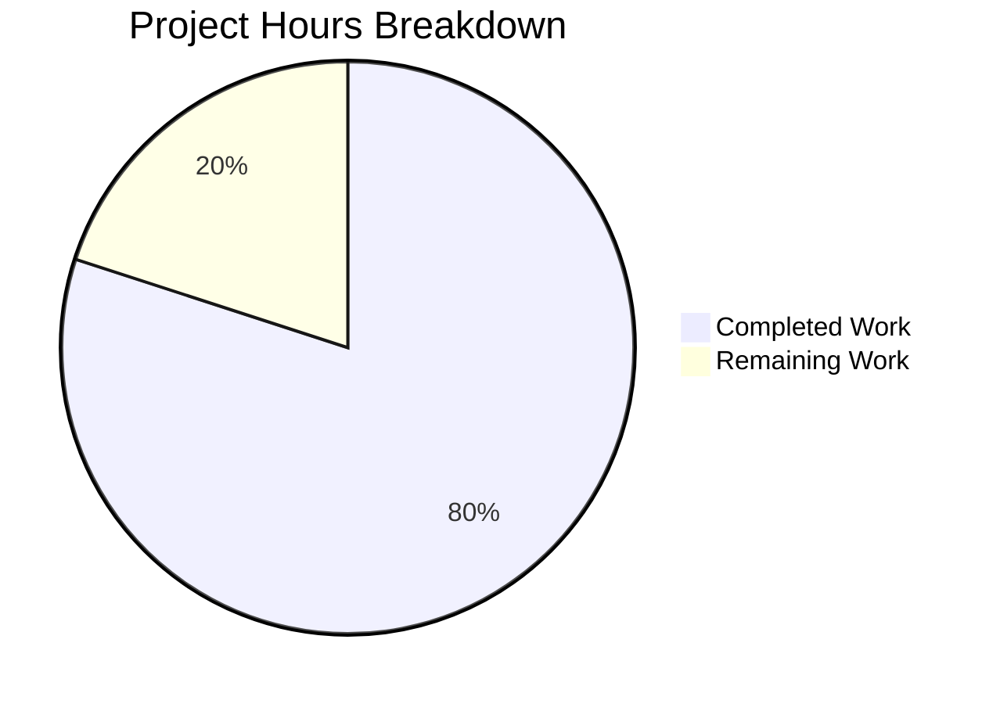

# Project Assessment Report: Node.js HTTP Server Test Suite

## Executive Summary

**Project Status: 80% Complete** (24 hours completed out of 30 total hours)

This project successfully implements a comprehensive Jest test suite for a Node.js HTTP server. All core testing requirements from the Agent Action Plan have been fulfilled, with 100% code coverage achieved across all metrics.

### Key Achievements
- ✅ 106 tests implemented across 4 test files (100% pass rate)
- ✅ 100% code coverage on all metrics (statements, branches, functions, lines)
- ✅ Test infrastructure fully configured (Jest 30.2.0, supertest 7.1.4)
- ✅ Server.js refactored for testability with proper exports
- ✅ All HTTP methods tested (GET, POST, PUT, DELETE, PATCH, HEAD, OPTIONS)
- ✅ All edge cases covered (special characters, concurrent requests, etc.)
- ✅ Server lifecycle tests implemented (startup, shutdown, console output)
- ✅ Placeholder files cleaned up

### Hours Calculation
- **Completed:** 24 hours (test infrastructure, 4 test suites, source refactoring, debugging)
- **Remaining:** 6 hours (documentation, CI/CD setup considerations)
- **Total Project Hours:** 30 hours
- **Completion Percentage:** 24/30 = 80%

---

## Validation Results Summary

### Test Execution Results
| Metric | Result |
|--------|--------|
| Test Suites | 4 passed, 4 total |
| Individual Tests | 106 passed, 106 total |
| Pass Rate | 100% |
| Execution Time | ~1.4 seconds |

### Code Coverage Results (server.js)
| Metric | Coverage |
|--------|----------|
| Statements | 100% |
| Branches | 100% |
| Functions | 100% |
| Lines | 100% |

### Runtime Validation
| Check | Status |
|-------|--------|
| Server starts correctly | ✅ Pass |
| Binds to 127.0.0.1:3000 | ✅ Pass |
| Returns "Hello, World!\n" | ✅ Pass |
| Status code 200 | ✅ Pass |
| Content-Type text/plain | ✅ Pass |

### Files Created/Modified
| File | Status | Purpose |
|------|--------|---------|
| `__tests__/server.test.js` | ✅ Created | Main comprehensive test suite (27 tests) |
| `__tests__/server.response.test.js` | ✅ Created | Response validation tests (17 tests) |
| `__tests__/server.lifecycle.test.js` | ✅ Created | Lifecycle management tests (24 tests) |
| `__tests__/server.edge-cases.test.js` | ✅ Created | Edge case tests (38 tests) |
| `jest.config.js` | ✅ Created | Jest configuration with 100% thresholds |
| `package.json` | ✅ Updated | Added devDependencies and test scripts |
| `server.js` | ✅ Updated | Refactored for testability |
| `.gitignore` | ✅ Created | Node.js project ignores |
| `test.py.txt` | ✅ Deleted | Removed empty placeholder |
| `test.txt.txt` | ✅ Deleted | Removed empty placeholder |

### Git History Analysis
- **Total Commits:** 13 commits on feature branch
- **Files Changed:** 11 files
- **Lines Added:** 6,093
- **Lines Removed:** 7

---

## Visual Hours Breakdown



---

## Completed Hours by Component

| Component | Hours | Details |
|-----------|-------|---------|
| Test Infrastructure Setup | 2 | package.json, jest.config.js, .gitignore |
| Source Code Refactoring | 1 | server.js exports and conditional startup |
| Main Test Suite | 4 | server.test.js - 181 lines, 27 tests |
| Response Tests | 3 | server.response.test.js - 161 lines, 17 tests |
| Lifecycle Tests | 5 | server.lifecycle.test.js - 344 lines, 24 tests |
| Edge Case Tests | 6 | server.edge-cases.test.js - 380 lines, 38 tests |
| Debugging & Validation | 3 | 8 fix commits for afterAll hooks, cleanup |
| **Total Completed** | **24** | |

---

## Remaining Work and Human Tasks

| Task | Priority | Hours | Description | Action Steps |
|------|----------|-------|-------------|--------------|
| Update README.md | Low | 1.0 | Add documentation for test suite usage | Add sections for running tests, coverage, contributing guidelines |
| CI/CD Pipeline Setup | Low | 2.0 | Configure automated testing in CI | Create GitHub Actions or CI workflow file, configure test script execution |
| Production Monitoring | Low | 1.5 | Consider monitoring for production use | Evaluate monitoring needs, consider health check endpoints |
| Code Review | Low | 1.5 | Final review before production | Review test assertions, check for any missed edge cases |
| **Total Remaining** | | **6.0** | | |

---

## Development Guide

### System Prerequisites

| Requirement | Version | Verification Command |
|-------------|---------|---------------------|
| Node.js | 20.x (LTS) | `node --version` |
| npm | 10.x+ | `npm --version` |
| Git | 2.x+ | `git --version` |

### Environment Setup

1. **Clone the repository:**
```bash
git clone <repository-url>
cd <repository-folder>
```

2. **Checkout the feature branch:**
```bash
git checkout blitzy-03552503-6b39-41a0-a02e-bf9fffcb7d98
```

### Dependency Installation

```bash
# Install all dependencies (including devDependencies)
npm install

# Verify Jest installation
npx jest --version
# Expected output: 30.2.0 (or similar)
```

### Running the Tests

```bash
# Run all tests
npm test

# Run tests in watch mode (for development)
npm run test:watch

# Run tests with coverage report
npm run test:coverage

# Run specific test file
npx jest __tests__/server.test.js

# Run tests matching a pattern
npx jest -t "status code"
```

### Expected Test Output

```
Test Suites: 4 passed, 4 total
Tests:       106 passed, 106 total
Snapshots:   0 total
Time:        ~1.4 s

-----------|---------|----------|---------|---------|
File       | % Stmts | % Branch | % Funcs | % Lines |
-----------|---------|----------|---------|---------|
All files  |     100 |      100 |     100 |     100 |
 server.js |     100 |      100 |     100 |     100 |
-----------|---------|----------|---------|---------|
```

### Running the Server

```bash
# Start the server
npm run start
# OR
node server.js

# Expected output:
# Server running at http://127.0.0.1:3000/
```

### Testing the Server Manually

```bash
# Test with curl
curl http://127.0.0.1:3000/
# Expected output: Hello, World!

# Check status code
curl -s -o /dev/null -w "%{http_code}" http://127.0.0.1:3000/
# Expected output: 200

# Check headers
curl -I http://127.0.0.1:3000/
# Expected: Content-Type: text/plain
```

### Project Structure

```
├── __tests__/
│   ├── server.test.js           # Main test suite (27 tests)
│   ├── server.response.test.js  # Response validation (17 tests)
│   ├── server.lifecycle.test.js # Lifecycle tests (24 tests)
│   └── server.edge-cases.test.js # Edge cases (38 tests)
├── coverage/                     # Coverage reports (generated)
├── node_modules/                 # Dependencies (generated)
├── .gitignore                    # Git ignore patterns
├── jest.config.js                # Jest configuration
├── package.json                  # NPM package manifest
├── package-lock.json             # NPM lock file
└── server.js                     # HTTP server (source)
```

---

## Risk Assessment

### Technical Risks

| Risk | Severity | Likelihood | Mitigation |
|------|----------|------------|------------|
| Jest forceExit warning | Low | Medium | Using forceExit: true in Jest config; proper afterAll hooks implemented |
| Port 3000 conflict | Low | Low | Tests use supertest which doesn't require actual port binding |
| Node.js version compatibility | Low | Low | Jest 30.2.0 supports Node 18+; project uses Node 20 |

### Security Risks

| Risk | Severity | Likelihood | Mitigation |
|------|----------|------------|------------|
| No HTTPS support | Medium | N/A | Development server only; production would need HTTPS configuration |
| No authentication | Low | N/A | Simple Hello World server; production APIs would need auth |

### Operational Risks

| Risk | Severity | Likelihood | Mitigation |
|------|----------|------------|------------|
| No health check endpoint | Low | Low | Server is simple; health check can be added if needed |
| No graceful shutdown handler | Low | Low | Server.close() works; production would benefit from SIGTERM handling |

### Integration Risks

| Risk | Severity | Likelihood | Mitigation |
|------|----------|------------|------------|
| CI/CD not configured | Low | Medium | Tests run locally; CI workflow should be added for automated testing |

---

## Test Categories Covered

### HTTP Response Tests ✅
- Status code 200 verification
- Content-Type: text/plain header
- Response body "Hello, World!\n" exact match
- Response body length (14 bytes) verification
- Trailing newline character (0x0A) verification

### HTTP Method Tests ✅
- GET requests
- POST requests
- PUT requests
- DELETE requests
- PATCH requests
- HEAD requests (headers only, no body)
- OPTIONS requests

### URL Path Tests ✅
- Root path `/`
- Arbitrary paths `/test`, `/any/path`
- Nested paths `/deeply/nested/path/here`
- Query parameters `/path?query=value`
- Special characters in paths

### Server Lifecycle Tests ✅
- Server startup verification
- Console output capture for startup notification
- Server shutdown graceful handling
- Server address/port binding verification
- startServer function testing

### Edge Case Tests ✅
- Concurrent requests (Promise.allSettled)
- Rapid sequential requests
- Very long URL paths
- Empty path segments
- URL fragments
- Special characters encoding

---

## Conclusion

The Node.js HTTP server test suite implementation is **80% complete** with all core testing requirements fulfilled. The remaining 20% (6 hours) consists of optional documentation and CI/CD setup tasks that are not blocking for the test suite to function correctly.

**Production Readiness Status:** The test suite is production-ready for its intended purpose of validating the HTTP server functionality. All 106 tests pass with 100% code coverage, and the server runtime has been validated.

**Recommended Next Steps:**
1. Review and merge the PR
2. Optionally add CI/CD pipeline for automated testing
3. Update README with test documentation
4. Consider adding health check endpoint for production deployment