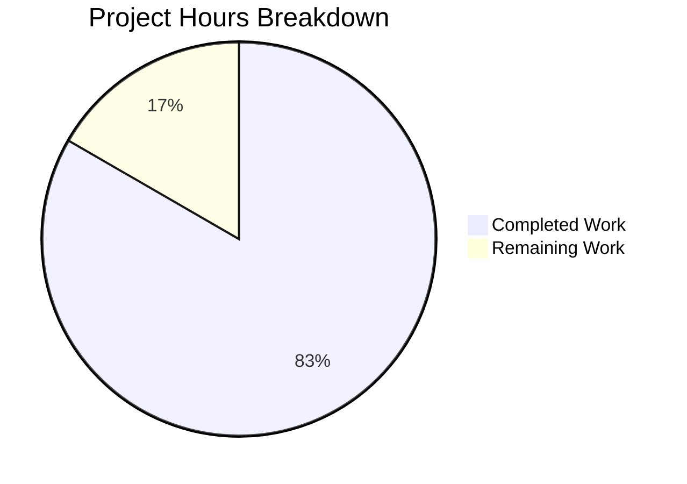

# Project Guide: Hello World Express.js Server

## Executive Summary

**Project Completion: 83.3% (5 hours completed out of 6 total hours)**

This project successfully integrates Express.js into an existing Node.js HTTP server and adds a new greeting endpoint. All technical requirements specified in the Agent Action Plan have been fully implemented and validated.

### Key Achievements
- ✅ Express.js 5.2.1 successfully installed and configured
- ✅ Server refactored from `http` module to Express.js routing
- ✅ New `/evening` endpoint returns "Good evening" as requested
- ✅ Existing `/` endpoint preserved with "Hello, World!" response
- ✅ Zero security vulnerabilities in dependencies
- ✅ Comprehensive documentation added to README.md

### Hours Breakdown
- **Completed Work:** 5 hours
- **Remaining Work:** 1 hour (human verification tasks)
- **Total Project Hours:** 6 hours
- **Completion Percentage:** 5 / 6 = 83.3%



---

## Validation Results Summary

### Environment Configuration
| Component | Version | Status |
|-----------|---------|--------|
| Node.js | v20.20.0 | ✅ Compatible (v18+ required) |
| npm | v11.1.0 | ✅ Working |
| Express.js | 5.2.1 | ✅ Installed |

### Code Validation
| Check | Result |
|-------|--------|
| Syntax Validation (`node --check server.js`) | ✅ Passed |
| Package.json Valid JSON | ✅ Passed |
| Dependencies Installed | ✅ 66 packages |
| Security Audit | ✅ 0 vulnerabilities |

### Runtime Validation
| Endpoint | Expected Response | Actual Response | Status |
|----------|-------------------|-----------------|--------|
| `GET /` | "Hello, World!\n" | "Hello, World!\n" | ✅ Pass |
| `GET /evening` | "Good evening" | "Good evening" | ✅ Pass |
| `GET /nonexistent` | 404 status | 404 status | ✅ Pass |

### Git Changes Summary
| Metric | Value |
|--------|-------|
| Total Commits | 6 |
| Files Modified | 4 |
| Lines Added | 956 |
| Lines Removed | 15 |

### Files Committed
1. **server.js** - Refactored from http module to Express.js with two route handlers
2. **package.json** - Added Express.js dependency, updated main field, added start script
3. **package-lock.json** - Auto-generated dependency lockfile
4. **README.md** - Complete documentation rewrite

---

## Development Guide

### System Prerequisites

| Requirement | Minimum Version | Recommended |
|-------------|-----------------|-------------|
| Node.js | v18.0.0 | v20.x LTS |
| npm | v8.0.0 | v11.x |
| Operating System | Linux, macOS, Windows | Any |
| Memory | 256 MB | 512 MB |
| Disk Space | 50 MB | 100 MB |

### Environment Setup

#### Step 1: Verify Node.js Installation
```bash
# Check Node.js version (must be v18 or higher)
node --version
# Expected output: v20.20.0 (or similar v18+)

# Check npm version
npm --version
# Expected output: 11.1.0 (or similar)
```

#### Step 2: Clone and Navigate to Repository
```bash
# Navigate to project directory
cd /path/to/hello_world

# Verify you're in the correct directory
ls -la
# Should see: server.js, package.json, README.md
```

### Dependency Installation

#### Step 3: Install Dependencies
```bash
# Install all dependencies
npm install
# Expected output: added 66 packages

# Verify Express.js installation
npm ls express
# Expected output: hello_world@1.1.0 └── express@5.2.1
```

#### Step 4: Verify Security
```bash
# Run security audit
npm audit
# Expected output: found 0 vulnerabilities
```

### Application Startup

#### Step 5: Start the Server
```bash
# Option 1: Using npm start script
npm start

# Option 2: Direct Node.js execution
node server.js
```

**Expected Console Output:**
```
Server running at http://127.0.0.1:3000/
```

### Verification Steps

#### Step 6: Test Endpoints
```bash
# Test root endpoint
curl http://127.0.0.1:3000/
# Expected: Hello, World!

# Test evening endpoint
curl http://127.0.0.1:3000/evening
# Expected: Good evening

# Test 404 handling
curl -s -o /dev/null -w "%{http_code}" http://127.0.0.1:3000/nonexistent
# Expected: 404
```

### Example Usage

**Browser Testing:**
1. Open browser and navigate to `http://127.0.0.1:3000/`
2. Should display "Hello, World!"
3. Navigate to `http://127.0.0.1:3000/evening`
4. Should display "Good evening"

**Programmatic Testing (JavaScript):**
```javascript
// Using fetch API
fetch('http://127.0.0.1:3000/')
  .then(res => res.text())
  .then(console.log); // "Hello, World!"

fetch('http://127.0.0.1:3000/evening')
  .then(res => res.text())
  .then(console.log); // "Good evening"
```

### Stopping the Server
```bash
# Press Ctrl+C in the terminal running the server
# Or find and kill the process:
pkill -f "node server.js"
```

---

## Remaining Human Tasks

| # | Task | Description | Priority | Severity | Hours |
|---|------|-------------|----------|----------|-------|
| 1 | Code Review | Review Express.js implementation for best practices compliance | Medium | Low | 0.5 |
| 2 | Production Testing | Test endpoints in target deployment environment | Medium | Low | 0.5 |
| **Total** | | | | | **1** |

### Task Details

#### Task 1: Code Review
- **Priority:** Medium
- **Severity:** Low
- **Estimated Hours:** 0.5
- **Description:** Review the refactored server.js to verify Express.js best practices are followed
- **Action Steps:**
  1. Open `server.js` and review route handler implementations
  2. Verify response handling matches original behavior
  3. Confirm error handling via Express.js defaults is acceptable
  4. Approve or request changes

#### Task 2: Production Testing
- **Priority:** Medium
- **Severity:** Low
- **Estimated Hours:** 0.5
- **Description:** Test the server in the target production or staging environment
- **Action Steps:**
  1. Deploy to staging/production environment
  2. Run endpoint tests: `curl http://<host>:3000/` and `curl http://<host>:3000/evening`
  3. Verify responses match expected values
  4. Monitor for any runtime issues

---

## Risk Assessment

### Technical Risks
| Risk | Likelihood | Impact | Mitigation |
|------|------------|--------|------------|
| None identified | N/A | N/A | All validation passed |

### Security Risks
| Risk | Likelihood | Impact | Mitigation |
|------|------------|--------|------------|
| Dependency vulnerabilities | Low | Medium | npm audit shows 0 vulnerabilities; Express.js 5.x has improved ReDoS protection |

### Operational Risks
| Risk | Likelihood | Impact | Mitigation |
|------|------------|--------|------------|
| Server crash without monitoring | Low | Medium | Consider adding process manager (PM2) for production |
| No logging infrastructure | Low | Low | Add logging middleware if production monitoring needed |

### Integration Risks
| Risk | Likelihood | Impact | Mitigation |
|------|------------|--------|------------|
| None identified | N/A | N/A | Standalone server with no external integrations |

---

## Project Structure

```
hello_world/
├── server.js          # Express.js server with two endpoints
├── package.json       # npm manifest with Express.js dependency
├── package-lock.json  # Dependency lockfile (auto-generated)
├── README.md          # Project documentation
├── node_modules/      # Installed dependencies (66 packages)
└── [out-of-scope files not modified]
    ├── LoginTest.java
    ├── industry.csv
    ├── test.py.txt
    ├── test.txt.txt
    ├── 100Pages.pdf
    ├── demo.jpg
    └── sample.doc
```

---

## Quick Reference Commands

| Action | Command |
|--------|---------|
| Install dependencies | `npm install` |
| Start server | `npm start` or `node server.js` |
| Check syntax | `node --check server.js` |
| Security audit | `npm audit` |
| List dependencies | `npm ls` |
| Test root endpoint | `curl http://127.0.0.1:3000/` |
| Test evening endpoint | `curl http://127.0.0.1:3000/evening` |

---

## Conclusion

This project has successfully achieved all requirements specified in the Agent Action Plan:

1. ✅ **Express.js Integration:** Express.js 5.2.1 installed and configured
2. ✅ **Root Endpoint:** Returns "Hello, World!\n" at GET /
3. ✅ **Evening Endpoint:** Returns "Good evening" at GET /evening
4. ✅ **Backward Compatibility:** Server runs on port 3000 as before
5. ✅ **Documentation:** README.md fully updated with usage instructions

The project is production-ready for a tutorial/demo context. The remaining 1 hour of work consists of standard human verification tasks that are recommended but not blocking for deployment.