# Technical Specification

# 1. Introduction

## 1.1 Executive Summary

The repository documented in this Technical Specification — `existing-projects-qa-test-08-dec-test` — is a small, heterogeneous quality-assurance (QA) sample project rather than a production business application. Its purpose is stated verbatim in `README.md`: *"This project is created for QA testing."* This Introduction therefore documents the repository exactly as it exists, grounding every statement in direct inspection of the source files. Where the conventional enterprise framing of a specification template (market positioning, enterprise integration, formal KPIs and SLAs) has no basis in the repository, that absence is stated plainly rather than fabricated.

**Project Overview.** The repository is flat — it contains no subdirectories — and comprises 13 files at its root. The single executable artifact is a dependency-free Node.js "Hello, World!" HTTP server defined in `server.js`. The remaining files fall into four groups: packaging manifests (`package.json`, `package-lock.json`); documentation (`README.md`, `Project Guide.md`); testing and placeholder artifacts (`server.test.js`, `LoginTest.java`, `test.py.txt`, `test.txt.txt`); and reference/sample data (`industry.csv`, plus the binary documents `100Pages.pdf`, `demo.jpg`, and `sample.doc`).

**Core Business Problem Being Solved.** The repository does not solve an external end-user or market problem. It addresses an engineering-process need: supplying a lightweight, self-contained, and deliberately mixed-content target that quality-assurance and automation workflows can clone, install, run, analyze, test, and document with minimal setup and low risk. The `hello_world` package name and the description "Hello world in Node.js" in `package.json`, combined with the QA statement in `README.md`, confirm this fixture-oriented intent.

**Key Stakeholders and Users.** The following table summarizes the stakeholder and user groups evident from the repository's stated QA purpose and its contents.

| Stakeholder / User Group | Role and Interest | Basis in Repository |
| --- | --- | --- |
| QA and test-automation engineers | Exercise tooling against a controlled, low-risk sample project | `README.md` ("created for QA testing") |
| Software developers | Run and, if needed, extend the sample HTTP server | `server.js`, `package.json` |
| Automated analysis / documentation tooling | Ingest a heterogeneous mix of code, data, and documents | Mixed file set at repository root |
| Original package author | Authored the npm package metadata | `package.json` author field `hxu` |

**Expected Business Impact and Value Proposition.** The repository's value is operational rather than commercial. Its zero-dependency design (`package-lock.json` records no installed packages) means it can be provisioned without network access to a package registry; its single executable component behaves deterministically, returning an identical HTTP `200` response for every request; and its intentionally varied contents — source code, manifests, a CSV taxonomy, and PDF/JPEG/DOC binaries — provide broad, low-cost coverage for tools that must handle multiple file types. These characteristics make the repository fast to set up, easy to reason about, and safe to reuse as a repeatable QA fixture.

## 1.2 System Overview

This section describes the repository's context, its high-level composition and technical approach, and the observable criteria by which its correct behavior can be judged. All details are drawn from the repository's actual files; no external system, dependency, or integration is attributed to the project that is not present in the source.

### 1.2.1 Project Context

**Business Context and Market Positioning.** The repository has no commercial market positioning. `README.md` describes it solely as a QA-testing project, and `package.json` describes it as "Hello world in Node.js." It is a sample/fixture artifact used within an engineering and quality-assurance context; it is not a product, service, or revenue-generating application. The Java package identifier `com.blitzyTest` in `LoginTest.java` and the repository name `existing-projects-qa-test-08-dec-test` reinforce that the project exists to support testing activities.

**Current System Constraints.** The repository does not replace or upgrade a pre-existing system; no legacy predecessor is referenced anywhere in the source. However, several current limitations of the repository itself are directly observable and material to understanding it.

| Observed Constraint | Evidence |
| --- | --- |
| No functional automated tests | `package.json` `test` script is a failing placeholder; `server.test.js` contains only the bare identifier `dfvrs` |
| Declared entry point is missing | `package.json` `main` = `index.js`, which does not exist; the server must be started via `node server.js` |
| Non-compiling Java placeholder | `LoginTest.java` `main` contains an unresolved bare token `Web` |
| Inert or empty artifacts | `Project Guide.md` contains only `def`; `test.py.txt` and `test.txt.txt` are empty |

**Integration with the Existing Enterprise Landscape.** The repository declares no enterprise or third-party integrations. `package-lock.json` records zero dependencies; there are no API clients, database drivers, message brokers, environment configuration, or CI/CD definitions anywhere in the tree. The only runtime integration surfaces are (1) the Node.js runtime and its built-in `http` module, and (2) the host operating system's TCP/IP networking stack, through which `server.js` binds a local HTTP listener on `127.0.0.1:3000`. Because the server binds to the IPv4 loopback address, it is reachable only from the local host and is not exposed to any external network by default.

### 1.2.2 High-Level Description

**Primary System Capabilities.** The repository provides two observable capabilities: (1) serving a fixed plain-text HTTP response — `server.js` returns HTTP status `200`, header `Content-Type: text/plain`, and the body `Hello, World!` for every request regardless of method or path; and (2) supplying static reference and sample assets — a 43-row industry taxonomy in `industry.csv` and three binary sample documents.

**Major System Components.** The table below enumerates the repository's components and their responsibilities.

| Component | File(s) | Responsibility |
| --- | --- | --- |
| HTTP server | `server.js` | Loopback hello-world responder on `127.0.0.1:3000` |
| Package manifests | `package.json`, `package-lock.json` | npm identity and metadata; empty dependency lockfile |
| Reference data | `industry.csv` | Single-column taxonomy of 43 industry categories |
| Sample documents | `100Pages.pdf`, `demo.jpg`, `sample.doc` | Binary fixtures (PDF 1.7, JPEG, legacy Word) |
| Documentation | `README.md`, `Project Guide.md` | QA-purpose statement; placeholder guide |
| Placeholders / stubs | `server.test.js`, `LoginTest.java`, `test.py.txt`, `test.txt.txt` | Non-functional test/entry stubs and empty files |

**Core Technical Approach.** The executable component follows a minimal, standard-library-only approach: it is a CommonJS Node.js script (`require('http')`) with module-level constants `hostname = '127.0.0.1'` and `port = 3000`, a stateless request handler that ignores the incoming request object and always writes the same response, and an immediate `server.listen(...)` call that logs `Server running at http://127.0.0.1:3000/` on successful bind. The script exports nothing, so importing it would also start the server. There is no routing, request parsing, environment-based configuration, listen-error handling, graceful shutdown, or TLS. The diagram below summarizes the runtime interaction and the components involved.

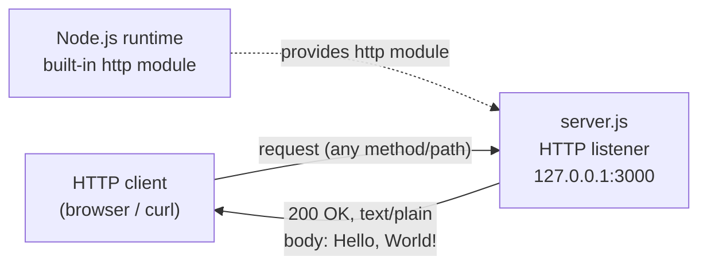
```mermaid
flowchart LR
    Client["HTTP client<br/>(browser / curl)"]
    Runtime["Node.js runtime<br/>built-in http module"]
    Server["server.js<br/>HTTP listener<br/>127.0.0.1:3000"]

    Runtime -.->|"provides http module"| Server
    Client -->|"request (any method/path)"| Server
    Server -->|"200 OK, text/plain<br/>body: Hello, World!"| Client
```

### 1.2.3 Success Criteria

No formal service-level agreements (SLAs), key performance indicators (KPIs), acceptance thresholds, benchmarks, or performance targets are defined anywhere in the repository. The criteria below are therefore expressed as observable, verifiable behaviors derived directly from the source — not as invented metrics.

**Measurable Objectives.** The following objectives are each verifiable against an observable behavior or artifact.

| Objective | Verification Basis |
| --- | --- |
| Server starts and binds successfully | Running `node server.js` logs `Server running at http://127.0.0.1:3000/` |
| Deterministic HTTP response | Any request to `127.0.0.1:3000` returns `200`, `text/plain`, body `Hello, World!` |
| Zero-dependency install | `package-lock.json` lists no packages, so installation requires no registry fetch |
| Reference-data integrity | `industry.csv` contains the `Industry` header followed by 43 category rows |

**Critical Success Factors.** Three factors are essential for the repository to function as intended: availability of a compatible Node.js runtime (the built-in `http` module is the only code dependency); availability of TCP port `3000` on the loopback interface; and preservation of the file set intact so that dependent tooling encounters the expected mix of code, data, and documents.

**Key Performance Indicators (KPIs).** The repository defines none. There is no telemetry, metrics collection, logging beyond the single startup `console.log`, monitoring configuration, or measurement instrumentation in the source. Any KPI-style measurement would have to be added and is not part of the repository as it currently exists.

## 1.3 Scope

This section delineates what the repository, as it currently exists, does and does not encompass. In-scope items are those present and observable in the source; out-of-scope items are capabilities that are demonstrably absent from the repository.

### 1.3.1 In-Scope

**Core Features and Functionalities.**

- **Must-have capabilities:** a runnable loopback HTTP server returning a fixed hello-world response (`server.js`); a valid npm package definition (`package.json`, `package-lock.json`); a static industry-taxonomy dataset (`industry.csv`); and a set of binary sample documents (`100Pages.pdf`, `demo.jpg`, `sample.doc`) usable as multi-format fixtures.
- **Primary user workflows:** (1) start the server with `node server.js` and issue HTTP requests to `127.0.0.1:3000`; (2) consume the reference data and sample documents as fixtures for downstream QA or analysis tooling.
- **Essential integrations:** the Node.js runtime and its built-in `http` module, and the host operating system's TCP/IP stack. No third-party services participate.
- **Key technical requirements:** a Node.js runtime supporting CommonJS and the built-in `http` module, and availability of TCP port `3000` on the loopback interface.

**Implementation Boundaries.** The table below defines the boundaries within which the repository operates.

| Boundary Dimension | In-Scope Definition |
| --- | --- |
| System boundary | A single Node.js process serving plain HTTP on `127.0.0.1:3000`, plus static files at the repository root |
| User groups covered | Local developers, QA/test-automation engineers, and automated analysis tooling |
| Geographic / network coverage | Local host only — loopback-bound (`127.0.0.1`); no remote or public network exposure |
| Data domains included | Industry taxonomy (`industry.csv`) and binary sample documents (PDF, JPEG, legacy Word) |

### 1.3.2 Out-of-Scope

The following are explicitly out of scope because they are absent from the repository as it currently exists.

**Excluded Features and Capabilities.**

- HTTP routing, request parsing, and multiple endpoints — the `server.js` handler ignores the request and returns a single fixed response.
- Authentication, authorization, sessions, and user management — the `LoginTest.java` login entry point is an empty, non-compiling stub.
- Data persistence, databases, and external API/integration clients — no such code or dependencies exist.
- Configuration management — `hostname` and `port` are hard-coded literals with no environment-variable support.
- TLS/HTTPS, remote or public network exposure, load balancing, and horizontal scaling.
- Functional automated testing and CI/CD — the `test` script is a failing placeholder, `server.test.js` is a non-functional stub, and no CI configuration exists.
- Observability concerns such as metrics, structured logging, tracing, monitoring, and alerting.
- Production concerns such as listen-error handling, graceful shutdown, process management, and containerization.

**Future-Phase Considerations (apparent but unrealized).** Several placeholders suggest intended-but-unimplemented work. They are not functional today and are out of scope for the current repository.

| Placeholder | Apparent Intent (not implemented) |
| --- | --- |
| `package.json` `main: index.js` | A canonical `index.js` entry point that does not yet exist |
| `server.test.js` | An automated test for the server (currently the token `dfvrs`) |
| `LoginTest.java` (`com.blitzyTest`) | A runnable login/test entry point (currently an empty `main` with `Web`) |
| `test.py.txt`, `test.txt.txt` | Placeholder test files that are currently empty |

**Integration Points Not Covered.** No external systems are integrated: no databases, message queues, third-party APIs, cloud services, identity providers, or CI/CD pipelines are referenced anywhere in the source.

**Unsupported Use Cases.** Remote or multi-user access to the HTTP server; production deployment; secure (HTTPS) transport; dynamic or data-driven responses; and any use requiring third-party npm dependencies, of which none are declared or locked.

## 1.4 References

The following repository files and folders were inspected as evidence for this Introduction.

- `/` (repository root) — established the flat structure: 13 files on disk, no subdirectories, and no CI/CD, Docker, or environment-configuration files.
- `README.md` — the definitive purpose statement: "This project is created for QA testing."
- `Project Guide.md` — placeholder documentation whose only content is `def`.
- `package.json` — npm package identity (`hello_world`, version `1.0.0`), description "Hello world in Node.js", author `hxu`, MIT license, `main: index.js`, and the failing placeholder `test` script.
- `package-lock.json` — `lockfileVersion` 3 with zero declared/installed dependencies.
- `server.js` — the loopback hello-world HTTP server (`127.0.0.1:3000`, status `200`, `text/plain`, body `Hello, World!`) and its standard-library, dependency-free technical approach.
- `server.test.js` — a non-functional test stub containing only the bare identifier `dfvrs`.
- `LoginTest.java` — an incomplete Java entry point in package `com.blitzyTest` with an empty, non-compiling `main`.
- `industry.csv` — a single-column `Industry` taxonomy of 43 category rows (reference data domain).
- `test.py.txt` — an empty placeholder file.
- `test.txt.txt` — an empty placeholder file.
- `100Pages.pdf` — a binary sample document (verified `%PDF-1.7`).
- `demo.jpg` — a binary sample image (verified JPEG/EXIF).
- `sample.doc` — a binary sample document (verified OLE2 legacy Microsoft Word).

# 2. Product Requirements

## 2.1 Feature Catalog

This section decomposes the repository into discrete, testable features grounded strictly in the observable source. As established in **Section 1.2 System Overview** and **Section 1.3 Scope**, the repository (`existing-projects-qa-test-08-dec-test`) is a small, flat, QA-testing sample project whose sole executable artifact is a dependency-free Node.js HTTP server; the remainder consists of static reference/sample data, packaging manifests, documentation, and non-functional placeholders. Accordingly, exactly **four** features are cataloged below, and each maps one-to-one to an in-scope must-have capability enumerated in **Section 1.3.1 In-Scope**.

Non-functional placeholders — the missing `index.js` entry point, the `server.test.js` stub, `LoginTest.java`, `Project Guide.md`, and the empty `test.py.txt`/`test.txt.txt` files — are deliberately **not** cataloged as features because they implement no runnable behavior. They are documented instead as unrealized items and global constraints in **Section 2.6 Assumptions and Constraints** (consistent with the future-phase placeholders listed in Section 1.3.2).

**Requirement baseline / versioning.** All features and requirements in this section are versioned against package version **1.0.0** (declared in `package.json`) at the current repository HEAD. There is no independent product versioning scheme in the repository; the npm package version is therefore adopted as the single traceable baseline for every requirement below.

| Feature ID | Feature Name | Category | Priority |
| --- | --- | --- | --- |
| F-001 | HTTP Hello-World Response Service | Runtime Service (HTTP) | Critical |
| F-002 | npm Package Definition & Zero-Dependency Manifest | Packaging / Build Metadata | Medium |
| F-003 | Industry Taxonomy Reference Dataset | Reference Data | Low |
| F-004 | Binary Multi-Format Sample Document Fixtures | Test Fixtures / Sample Data | Low |

### 2.1.1 F-001: HTTP Hello-World Response Service

**Feature Metadata**

| Attribute | Value |
| --- | --- |
| Unique ID | F-001 |
| Feature Name | HTTP Hello-World Response Service |
| Feature Category | Runtime Service (HTTP) |
| Priority Level | Critical |
| Status | Completed |

**Description**

- **Overview:** `server.js` creates an HTTP server using the Node.js built-in `http` module, binds it to host `127.0.0.1` on port `3000`, and returns an identical response — HTTP status `200`, header `Content-Type: text/plain`, and body `Hello, World!\n` — to every request regardless of method, path, or headers. On successful bind it logs `Server running at http://127.0.0.1:3000/`.
- **Business Value:** This is the single runnable behavior of the repository and the concrete embodiment of its stated purpose — a deterministic, low-risk HTTP responder that quality-assurance and automation workflows can start, exercise, and observe with minimal setup (`README.md`: "This project is created for QA testing"; `package.json` description: "Hello world in Node.js").
- **User Benefits:** Developers and QA/test-automation engineers obtain an immediately runnable, zero-dependency HTTP endpoint whose output is fully predictable, making success/failure trivial to assert.
- **Technical Context:** A CommonJS script with module-level constants `hostname` and `port`, a stateless request handler that ignores the incoming request object, and an immediate `server.listen(port, hostname, callback)` call. There is no routing, request parsing, environment-based configuration, TLS, listen-error handling, or graceful shutdown. The module exports nothing, so importing it also starts the listener.

**Dependencies**

| Dependency Type | Detail |
| --- | --- |
| Prerequisite Features | None |
| System Dependencies | Node.js runtime with the built-in `http` module; host OS TCP/IP stack; TCP port `3000` free on the `127.0.0.1` loopback interface |
| External Dependencies | None — `package-lock.json` records zero third-party packages |
| Integration Requirements | An HTTP client (e.g., browser or `curl`) able to reach `127.0.0.1:3000` from the local host |

### 2.1.2 F-002: npm Package Definition & Zero-Dependency Manifest

**Feature Metadata**

| Attribute | Value |
| --- | --- |
| Unique ID | F-002 |
| Feature Name | npm Package Definition & Zero-Dependency Manifest |
| Feature Category | Packaging / Build Metadata |
| Priority Level | Medium |
| Status | Completed (with known packaging defects — see F-002-RQ-003) |

**Description**

- **Overview:** `package.json` and `package-lock.json` together define the npm package identity `hello_world`, version `1.0.0`, license `MIT`, and author `hxu`. The lockfile uses `lockfileVersion: 3`, sets `requires: true`, and records only the root package entry (`""`) with no installed dependency packages.
- **Business Value:** Establishes a valid, reproducible package identity and license, and — because no dependencies are declared or locked — enables installation without any network access to a package registry, which is central to the repository's "safe, repeatable QA fixture" value proposition (see Section 1.1).
- **User Benefits:** `npm install` completes offline with no registry fetch; the package metadata provides a clear name, version, and licensing for downstream tooling.
- **Technical Context:** The manifest declares `main: index.js`, but no `index.js` file exists at the repository root, so the server must be started directly via `node server.js`. The `test` script is a deliberately failing placeholder (`echo "Error: no test specified" && exit 1`). `lockfileVersion: 3` implies an npm CLI of version 7 or later.

**Dependencies**

| Dependency Type | Detail |
| --- | --- |
| Prerequisite Features | None (the manifest nominally packages the F-001 source but declares a non-existent entry point) |
| System Dependencies | npm CLI (v7+ to honor `lockfileVersion: 3`) and a Node.js runtime |
| External Dependencies | None — zero runtime, dev, peer, or optional dependencies are declared |
| Integration Requirements | None; notably, an npm registry connection is **not** required because no packages must be fetched |

### 2.1.3 F-003: Industry Taxonomy Reference Dataset

**Feature Metadata**

| Attribute | Value |
| --- | --- |
| Unique ID | F-003 |
| Feature Name | Industry Taxonomy Reference Dataset |
| Feature Category | Reference Data |
| Priority Level | Low |
| Status | Completed |

**Description**

- **Overview:** `industry.csv` is a single-column CSV (749 bytes, 44 lines total) with the exact header `Industry` followed by 43 industry-category rows, ranging from `Accounting/Finance` to a final `Other` bucket.
- **Business Value:** Provides a compact, canonical industry taxonomy usable as a seed list, lookup table, or validation set for downstream QA/analysis tooling — one of the repository's "static reference asset" capabilities (Section 1.2.2).
- **User Benefits:** A ready-made, human-readable structured dataset that tooling can parse, validate, or diff without any preparation.
- **Technical Context:** The file contains no ID column, no additional metadata columns, and no executable behavior; category values such as `Accounting/Finance` use a slash rather than a comma, preserving the single-column structure. No source file in the repository reads or references this dataset.

**Dependencies**

| Dependency Type | Detail |
| --- | --- |
| Prerequisite Features | None |
| System Dependencies | None within the repository (any external CSV-capable consumer suffices) |
| External Dependencies | None |
| Integration Requirements | None — the dataset is not consumed by any code in the repository (verified: no `.csv`/`industry` reference exists in the source) |

### 2.1.4 F-004: Binary Multi-Format Sample Document Fixtures

**Feature Metadata**

| Attribute | Value |
| --- | --- |
| Unique ID | F-004 |
| Feature Name | Binary Multi-Format Sample Document Fixtures |
| Feature Category | Test Fixtures / Sample Data |
| Priority Level | Low |
| Status | Completed |

**Description**

- **Overview:** Three binary sample documents are provided at the repository root: `100Pages.pdf` (PDF version 1.7, ~9.4 MB), `demo.jpg` (JPEG image with EXIF, ~2.1 MB), and `sample.doc` (OLE2 Compound File / legacy Microsoft Word, ~98 KB).
- **Business Value:** Supplies a deliberately varied set of binary formats so that tools which must ingest or classify multiple file types gain broad, low-cost coverage from a single small repository (Section 1.1 value proposition).
- **User Benefits:** QA and document-processing pipelines can exercise PDF, image, and legacy-document handling against known fixtures without sourcing external files.
- **Technical Context:** The three files are static binaries committed directly into git; their formats were confirmed by magic bytes (`%PDF-1.7`; `FF D8 FF E1`; `D0 CF 11 E0 A1 B1 1A E1`). None is referenced or processed by any source file in the repository.

**Dependencies**

| Dependency Type | Detail |
| --- | --- |
| Prerequisite Features | None |
| System Dependencies | None within the repository (a format-appropriate external reader is required to open each file) |
| External Dependencies | None |
| Integration Requirements | None — the binaries are not consumed by any code in the repository |

## 2.2 Functional Requirements

Each feature from Section 2.1 is expanded below into numbered, individually testable requirements using the identifier scheme `F-XXX-RQ-YYY`. For every requirement, a **Requirement Details** summary table (with priority and complexity) is followed by explicit **Acceptance Criteria**, a **Technical Specifications** table, and a **Validation Rules** table. All tables are limited to four columns or fewer. Every acceptance criterion is expressed as an observable, verifiable behavior derived directly from the source; no invented performance targets, SLAs, or compliance regimes are asserted, because none exist in the repository (consistent with Section 1.2.3). All requirements share the version baseline `1.0.0` (see Section 2.1).

### 2.2.1 F-001 — HTTP Hello-World Response Service

**Requirement Details**

| Requirement ID | Description | Priority | Complexity |
| --- | --- | --- | --- |
| F-001-RQ-001 | Create and bind an HTTP listener on `127.0.0.1:3000` | Must-Have | Low |
| F-001-RQ-002 | Return a deterministic `200` / `text/plain` / `Hello, World!\n` response to every request | Must-Have | Low |
| F-001-RQ-003 | Emit a startup confirmation log line on successful bind | Should-Have | Low |

**F-001-RQ-001 — HTTP listener binding**

- **Acceptance Criteria:** Running `node server.js` opens a listening TCP socket on `127.0.0.1:3000` without error; a subsequent connection to that address succeeds.

| Technical Specification | Detail |
| --- | --- |
| Input Parameters | None — `hostname` (`127.0.0.1`) and `port` (`3000`) are hard-coded module constants |
| Output / Response | A bound HTTP listener on the loopback interface |
| Performance Criteria | None defined in the repository; a single synchronous `server.listen(...)` call |
| Data Requirements | None |

| Validation Rule | Detail |
| --- | --- |
| Business Rules | Binding is loopback-only (`127.0.0.1`), so the listener is not reachable from remote hosts |
| Data Validation | Not applicable (no external input) |
| Security Requirements | Loopback binding constrains reachability to the local host; no TLS and no authentication are implemented |
| Compliance Requirements | None declared in the source |

**F-001-RQ-002 — Deterministic hello-world response**

- **Acceptance Criteria:** Any HTTP request to `127.0.0.1:3000`, using any method, path, or headers, returns status `200`, header `Content-Type: text/plain`, and a body of exactly `Hello, World!\n`.

| Technical Specification | Detail |
| --- | --- |
| Input Parameters | The request object (`req`) is accepted by the handler but ignored |
| Output / Response | HTTP `200`, `Content-Type: text/plain`, body `Hello, World!\n` |
| Performance Criteria | None defined; the handler writes a fixed literal and returns immediately |
| Data Requirements | A single hard-coded response string; no data store or lookup |

| Validation Rule | Detail |
| --- | --- |
| Business Rules | A uniform response is returned regardless of request; there is no routing or content negotiation |
| Data Validation | None — the request body, method, and path are neither parsed nor validated |
| Security Requirements | Because no request input is processed, there is no request-driven injection surface; the response is static text requiring no output encoding |
| Compliance Requirements | None declared in the source |

**F-001-RQ-003 — Startup confirmation logging**

- **Acceptance Criteria:** After a successful bind, standard output contains the exact line `Server running at http://127.0.0.1:3000/`.

| Technical Specification | Detail |
| --- | --- |
| Input Parameters | None |
| Output / Response | A single `console.log` line written to stdout on the `listen` callback |
| Performance Criteria | None defined; emitted once at startup |
| Data Requirements | None |

| Validation Rule | Detail |
| --- | --- |
| Business Rules | Logging occurs only once at startup; there is no per-request or error logging |
| Data Validation | Not applicable |
| Security Requirements | No sensitive data is logged |
| Compliance Requirements | None declared in the source |

### 2.2.2 F-002 — npm Package Definition & Zero-Dependency Manifest

**Requirement Details**

| Requirement ID | Description | Priority | Complexity |
| --- | --- | --- | --- |
| F-002-RQ-001 | Declare a valid npm package identity and license | Must-Have | Low |
| F-002-RQ-002 | Record a zero-dependency, reproducible, offline-installable dependency tree | Must-Have | Low |
| F-002-RQ-003 | Declared entry point and test script (currently defective) | Could-Have | Low |

**F-002-RQ-001 — Package identity and license**

- **Acceptance Criteria:** `package.json` declares `name: hello_world`, `version: 1.0.0`, `license: MIT`, and `author: hxu`; `package-lock.json` records the same name, version `1.0.0`, and license `MIT` for the root package.

| Technical Specification | Detail |
| --- | --- |
| Input Parameters | Not applicable (static JSON manifest) |
| Output / Response | npm-resolvable package metadata (name, version, license, author) |
| Performance Criteria | Not applicable |
| Data Requirements | JSON manifest fields in `package.json` and `package-lock.json` |

| Validation Rule | Detail |
| --- | --- |
| Business Rules | Name, version, and license must remain consistent across manifest and lockfile |
| Data Validation | Files must be valid JSON parseable by the npm CLI |
| Security Requirements | No secrets or credentials present in the manifest; license is MIT |
| Compliance Requirements | Distribution governed by the declared MIT license |

**F-002-RQ-002 — Zero-dependency reproducible install**

- **Acceptance Criteria:** `package-lock.json` uses `lockfileVersion: 3` and its `packages` object contains only the root entry (`""`); running `npm install` completes with no packages fetched from any registry.

| Technical Specification | Detail |
| --- | --- |
| Input Parameters | Not applicable |
| Output / Response | A deterministic, empty third-party dependency tree |
| Performance Criteria | Installation requires no network round-trips to a package registry |
| Data Requirements | The lockfile `packages` map (root entry only) |

| Validation Rule | Detail |
| --- | --- |
| Business Rules | No runtime, development, peer, or optional dependencies are permitted |
| Data Validation | `lockfileVersion: 3` (requires npm CLI v7 or later) |
| Security Requirements | Zero third-party code eliminates transitive supply-chain exposure |
| Compliance Requirements | None beyond the declared MIT license |

**F-002-RQ-003 — Declared entry point and test script (known defects)**

- **Acceptance Criteria (documents actual, verifiable behavior):** `package.json` declares `main: index.js`, but no `index.js` exists, so entry-point resolution fails and the server must be launched with `node server.js`; running `npm test` prints `Error: no test specified` and exits with a non-zero status.

| Technical Specification | Detail |
| --- | --- |
| Input Parameters | Not applicable |
| Output / Response | Unresolved `main` entry point; failing `test` script (exit code 1) |
| Performance Criteria | Not applicable |
| Data Requirements | `main` and `scripts.test` fields of `package.json` |

| Validation Rule | Detail |
| --- | --- |
| Business Rules | The declared entry point and automated test are placeholders, not functional implementations |
| Data Validation | Not applicable |
| Security Requirements | Not applicable |
| Compliance Requirements | None; this requirement records a known limitation rather than an implemented capability |

### 2.2.3 F-003 — Industry Taxonomy Reference Dataset

**Requirement Details**

| Requirement ID | Description | Priority | Complexity |
| --- | --- | --- | --- |
| F-003-RQ-001 | Provide a single-column industry taxonomy of 43 categories | Must-Have | Low |

**F-003-RQ-001 — Taxonomy content and structure**

- **Acceptance Criteria:** `industry.csv` contains the header `Industry` followed by exactly 43 data rows (44 lines total); the first data value is `Accounting/Finance` and the last is `Other`; each line contains exactly one field.

| Technical Specification | Detail |
| --- | --- |
| Input Parameters | Not applicable (static data file) |
| Output / Response | A 43-row industry taxonomy consumable as CSV |
| Performance Criteria | 749 bytes — trivially and instantly parseable |
| Data Requirements | Single text column, plain ASCII/UTF-8, header `Industry` |

| Validation Rule | Detail |
| --- | --- |
| Business Rules | Exactly one category per row; a catch-all `Other` bucket is included |
| Data Validation | No ID or metadata columns; compound labels (e.g., `Accounting/Finance`) use a slash so the single-column structure is preserved |
| Security Requirements | Contains no PII or sensitive data; values are a public industry taxonomy |
| Compliance Requirements | None declared in the source |

### 2.2.4 F-004 — Binary Multi-Format Sample Document Fixtures

**Requirement Details**

| Requirement ID | Description | Priority | Complexity |
| --- | --- | --- | --- |
| F-004-RQ-001 | Provide valid PDF, JPEG, and legacy Word binary fixtures | Could-Have | Low |

**F-004-RQ-001 — Multi-format fixture availability and integrity**

- **Acceptance Criteria:** `100Pages.pdf`, `demo.jpg`, and `sample.doc` are present and non-empty; `100Pages.pdf` begins with `%PDF-1.7`, `demo.jpg` begins with the JPEG marker `FF D8 FF`, and `sample.doc` begins with the OLE2 signature `D0 CF 11 E0 A1 B1 1A E1`.

| Technical Specification | Detail |
| --- | --- |
| Input Parameters | Not applicable (static binary files) |
| Output / Response | Three readable binary fixtures spanning distinct formats |
| Performance Criteria | Files are large relative to the repository (~9.4 MB, ~2.1 MB, ~98 KB), increasing clone size |
| Data Requirements | PDF 1.7, JPEG (with EXIF), and OLE2 Compound File (legacy `.doc`) |

| Validation Rule | Detail |
| --- | --- |
| Business Rules | The three formats are intentionally distinct to broaden file-type coverage |
| Data Validation | Format integrity is verifiable by magic-byte inspection |
| Security Requirements | The binaries are opaque fixtures not processed by any repository code; consumers should treat them as untrusted external content |
| Compliance Requirements | None declared in the source |

## 2.3 Feature Relationships

This section documents only those relationships that are directly evident in the source. Critically, the repository is **flat** (no subdirectories) and its features are largely **independent**: the sole executable feature (F-001) shares no code with any other feature, and the two data features (F-003, F-004) are not referenced by any source file (verified — no `industry.csv`, `.csv`, or binary-filename reference exists in the code). No inter-feature runtime call graph exists. The relationships below are therefore deliberately minimal and are not embellished.

### 2.3.1 Feature Dependency Map

The diagram summarizes how the features relate to one another and to their system dependencies. Solid arrows denote actual runtime data/control flow; dashed arrows denote declared (packaging) relationships, including one that is unresolved.

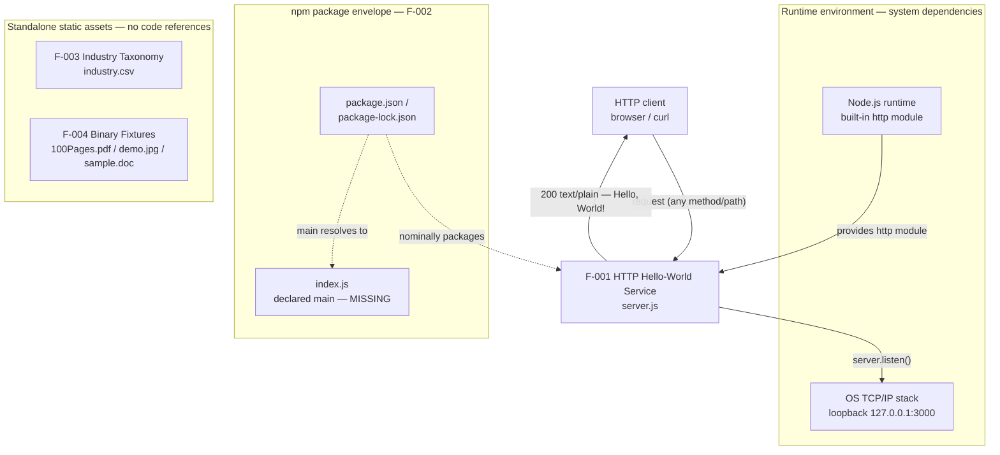
```mermaid
flowchart TD
    Client["HTTP client<br/>browser / curl"]

    subgraph RT["Runtime environment — system dependencies"]
        Node["Node.js runtime<br/>built-in http module"]
        TCP["OS TCP/IP stack<br/>loopback 127.0.0.1:3000"]
    end

    F001["F-001 HTTP Hello-World Service<br/>server.js"]

    subgraph PKG["npm package envelope — F-002"]
        F002["package.json /<br/>package-lock.json"]
        Missing["index.js<br/>declared main — MISSING"]
    end

    subgraph Assets["Standalone static assets — no code references"]
        F003["F-003 Industry Taxonomy<br/>industry.csv"]
        F004["F-004 Binary Fixtures<br/>100Pages.pdf / demo.jpg / sample.doc"]
    end

    Node -->|"provides http module"| F001
    F001 -->|"server.listen()"| TCP
    Client -->|"request (any method/path)"| F001
    F001 -->|"200 text/plain — Hello, World!"| Client
    F002 -.->|"nominally packages"| F001
    F002 -.->|"main resolves to"| Missing
```

**Interpretation.**

- **F-001 → system dependencies (real):** F-001 requires the Node.js built-in `http` module and binds through the host TCP/IP stack to `127.0.0.1:3000`. This is the only live integration and mirrors the runtime interaction diagram in **Section 1.2.2**.
- **F-002 → F-001 (declared, partial):** The `hello_world` package nominally packages every file in the repository, including `server.js`. However, F-002's declared entry point (`main: index.js`) is unresolved because `index.js` does not exist, so F-002 does not correctly reference F-001's runnable file.
- **F-003 and F-004 (isolated):** Neither data feature has any dependency on, or dependent among, the other features; they participate in no runtime flow.

### 2.3.2 Integration Points

| Integration Point | Participants | Nature |
| --- | --- | --- |
| Node.js `http` module | F-001 ↔ Node.js runtime | Server created via `require('http')` and `http.createServer(...)` |
| OS TCP/IP loopback | F-001 ↔ host network stack | Listener bound to `127.0.0.1:3000` (local host only) |
| HTTP request/response | External client → F-001 | Client issues requests to `127.0.0.1:3000`; receives the fixed 200 response |
| npm packaging metadata | F-002 → repository files | Package identity/version/license; the declared `main` entry point is unresolved |

No external-system integration points exist: there are no databases, message queues, third-party APIs, identity providers, cloud services, or CI/CD pipelines referenced anywhere in the source (consistent with **Section 1.3.2**).

### 2.3.3 Shared Components and Common Services

**Shared components.** There are **no shared code components** among the features. The repository contains no reusable modules, libraries, utilities, or helpers; `server.js` imports only the Node.js built-in `http` module and shares no code with any other file. The only elements that "contain" the features in common are non-code envelopes: the **npm package** defined by F-002 (`package.json`/`package-lock.json`) and the **git repository** itself.

**Common services.** There are **no common services**. The repository provides no shared configuration mechanism (host and port are hard-coded literals), no shared logging framework (the only log statement is a single `console.log` at server startup), and no shared persistence, authentication, caching, messaging, or observability layer. Each feature is self-contained, and the data features (F-003, F-004) expose no service interface at all — they are static files consumed, if at all, only by tooling external to the repository.

## 2.4 Implementation Considerations

The considerations below are drawn directly from the observable implementation. The repository defines **no formal performance targets, throughput benchmarks, scalability tiers, or compliance regimes** (see Section 1.2.3); where such dimensions have no basis in the source, that absence is stated rather than invented. Each feature is addressed across five dimensions: technical constraints, performance requirements, scalability considerations, security implications, and maintenance requirements.

### 2.4.1 F-001 — HTTP Hello-World Response Service

| Dimension | Consideration |
| --- | --- |
| Technical Constraints | `hostname` and `port` are hard-coded literals with no environment-variable override; there is no routing, request parsing, listen-error handling, or graceful shutdown; the module exports nothing, so importing it also starts the listener; binding is loopback-only |
| Performance Requirements | None defined in the repository; the handler returns a fixed literal immediately on Node.js's single-threaded event loop, and no latency/throughput target or benchmark exists |
| Scalability Considerations | A single process binds a single loopback listener; there is no clustering, worker pool, load balancing, or horizontal-scaling provision, and loopback binding precludes multi-host access |
| Security Implications | Plain HTTP only (no TLS); no authentication or authorization; loopback binding limits reachability to the local host; because the request is ignored, there is no request-driven input attack surface; no security-related response headers are set |
| Maintenance Requirements | Must be started via `node server.js` due to the missing `index.js` entry point; no functional automated test guards behavior (`server.test.js` is a stub, `npm test` fails); changing host or port requires editing source |

### 2.4.2 F-002 — npm Package Definition & Zero-Dependency Manifest

| Dimension | Consideration |
| --- | --- |
| Technical Constraints | `main: index.js` is unresolved (file absent); the `test` script is a failing placeholder; `lockfileVersion: 3` requires npm CLI v7 or later |
| Performance Requirements | Zero declared dependencies enable a fast, fully offline `npm install` with no registry round-trips and no build step |
| Scalability Considerations | Not applicable — the manifest is static metadata with no runtime scaling behavior |
| Security Implications | The absence of third-party dependencies eliminates transitive supply-chain risk; the manifest contains no secrets or credentials; distribution is governed by the declared MIT license |
| Maintenance Requirements | Name/version/license must stay consistent between `package.json` and `package-lock.json`; making the entry point and testing functional requires adding `index.js` (or correcting `main`) and a real `test` script; lockfile regeneration must preserve the zero-dependency state |

### 2.4.3 F-003 — Industry Taxonomy Reference Dataset

| Dimension | Consideration |
| --- | --- |
| Technical Constraints | A static, single-column CSV with no schema enforcement, no ID column, and no programmatic link to any code in the repository |
| Performance Requirements | None meaningful — the file is 749 bytes and parses instantly |
| Scalability Considerations | Fixed at 43 rows; any change is a manual edit, with no generation or update pipeline |
| Security Implications | Contains no PII or sensitive data (a public industry taxonomy); if consumed downstream, standard CSV-injection precautions should be applied by the consumer |
| Maintenance Requirements | Edited manually; no automated test verifies the row count or format; consumers must correctly handle slash-containing compound labels (e.g., `Accounting/Finance`) as single values |

### 2.4.4 F-004 — Binary Multi-Format Sample Document Fixtures

| Dimension | Consideration |
| --- | --- |
| Technical Constraints | Large binaries are committed directly to git without Git LFS; `sample.doc` uses the legacy OLE2 (`.doc`) format |
| Performance Requirements | The combined ~11.6 MB (≈9.4 MB PDF, ≈2.1 MB JPEG, ≈98 KB DOC) increases clone/checkout time and overall repository size disproportionately to the code |
| Scalability Considerations | Binary blobs are not deduplicated and persist permanently in git history; adding further large fixtures compounds repository growth |
| Security Implications | The files are opaque fixtures not processed by any repository code; downstream consumers should treat PDF/JPEG/DOC content as untrusted input to their own parsers |
| Maintenance Requirements | No checksums or integrity manifest accompany the files; format validation is external (magic-byte inspection); migrating to Git LFS is advisable if the fixture set grows |

## 2.5 Traceability Matrix

The matrices below trace every requirement to its source artifact and verification method, and map each feature to the scope definitions and components established in Section 1. Related process flowcharts are the runtime interaction diagram in **Section 1.2.2** and the feature dependency map in **Section 2.3.1**.

### 2.5.1 Requirement-to-Source Traceability

| Requirement ID | Feature | Source Artifact | Verification Method |
| --- | --- | --- | --- |
| F-001-RQ-001 | F-001 | `server.js` (lines 6, 12–14) | Run `node server.js`; confirm a listener on `127.0.0.1:3000` |
| F-001-RQ-002 | F-001 | `server.js` (lines 6–10) | Issue any request to `127.0.0.1:3000`; assert `200`, `text/plain`, body `Hello, World!\n` |
| F-001-RQ-003 | F-001 | `server.js` (lines 12–14) | Assert stdout contains `Server running at http://127.0.0.1:3000/` |
| F-002-RQ-001 | F-002 | `package.json`, `package-lock.json` | Inspect `name`/`version`/`license`/`author` fields for consistency |
| F-002-RQ-002 | F-002 | `package-lock.json` | Confirm `lockfileVersion: 3` and root-only `packages`; `npm install` offline |
| F-002-RQ-003 | F-002 | `package.json` (`main`, `scripts.test`) | Confirm `index.js` absent and `npm test` exits non-zero |
| F-003-RQ-001 | F-003 | `industry.csv` | Confirm header `Industry` + 43 rows; first `Accounting/Finance`, last `Other` |
| F-004-RQ-001 | F-004 | `100Pages.pdf`, `demo.jpg`, `sample.doc` | Verify magic bytes for PDF 1.7, JPEG, and OLE2 |

### 2.5.2 Feature-to-Scope Traceability

Each feature maps one-to-one to an in-scope must-have capability (Section 1.3.1) and to a component in the system composition (Section 1.2.2).

| Feature | Section 1.3.1 In-Scope Capability | Section 1.2.2 Component |
| --- | --- | --- |
| F-001 | Runnable loopback HTTP server | HTTP server (`server.js`) |
| F-002 | Valid npm package definition | Package manifests (`package.json`, `package-lock.json`) |
| F-003 | Static industry-taxonomy dataset | Reference data (`industry.csv`) |
| F-004 | Binary sample documents | Sample documents (`100Pages.pdf`, `demo.jpg`, `sample.doc`) |

### 2.5.3 Requirement Coverage Summary

| Feature | Priority | Requirements | Status |
| --- | --- | --- | --- |
| F-001 | Critical | 3 (RQ-001 … RQ-003) | Completed |
| F-002 | Medium | 3 (RQ-001 … RQ-003) | Completed (RQ-003 records known defects) |
| F-003 | Low | 1 (RQ-001) | Completed |
| F-004 | Low | 1 (RQ-001) | Completed |

## 2.6 Assumptions and Constraints

This section records the assumptions on which the requirements depend, the global constraints that bound every feature, and the unrealized placeholders that are explicitly **not** treated as features. All items are grounded in the observed source and align with the out-of-scope and future-phase content of **Section 1.3.2**.

### 2.6.1 Assumptions

- A compatible **Node.js runtime** providing the built-in `http` module is installed on the host (F-001 has no other code dependency).
- **TCP port 3000** on the `127.0.0.1` loopback interface is available and unused when the server starts.
- If installation is performed via npm, an **npm CLI of version 7 or later** is used, so that `lockfileVersion: 3` is honored (F-002).
- The reference dataset (F-003) and binary fixtures (F-004) are consumed, if at all, by **tooling external to this repository**; nothing in the source parses or validates them.
- The npm package **version `1.0.0`** is the single baseline against which all requirements are versioned; the repository defines no separate product-versioning scheme.

### 2.6.2 Global Constraints

- The repository is **flat** — 13 tracked files, no subdirectories — and declares **zero third-party dependencies**, so it is fully installable offline.
- The HTTP service is **loopback-only and single-process**: there is no remote/public exposure, no TLS/HTTPS, no environment-based configuration (host and port are hard-coded), no persistence, and no observability beyond a single startup `console.log` (per Section 1.3.2).
- There is **no functional automated testing and no CI/CD**: the `npm test` script is a failing placeholder and `server.test.js` is a non-functional stub.
- Requirement **change tracking** relies on git history; the current baseline corresponds to repository HEAD, whose most recent commits are `Update README.md`, `Create Project Guide.md`, `Create server.test.js`, and `Update package-lock.json`.

### 2.6.3 Unrealized Placeholders and Known Limitations

The following artifacts suggest intended-but-unimplemented work. They implement no runnable behavior and are therefore excluded from the Feature Catalog (Section 2.1); they are recorded here for traceability and correspond to the future-phase placeholders in Section 1.3.2.

| Placeholder Artifact | Apparent Intent (not implemented) | Current State |
| --- | --- | --- |
| `index.js` (`package.json` `main`) | Canonical package entry point | Absent — `main` is unresolved |
| `server.test.js` | Automated test for the HTTP server | Contains only the bare identifier `dfvrs` |
| `LoginTest.java` (`com.blitzyTest`) | Runnable login/test entry point | `main` contains the bare token `Web`; non-compilable |
| `Project Guide.md` | Project guidance document | Contains only the literal text `def` |
| `test.py.txt`, `test.txt.txt` | Placeholder test files | Empty (0 bytes) |

## 2.7 References

The following repository artifacts and technical-specification sections were examined as evidence for this section.

**Repository files (examined directly):**

- `server.js` — Established F-001; the Node.js `http` server binding `127.0.0.1:3000` and returning `200`/`text/plain`/`Hello, World!\n` for every request, with a single startup log line.
- `package.json` — Established F-002 identity (`hello_world`, `1.0.0`, MIT, author `hxu`), the declared `main: index.js`, and the failing placeholder `test` script.
- `package-lock.json` — Established F-002's zero-dependency state (`lockfileVersion: 3`, root-only `packages`).
- `industry.csv` — Established F-003; header `Industry` plus 43 category rows (`Accounting/Finance` … `Other`).
- `100Pages.pdf` — Established part of F-004; PDF 1.7 binary fixture (~9.4 MB), confirmed by the `%PDF-1.7` header.
- `demo.jpg` — Established part of F-004; JPEG image with EXIF (~2.1 MB), confirmed by magic bytes `FF D8 FF E1`.
- `sample.doc` — Established part of F-004; OLE2 legacy Word document (~98 KB), confirmed by magic bytes `D0 CF 11 E0 A1 B1 1A E1`.
- `README.md` — Established the QA-fixture purpose ("This project is created for QA testing.").
- `server.test.js` — Established the non-functional test stub (`dfvrs`) recorded in Section 2.6.3.
- `LoginTest.java` — Established the non-compilable `com.blitzyTest` login/test placeholder (bare `Web` token) recorded in Section 2.6.3.
- `Project Guide.md` — Established the placeholder documentation artifact (`def`) recorded in Section 2.6.3.
- `test.py.txt`, `test.txt.txt` — Established the empty placeholder files recorded in Section 2.6.3.
- `index.js` — Confirmed **absent**; the declared `main` entry point underlying F-002-RQ-003.

**Repository folder:**

- Repository root (`.`) — Confirmed the flat structure (13 git-tracked files, no subdirectories) and the git commit history used for requirement change tracking (Section 2.6.2).

**Technical-specification sections (cross-referenced):**

- [Section 1.1 Executive Summary] — Confirmed the QA-fixture purpose, stakeholders, and value proposition underpinning the feature business-value statements.
- [Section 1.2 System Overview] — Confirmed the component composition, the two observable capabilities, the success criteria, and the runtime interaction diagram referenced in Sections 2.3.1 and 2.5.
- [Section 1.3 Scope] — Confirmed the in-scope must-have capabilities (mapped to F-001…F-004) and the out-of-scope/future-phase placeholders recorded in Section 2.6.3.

# 3. Technology Stack

## 3.1 Programming Languages

The `hello_world` repository is a minimal, standard-library-only sample project created for QA testing, and its technology stack is correspondingly small. Exactly one programming language is executed at runtime — JavaScript on the Node.js runtime (`server.js`). A second language, Java, is present only as a non-compilable placeholder (`LoginTest.java`), and no other executable language exists in the tree (the `test.py.txt` and `test.txt.txt` files are empty). The remainder of the stack consists of data/markup formats and the npm tooling that packages the project. All statements below are grounded in the repository's actual files; no language, framework, or service is attributed to the project that is not present in the source.

The diagram below situates each language within the overall (minimal) stack; the sub-sections that follow detail each layer, and this view is also the reference for the framework, dependency, service, storage, and deployment sub-sections (3.2–3.6).

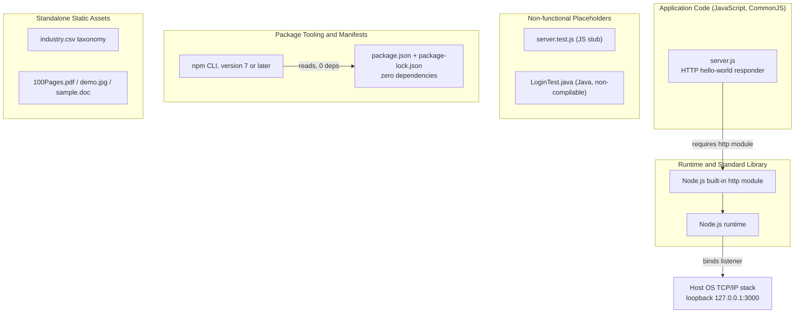
```mermaid
flowchart TD
    subgraph App["Application Code (JavaScript, CommonJS)"]
        Server["server.js<br/>HTTP hello-world responder"]
    end
    subgraph Placeholders["Non-functional Placeholders"]
        JsStub["server.test.js (JS stub)"]
        JavaStub["LoginTest.java (Java, non-compilable)"]
    end
    subgraph Runtime["Runtime and Standard Library"]
        HttpMod["Node.js built-in http module"]
        Node["Node.js runtime"]
    end
    subgraph Tooling["Package Tooling and Manifests"]
        Npm["npm CLI, version 7 or later"]
        Manifest["package.json + package-lock.json<br/>zero dependencies"]
    end
    subgraph Assets["Standalone Static Assets"]
        Csv["industry.csv taxonomy"]
        Bin["100Pages.pdf / demo.jpg / sample.doc"]
    end
    OS["Host OS TCP/IP stack<br/>loopback 127.0.0.1:3000"]

    Server -->|"requires http module"| HttpMod
    HttpMod --> Node
    Node -->|"binds listener"| OS
    Npm -->|"reads, 0 deps"| Manifest
```

### 3.1.1 Language Inventory by Component

The table maps each language to the component that uses it and the current state of that component.

| Language | Component / File(s) | Role | Status |
| --- | --- | --- | --- |
| JavaScript (Node.js, CommonJS) | `server.js` | Runnable HTTP hello-world responder | Active / runnable |
| JavaScript (Node.js, CommonJS) | `server.test.js` | Intended test stub | Non-functional — only the bare identifier `dfvrs` |
| Java | `LoginTest.java` (package `com.blitzyTest`) | Intended login/test entry point | Non-compilable placeholder — unresolved token `Web` |

No language runtime version is pinned by the repository: `package.json` declares no `engines` field, and there is no `.nvmrc` or `.node-version` file. For reference only, the verification environment provided **Node.js v22.23.1**; Java is not installed in that environment, and the repository ships no JDK or Java build configuration.

### 3.1.2 Supporting Data and Markup Formats

These are file formats rather than executable languages, but they are integral to the repository's composition.

| Format (version) | File(s) | Purpose |
| --- | --- | --- |
| JSON | `package.json`, `package-lock.json` | npm package manifest and lockfile (`lockfileVersion: 3`) |
| CSV | `industry.csv` | Single-column, 43-row industry taxonomy reference dataset |
| Markdown | `README.md`, `Project Guide.md` | Documentation (QA-purpose statement; placeholder guide) |

No source code is written in Python, TypeScript, or any other language: `test.py.txt` and `test.txt.txt` are 0-byte files and contain no code despite their names.

### 3.1.3 Selection Criteria and Justification

- **JavaScript on Node.js (primary).** The project's stated purpose — "Hello world in Node.js" (`package.json`) for QA testing (`README.md`) — is fully met by JavaScript executed on the Node.js runtime. Node's built-in `http` module lets the project expose an HTTP service with **zero third-party dependencies**, and CommonJS (`require`) is the default, zero-configuration module system, so no transpilation or bundling is required. This directly supports the offline, zero-dependency posture recorded in Section 2.6.2.
- **Java (placeholder only).** Java carries no active justification here; `LoginTest.java` exists solely to reserve the `com.blitzyTest.LoginTest` entry point for possible future login/test work. It is neither compiled nor executed.

### 3.1.4 Constraints and Dependencies

- **Runtime dependency:** `server.js` depends solely on a Node.js runtime that provides the built-in `http` module; it has no other code dependency.
- **Unpinned version:** the absence of an `engines` field, `.nvmrc`, and `.node-version` means any compatible Node.js version is acceptable; the project neither constrains nor guarantees a specific version.
- **Tooling constraint:** `package-lock.json` uses `lockfileVersion: 3`, which is honored only by npm 7 or later (consistent with the assumption in Section 2.6.1).
- **Java constraint:** `LoginTest.java` cannot compile until the unresolved identifier `Web` is defined or removed, and it would additionally require a JDK and a build step that the repository does not provide.
- **Module-system note:** `server.js` uses CommonJS and exports nothing, so `require`-ing it starts the server as a side effect rather than exposing an importable API.

## 3.2 Frameworks & Libraries

The repository uses **no third-party application frameworks and no third-party libraries**. Its only framework-like dependency is the Node.js standard library — specifically the built-in `http` module. This sub-section documents that runtime platform, confirms the absence of application frameworks and libraries, justifies the choice, and states the resulting compatibility requirements.

### 3.2.1 Runtime Platform and Standard-Library Modules

The sole "framework" the application code relies on is the Node.js runtime and its bundled `http` core module.

| Component | Version | Source | Role |
| --- | --- | --- | --- |
| Node.js runtime | Not pinned by repo (reference env: v22.23.1) | Host-provided platform | Executes `server.js` |
| Node.js `http` core module | Bundled with the Node.js runtime | Standard library | Creates the HTTP server; sets status/headers; writes the response |

`server.js` uses this module through `require('http')`, `http.createServer((req, res) => …)`, and `server.listen(port, hostname, callback)`. No other Node core module is used — there is no `fs`, `path`, `crypto`, `tls`, `cluster`, or `stream` usage anywhere in the source.

### 3.2.2 Absence of Application Frameworks and Third-Party Libraries

No application framework or third-party library is declared or used. `package.json` contains no `dependencies`, `devDependencies`, `peerDependencies`, or `optionalDependencies` block; `package-lock.json` records zero installed packages; and a repository-wide search for common frameworks and libraries returned no matches. The following categories were each confirmed **absent**:

| Category | Present in Repository | Evidence |
| --- | --- | --- |
| Web / application framework (e.g., Express, Fastify, Koa) | No | No dependency entries; no framework imports in `server.js` |
| Frontend / UI framework | No | No frontend code, build config, or UI libraries in the tree |
| Testing framework | No | `npm test` is a failing placeholder; `server.test.js` is a bare-identifier stub |
| Database / ORM library | No | No database driver or ORM imports; no connection code |
| HTTP client / cloud SDK | No | `server.js` makes no outbound calls; the only import is core `http` |

### 3.2.3 Justification

The project's objective — a hello-world HTTP responder used for QA testing — is fully satisfied by Node's built-in `http` module, so no external framework is warranted. Avoiding third-party frameworks and libraries keeps installation **zero-dependency and offline-installable** (Section 2.6.2) and eliminates third-party supply-chain and CVE exposure. The cost of this choice is that capabilities a framework would normally provide (routing, request parsing, middleware, validation) are simply absent, which is consistent with the deliberately minimal scope described in Section 1.3.2.

### 3.2.4 Compatibility Requirements

- **Node.js API surface:** requires a Node.js runtime whose built-in `http` API — `createServer`, `res.statusCode`, `res.setHeader`, `res.end`, and `server.listen` — is available. This API is stable across all modern Node.js release lines, so no specific version is mandated.
- **Module system:** CommonJS resolution must be available (the Node.js default); no ES-module configuration is present.
- **No build toolchain:** no transpiler, bundler, or compiler is required or configured; the JavaScript runs as authored.
- **Package tooling:** npm 7 or later is required to honor `lockfileVersion: 3` if installation is performed (Section 2.6.1).

## 3.3 Open Source Dependencies

The repository declares and installs **zero open-source dependencies**. This sub-section records the (empty) dependency set, the package registry configuration, the project's own license, and the single open-source component the project relies on externally — the Node.js runtime itself.

### 3.3.1 Declared Package Dependencies

No package dependencies of any kind are declared.

| Dependency Type | Declared Entries | Evidence |
| --- | --- | --- |
| Runtime (`dependencies`) | None | `package.json` has no `dependencies` block |
| Development (`devDependencies`) | None | `package.json` has no `devDependencies` block |
| Peer (`peerDependencies`) | None | `package.json` has no `peerDependencies` block |
| Optional (`optionalDependencies`) | None | `package.json` has no `optionalDependencies` block |

`package-lock.json` (`lockfileVersion: 3`, `requires: true`) contains only the root-package entry (`""`, version `1.0.0`, license `MIT`) with no nested package entries, confirming that a clean install fetches nothing.

### 3.3.2 Package Registry and Resolution

- **Registry:** the default npm public registry, `https://registry.npmjs.org/`, is the configured source. Because no dependencies are declared, no package resolution or download actually occurs.
- **Offline install:** with an empty dependency graph, `npm install` requires no network access, so the project is fully installable offline (Section 2.6.2).

### 3.3.3 External Open-Source Runtime

The one open-source component the project depends on is the **Node.js runtime**, which executes the code and provides the built-in `http` module. Node.js is host-provided; it is neither vendored nor committed to the repository, and it does not appear in the dependency manifests because it is a platform rather than a package.

### 3.3.4 Licensing and Security Posture

- **Project license:** `MIT`, declared in both `package.json` and the root entry of `package-lock.json`.
- **Security implication:** with zero third-party dependencies, the repository has no transitive dependency tree — hence no third-party CVE or supply-chain attack surface, and nothing for a dependency scanner (e.g., `npm audit`) to flag. No lockfile integrity hashes are present because no external packages are resolved.

## 3.4 Third-Party Services

The repository integrates with **no third-party services**. It defines no external API clients, no authentication or identity provider, no monitoring or observability service, and no cloud services. This sub-section documents that absence and then enumerates the only external touch-points that genuinely exist.

### 3.4.1 External APIs and Integrations

None. `server.js` only *receives* inbound HTTP requests and never issues outbound calls; there is no HTTP client, SDK, API key, endpoint URL, or integration configuration anywhere in the tree. The service ignores the incoming request entirely and returns a constant response, so it neither consumes nor produces integration data.

### 3.4.2 Authentication and Identity Services

None. There is no authentication or authorization code and no identity-provider integration (no OAuth/OIDC, no JWT handling, no session management, and no external service such as Auth0). Every request to the HTTP responder receives the same `200` response regardless of caller, method, or path.

### 3.4.3 Monitoring and Observability

None. There is no application performance monitoring, metrics collection, distributed tracing, error-reporting service, or log shipping. The only telemetry is a single `console.log` line emitted on successful bind (`Server running at http://127.0.0.1:3000/`), as noted in Section 1.2.3.

### 3.4.4 Cloud Services

None. There are no cloud provider SDKs or configuration (no AWS, GCP, or Azure clients), no object-storage, queue, or managed-database clients, and no deployment target definitions. The absence of containerization and Infrastructure-as-Code (Section 3.6) further confirms there is no cloud footprint.

### 3.4.5 External Touch-Points That Do Exist

While no third-party *service* is integrated, three external touch-points exist and are documented for completeness:

| Touch-Point | Nature | Notes |
| --- | --- | --- |
| Host OS TCP/IP stack | Operating-system facility | `server.js` binds a loopback listener on `127.0.0.1:3000`; this is an OS capability, not a third-party service |
| Source-code hosting | Development-time location | The git origin is hosted on GitHub; this is a code-hosting location only, with no GitHub Actions, apps, or webhooks configured |
| npm public registry | Potential dependency source | `https://registry.npmjs.org/` is the default registry but is unused because the project declares no dependencies |

**Security implication:** binding to the IPv4 loopback address means the service is not reachable off-host by default, and the absence of any integrated third-party service means there are no external credentials, tokens, or API secrets to manage within the source — none are committed to the repository.

## 3.5 Databases & Storage

The repository uses **no database and no caching layer**. Its only form of "storage" is a set of static files on the local filesystem, and the HTTP service itself is entirely stateless.

### 3.5.1 Databases (Primary and Secondary)

None. There is no database engine, driver, ORM, connection string, migration, or schema anywhere in the tree; a repository-wide search for common engines (MongoDB, MySQL, PostgreSQL, SQLite, Redis) returned no matches. Neither a primary nor a secondary datastore exists, and `server.js` maintains no in-memory data structure that serves as a substitute store.

### 3.5.2 Data Persistence Strategy

None. The HTTP handler is **stateless**: it ignores the incoming request and always writes the same `Hello, World!` response, performing no reads or writes (there is no `fs` usage). No data is persisted between requests or across restarts, so there is no persistence layer to configure or secure.

### 3.5.3 Caching

None. There is no in-process cache, no external cache client (such as Redis or Memcached), and no HTTP caching behavior beyond the single `Content-Type: text/plain` header the handler sets.

### 3.5.4 Storage — Static Filesystem Assets

The repository's only storage is a set of static assets committed to the local filesystem. These are **standalone fixtures**: a repository-wide search confirms that no source file references, opens, parses, or serves them (consistent with Section 2.6.1).

| Asset | Format (version) | Approx. Size | Nature |
| --- | --- | --- | --- |
| `industry.csv` | CSV | 749 B | 43-row industry taxonomy reference dataset |
| `100Pages.pdf` | PDF 1.7 | ~9.4 MB | Binary sample document fixture |
| `demo.jpg` | JPEG (EXIF) | ~2.1 MB | Binary sample image fixture |
| `sample.doc` | OLE2 / legacy Microsoft Word | ~98 KB | Binary sample document fixture |

**Security implication:** the absence of any database means there is no data-at-rest to encrypt, no SQL/NoSQL injection surface, and no connection credentials to manage. The static assets are read-only fixtures that the application code never exposes over the network.

## 3.6 Development & Deployment

Development and deployment tooling is minimal and manual. The project relies on the Node.js runtime and the npm CLI, has no build step, and defines no containerization or CI/CD. This sub-section documents the tools, the (absent) build system, the execution model, containerization, CI/CD, and the resulting integration and security implications.

### 3.6.1 Development Tools

| Tool | Version | Role |
| --- | --- | --- |
| Node.js | Not pinned by repo (reference env: v22.23.1) | Runtime used to execute `server.js` |
| npm CLI | Not pinned; 7 or later required for `lockfileVersion: 3` (reference env: 11.1.0) | Manifest/lockfile management and script runner |
| git | Not pinned | Version control; origin hosted on GitHub |

No linter, formatter, type-checker, test framework, or editor configuration is present — there is no ESLint, Prettier, `.editorconfig`, or `tsconfig.json` in the tree.

### 3.6.2 Build System

None. The project requires no compilation, bundling, or transpilation — `server.js` is plain CommonJS JavaScript executed directly by Node.js. The Java placeholder would require a JDK/`javac` and a build tool to compile, but no build configuration (no Maven `pom.xml`, no Gradle files) is provided, so `LoginTest.java` is neither built nor run.

### 3.6.3 Execution / Run Model

- **Start command:** `node server.js`, which binds `127.0.0.1:3000` and logs `Server running at http://127.0.0.1:3000/`.
- **Missing entry point:** `package.json` `main` points to `index.js`, which does not exist; there is no `npm start` script, and `npm test` is a placeholder that intentionally exits non-zero.
- **Side-effect start:** because `server.js` exports nothing and calls `server.listen(...)` at module load, `require`-ing it also starts the server rather than exposing an importable API.

### 3.6.4 Containerization

None. There is no `Dockerfile`, `docker-compose` file, or `.dockerignore`. The service is intended to run directly on a host Node.js runtime with no container image or orchestration.

### 3.6.5 CI/CD and Infrastructure-as-Code

None. There are no pipeline definitions (no `.github/workflows`, `.gitlab-ci.yml`, `.circleci/`, `Jenkinsfile`, or `azure-pipelines.yml`) and no Infrastructure-as-Code (no Terraform, CloudFormation, or Pulumi files; the tree contains zero YAML files). Change tracking relies solely on git history; the repository is hosted on GitHub, but no automated build, test, or deployment is configured (Section 2.6.2).

### 3.6.6 Integration Requirements and Security Implications

**Component integration.** The stack is intentionally decoupled and has very few integration points:

- `server.js` integrates only with the Node.js runtime via `require('http')` and, through it, with the host OS TCP/IP stack to bind the loopback listener.
- `package.json` and `package-lock.json` integrate with the npm CLI (which must be version 7 or later to honor `lockfileVersion: 3`).
- The Java placeholder is not linked to the JavaScript code, and the static assets (`industry.csv` and the three binaries) are not referenced by any source file — so there are no code-to-data or cross-language integrations to satisfy.

**Security implications** (observed characteristics and their direct consequences):

- The listener binds to `127.0.0.1`, so the service is not reachable off-host by default.
- Traffic is plaintext HTTP; there is no TLS/HTTPS.
- There is no authentication or authorization; every request receives a `200` response.
- No secrets are committed to the repository, and there are no third-party dependencies to scan or patch.
- No CI security gate, dependency-vulnerability scan, or static analysis is configured, so any such checks would have to be added (consistent with Sections 1.3.2 and 2.6.2).

## 3.7 References

The following repository files, folders, cross-referenced specification sections, and environment observations were examined as evidence for this section.

**Repository files (all repository-root-relative):**

- `server.js` - established the sole runnable component, its use of the Node.js built-in `http` module, the loopback bind on `127.0.0.1:3000`, and the stateless request handler
- `server.test.js` - confirmed a non-functional JavaScript test stub (bare identifier `dfvrs`)
- `package.json` - established the npm package identity (`hello_world` v`1.0.0`, MIT), the missing `index.js` entry point, the failing `test` script, and the absence of any dependency or `engines` declarations
- `package-lock.json` - established `lockfileVersion: 3`, `requires: true`, and zero installed dependency packages
- `LoginTest.java` - established the Java placeholder (package `com.blitzyTest`) and its non-compilable state (unresolved `Web`)
- `test.py.txt` - confirmed a 0-byte empty file (no Python source)
- `test.txt.txt` - confirmed a 0-byte empty file
- `industry.csv` - established the 43-row CSV industry-taxonomy reference dataset
- `README.md` - established the project's QA-testing purpose statement
- `Project Guide.md` - confirmed a placeholder document (literal text `def`)
- `100Pages.pdf` - established a binary sample document fixture (PDF 1.7)
- `demo.jpg` - established a binary sample image fixture (JPEG/EXIF)
- `sample.doc` - established a binary sample document fixture (OLE2 / legacy Microsoft Word)

**Folders:**

- `` (repository root) - confirmed a flat structure with no subdirectories, and the complete absence of Docker, CI/CD (`.github/workflows`), Infrastructure-as-Code (Terraform/CloudFormation/Pulumi), Python/Java build files, frontend/TypeScript configuration, and env/config files

**Cross-referenced specification sections (via `get_tech_spec_section`):**

- `1.2 System Overview` - aligned the runtime, component, and technical-approach framing (Node.js built-in `http`, loopback-only, single startup `console.log`)
- `2.6 Assumptions and Constraints` - aligned the zero-dependency, npm 7+, `v1.0.0` baseline, and no-CI/CD constraints

**Environment observations (informational only; not pinned by the repository):**

- Runtime versions available in the verification environment — Node.js v22.23.1, npm 11.1.0, Python 3.12.3; Java not installed — and the default npm registry `https://registry.npmjs.org/`. These were observed to report reference versions and are explicitly not constraints declared by the repository.

No external web sources were required or used for this section.

# 4. Process Flowchart

## 4.1 System Workflows

This section documents the process flows that are directly observable in the repository. As established in **Section 1.2 System Overview**, **Section 1.3 Scope**, and **Section 2.1 Feature Catalog**, the repository (`existing-projects-qa-test-08-dec-test`) is a small, flat, QA-testing sample project whose only executable artifact is the dependency-free Node.js HTTP server in `server.js`. Consequently, the "business processes" documented here are correspondingly minimal: (1) an operator/QA workflow that starts and exercises the server, and (2) a stateless HTTP request/response loop.

To avoid overstating the system, the following enterprise-workflow constructs are **explicitly absent** from the source and are therefore not depicted as active flows (each is confirmed by direct inspection and cross-referenced in **Section 2.3 Feature Relationships**): multi-step business transactions, user onboarding/authentication journeys, database-backed persistence flows, third-party API orchestration, message-queue or event-bus pipelines, and scheduled/batch jobs. Where a required flowchart dimension has no basis in the code, that absence is stated rather than invented.

Throughout the diagrams below, swim lanes (subgraphs and sequence-diagram participants) separate the distinct actors and systems — the **Operator/QA engineer**, the **HTTP client**, the **`server.js` process**, the **Node.js runtime (built-in `http` module)**, and the **OS TCP/IP loopback stack**.

### 4.1.1 Core Business Processes

**End-to-end user journey.** The single end-to-end journey is: an operator starts the server (`node server.js`), the process binds a loopback listener on `127.0.0.1:3000` and logs a startup line, and thereafter any HTTP client issuing a request to that address receives a deterministic `200 text/plain` response with the body `Hello, World!`. This journey embodies feature **F-001** and its requirements **F-001-RQ-001** (listener binding), **F-001-RQ-002** (deterministic response), and **F-001-RQ-003** (startup logging) from **Section 2.2 Functional Requirements**.

**High-level system workflow.** The following diagram captures the complete observable lifecycle — invocation, binding decision, request serving, the failure branches, and the isolated static-asset consumption path.

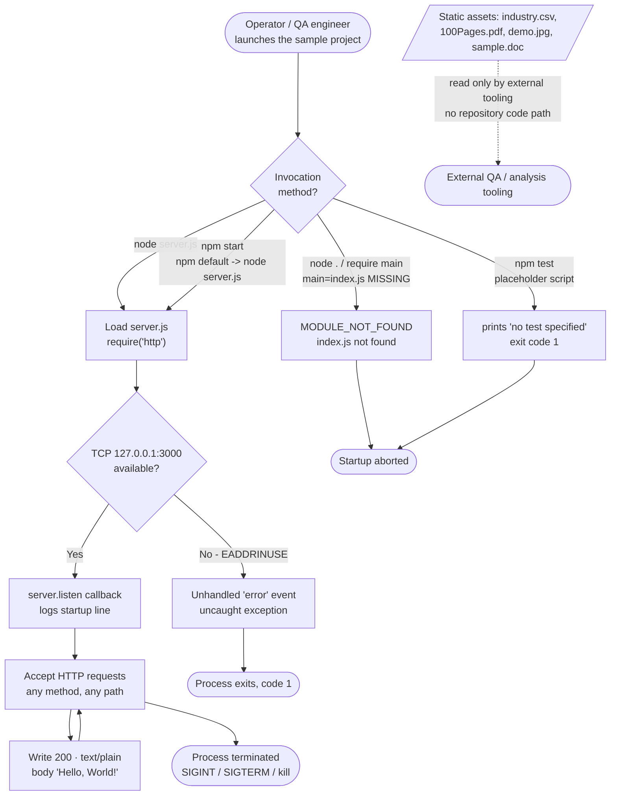
```mermaid
flowchart TB
    Start(["Operator / QA engineer<br/>launches the sample project"]) --> Choose{"Invocation<br/>method?"}
    Choose -->|"node server.js"| Boot["Load server.js<br/>require('http')"]
    Choose -->|"npm start<br/>npm default -> node server.js"| Boot
    Choose -->|"node . / require main<br/>main=index.js MISSING"| EntryErr["MODULE_NOT_FOUND<br/>index.js not found"]
    Choose -->|"npm test<br/>placeholder script"| TestErr["prints 'no test specified'<br/>exit code 1"]
    Boot --> Bind{"TCP 127.0.0.1:3000<br/>available?"}
    Bind -->|"Yes"| Listen["server.listen callback<br/>logs startup line"]
    Bind -->|"No - EADDRINUSE"| BindErr["Unhandled 'error' event<br/>uncaught exception"]
    Listen --> Serve["Accept HTTP requests<br/>any method, any path"]
    Serve --> Respond["Write 200 · text/plain<br/>body 'Hello, World!'"]
    Respond --> Serve
    Serve --> Stop(["Process terminated<br/>SIGINT / SIGTERM / kill"])
    EntryErr --> EndFail(["Startup aborted"])
    TestErr --> EndFail
    BindErr --> Crash(["Process exits, code 1"])

    Assets[/"Static assets: industry.csv,<br/>100Pages.pdf, demo.jpg, sample.doc"/] -.->|"read only by external tooling<br/>no repository code path"| ExtTool(["External QA / analysis tooling"])
```

**Operator command workflow.** The repository exposes several operator entry points; their resolution and observed outcomes (empirically verified against the source) are summarized below. Note that `npm start` succeeds only because npm's built-in default runs `node server.js` when no `start` script is declared, whereas the declared `main` entry point does not resolve.

| Invocation | Resolution | Observed Result |
| --- | --- | --- |
| `node server.js` | Direct script execution | Binds `127.0.0.1:3000`, logs `Server running at http://127.0.0.1:3000/`, then serves requests |
| `npm start` | npm default (no `start` script) -> `node server.js` | Identical to `node server.js` (verified: npm echoes `> node server.js`) |
| `node .` / `require(main)` | Package `main` = `index.js` | Fails: `Error: Cannot find module .../index.js` (`MODULE_NOT_FOUND`) |
| `npm test` | `echo "Error: no test specified" && exit 1` | Prints `Error: no test specified`; exits with code `1` (F-002-RQ-003) |
| `npm install` | Zero-dependency lockfile | Completes offline with no registry fetch (F-002-RQ-002) |

**Detailed process flow — server startup.** The startup path is strictly linear: the module is executed top-to-bottom, the `http` server is created, and `server.listen()` delegates the bind to the OS. The only decision point is whether the loopback bind succeeds. Because `server.js` registers **no** `'error'` listener, a bind failure (e.g., `EADDRINUSE`) becomes an uncaught exception that terminates the process.

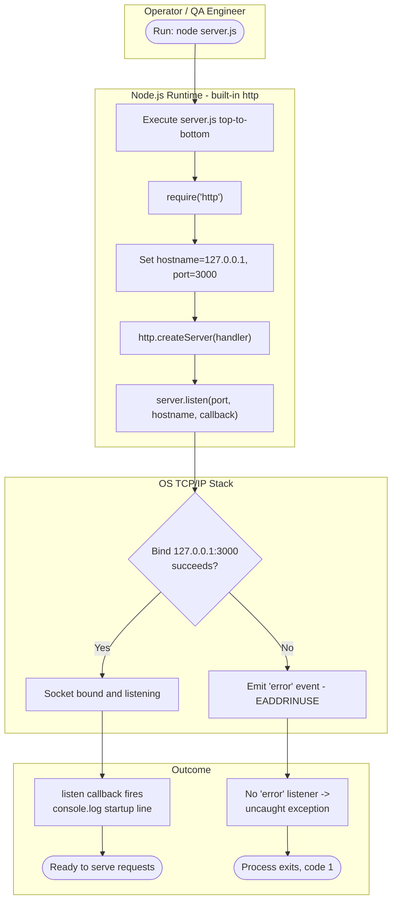
```mermaid
flowchart TB
    subgraph laneOp["Operator / QA Engineer"]
        direction TB
        O1(["Run: node server.js"])
    end
    subgraph laneRT["Node.js Runtime - built-in http"]
        direction TB
        N1["Execute server.js top-to-bottom"]
        N2["require('http')"]
        N3["Set hostname=127.0.0.1, port=3000"]
        N4["http.createServer(handler)"]
        N5["server.listen(port, hostname, callback)"]
    end
    subgraph laneOS["OS TCP/IP Stack"]
        direction TB
        S1{"Bind 127.0.0.1:3000<br/>succeeds?"}
        S2["Socket bound and listening"]
        S3["Emit 'error' event - EADDRINUSE"]
    end
    subgraph laneOut["Outcome"]
        direction TB
        R1["listen callback fires<br/>console.log startup line"]
        R2(["Ready to serve requests"])
        R3["No 'error' listener -><br/>uncaught exception"]
        R4(["Process exits, code 1"])
    end
    O1 --> N1 --> N2 --> N3 --> N4 --> N5 --> S1
    S1 -->|"Yes"| S2 --> R1 --> R2
    S1 -->|"No"| S3 --> R3 --> R4
```

**Detailed process flow — HTTP request handling.** Once listening, every request is handled by the same three-statement callback. There are **no decision points** in the handler: the request object is accepted but never parsed, routed, or validated, so the output is identical regardless of method, path, headers, or body. This unconditional determinism is the defining behavioral property of F-001-RQ-002.

```javascript
res.statusCode = 200;
res.setHeader('Content-Type', 'text/plain');
res.end('Hello, World!\n');
```

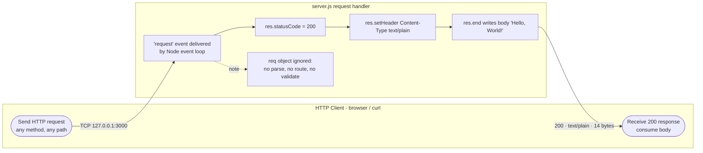
```mermaid
flowchart LR
    subgraph laneClient["HTTP Client - browser / curl"]
        direction TB
        C1(["Send HTTP request<br/>any method, any path"])
        C2(["Receive 200 response<br/>consume body"])
    end
    subgraph laneServer["server.js request handler"]
        direction TB
        H0["'request' event delivered<br/>by Node event loop"]
        H1["res.statusCode = 200"]
        H2["res.setHeader Content-Type text/plain"]
        H3["res.end writes body 'Hello, World!'"]
        H4["req object ignored:<br/>no parse, no route, no validate"]
    end
    C1 -->|"TCP 127.0.0.1:3000"| H0
    H0 --> H1 --> H2 --> H3
    H0 -.->|"note"| H4
    H3 -->|"200 · text/plain · 14 bytes"| C2
```

**Decision points.** The two — and only two — decision points in the running system are enumerated below; the request handler itself contributes none.

| Decision Point | Condition Evaluated | Branch Outcomes |
| --- | --- | --- |
| Invocation resolution | Which command is used to start the app | Success (`node server.js`, `npm start`) vs. failure (`node .`, `npm test`) |
| Listener bind | Is `127.0.0.1:3000` free? | Yes -> listening/serving; No -> `EADDRINUSE` uncaught exception -> exit code 1 |
| Request routing | (none — handler is unconditional) | Always `200 text/plain Hello, World!` regardless of request |

**Error handling paths and user touchpoints.** The observable error branches (missing `index.js`, failing `npm test`, and `EADDRINUSE` on bind) are summarized above and detailed with recovery guidance in **Section 4.4 Error Handling**. The user touchpoints are limited to two roles that may be the same person: the **Operator/QA engineer** (issues shell commands) and the **HTTP client** (issues requests to `127.0.0.1:3000`). Because the listener is loopback-bound, both touchpoints are reachable only from the local host (see **Section 1.3.1**).

### 4.1.2 Integration Workflows

**Data flow between systems.** The only live runtime integration is the HTTP request/response path between an external client and `server.js`, mediated by the Node.js built-in `http` module and the host OS TCP/IP loopback stack. This mirrors the integration-point inventory in **Section 2.3.2** and the runtime interaction diagram in **Section 1.2.2**. The static assets (`industry.csv` and the three binary fixtures) are **not** part of any runtime data flow — no source file reads them (verified: the codebase contains no `fs` usage and no reference to any `.csv`/`.pdf`/`.doc`/`.jpg` filename); they flow only into external tooling that chooses to open them.

| Integration | Participants | Direction / Nature |
| --- | --- | --- |
| HTTP request/response | External client <-> `server.js` | Bidirectional; request in, fixed `200` response out |
| Node.js `http` module | `server.js` <-> Node runtime | `require('http')` + `http.createServer(...)` |
| OS TCP/IP loopback | `server.js` <-> host network stack | `server.listen()` binds `127.0.0.1:3000` |
| Static-asset consumption | Repository files -> external tooling | One-way, out-of-band; no repository code path |

**API interactions.** The server exposes a single, implicit HTTP surface: one listener answering every method and path uniformly. There are no REST resources, no route table, no path/query parameters, no content negotiation, no API versioning, and no request/response schema beyond the fixed plain-text body. In effect the "API" is a constant function of zero meaningful inputs.

**Event processing flows.** The only event processing is that provided intrinsically by the Node.js event loop within the `http` module: the server instance emits a `'listening'` event (whose callback logs the startup line), a `'request'` event per inbound request (whose handler writes the response), and an `'error'` event on bind failure (for which **no** listener is registered — see Section 4.4). There is **no** application-level event bus, publish/subscribe mechanism, domain-event model, or message broker anywhere in the repository.

**Batch processing sequences.** There are **none**. The repository contains no scheduler, cron definition, job queue, worker, timer (`setInterval`/`setTimeout`), or bulk-processing routine (verified by source inspection). The industry taxonomy and binary fixtures are static files that would be processed, if at all, only by external batch tooling outside this repository's scope.

**Integration sequence diagram.** The sequence below shows the two temporal phases — one-time startup and the repeatable per-request exchange — across the four participating systems (swim lanes).

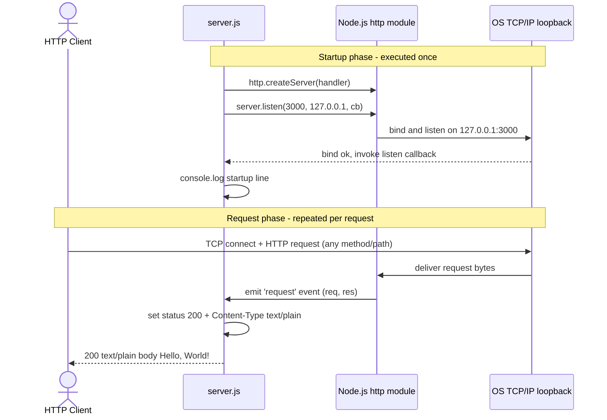
```mermaid
sequenceDiagram
    actor Client as HTTP Client
    participant Server as server.js
    participant HTTP as Node.js http module
    participant OS as OS TCP/IP loopback

    Note over Server,OS: Startup phase - executed once
    Server->>HTTP: http.createServer(handler)
    Server->>HTTP: server.listen(3000, 127.0.0.1, cb)
    HTTP->>OS: bind and listen on 127.0.0.1:3000
    OS-->>Server: bind ok, invoke listen callback
    Server->>Server: console.log startup line

    Note over Client,OS: Request phase - repeated per request
    Client->>OS: TCP connect + HTTP request (any method/path)
    OS->>HTTP: deliver request bytes
    HTTP->>Server: emit 'request' event (req, res)
    Server->>Server: set status 200 + Content-Type text/plain
    Server-->>Client: 200 text/plain body Hello, World!
```

## 4.2 Workflow Validation and Business Rules

This section enumerates the business rules, data-validation requirements, authorization checkpoints, regulatory-compliance checks, and timing constraints that apply at each step of the workflows in **Section 4.1**. Every entry is derived from the observable source; the corresponding **Validation Rules** tables in **Section 2.2 Functional Requirements** are the authoritative per-requirement basis, and this section maps those rules onto the process steps. Where a category has no implementation in the repository, that absence is documented explicitly rather than fabricated (consistent with **Section 1.2.3** and **Section 2.4**).

### 4.2.1 Business Rules and Data Validation by Process Step

The table below aligns each observable process step with its governing business rule, its data-validation posture, and the related requirement identifier. The most consequential fact is that the request-handling step performs **no** input validation whatsoever — the `req` object is accepted but never inspected, so no method, path, header, or body is parsed or checked.

| Process Step | Business Rule | Data Validation | Related Req. |
| --- | --- | --- | --- |
| Listener bind | Loopback-only (`127.0.0.1`); not reachable from remote hosts | Not applicable — no external input at bind time | F-001-RQ-001 |
| Request handling | Uniform response; no routing or content negotiation | None — request method/path/headers/body are neither parsed nor validated | F-001-RQ-002 |
| Startup logging | Emit the startup line exactly once, on successful bind | Not applicable | F-001-RQ-003 |
| Package identity | Name/version/license consistent across manifest and lockfile | Files must be valid JSON parseable by the npm CLI | F-002-RQ-001 |
| Dependency install | No runtime, dev, peer, or optional dependencies permitted | `lockfileVersion: 3` implies npm CLI v7+ | F-002-RQ-002 |
| Taxonomy dataset | Exactly one category per row, plus a catch-all `Other` | No ID/metadata columns; slash-compound labels (e.g., `Accounting/Finance`) are single values | F-003-RQ-001 |
| Binary fixtures | Three intentionally distinct file formats | Integrity verifiable by magic bytes (`%PDF-1.7`; `FF D8 FF`; `D0 CF 11 E0 A1 B1 1A E1`) | F-004-RQ-001 |

**Interpretation.** Because the running service consumes no external data, the only "validation" that matters at runtime is the OS-level bind check (does port `3000` bind on the loopback interface?). All other validation entries pertain to static artifacts (manifests, CSV, binaries) that are checked by tooling or by the npm CLI, not by any code in this repository.

### 4.2.2 Authorization Checkpoints and Regulatory Compliance

**Authorization checkpoints — none.** There are no authentication or authorization checkpoints anywhere in the workflows. The repository implements no login, session, token, API key, role-based access control, or access-control list; the request handler grants every request identical, unconditional access to the same response. The only access-limiting mechanism is **network-level**, not authorization: the loopback bind (`127.0.0.1`) confines reachability to the local host (see **Section 2.4.1** security implications). The apparent login entry point, `LoginTest.java` (package `com.blitzyTest`), is a non-compiling stub with an empty `main` — an unrealized placeholder documented in **Section 1.3.2** and **Section 2.6**, not an implemented authorization control.

**Regulatory compliance checks — none declared.** No regulatory or compliance regime (e.g., data-protection, financial, or healthcare frameworks) is referenced anywhere in the source. The observable compliance-relevant facts are limited to: distribution is governed by the declared **MIT license** (`package.json`, `package-lock.json`); the `industry.csv` taxonomy contains **no PII** (it is a public industry list); and the binary fixtures are opaque content that downstream consumers should treat as **untrusted input** to their own parsers (**Section 2.4.4**). No audit logging, consent handling, data-retention, or encryption-at-rest/in-transit control exists — notably, transport is plain HTTP with no TLS.

### 4.2.3 Timing and SLA Considerations

The repository defines **no** service-level agreements, latency or throughput targets, timeouts, deadlines, or retry windows in any source or configuration file (consistent with **Section 1.2.3** and **Section 2.4.1**). The only timing-relevant behaviors are emergent runtime characteristics:

| Timing Aspect | Observed Behavior | Source of the Value |
| --- | --- | --- |
| Startup | Bind and startup log occur once, synchronously, at process start | `server.listen()` callback in `server.js` |
| Response latency | Handler writes a fixed literal and returns immediately on the single-threaded event loop; no I/O or lookup | `server.js` request handler (no async work) |
| Connection keep-alive | Responses carry `Keep-Alive: timeout=5` (5 seconds) | Node.js `http` module **default** — not configured in `server.js` |
| Concurrency | Single process, single loopback listener; no clustering or worker pool | `server.js` (see **Section 2.4.1** scalability) |

The `Keep-Alive: timeout=5` header is an emergent default of the Node.js `http` module observed on responses; it is **not** an SLA and is **not** set by the application code. Any genuine timing constraint or SLA would have to be added and is not part of the repository as it currently exists.

## 4.3 State Management

The running service is **stateless across requests**: it maintains no session store, no in-memory application state, and no persistent data. As confirmed in **Section 2.3.3**, there is no shared configuration, persistence, caching, or messaging layer. The only "state" that exists is (1) the operating-system-level lifecycle of the `server.js` process and (2) the transient, per-request construction of the HTTP response object. Both are modeled below as state-transition diagrams (a required diagram type), followed by an explicit accounting of persistence, caching, and transaction boundaries.

### 4.3.1 Process and Server Lifecycle State Transitions

The `server.js` process moves through a small, deterministic set of states. The single branching transition is at bind time: a successful loopback bind advances the process to `Listening`, while an `EADDRINUSE` (or other listen) error — for which no handler is registered — drives it directly to `Crashed`. From `Listening`, each inbound request briefly enters `Serving` and returns to `Listening` after `res.end()`. Termination is external (a signal), because `server.js` implements no graceful-shutdown logic.

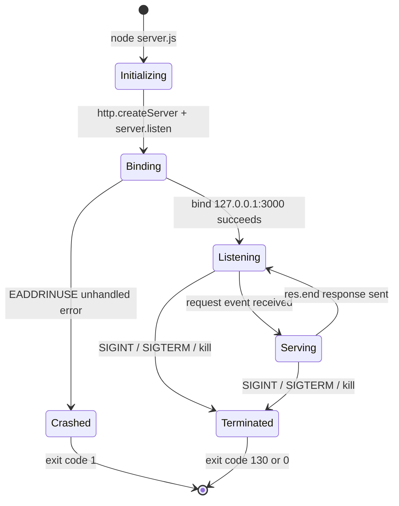
```mermaid
stateDiagram-v2
    [*] --> Initializing: node server.js
    Initializing --> Binding: http.createServer + server.listen
    Binding --> Listening: bind 127.0.0.1:3000 succeeds
    Binding --> Crashed: EADDRINUSE unhandled error
    Listening --> Serving: request event received
    Serving --> Listening: res.end response sent
    Listening --> Terminated: SIGINT / SIGTERM / kill
    Serving --> Terminated: SIGINT / SIGTERM / kill
    Crashed --> [*]: exit code 1
    Terminated --> [*]: exit code 130 or 0
```

Key properties: the `Listening` <-> `Serving` cycle carries **no** accumulated state between iterations (every visit to `Serving` produces the identical response); and there is no `Paused`, `Draining`, or `Reloading` state, because no configuration reload, connection draining, or graceful-shutdown mechanism exists in the source.

### 4.3.2 Request/Response Construction State

Within a single `Serving` visit, the response object is built through a fixed three-step progression. This micro-state is entirely transient — it lives only for the duration of the request and is discarded once the response is flushed to the socket.

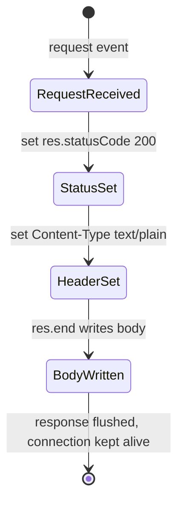
```mermaid
stateDiagram-v2
    [*] --> RequestReceived: request event
    RequestReceived --> StatusSet: set res.statusCode 200
    StatusSet --> HeaderSet: set Content-Type text/plain
    HeaderSet --> BodyWritten: res.end writes body
    BodyWritten --> [*]: response flushed, connection kept alive
```

There are no alternative terminal states (no `4xx`/`5xx` branch), because the handler contains no conditional logic; the progression is identical for every request (F-001-RQ-002).

### 4.3.3 Data Persistence, Caching, and Transaction Boundaries

The table below records the state-management concerns raised by the section prompt against their actual implementation status in the repository. All are absent by design for a minimal QA sample, and each absence is evidence-backed.

| Concern | Status in Repository | Evidence |
| --- | --- | --- |
| Data persistence points | None at runtime — no database and no file writes | `server.js` performs no `fs` I/O; no DB driver or connection exists (**Section 3.5**) |
| In-memory / session state | Stateless — the response is a hard-coded literal with no shared mutable state | Request handler in `server.js` reads/writes no variables beyond the local `res` |
| Caching requirements | None — no cache layer and no `Cache-Control` header is set | Handler sets only `Content-Type`; the observed `Keep-Alive` is TCP connection reuse, not response caching |
| Transaction boundaries | None — each request is a single synchronous write with no atomicity semantics | No database, transaction API, or multi-step commit/rollback anywhere in the source |
| Static-asset lifecycle | Read-only files committed to git; never mutated or read by the app | `industry.csv` and the three binaries are not referenced by any code (**Section 2.3.1**) |

**Restart behavior.** Because the process holds no persistent or in-memory state, restarting it (`node server.js`) fully reconstructs its behavior from source with nothing to recover, migrate, or reconcile — there is no state to lose. This is the practical corollary of the stateless design and is the basis for the manual recovery procedure described in **Section 4.4**.

## 4.4 Error Handling

The repository implements **no error-handling framework**. Direct inspection confirms there is no `try`/`catch`, no server `'error'` listener, no process-level `uncaughtException`/`unhandledRejection` handler, and no error-reporting middleware anywhere in `server.js`. Error handling is therefore limited to (a) the Node.js runtime's default behavior of printing a stack trace and exiting on an uncaught exception, and (b) a de facto **manual** recovery model. This section documents the observable failure modes (each empirically reproduced), the resulting flow, and the retry/fallback/notification/recovery posture.

### 4.4.1 Observable Failure Modes

| Failure Mode | Trigger | Observed Behavior |
| --- | --- | --- |
| Port already in use | Start the server while `127.0.0.1:3000` is bound | Server emits an `'error'` event with no listener -> uncaught `EADDRINUSE` exception -> process exits with code `1` |
| Missing entry point | `node .` or `require` of the package `main` | `Error: Cannot find module .../index.js` (`MODULE_NOT_FOUND`); exit code `1` |
| Non-functional test | `npm test` | Prints `Error: no test specified`; exits with code `1` (F-002-RQ-003) |
| Broken test stub | Executing `server.test.js` | Bare identifier `dfvrs` raises a `ReferenceError` (not wired into `npm test`) |
| Non-compiling Java stub | Compiling `LoginTest.java` | Unresolved token `Web` prevents compilation (unrealized placeholder) |
| Request-driven runtime error | Any HTTP request | **None possible** — the request is never parsed, so no request content can trigger a handler error |

The final row is significant: because the handler ignores the request entirely and returns a fixed literal, there is **no request-driven error surface** — no `4xx`/`5xx` responses can arise from request content. The realistic failure modes are all confined to startup and tooling, not to request processing.

### 4.4.2 Error-Handling Flowchart

The following flowchart consolidates the failure branches from **Section 4.1** and shows the single recovery mechanism that exists: manual operator remediation. There is no automatic path out of a failed state.

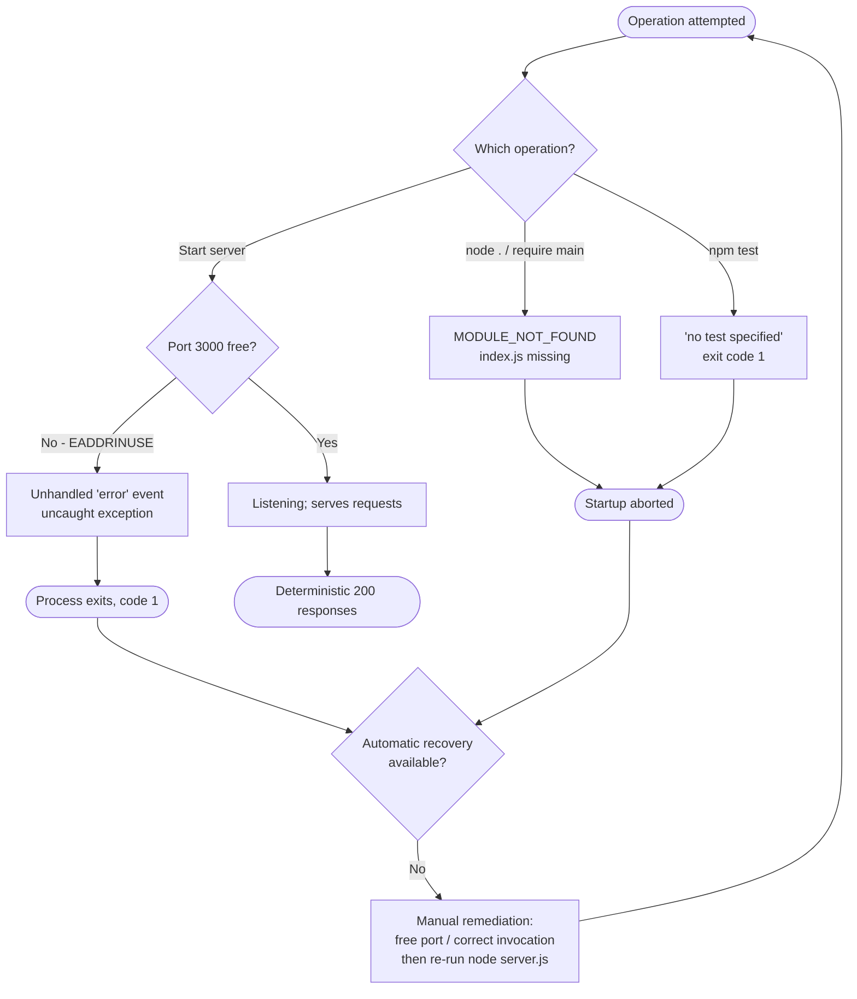
```mermaid
flowchart TB
    Trigger(["Operation attempted"]) --> Q1{"Which operation?"}
    Q1 -->|"Start server"| Q2{"Port 3000 free?"}
    Q1 -->|"node . / require main"| Eentry["MODULE_NOT_FOUND<br/>index.js missing"]
    Q1 -->|"npm test"| Etest["'no test specified'<br/>exit code 1"]
    Q2 -->|"Yes"| OK["Listening; serves requests"]
    Q2 -->|"No - EADDRINUSE"| Ebind["Unhandled 'error' event<br/>uncaught exception"]
    Ebind --> Crash(["Process exits, code 1"])
    Eentry --> Abort(["Startup aborted"])
    Etest --> Abort
    Crash --> Recover{"Automatic recovery<br/>available?"}
    Abort --> Recover
    Recover -->|"No"| Manual["Manual remediation:<br/>free port / correct invocation<br/>then re-run node server.js"]
    Manual --> Trigger
    OK --> Healthy(["Deterministic 200 responses"])
```

### 4.4.3 Retry, Fallback, Notification, and Recovery

**Retry mechanisms — none.** There is no retry logic, exponential backoff, reconnection loop, or bounded-attempt wrapper anywhere in the source. A failed bind is terminal for the process; it is not retried.

**Fallback processes — none.** There is no fallback response, degraded-mode path, default/catch-all route, or circuit breaker. The service has exactly one behavior; when it cannot start, there is no secondary behavior to fall back to. (No `4xx`/`5xx` fallback is needed at request time because every request already resolves to the same `200`.)

**Error notification flows.** The application emits exactly one intentional log line — the success-path startup message `Server running at http://127.0.0.1:3000/` (`console.log` in the `server.listen` callback). On failure, the **only** notification is the Node.js runtime's default stack trace written to `stderr` (e.g., the `EADDRINUSE` trace or `MODULE_NOT_FOUND` error). There is no structured logging, no alerting, no metric emission, no error webhook, and no monitoring integration (consistent with the observability exclusions in **Section 1.3.2** and **Section 2.3.3**).

**Recovery procedures.** Recovery is entirely manual and relies on the stateless design established in **Section 4.3**:

1. Detect the failure by observing the non-zero process exit and the `stderr` trace (there is no health-check or liveness probe to detect it automatically).
2. Remediate the root cause — free TCP port `3000` (or edit the hard-coded `port`/`hostname` literals in `server.js`), or switch to a working invocation (`node server.js` / `npm start`) if the entry-point or test path was the cause.
3. Re-run `node server.js`. Because the process holds no persistent or in-memory state, the restart fully restores behavior with nothing to recover, replay, or reconcile.

No process manager, supervisor, container orchestrator, or auto-restart facility is present in the repository (**Section 3.6**), so no automated restart or self-healing occurs; the service remains down until an operator intervenes.

## 4.5 References

The following repository files, folders, and previously authored specification sections were examined as evidence for this section. All process flows, decision points, state transitions, and error paths documented above are grounded in these sources.

**Repository files inspected**

- `server.js` - The sole executable artifact; established the linear startup flow (`require('http')`, hard-coded `hostname`/`port`, `http.createServer`, `server.listen`), the unconditional stateless request handler (`200`/`text/plain`/`Hello, World!\n`), the startup log line, and the absence of routing, `fs`/env access, timers/async, and any `'error'`/`try`-`catch` handling.
- `package.json` - Established the operator entry points and their resolution: `main: index.js` (unresolved), the failing `test` placeholder script, and the absence of a `start` script (so `npm start` falls back to the npm default).
- `package-lock.json` - Established the zero-dependency, offline-installable dependency tree (`lockfileVersion: 3`, root package only).
- `server.test.js` - Established the broken test stub (bare identifier `dfvrs`) that is not wired into `npm test`.
- `LoginTest.java` - Established that the apparent login/authorization entry point (`com.blitzyTest.LoginTest`) is a non-compiling, unrealized placeholder (bare `Web` token).
- `industry.csv` - Established a static, read-only taxonomy asset that participates in no runtime data flow (not referenced by any code).
- `100Pages.pdf`, `demo.jpg`, `sample.doc` - Established the binary fixtures consumed only by external tooling; not part of any runtime workflow.
- `README.md` - Established the QA-testing purpose framing the minimal scope of the workflows.
- `Project Guide.md`, `test.py.txt`, `test.txt.txt` - Confirmed inert/empty placeholders with no process behavior.

**Repository folders inspected**

- `/` (repository root) - Confirmed the flat structure (no subdirectories); the complete file inventory over which all workflows were derived.

**Empirical verification environment**

- Node.js `v22.23.1` / npm `11.1.0` (sandbox) - Used to reproduce and confirm observed behaviors: startup log, deterministic `200` response to GET and POST (any method/path), the `EADDRINUSE` unhandled-error crash (exit code `1`), the `MODULE_NOT_FOUND` entry-point failure, the failing `npm test` (exit code `1`), and the `npm start` default resolution to `node server.js`. These versions are the verification runtime only; the repository pins no runtime version.

**Cross-referenced specification sections**

- **Section 1.2 System Overview** - Runtime interaction diagram, component inventory, and the confirmation that no SLAs/KPIs are defined.
- **Section 1.3 Scope** - In-scope workflows and the explicit out-of-scope list (routing, auth, persistence, TLS, CI/CD, observability, production concerns).
- **Section 2.1 Feature Catalog** - Feature identifiers F-001 through F-004 used throughout the flows.
- **Section 2.2 Functional Requirements** - Requirement identifiers (F-001-RQ-001/002/003, F-002-RQ-002/003) and their per-step validation rules.
- **Section 2.3 Feature Relationships** - Integration-point inventory and the confirmation of no shared components/common services.
- **Section 2.4 Implementation Considerations** - F-001 technical constraints, scalability, security, and timing characteristics.
- **Section 3.5 Databases & Storage** - Confirmation of no database, persistence, or caching layer.
- **Section 3.6 Development & Deployment** - Confirmation of no process manager, container orchestrator, or CI/CD auto-restart facility.

No external web sources were required for this section; all content is derived from direct repository inspection and empirical verification.

# 5. System Architecture

## 5.1 High-Level Architecture

This section describes the architecture of the repository `existing-projects-qa-test-08-dec-test` exactly as it exists in source. As established in **Section 1.2 System Overview** and **Section 2.1 Feature Catalog**, this is a small, flat, QA-testing sample project whose only executable artifact is the dependency-free Node.js HTTP server in `server.js`. The architecture is therefore intentionally minimal; every claim below is grounded in an observed file, and constructs that are absent (databases, message brokers, caches, external APIs, orchestration) are documented as absent rather than invented.

### 5.1.1 System Overview

**Architecture style and rationale.** The system is a **single-process, single-file, standard-library-only HTTP responder**. `server.js` is a CommonJS Node.js script that acquires the built-in `http` module via `require('http')`, constructs one server with `http.createServer(...)`, and binds a listener with `server.listen(3000, '127.0.0.1', ...)`. There is no build step, no application framework, and no runtime dependency beyond the Node.js platform itself (confirmed in **Section 3.2 Frameworks & Libraries** and **Section 3.3 Open Source Dependencies**, which record zero third-party packages). The rationale is scope-driven: the project's declared purpose is QA testing (`README.md`) and a "Hello world in Node.js" exercise (`package.json`), and that objective is fully satisfied by the `http` core module, so no heavier architectural style (layered, microservices, event-driven messaging, hexagonal) is warranted or present.

**Key architectural principles and patterns (as observed).** The following properties are directly verifiable in the source and constitute the system's design character:

- **Statelessness** — the request handler holds no shared mutable state and returns a hard-coded literal; nothing is accumulated between requests (see **Section 4.3 State Management**).
- **Determinism** — every request, regardless of method, path, headers, or body, yields the identical `200 text/plain` response with body `Hello, World!` (requirement **F-001-RQ-002**).
- **Event-driven I/O at the platform layer** — request handling relies on the Node.js event loop and the `http` module's `'listening'`, `'request'`, and `'error'` events; there is no application-level event bus or message queue.
- **Zero-dependency / offline-installable** — `package-lock.json` records no installed packages, eliminating third-party supply-chain and CVE exposure (**Section 2.6.2**).
- **Isolation by loopback binding** — the listener binds the IPv4 loopback address `127.0.0.1`, so the service is reachable only from the local host and is not network-exposed by default (**Section 1.3.1**).
- **No-build, run-as-authored** — plain CommonJS JavaScript executed directly by Node.js; no transpiler, bundler, or compiler is configured.

**System boundaries and major interfaces.** The system boundary encloses the repository's committed artifacts. The only boundary crossing that occurs at runtime is the inbound HTTP request/response exchange over the loopback interface. The major interfaces are: (1) the **HTTP interface** on `127.0.0.1:3000`; (2) the **Node.js `http` module API** consumed in-process (`createServer`, `res.statusCode`, `res.setHeader`, `res.end`, `server.listen`); (3) the **OS TCP/IP loopback socket** to which the listener binds; and (4) the **operator CLI** (`node server.js` / `npm start`). The diagram below situates these interfaces relative to the system boundary and the external actors.

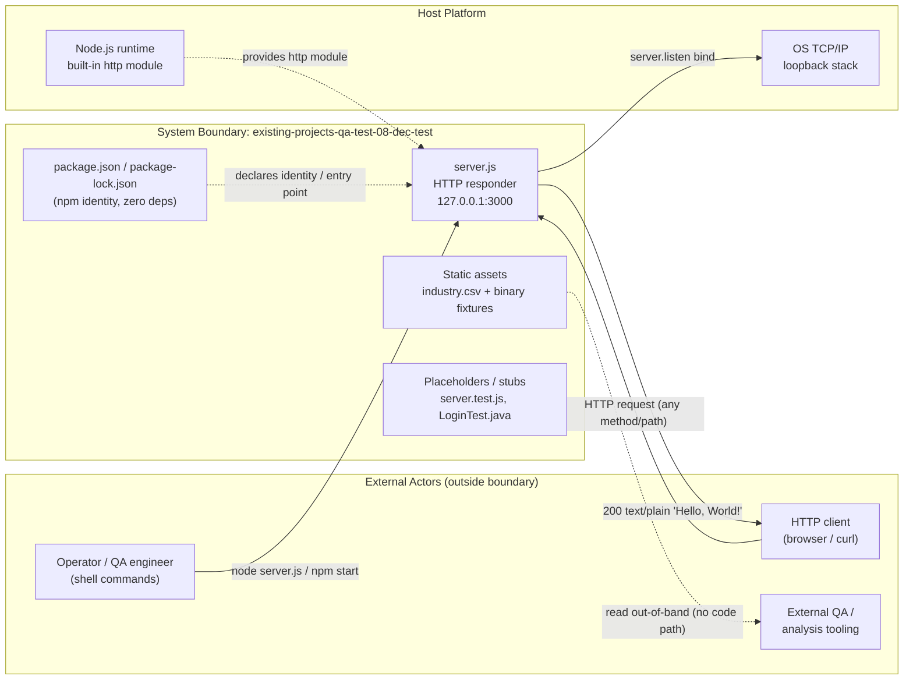
```mermaid
flowchart LR
    subgraph External["External Actors (outside boundary)"]
        direction TB
        Op["Operator / QA engineer<br/>(shell commands)"]
        Client["HTTP client<br/>(browser / curl)"]
        Tooling["External QA /<br/>analysis tooling"]
    end
    subgraph SystemB["System Boundary: existing-projects-qa-test-08-dec-test"]
        direction TB
        Server["server.js<br/>HTTP responder<br/>127.0.0.1:3000"]
        Manifests["package.json / package-lock.json<br/>(npm identity, zero deps)"]
        Assets["Static assets<br/>industry.csv + binary fixtures"]
        Stubs["Placeholders / stubs<br/>server.test.js, LoginTest.java"]
    end
    subgraph Platform["Host Platform"]
        direction TB
        Runtime["Node.js runtime<br/>built-in http module"]
        TCP["OS TCP/IP<br/>loopback stack"]
    end
    Op -->|"node server.js / npm start"| Server
    Client -->|"HTTP request (any method/path)"| Server
    Server -->|"200 text/plain 'Hello, World!'"| Client
    Runtime -.->|"provides http module"| Server
    Server -->|"server.listen bind"| TCP
    Manifests -.->|"declares identity / entry point"| Server
    Assets -.->|"read out-of-band (no code path)"| Tooling
```

### 5.1.2 Core Components

The repository comprises six logical components. Because the section format limits tables to four columns, the five requested dimensions are presented across two complementary tables keyed by component name: the first covers responsibility and dependencies; the second covers integration points and critical considerations. Feature identifiers (F-001–F-004) are carried over from **Section 2.1 Feature Catalog** for traceability.

| Component | Primary Responsibility | Key Dependencies |
| --- | --- | --- |
| HTTP Response Service (`server.js`, F-001) | Bind a loopback HTTP listener on `127.0.0.1:3000` and return a deterministic `200`/`text/plain`/`Hello, World!` response to every request | Node.js runtime; built-in `http` core module (only) |
| Package Manifests (`package.json`, `package-lock.json`, F-002) | Declare npm identity `hello_world@1.0.0` and an empty, zero-dependency lockfile | npm 7+ (to honor `lockfileVersion: 3`) |
| Reference Data (`industry.csv`, F-003) | Provide a single-column, 43-row industry taxonomy dataset | None (plain CSV file) |
| Sample Document Fixtures (`100Pages.pdf`, `demo.jpg`, `sample.doc`, F-004) | Provide binary sample documents (PDF 1.7, JPEG, legacy Word) as QA fixtures | None |
| Documentation (`README.md`, `Project Guide.md`) | State the QA-testing purpose; provide a placeholder guide | None |
| Placeholders / Stubs (`server.test.js`, `LoginTest.java`, `test.py.txt`, `test.txt.txt`) | Reserve future test/entry-point slots | None functional (would require a JS test runner / JDK, neither present) |

| Component | Integration Points | Critical Considerations |
| --- | --- | --- |
| HTTP Response Service (`server.js`) | HTTP over OS TCP/IP loopback; operator CLI (`node server.js` / `npm start`) | No routing/parsing/validation; no `'error'` listener (EADDRINUSE → uncaught exception, exit 1); no TLS or graceful shutdown; exports nothing, so `require()` also starts the server |
| Package Manifests | npm CLI (`install` / `test` / `start`); declares `main` = `index.js` | `main` target `index.js` is absent (`node .` fails with MODULE_NOT_FOUND); `test` is a failing placeholder; zero declared dependencies |
| Reference Data (`industry.csv`) | None at runtime; read out-of-band by external tooling | Not referenced or read by any source file; read-only fixture |
| Sample Document Fixtures | None at runtime; opened out-of-band by external tooling | Large binaries absent from the indexed source view; never read by code |
| Documentation | Human readers | Minimal content; `Project Guide.md` contains only the token `def` |
| Placeholders / Stubs | None (not wired into `npm test`) | `server.test.js` is a bare identifier (`ReferenceError`); `LoginTest.java` is non-compilable (unresolved `Web`); two `.txt` files are empty |

### 5.1.3 Data Flow Description

**Primary data flows between components.** There are two temporal phases and one out-of-band path:

- **Startup flow (one-time, linear).** The operator invokes `node server.js` (or `npm start`, which npm resolves to the same command because no `start` script is declared). Node executes the module top-to-bottom: `require('http')`, set `hostname`/`port` constants, `http.createServer(handler)`, then `server.listen(...)`, which delegates the socket bind to the OS TCP/IP stack. On a successful loopback bind, the listen callback writes the single log line `Server running at http://127.0.0.1:3000/` (requirement **F-001-RQ-003**).
- **Request/response flow (repeatable, synchronous).** An HTTP client connects to `127.0.0.1:3000`; the OS delivers request bytes to the `http` module, which emits a `'request'` event; the handler sets status `200`, sets `Content-Type: text/plain`, and writes the 14-byte body `Hello, World!\n`. The inbound request object is accepted but never parsed, routed, or validated, so the outbound data is identical for every request.
- **Static-asset flow (out-of-band).** `industry.csv` and the three binary fixtures are not referenced by any source file (no `fs` usage exists anywhere); they are consumed only by external tooling that chooses to open them and are not part of any in-process data flow (**Section 4.1.2**).

**Integration patterns and protocols.** The single live integration pattern is a **synchronous HTTP/1.1 request-response** over the loopback TCP socket, complemented by an **in-process CommonJS module binding** to the `http` core module. There is no asynchronous messaging, publish/subscribe, streaming, batch, or scheduled processing anywhere in the source (**Section 4.1.2**).

**Data transformation points.** Effectively none. The handler performs no deserialization of the request and no serialization of application data; the response body is a compile-time literal. The only "transformation" is the assembly of a fixed response envelope (status line, one header, fixed body), which is invariant across all inputs.

**Key data stores and caches.** None. There is no database, ORM, connection string, or migration (**Section 3.5.1**); no in-process or external cache and no `Cache-Control` header (**Section 3.5.3**); no session store; and no filesystem reads or writes by the application. The only "storage" is the set of read-only static files committed to git, which the application never touches (**Section 3.5.4**).

### 5.1.4 External Integration Points

Conventional external integration points — third-party REST/GraphQL APIs, databases, message brokers, identity providers, cloud services, and monitoring backends — are **entirely absent** from the repository (confirmed in **Section 2.3.2** and **Section 3.4 Third-Party Services**). The table below therefore documents the only observable integration surfaces, including platform bindings and the out-of-band asset path. No service-level agreements are defined anywhere in the source, so the SLA column reflects that fact rather than inventing targets.

| System / Interface | Integration Type | Protocol / Data Exchange | SLA Requirements |
| --- | --- | --- | --- |
| HTTP client (browser / curl) | Inbound, synchronous request/response | HTTP/1.1 over loopback TCP; fixed `200 text/plain` reply, body `Hello, World!` | None defined in repository |
| Node.js runtime (`http` core module) | In-process platform / library binding | CommonJS `require('http')`; `createServer` / `listen` API | None defined in repository |
| OS TCP/IP loopback stack | Host network bind | `server.listen` binds `127.0.0.1:3000` (IPv4 loopback) | None defined in repository |
| npm registry (install time) | Build / dependency resolution | npm over HTTPS; zero declared deps → no registry fetch (offline-installable) | None defined in repository |
| External QA / analysis tooling | Out-of-band static-asset consumption | Filesystem read of `industry.csv` and binary fixtures; no repository code path | None defined in repository |


## 5.2 Component Details

This section details each major component identified in **Section 5.1.2**, covering purpose, technologies, interfaces, persistence, and scaling. The only component with runtime behavior is the HTTP Response Service; the remaining components are static metadata, read-only data, documentation, or non-functional placeholders, and their non-applicable dimensions are marked as such rather than embellished. The required component-interaction, state-transition, and sequence diagrams are grouped under the HTTP Response Service because it is the sole executable component and the sole participant in every runtime interaction.

### 5.2.1 HTTP Response Service (`server.js`, F-001)

**Purpose and responsibilities.** This is the only executable component. It binds a loopback HTTP listener on `127.0.0.1:3000` and answers every inbound request with a fixed `200 text/plain` response whose body is `Hello, World!`. It realizes feature **F-001** and its three requirements: listener binding (**F-001-RQ-001**), deterministic response (**F-001-RQ-002**), and startup logging (**F-001-RQ-003**).

**Technologies and frameworks.** The component is a ~14-line CommonJS JavaScript module executed by the Node.js runtime (reference environment Node v22.23.1, though the repository pins no version). Its only code dependency is the built-in `http` core module; no application framework, third-party library, transpiler, or bundler is used (**Section 3.2**). It runs as authored, with no build step.

**Key interfaces and APIs.** The component exposes and consumes the following interfaces:

- **Inbound HTTP surface** — a single implicit endpoint on `127.0.0.1:3000` that answers all methods and paths uniformly. There is no route table, path/query parameter handling, content negotiation, or API versioning. The response contract is fixed:

```javascript
res.statusCode = 200;
res.setHeader('Content-Type', 'text/plain');
res.end('Hello, World!\n');
```

- **Platform API (outbound, in-process)** — `require('http')`, `http.createServer(handler)`, `res.statusCode`, `res.setHeader`, `res.end`, and `server.listen(port, hostname, callback)`.
- **Operator CLI** — `node server.js` or `npm start` (npm's built-in default runs `node server.js` because no `start` script is declared).
- **Module exports** — none; the module exports nothing, so importing it via `require()` triggers the same server startup as direct execution.

**Data persistence requirements.** None. The handler is stateless and performs no filesystem, database, cache, or session I/O (**Section 4.3.3**). Because the process holds no persistent or in-memory application state, a restart fully reconstructs behavior with nothing to recover or reconcile.

**Scaling considerations.** The service runs as a single Node.js process on a single-threaded event loop, bound to one hard-coded loopback port. The repository contains no clustering (`cluster`), worker threads, worker pool, reverse proxy, load balancer, or horizontal-scaling configuration (**Section 2.4.1**). The handler returns a fixed literal with no I/O or shared mutable state, so it is trivially concurrency-safe within the single process; however, any multi-process or externally reachable deployment would require code changes (the hard-coded `127.0.0.1` bind and single `port` literal, plus process management), none of which exist here. Scaling beyond one loopback process is therefore **not implemented**.

#### 5.2.1.1 Component Interaction Diagram

The diagram below shows how the `server.js` process, the Node.js `http` module and event loop, the OS loopback stack, the operator, and the HTTP client interact across the startup and request paths.

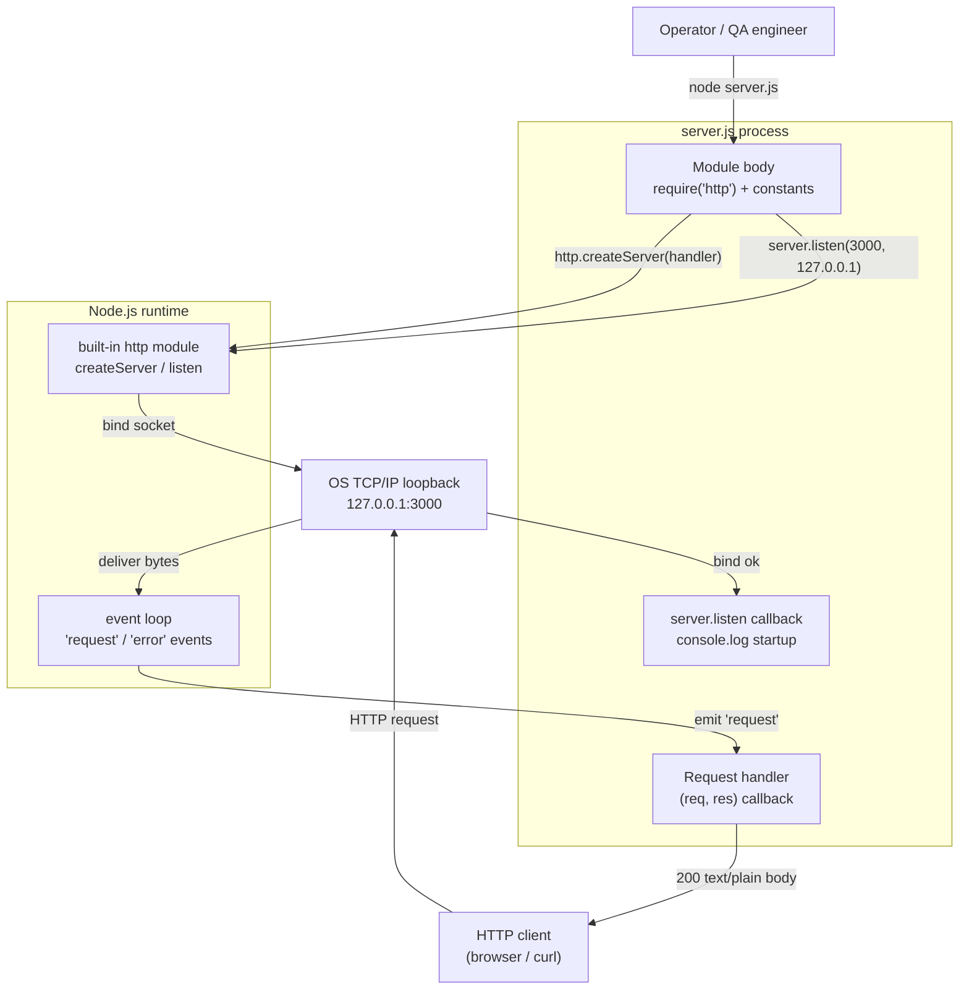
```mermaid
flowchart TB
    Operator["Operator / QA engineer"]
    Client["HTTP client<br/>(browser / curl)"]
    subgraph Proc["server.js process"]
        direction TB
        Main["Module body<br/>require('http') + constants"]
        Handler["Request handler<br/>(req, res) callback"]
        ListenCb["server.listen callback<br/>console.log startup"]
    end
    subgraph NodeRT["Node.js runtime"]
        direction TB
        HttpMod["built-in http module<br/>createServer / listen"]
        Loop["event loop<br/>'request' / 'error' events"]
    end
    OSStack["OS TCP/IP loopback<br/>127.0.0.1:3000"]

    Operator -->|"node server.js"| Main
    Main -->|"http.createServer(handler)"| HttpMod
    Main -->|"server.listen(3000, 127.0.0.1)"| HttpMod
    HttpMod -->|"bind socket"| OSStack
    OSStack -->|"bind ok"| ListenCb
    Client -->|"HTTP request"| OSStack
    OSStack -->|"deliver bytes"| Loop
    Loop -->|"emit 'request'"| Handler
    Handler -->|"200 text/plain body"| Client
```

#### 5.2.1.2 State Transition Diagram

The `server.js` process moves through a small, deterministic set of lifecycle states. The single branching transition is at bind time; a successful loopback bind reaches `Listening`, while an unhandled `EADDRINUSE` drives the process directly to `Crashed`. This view is consistent with **Section 4.3.1**.

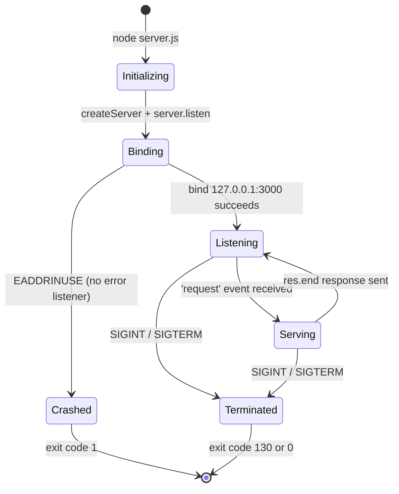
```mermaid
stateDiagram-v2
    [*] --> Initializing: node server.js
    Initializing --> Binding: createServer + server.listen
    Binding --> Listening: bind 127.0.0.1:3000 succeeds
    Binding --> Crashed: EADDRINUSE (no error listener)
    Listening --> Serving: 'request' event received
    Serving --> Listening: res.end response sent
    Listening --> Terminated: SIGINT / SIGTERM
    Serving --> Terminated: SIGINT / SIGTERM
    Crashed --> [*]: exit code 1
    Terminated --> [*]: exit code 130 or 0
```

#### 5.2.1.3 Sequence Diagram — Startup and Request Flows

The sequence below captures the one-time startup exchange and the repeatable per-request exchange across the four participating systems. It is consistent with the integration sequence in **Section 4.1.2**.

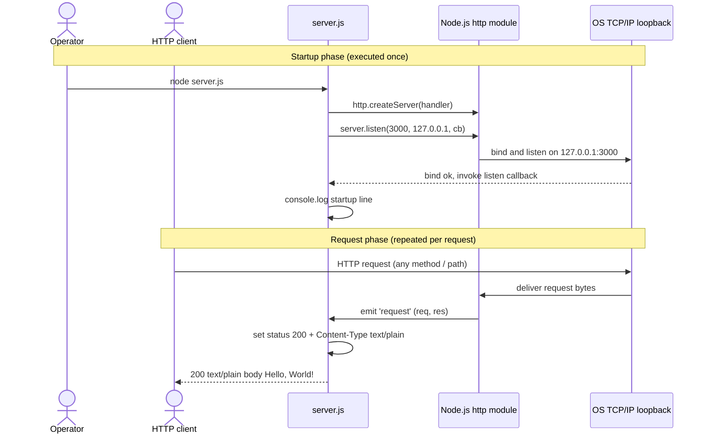
```mermaid
sequenceDiagram
    actor Operator
    actor Client as HTTP client
    participant Srv as server.js
    participant Http as Node.js http module
    participant OSStack as OS TCP/IP loopback

    Note over Operator,OSStack: Startup phase (executed once)
    Operator->>Srv: node server.js
    Srv->>Http: http.createServer(handler)
    Srv->>Http: server.listen(3000, 127.0.0.1, cb)
    Http->>OSStack: bind and listen on 127.0.0.1:3000
    OSStack-->>Srv: bind ok, invoke listen callback
    Srv->>Srv: console.log startup line

    Note over Client,OSStack: Request phase (repeated per request)
    Client->>OSStack: HTTP request (any method / path)
    OSStack->>Http: deliver request bytes
    Http->>Srv: emit 'request' (req, res)
    Srv->>Srv: set status 200 + Content-Type text/plain
    Srv-->>Client: 200 text/plain body Hello, World!
```

### 5.2.2 Package & Tooling Component (`package.json`, `package-lock.json`, F-002)

**Purpose and responsibilities.** Declares the npm package identity `hello_world@1.0.0`, the (missing) `main` entry point `index.js`, and the `test` script; the lockfile records an empty, zero-dependency install graph. Realizes feature **F-002**.

**Technologies and frameworks.** npm as package tooling (npm 7+ required to honor `lockfileVersion: 3`); JSON as the manifest format. No dependency, devDependency, peerDependency, or optionalDependency sections exist.

**Key interfaces and APIs.** The npm CLI surface: `npm install` completes offline with no registry fetch because zero dependencies are declared (**F-002-RQ-002**); `npm test` prints `Error: no test specified` and exits `1` (**F-002-RQ-003**); `npm start` resolves via npm's default to `node server.js`. The declared `main` = `index.js` does not resolve because `index.js` is absent, so `node .` fails with `MODULE_NOT_FOUND`.

**Data persistence requirements.** Not applicable — these are static metadata files.

**Scaling considerations.** Not applicable.

### 5.2.3 Static Data & Fixture Components (`industry.csv` F-003; `100Pages.pdf` / `demo.jpg` / `sample.doc` F-004)

**Purpose and responsibilities.** `industry.csv` provides a single-column, 43-row industry taxonomy reference dataset (header `Industry`). The three binaries provide sample document fixtures in distinct formats (PDF 1.7, JPEG/EXIF, and legacy OLE2 Microsoft Word). These realize features **F-003** and **F-004**.

**Technologies and frameworks.** Plain file formats only; there is no CSV parser, PDF/image library, or document reader anywhere in the repository.

**Key interfaces and APIs.** None at runtime. No source file references, opens, parses, or serves these assets; they are consumed strictly out-of-band by external tooling via direct filesystem access (**Section 3.5.4**, **Section 4.1.2**).

**Data persistence requirements.** Read-only files committed to git; never mutated or read by the application.

**Scaling considerations.** Not applicable (static assets).

### 5.2.4 Documentation & Placeholder Components

**Purpose and responsibilities.** `README.md` states the QA-testing purpose and `Project Guide.md` is a placeholder (`def`). `server.test.js`, `LoginTest.java`, `test.py.txt`, and `test.txt.txt` reserve future test/entry-point slots but implement no behavior.

**Technologies and frameworks.** Markdown (documentation); a JavaScript stub (`server.test.js`, containing only the bare identifier `dfvrs`); a Java stub (`LoginTest.java`, package `com.blitzyTest`, non-compilable due to the unresolved token `Web`); and two empty text files. No JavaScript test runner and no Java toolchain are present in the repository to execute these stubs.

**Key interfaces and APIs.** None. `server.test.js` is not wired into `npm test`; executing it raises a `ReferenceError`. `LoginTest.java` does not compile. The empty `.txt` files contribute nothing.

**Data persistence requirements.** Not applicable.

**Scaling considerations.** Not applicable.


## 5.3 Technical Decisions

This section records the architecturally significant decisions that are evident in the repository and justifies them against the project's stated purpose — a QA-testing "Hello world in Node.js" sample (`README.md`, `package.json`). Because the defining characteristic of this system is deliberate minimalism, most decisions are decisions to *omit* capability; each such omission is documented as an intentional decision with its rationale and tradeoff, consistent with the scope boundaries in **Section 1.3.2** and the assumptions in **Section 2.6**. No rationale is attributed that is not supported by an observed choice in the source.

### 5.3.1 Architecture Style Decision and Tradeoffs

The core decision is to implement the service as a single-process, single-file, standard-library-only HTTP responder rather than adopting any application framework or multi-tier structure. This choice is fully sufficient for a fixed hello-world responder and keeps the footprint minimal, at the cost of the conveniences a framework would provide. The table summarizes the principal decisions, their observed choice, rationale, and tradeoff.

| Decision Area | Choice Observed | Rationale / Tradeoff |
| --- | --- | --- |
| Architecture style | Single-process, single-file `http` responder | Matches hello-world/QA scope; no layering or module boundaries, so it does not extend to richer features without refactoring |
| Application framework | None — built-in `http` only | Zero-dependency and offline-installable with no supply-chain/CVE exposure (**Section 3.2.3**); no routing, middleware, parsing, or validation out of the box |
| Communication pattern | Synchronous HTTP/1.1 request-response | Simplest model sufficient for a constant reply; no asynchronous, streaming, or event-decoupled behavior |
| Data storage | None (stateless) | Nothing to persist since the reply is constant; no durability, but also no data-at-rest risk |
| Caching | None (no cache layer, no `Cache-Control`) | Response is a trivially cheap constant, so caching is unwarranted; clients/proxies are not instructed to cache |
| Security posture | Loopback bind, plain HTTP, no auth | Local-only reach limits exposure for a sample; no TLS/authentication/authorization, so it is not safe for public exposure as-is |
| Configuration | Hard-coded `hostname`/`port` literals | Simplicity for a fixed sample; changing host or port requires a code edit (no environment configuration) |
| Concurrency / scaling | Single-threaded event loop, one process | Sufficient for a QA sample; no clustering, load balancing, or horizontal scaling |

#### 5.3.1.1 Architecture Decision Tree

The decision tree makes explicit the reasoning that yields the observed minimal architecture: at each capability question the sample's requirement is "no," so the corresponding heavier mechanism is not adopted.

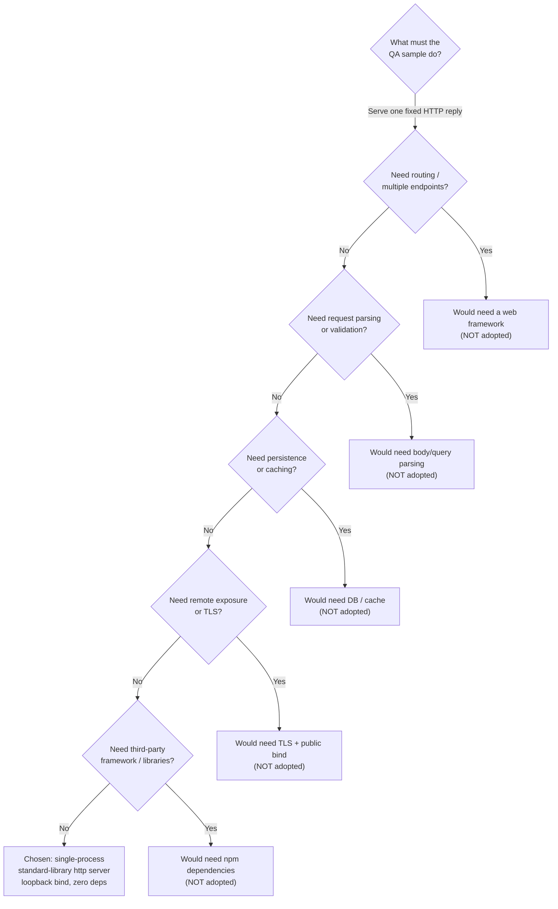
```mermaid
flowchart TB
    Q0{"What must the<br/>QA sample do?"}
    Q0 -->|"Serve one fixed HTTP reply"| Q1{"Need routing /<br/>multiple endpoints?"}
    Q1 -->|"No"| Q2{"Need request parsing<br/>or validation?"}
    Q2 -->|"No"| Q3{"Need persistence<br/>or caching?"}
    Q3 -->|"No"| Q4{"Need remote exposure<br/>or TLS?"}
    Q4 -->|"No"| Q5{"Need third-party<br/>framework / libraries?"}
    Q5 -->|"No"| Decision["Chosen: single-process<br/>standard-library http server<br/>loopback bind, zero deps"]
    Q1 -->|"Yes"| FW["Would need a web framework<br/>(NOT adopted)"]
    Q2 -->|"Yes"| Parse["Would need body/query parsing<br/>(NOT adopted)"]
    Q3 -->|"Yes"| Store["Would need DB / cache<br/>(NOT adopted)"]
    Q4 -->|"Yes"| Expose["Would need TLS + public bind<br/>(NOT adopted)"]
    Q5 -->|"Yes"| Deps["Would need npm dependencies<br/>(NOT adopted)"]
```

### 5.3.2 Communication Pattern Choice

The system uses exactly one communication pattern: a **synchronous, request/response HTTP exchange** over a loopback TCP socket, with an unconditional handler that returns the same response for every request. There is no asynchronous messaging, publish/subscribe, message broker, streaming, long-polling, or webhook mechanism anywhere in the source (**Section 4.1.2**). This choice follows directly from the requirement to return a single deterministic reply (**F-001-RQ-002**): a request/response model is the minimal pattern that satisfies it, and any decoupled or event-driven pattern would add machinery with no behavior to justify it. The tradeoff is that the service cannot participate in asynchronous integrations or back-pressure-managed pipelines, which are simply out of scope.

### 5.3.3 Data Storage and Caching Rationale

**Data storage.** The deliberate decision is to use **no database and no persistence layer** (**Section 3.5.1**, **Section 3.5.2**). Because the handler ignores the request and returns a compile-time literal, there is no application data to store, query, or migrate. The rationale is that persistence would be pure overhead for a constant responder; the consequence is that the service has no durable state — which is acceptable precisely because it has no state to lose (restart fully restores behavior, per **Section 4.3.3**). A secondary benefit noted in **Section 3.5.4** is the absence of any data-at-rest, injection, or credential-management surface.

**Caching.** The decision is to implement **no caching** — neither an in-process/external cache nor HTTP cache-control semantics (**Section 3.5.3**). The handler sets only `Content-Type`; it emits no `Cache-Control`, `ETag`, or `Expires` header. The rationale is that generating the 14-byte constant body is cheaper than any cache lookup, so a cache would add complexity without measurable benefit. The observed TCP `Keep-Alive` behavior is connection reuse provided by the `http` module, not response caching.

### 5.3.4 Security Mechanism Selection

The single, implicit security mechanism selected is **network isolation via loopback binding**: `server.js` binds `127.0.0.1`, so the service is reachable only from the local host and is not exposed to any external network by default (**Section 1.3.1**). Beyond this, the repository deliberately implements **no** transport security (no TLS/HTTPS), **no** authentication or authorization, and **no** security headers. Two properties of the design further shape the security posture: the handler never parses the request, so there is no request-driven injection or deserialization surface (**Section 4.4.1**); and the zero-dependency manifest eliminates third-party supply-chain and CVE exposure (**Section 3.3**). The rationale is that a local, loopback-only QA sample does not require these controls; the explicit consequence is that the service is **not production- or internet-safe as authored** — public exposure would require adding TLS, authentication, a non-loopback bind, and input handling, none of which exist today.

### 5.3.5 Architecture Decision Records (ADRs)

The following ADRs capture the architecturally significant decisions above in a compact, auditable form. All are inferred from observed code and the project's stated QA/hello-world purpose; each is classified **Accepted** because it is the decision actually realized in the current source. There are no superseded or deprecated ADRs because the repository shows a single, consistent design.

| ADR | Decision | Status | Key Consequence |
| --- | --- | --- | --- |
| ADR-001 | Use Node.js built-in `http` module; adopt no web framework | Accepted | No routing/middleware; minimal, framework-free footprint |
| ADR-002 | Declare zero third-party dependencies | Accepted | Offline-installable; no supply-chain/CVE exposure; no library conveniences |
| ADR-003 | Use a synchronous, unconditional HTTP request/response handler | Accepted | Deterministic `200`; no request-driven error surface |
| ADR-004 | Keep the service stateless — no datastore, no cache | Accepted | Nothing to persist or recover; no data-at-rest risk |
| ADR-005 | Bind loopback, serve plain HTTP, omit auth/TLS | Accepted | Local-only reach; not public-/production-safe as-is |

**Context and consequences.** ADR-001 and ADR-002 are driven by the hello-world/QA scope: the `http` core module satisfies the requirement without any framework or package, so none were introduced. ADR-003 follows from the fixed-response requirement (**F-001-RQ-002**), which also produces the notable consequence that no `4xx`/`5xx` response can arise from request content (**Section 4.4.1**). ADR-004 reflects that a constant responder has no data to manage. ADR-005 reflects the observed loopback bind and the absence of any transport-security or access-control code. The diagram below summarizes the ADR set and its common driver.

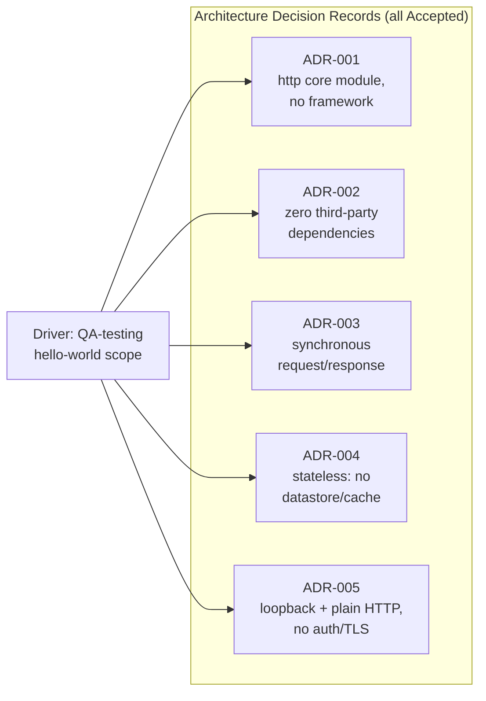
```mermaid
flowchart LR
    Driver["Driver: QA-testing<br/>hello-world scope"]
    subgraph ADRSet["Architecture Decision Records (all Accepted)"]
        direction TB
        A1["ADR-001<br/>http core module,<br/>no framework"]
        A2["ADR-002<br/>zero third-party<br/>dependencies"]
        A3["ADR-003<br/>synchronous<br/>request/response"]
        A4["ADR-004<br/>stateless: no<br/>datastore/cache"]
        A5["ADR-005<br/>loopback + plain HTTP,<br/>no auth/TLS"]
    end
    Driver --> A1
    Driver --> A2
    Driver --> A3
    Driver --> A4
    Driver --> A5
```


## 5.4 Cross-Cutting Concerns

Cross-cutting concerns in this repository are, with one small exception, **not implemented** — a direct consequence of the deliberately minimal QA/hello-world scope (**Section 1.3.2**). Rather than describe frameworks that do not exist, this section records the actual status of each concern with evidence, so the specification remains an accurate reference. The table below summarizes the concerns; the subsections that follow provide detail and the required error-handling flow diagram.

| Concern | Status in Repository | Evidence |
| --- | --- | --- |
| Monitoring / observability | Not implemented (single startup log only) | One `console.log`; no metrics, health probe, or telemetry |
| Logging / tracing | Minimal (stdout startup line + default stderr traces) | Single `console.log`; no logging library or tracing |
| Error handling | No framework; Node.js default plus manual recovery | No `try`/`catch`, no `'error'` listener (**Section 4.4**) |
| Authentication / authorization | Not implemented | No auth code; loopback network isolation only |
| Performance / SLA | None defined | No benchmarks, targets, or telemetry in source |
| Disaster recovery | No formal procedures; manual restart | No backup, failover, replication, or process manager |

### 5.4.1 Monitoring and Observability

There is no monitoring or observability layer. The application emits exactly one intentional signal — the startup line `Server running at http://127.0.0.1:3000/` — and nothing else. The following observability capabilities were each confirmed absent by inspection (consistent with **Section 1.2.3** and **Section 2.3.3**):

- **Metrics / telemetry** — no metrics library, counters, histograms, or exporters; no request counting.
- **Health / liveness endpoint** — none; because the handler answers all paths identically, there is no distinct `/health` or readiness probe.
- **Distributed tracing** — no tracing library, span creation, or context propagation.
- **Alerting and log aggregation** — no alerting hooks, error webhooks, or log shipping.

The practical implication (noted in **Section 4.4.3**) is that failures cannot be detected automatically; an operator observes the process's non-zero exit and its `stderr` output directly.

### 5.4.2 Logging and Tracing Strategy

Logging is limited to two channels, both provided without any logging framework:

- **Application stdout** — a single `console.log` in the `server.listen` callback prints the startup line on a successful bind (**F-001-RQ-003**). No request logging, access logging, log levels, timestamps, correlation IDs, or structured (JSON) output exist.
- **Runtime stderr** — on an uncaught failure (for example, `EADDRINUSE`), the Node.js runtime writes its default stack trace to `stderr`. This is runtime behavior, not application logging.

There is **no tracing** of any kind — no trace/span identifiers, no propagation headers, and no correlation across the request lifecycle. Given the single-process, single-statement handler, there is no call graph to trace.

### 5.4.3 Error Handling Patterns

The repository implements **no error-handling framework**: there is no `try`/`catch`, no server `'error'` listener, and no process-level `uncaughtException`/`unhandledRejection` handler anywhere in `server.js` (**Section 4.4**). The de facto pattern is therefore **fail-fast with manual recovery**: an unrecoverable startup condition becomes an uncaught exception that terminates the process, and an operator must remediate and re-run. A defining property is that the handler never parses the request, so **no request-driven error surface exists** — no `4xx`/`5xx` response can arise from request content (**Section 4.4.1**). The realistic failure modes are confined to startup and tooling:

| Failure Mode | Trigger | Observed Behavior |
| --- | --- | --- |
| Port already in use | Start while `127.0.0.1:3000` is bound | Unhandled `'error'` → uncaught `EADDRINUSE` → exit code `1` |
| Missing entry point | `node .` / `require` of package `main` | `MODULE_NOT_FOUND` for `index.js`; exit code `1` |
| Non-functional test | `npm test` | Prints `Error: no test specified`; exit code `1` |
| Request-driven error | Any HTTP request | None possible — request is never parsed |

**Error-handling flow.** The flow below consolidates the failure branches and shows the single recovery mechanism that exists — manual operator remediation; there is no automatic path out of a failed state (consistent with **Section 4.4.2**).

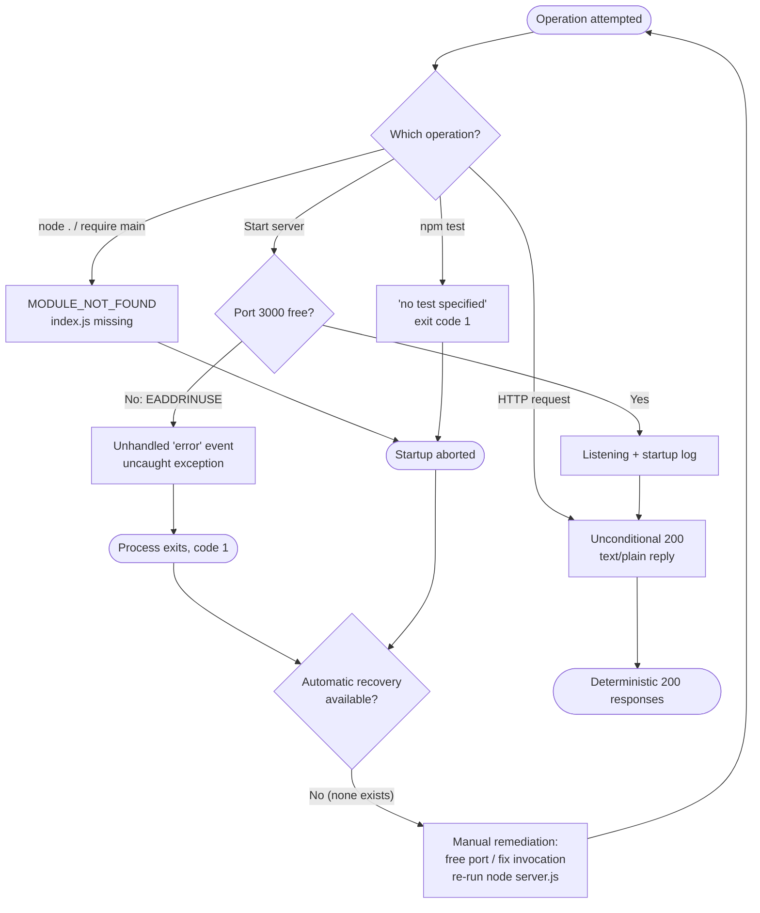
```mermaid
flowchart TB
    Start(["Operation attempted"]) --> Which{"Which operation?"}
    Which -->|"Start server"| PortQ{"Port 3000 free?"}
    Which -->|"node . / require main"| Missing["MODULE_NOT_FOUND<br/>index.js missing"]
    Which -->|"npm test"| TestFail["'no test specified'<br/>exit code 1"]
    Which -->|"HTTP request"| Serve["Unconditional 200<br/>text/plain reply"]
    PortQ -->|"Yes"| Listen["Listening + startup log"]
    PortQ -->|"No: EADDRINUSE"| Unhandled["Unhandled 'error' event<br/>uncaught exception"]
    Unhandled --> Crash(["Process exits, code 1"])
    Missing --> Abort(["Startup aborted"])
    TestFail --> Abort
    Crash --> Recover{"Automatic recovery<br/>available?"}
    Abort --> Recover
    Recover -->|"No (none exists)"| Manual["Manual remediation:<br/>free port / fix invocation<br/>re-run node server.js"]
    Manual --> Start
    Listen --> Serve
    Serve --> Healthy(["Deterministic 200 responses"])
```

### 5.4.4 Authentication and Authorization

There is **no authentication or authorization framework**. `server.js` contains no credential checking, session handling, token validation, API keys, role/permission model, or access-control logic; the handler serves every request identically. The only access control that exists is implicit: the server binds the IPv4 loopback address `127.0.0.1`, so it is reachable only from the local host and is not exposed to remote callers by default (**Section 1.3.1**, **Section 5.3.4**). No security headers are set beyond `Content-Type`. Because the request is never inspected, there is also no authenticated identity or principal in the system.

### 5.4.5 Performance Requirements and SLAs

No performance requirements, service-level agreements, key performance indicators, latency/throughput targets, capacity limits, or benchmarks are defined anywhere in the repository (**Section 1.2.3**). The observable performance characteristics — stated as facts, not as targets — are: the handler performs no I/O, no computation, and no allocation beyond composing a fixed 14-byte body (`Content-Length: 14`, empirically confirmed); responses are served on Node.js's single-threaded event loop; and there is no configurable timeout, rate limit, or concurrency cap in the source. Any performance target or measurement instrumentation would have to be added and is not part of the repository as it exists today.

### 5.4.6 Disaster Recovery Procedures

There are **no formal disaster-recovery procedures** and none are warranted by the design. The repository defines no backups, snapshots, data replication, failover, multi-region deployment, or restore runbook, and it includes no process manager, supervisor, container orchestrator, or auto-restart facility (**Section 3.6**). No RTO or RPO is defined. Recovery relies entirely on the stateless design (**Section 4.3.3**): because the process holds no persistent or in-memory application state, "recovery" is simply re-running `node server.js` after remediating the root cause, with nothing to restore, migrate, or reconcile. The source artifacts themselves are preserved only through version control (the git repository) — the sole mechanism by which the file set could be recovered if lost.


## 5.5 References

The following repository files, folders, and previously authored Technical Specification sections were examined and cited as evidence for Section 5. No external web sources were required.

**Repository files and folders**

- `server.js` - Established the sole executable component: CommonJS Node.js HTTP responder using the built-in `http` module, `127.0.0.1:3000` bind, deterministic `200 text/plain` `Hello, World!` reply, single startup `console.log`, no routing/parsing/error-listener/TLS/graceful-shutdown, exports nothing.
- `package.json` - Established npm identity `hello_world@1.0.0`, declared `main` = `index.js` (missing), the failing `test` placeholder script, MIT license, and the absence of any dependency sections.
- `package-lock.json` - Established `lockfileVersion: 3` (npm 7+) and a zero-dependency install graph.
- `server.test.js` - Established the non-functional test stub (bare identifier `dfvrs`), not wired into `npm test`.
- `LoginTest.java` - Established the non-compilable Java placeholder (`package com.blitzyTest`, unresolved token `Web`).
- `industry.csv` - Established the static reference dataset: header `Industry` plus 43 category rows; not read by any code.
- `100Pages.pdf` - Established a binary sample document fixture (PDF 1.7); not read by any code.
- `demo.jpg` - Established a binary sample image fixture (JPEG/EXIF); not read by any code.
- `sample.doc` - Established a binary sample document fixture (legacy OLE2 Microsoft Word); not read by any code.
- `README.md` - Established the project's stated purpose: "This project is created for QA testing."
- `Project Guide.md` - Established a placeholder document (content `def`).
- `test.py.txt` - Established an empty (0-byte) placeholder file.
- `test.txt.txt` - Established an empty (0-byte) placeholder file.
- Repository root (`""`) - Confirmed the flat structure: all artifacts at the top level with no source subfolders.

**Cross-referenced Technical Specification sections**

- `1.2 System Overview` - Component inventory, runtime interaction, and success-criteria framing (no SLAs/KPIs).
- `1.3 Scope` - In-scope capabilities and out-of-scope exclusions; loopback local reachability (1.3.1) and minimal scope (1.3.2).
- `2.1 Feature Catalog` - Feature identifiers F-001–F-004 used for component traceability.
- `2.3 Feature Relationships` - Integration-point inventory (2.3.2) and absence of shared services/observability (2.3.3).
- `2.4 Implementation Considerations` - Single-threaded, no-clustering/scaling posture (2.4.1).
- `2.6 Assumptions and Constraints` - npm 7+ assumption and zero-dependency/offline-install (2.6.2).
- `3.2 Frameworks & Libraries` - Node.js `http`-only platform; framework-absence justification (3.2.3).
- `3.3 Open Source Dependencies` - Zero third-party dependencies and the resulting security posture.
- `3.4 Third-Party Services` - Confirmed absence of external APIs, auth, monitoring, and cloud services.
- `3.5 Databases & Storage` - No database (3.5.1), no persistence strategy (3.5.2), no caching (3.5.3), static filesystem assets only (3.5.4).
- `3.6 Development & Deployment` - Absence of process manager, container, orchestrator, and CI/CD.
- `4.1 System Workflows` - Startup and request workflows; integration workflows and out-of-band asset consumption (4.1.2).
- `4.3 State Management` - Process lifecycle and request-construction state models (4.3.1); stateless restart behavior (4.3.3).
- `4.4 Error Handling` - Observable failure modes (4.4.1), error-handling flowchart (4.4.2), and manual recovery posture (4.4.3).


# 6. SYSTEM COMPONENTS DESIGN

## 6.1 Core Services Architecture

### 6.1.1 Applicability Assessment

**Core Services Architecture is not applicable for this system.**

The repository does not implement — and by design does not require — microservices, a distributed architecture, or distinct cooperating service components. As established in **Section 5.1 High-Level Architecture**, the system is a single-process, single-file, standard-library-only HTTP responder: `server.js` acquires the built-in `http` module via `require('http')`, constructs exactly one server, and binds a single listener to the IPv4 loopback address `127.0.0.1` on port `3000`. It declares no runtime dependencies (**Section 3.3 Open Source Dependencies** records zero third-party packages), has no build, containerization, or orchestration tooling (**Section 3.6 Development & Deployment**), and uses no data stores (**Section 3.5 Databases & Storage**). Consequently there is no second service to communicate with, no registry to discover peers through, no fleet to balance load across, and no replica to fail over to.

A "core services architecture" presupposes multiple independently deployable, network-coordinated services; because that precondition is absent, none of the architecture's defining constructs exist in this repository. The table below records each precondition against its directly observed status. Every subsequent subsection then documents the corresponding requested topic as *not applicable / not implemented*, grounded in the same evidence rather than in assumed or typical behavior.

| Precondition for a Core Services Architecture | Present in Repository | Supporting Evidence |
| --- | --- | --- |
| Multiple independently deployable services | No — one process, one file | `server.js`; Section 5.1.1 |
| Inter-service communication (HTTP/gRPC/messaging between components) | No — only inbound HTTP to a single handler; sole import is `require('http')` | Section 5.1.3 |
| Service discovery / service registry | No — endpoint hard-coded to `127.0.0.1:3000`, no registry client | `server.js` |
| Load balancer / multiple instances | No — one instance on a single event loop | Section 2.4.1; source inspection |
| Container / orchestration platform (Docker, Kubernetes, serverless) | No — no Dockerfile, compose file, YAML, or CI/CD | Section 3.6.4, Section 3.6.5 |
| Distributed or redundant data stores | No — stateless; no database or cache | Section 3.5; Section 5.1.3 |
| Resilience libraries (circuit breaker, retry) | No — zero dependencies; no error handling | `package.json`; Section 5.4.3 |

**Organization of this section.** For completeness, the three requested areas are still addressed in full below: **Service Components** (Section 6.1.2), **Scalability Design** (Section 6.1.3), and **Resilience Patterns** (Section 6.1.4). Each documents the observed absence of the relevant patterns with direct evidence and a clearly labeled Mermaid diagram. Operational concerns that overlap with resilience — monitoring/observability, error-handling patterns, performance/SLAs, and disaster recovery — are treated authoritatively in **Section 5.4 Cross-Cutting Concerns** and are cross-referenced here rather than duplicated.

### 6.1.2 Service Components Analysis

The system comprises a **single logical service component** — the HTTP Response Service implemented in `server.js` (feature **F-001** in **Section 2.1 Feature Catalog**). Its boundary is the operating-system process, and its sole responsibility is to bind a loopback listener and return a deterministic `200` / `text/plain` / `Hello, World!` response to every inbound request, irrespective of method, path, headers, or body (**Section 5.1.1**, requirement **F-001-RQ-002**). Because exactly one component exists and it issues no outbound calls, the remaining service-component concerns — inter-service communication, discovery, load balancing, circuit breaking, and retry/fallback — have no surface on which to operate.

The only live interaction is a **synchronous inbound HTTP/1.1 request/response** over the OS TCP/IP loopback socket, complemented by an in-process CommonJS binding to the `http` core module (**Section 5.1.3**). No API gateway, service mesh, sidecar proxy, message broker, or second process participates in request handling. The following table records each requested service-component concern against its observed status.

| Service-Component Concern | Status in This System | Basis / Evidence |
| --- | --- | --- |
| Service boundaries & responsibilities | One in-process component (F-001): bind loopback listener, return fixed `200` response | `server.js`; Section 5.1.2 |
| Inter-service communication patterns | None — single process, no outbound calls; sole import is `require('http')` for the inbound listener | Section 5.1.3; source inspection |
| Service discovery mechanisms | None — endpoint hard-coded to `127.0.0.1:3000`; no registry, DNS-SD, or config lookup | `server.js`; Section 6.1.1 |
| Load balancing strategy | None — one instance on a single-threaded event loop; no reverse proxy or `cluster` module | Section 2.4.1; Section 3.6.4 |
| Circuit breaker patterns | None — no downstream dependency to protect; no breaker library (zero dependencies) | `package.json`; source inspection |
| Retry & fallback mechanisms | None — fail-fast; no `try`/`catch`, no `'error'` listener, no fallback path | Section 4.4; Section 5.4.3 |

**Diagram 6.1.2 — Service Interaction: observed single service versus absent core-services constructs.** The left grouping is the entire observed runtime topology; the right grouping enumerates the multi-service constructs a core services architecture would introduce, all of which are absent from this repository (shown with dashed connectors).

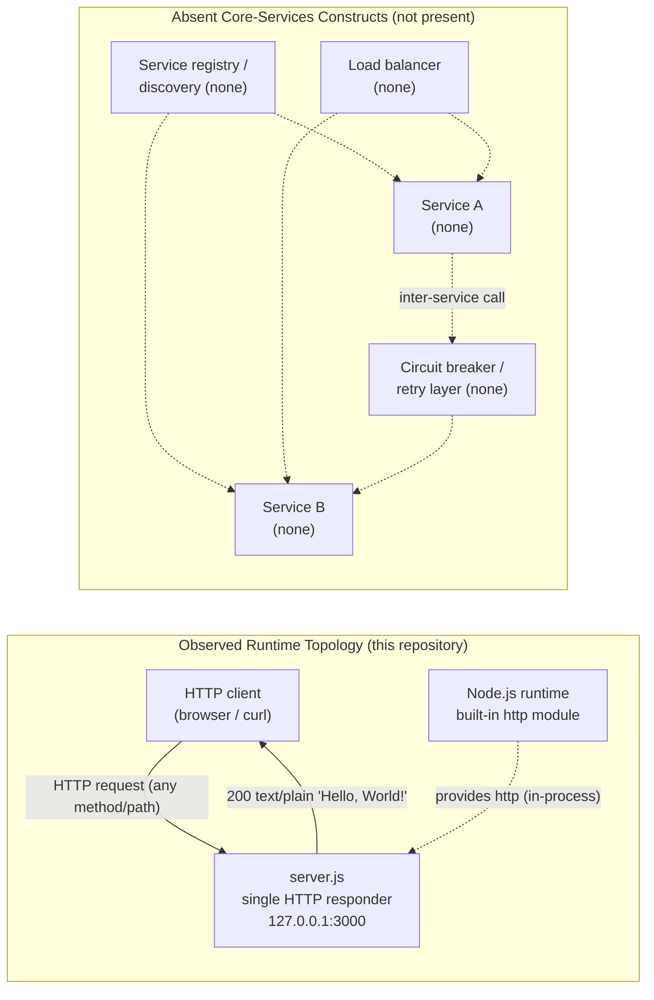
```mermaid
flowchart LR
    subgraph Observed["Observed Runtime Topology (this repository)"]
        direction TB
        Client["HTTP client<br/>(browser / curl)"]
        Svc["server.js<br/>single HTTP responder<br/>127.0.0.1:3000"]
        Runtime["Node.js runtime<br/>built-in http module"]
        Client -->|"HTTP request (any method/path)"| Svc
        Svc -->|"200 text/plain 'Hello, World!'"| Client
        Runtime -.->|"provides http (in-process)"| Svc
    end
    subgraph Absent["Absent Core-Services Constructs (not present)"]
        direction TB
        LB["Load balancer<br/>(none)"]
        Registry["Service registry /<br/>discovery (none)"]
        SvcA["Service A<br/>(none)"]
        SvcB["Service B<br/>(none)"]
        Breaker["Circuit breaker /<br/>retry layer (none)"]
        Registry -.-> SvcA
        Registry -.-> SvcB
        LB -.-> SvcA
        LB -.-> SvcB
        SvcA -.->|"inter-service call"| Breaker
        Breaker -.-> SvcB
    end
```

In summary, service-component patterns are **not applicable**: the repository defines one deterministic, dependency-free responder with no peers, no downstream targets, and no coordination layer, so there is nothing to discover, balance, break, or retry against.

### 6.1.3 Scalability Design Analysis

No scalability design is implemented or configured. The system runs as a **single Node.js process on a single-threaded event loop** and binds only the IPv4 loopback interface `127.0.0.1:3000` (**Section 1.3.1**, **Section 5.4.5**), so it is not externally reachable by default, let alone horizontally scaled. The mechanisms that horizontal, vertical, or automatic scaling would depend on — a `cluster` / `worker_threads` fan-out, a process manager, a container image, an orchestrator, or a reverse proxy — are all absent (**Section 3.6.4**, **Section 3.6.5**; confirmed by source inspection).

The system's performance profile is stated here as **observed fact, not as a target or SLA** (none are defined — **Section 5.4.5**): the request handler performs no I/O, no computation, and no allocation beyond composing a fixed 14-byte body (`Content-Length: 14`, empirically confirmed); every response is served synchronously on the single event loop; and there is no configurable timeout, rate limit, or concurrency cap anywhere in the source. Any scaling behavior, resource budget, or capacity target would have to be added and does not exist in the repository today.

| Scalability Dimension | Status in This System | Basis / Evidence |
| --- | --- | --- |
| Horizontal / vertical scaling approach | None configured — one process; no `cluster`, `worker_threads`, or multi-instance deployment; vertical capacity is whatever the host provides, ungoverned by the repo | Section 2.4.1; source inspection |
| Auto-scaling triggers & rules | None — no orchestrator and no metrics-driven policy (HPA/target tracking); there is nothing to trigger scaling | Section 3.6.5 |
| Resource allocation strategy | None — no CPU/memory limits, cgroup, or container resource requests; the process uses host defaults | Section 3.6.4 |
| Performance optimization techniques | None configured — no caching, compression, or keep-alive tuning; the handler already performs no I/O and returns a fixed 14-byte body | Section 5.4.5; Section 3.5.3 |
| Capacity planning guidelines | None defined — no benchmarks, throughput/latency budgets, or capacity limits | Section 5.4.5 |

**Diagram 6.1.3 — Scalability Architecture: current single-instance model and unconfigured scaling options.** The left grouping is the deployed reality; the right grouping lists the scaling primitives that would be required for a scalable services architecture, none of which are present (dashed connectors denote hypothetical relationships).

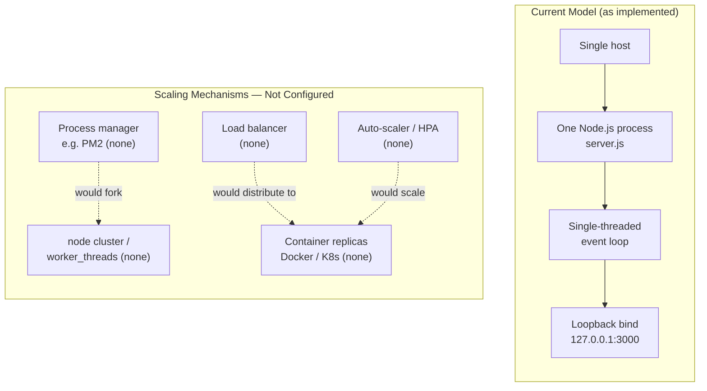
```mermaid
flowchart TB
    subgraph Current["Current Model (as implemented)"]
        direction TB
        Host["Single host"]
        Proc["One Node.js process<br/>server.js"]
        Loop["Single-threaded<br/>event loop"]
        Bind["Loopback bind<br/>127.0.0.1:3000"]
        Host --> Proc
        Proc --> Loop
        Loop --> Bind
    end
    subgraph Unconfigured["Scaling Mechanisms — Not Configured"]
        direction TB
        PM["Process manager<br/>e.g. PM2 (none)"]
        ClusterN["node cluster /<br/>worker_threads (none)"]
        Replicas["Container replicas<br/>Docker / K8s (none)"]
        HPA["Auto-scaler / HPA<br/>(none)"]
        LB2["Load balancer<br/>(none)"]
        PM -.->|"would fork"| ClusterN
        LB2 -.->|"would distribute to"| Replicas
        HPA -.->|"would scale"| Replicas
    end
```

In summary, scalability design is **not applicable / not implemented**: the repository provides a single unmanaged process with no scaling primitives, no auto-scaling policy, no resource governance, and no capacity plan.

### 6.1.4 Resilience Patterns Analysis

No resilience patterns are implemented; the system follows a **fail-fast model with manual recovery** (**Section 4.4**, **Section 5.4.3**). `server.js` registers no server `'error'` listener and no process-level `uncaughtException` / `unhandledRejection` handler, so an unrecoverable condition becomes an uncaught exception that terminates the process. This was empirically confirmed: starting a second instance while `127.0.0.1:3000` is already bound raises an unhandled `'error'` event (`EADDRINUSE`) and the process exits with code `1` (**Section 4.4**). Because the single process is simultaneously the entire service and a single point of failure, there is no fault-tolerance layer, no failover target, and no degraded operating mode.

Two properties bound the resilience surface. First, the handler never parses the request, so **no request-driven failure mode exists** — no `4xx`/`5xx` can arise from request content (**Section 4.4.1**). Second, the process is **stateless** (**Section 4.3 State Management**): it holds no persistent or in-memory application state, so "recovery" is simply re-running `node server.js` after remediating the root cause, with nothing to restore, migrate, or reconcile (**Section 5.4.6**). The only durable copy of the system is its git-versioned source (**Section 5.4.6**).

| Resilience Concern | Status in This System | Basis / Evidence |
| --- | --- | --- |
| Fault tolerance mechanisms | None — fail-fast; no `'error'` listener, no `try`/`catch`, no `uncaughtException`/`unhandledRejection` handler | Section 5.4.3; Section 4.4 |
| Disaster recovery procedures | None formal — manual restart of a stateless process; no backup, snapshot, RTO/RPO, or restore runbook | Section 5.4.6 |
| Data redundancy approach | Not applicable — stateless; no database or cache; the only "persistence" is git-versioned source | Section 4.3; Section 5.4.6; Section 3.5 |
| Failover configurations | None — single instance; no standby, replica, health check, or supervisor to fail over to | Section 3.6; source inspection |
| Service degradation policies | None — no health/readiness endpoint, no graceful shutdown, no partial-degradation mode; the handler answers all paths identically | Section 5.4.1; Section 5.1.2 |

**Diagram 6.1.4 — Resilience: fail-fast single point of failure with manual recovery, alongside absent resilience mechanisms.** The top flow is the observed lifecycle and its only recovery path (manual operator remediation); the grouped nodes are the resilience mechanisms that would automate or eliminate that manual loop, none of which are present.

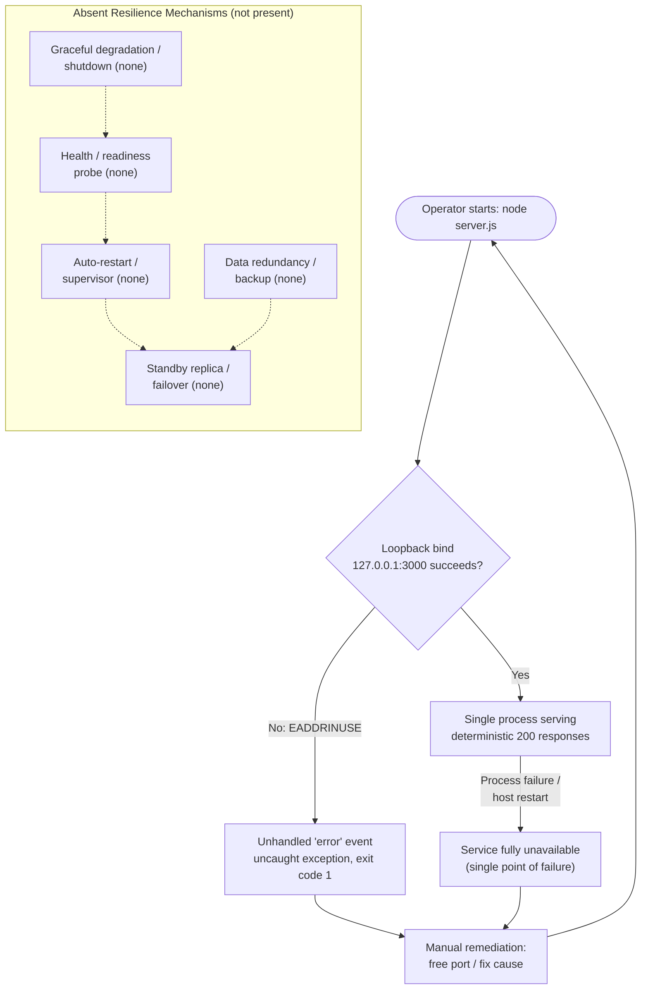
```mermaid
flowchart TB
    Start(["Operator starts: node server.js"]) --> Bind{"Loopback bind<br/>127.0.0.1:3000 succeeds?"}
    Bind -->|"Yes"| Serving["Single process serving<br/>deterministic 200 responses"]
    Bind -->|"No: EADDRINUSE"| Crash["Unhandled 'error' event<br/>uncaught exception, exit code 1"]
    Serving -->|"Process failure /<br/>host restart"| Down["Service fully unavailable<br/>(single point of failure)"]
    Crash --> Manual["Manual remediation:<br/>free port / fix cause"]
    Down --> Manual
    Manual --> Start
    subgraph Absent["Absent Resilience Mechanisms (not present)"]
        direction TB
        AutoRestart["Auto-restart /<br/>supervisor (none)"]
        Standby["Standby replica /<br/>failover (none)"]
        Health["Health / readiness<br/>probe (none)"]
        Redund["Data redundancy /<br/>backup (none)"]
        Degrade["Graceful degradation /<br/>shutdown (none)"]
        Health -.-> AutoRestart
        AutoRestart -.-> Standby
        Degrade -.-> Health
        Redund -.-> Standby
    end
```

In summary, resilience patterns are **not applicable / not implemented**: fault tolerance, disaster recovery, data redundancy, failover, and graceful degradation are all absent by design, consistent with the QA/hello-world scope (**Section 1.3.2**). The authoritative treatment of disaster recovery, monitoring, and error handling is **Section 5.4 Cross-Cutting Concerns**.

### 6.1.5 References

The following repository artifacts and previously authored specification sections were examined and cited as evidence for this section.

**Repository files**

- `server.js` — Established the single-process HTTP responder: sole import `require('http')`, loopback bind to `127.0.0.1:3000`, an unconditional `200` / `text/plain` / `Hello, World!` response to every request, and the absence of any `'error'` listener, clustering, retry/fallback logic, or graceful shutdown.
- `package.json` — Established zero declared dependencies (hence no circuit-breaker, retry, service-discovery, or scaling libraries) and the failing `test` placeholder.
- `package-lock.json` — Corroborated zero installed dependency packages (`lockfileVersion: 3`, root-only entry), confirming there is no third-party resilience or scaling tooling.

**Repository structure**

- Repository root (`./`, flat 13-file layout) — Source inspection confirming the absence of any service/scaling/resilience constructs (`cluster`, `worker_threads`, load balancer, circuit breaker, retry, service discovery), orchestration files, Dockerfile/compose, CI/CD workflows, and YAML/IaC definitions.

**Cross-referenced specification sections**

- Section 1.3 Scope — Loopback isolation (1.3.1) and the minimal QA/hello-world scope that renders distributed constructs out of scope (1.3.2).
- Section 2.1 Feature Catalog — Feature F-001 (HTTP Response Service) identity and responsibility.
- Section 2.4 Implementation Considerations — Absence of clustering, worker pool, load balancing, and horizontal scaling (2.4.1).
- Section 3.5 Databases & Storage — No database or cache; stateless design (informing the data-redundancy assessment).
- Section 3.6 Development & Deployment — No containerization (3.6.4) and no CI/CD or Infrastructure-as-Code (3.6.5).
- Section 4.3 State Management — Stateless process lifecycle underpinning the recovery assessment.
- Section 4.4 Error Handling — Fail-fast behavior, the empirically observed `EADDRINUSE` exit, and manual recovery.
- Section 5.1 High-Level Architecture — Single-process, single-file, standard-library-only architecture (5.1.1–5.1.3).
- Section 5.4 Cross-Cutting Concerns — Authoritative treatment of monitoring/health (5.4.1), error-handling patterns (5.4.3), performance/SLAs (5.4.5), and disaster recovery (5.4.6).

## 6.2 Database Design

### 6.2.1 Applicability Assessment

**Database Design is not applicable to this system.**

The repository does not require — and does not contain — any database or persistent-storage layer. As established in **Section 3.5 Databases & Storage** and **Section 6.1 Core Services Architecture**, the executable system is a single-process, single-file, dependency-free Node.js HTTP responder: `server.js` acquires only the built-in `http` module via `require('http')`, binds a listener to the IPv4 loopback address `127.0.0.1:3000`, and returns an unconditional `200` / `text/plain` / `Hello, World!` response to every request. The request object is never inspected, no data is read or written, and nothing is retained between requests or across restarts (**Section 4.3 State Management**). A repository-wide search for every common database engine, ORM/ODM, query builder, connection string, schema definition, and migration tool returned no matches in any application-code file; the sole `require`/`import` anywhere in the codebase is `require('http')`.

Because no datastore exists, the defining constructs of a database design — entities, tables/collections, keys, indexes, constraints, migrations, replication, and connection pools — have no surface on which to operate. The table below records each precondition for a database design against its directly observed status.

| Precondition for a Database Design | Present | Supporting Evidence |
| --- | --- | --- |
| Database engine or client driver (PostgreSQL, MySQL, MongoDB, SQLite, Redis) | No | `package.json` / `package-lock.json` declare zero dependencies; keyword sweep across all code returned no matches (Section 3.5.1) |
| ORM / ODM / query builder (Sequelize, Prisma, TypeORM, Mongoose, Knex) | No | Sole `require` in the codebase is `require('http')` in `server.js` |
| Connection string / datasource configuration | No | No `.env`, config, `ormconfig`, or `knexfile`; `127.0.0.1:3000` is an HTTP bind, not a datasource |
| Schema / DDL / migration files | No | No `*.sql` or `*.prisma`; no Alembic / Flyway / Liquibase / Prisma-migrate tooling |
| Persistence I/O in application code | No | `server.js` performs no `fs` read or write; handler returns a fixed literal (Section 3.5.2) |
| In-memory store used as a datastore substitute | No | Process is stateless; holds no request-spanning data (Section 4.3) |
| Caching layer (Redis, Memcached, in-process cache) | No | No cache client and no in-process cache (Section 3.5.3) |

The repository's only "storage" is a set of **static filesystem assets** committed to source control — `industry.csv` (a 43-row industry taxonomy) and three binary fixtures (`100Pages.pdf`, `demo.jpg`, `sample.doc`). These are standalone fixtures: no source file references, opens, parses, or serves them, so they do not participate in any runtime data flow and are not a database (**Section 3.5.4**).

**Diagram 6.2.1 — Data Flow: stateless request/response with no persistence.** The diagram traces the only data path at runtime. The request handler composes a fixed in-memory literal and returns it; the dashed connectors denote data flows that are **absent** — there is no read or write to any datastore and the static assets are never opened by the process.

```mermaid
flowchart LR
    Client["HTTP client<br/>(browser / curl)"]
    Handler["server.js request handler<br/>stateless, 127.0.0.1:3000"]
    Fixed["Fixed in-memory literal<br/>'Hello, World!' (14 bytes)"]
    NoStore[("Persistent datastore<br/>NONE - absent")]
    CSV["industry.csv<br/>(static file)"]
    Bin["100Pages.pdf / demo.jpg / sample.doc<br/>(static binary fixtures)"]

    Client -->|"request (any method/path, ignored)"| Handler
    Handler --> Fixed
    Fixed -->|"200 / text/plain response"| Client
    Handler -. "no read / no write<br/>(no fs, no DB driver)" .-> NoStore
    Handler -. "never opened at runtime" .-> CSV
    Handler -. "never opened at runtime" .-> Bin
```

**Organization of this section.** For completeness and traceability, the four requested areas are still documented in full below — **Schema Design** (Section 6.2.2), **Data Management** (Section 6.2.3), **Compliance Considerations** (Section 6.2.4), and **Performance Optimization** (Section 6.2.5). Each subsection records the observed absence of the relevant construct with direct evidence rather than assumed or typical behavior, and the required Mermaid diagrams (entity-relationship and replication architecture) are included in Section 6.2.2. Where an operational concern overlaps with another section — for example error handling, disaster recovery, and security — the authoritative treatment lives in **Section 4.4 Error Handling** and **Section 5.4 Cross-Cutting Concerns** and is cross-referenced here rather than duplicated.

### 6.2.2 Schema Design

No database schema exists in this repository, so there are no entities, tables, collections, keys, indexes, constraints, partitions, replicas, or backup targets to design. This subsection documents each requested schema-design concern as an observed absence, grounded in direct source inspection, and satisfies the required entity-relationship and replication-architecture diagrams by depicting the observed reality — a single structured static file and the absence of any replication topology. The table below summarizes every requested schema-design concern against its observed status.

| Schema Concern | Status in This System | Basis / Evidence |
| --- | --- | --- |
| Entity relationships | None — no entities and no relations of any kind | No datastore; no data models defined in `server.js` or elsewhere |
| Data models & structures | None persisted — only a fixed in-memory literal plus static flat files | `server.js` returns `'Hello, World!'`; `industry.csv` is a flat single-column file |
| Indexing strategy | None — no tables, therefore no indexes | No DDL and no index definitions anywhere (Section 3.5.1) |
| Partitioning approach | None — no tables/collections to partition | No datastore present |
| Replication configuration | None — no primary/replica topology | No DB; single stateless process (Section 6.1.4) |
| Backup architecture | None for data — source is git-versioned only | No datastore to back up; only durable copy is git source (Section 5.4.6) |

#### 6.2.2.1 Entity-Relationship View, Data Structures, Indexing & Partitioning

There are **zero persistent entities** and therefore **zero relationships**. Nothing in the codebase declares a table, collection, document, or record type, and `server.js` never constructs, reads, or writes a domain object. The only structured data artifact in the repository is `industry.csv` — a flat file consisting of the header `Industry` followed by 43 free-text industry labels — and it is never loaded by any code (the sole `require` in the codebase is `require('http')`). The only runtime "data structure" is the fixed 14-byte string literal `'Hello, World!\n'`, composed in memory and written directly to the HTTP response on each request; it is ephemeral, never stored, and never queried.

Because a database design is required to include entity-relationship diagrams, the ERD below depicts the single structured static file as a standalone, non-persistent flat structure. **It is not a database table** and models no relationships: there is exactly one candidate structure, it holds no keys, and no code loads it into any datastore.

**Diagram 6.2.2.1 — Entity-Relationship View (observed).** A conceptual depiction of the one structured static artifact. There are no relationships because no second entity exists and the file is never persisted, indexed, or joined.

```mermaid
erDiagram
    INDUSTRY_CSV_STATIC_FILE {
        string Industry "single column; 43 values; no key, no index, no constraint"
    }
```

Consistent with the output-format requirement to *document all indexes and constraints*, the table below enumerates every data object and records that none carry indexes or constraints — there are no primary keys, foreign keys, unique keys, not-null rules, check constraints, or secondary indexes anywhere, because there is no database.

| Data Object | Indexes | Constraints |
| --- | --- | --- |
| `industry.csv` (static file, never loaded) | None — plain-text rows with no index structure | None — no primary/foreign/unique key and no not-null or check rule |
| HTTP response body (in-memory literal) | Not applicable — not stored | Not applicable — ephemeral, recomposed per request |

**Indexing strategy** and **partitioning approach** are likewise not applicable: both operate on tables or collections, and none exist. No horizontal or vertical partitioning, sharding key, or index (clustered, covering, full-text, or otherwise) is defined or configured in the repository.

#### 6.2.2.2 Replication Configuration & Backup Architecture

No **replication** is configured. The system runs as a single stateless Node.js process bound to loopback and holds no data, so there is no primary datastore, no read replica, no standby, and no replication stream (WAL shipping, binlog, or oplog) to configure or monitor. This is consistent with the resilience assessment in **Section 6.1.4**, which records the absence of failover targets and data redundancy.

No data **backup architecture** exists because there is no data at rest to back up. The only durable, recoverable copy of the system is its **git-versioned source** (**Section 5.4.6**); the static fixtures (`industry.csv`, `100Pages.pdf`, `demo.jpg`, `sample.doc`) are preserved solely by being committed to that same git history. There is no snapshot schedule, no point-in-time recovery, and no defined RPO/RTO for any datastore, because no datastore exists.

**Diagram 6.2.2.2 — Replication Architecture: observed single-process topology versus absent replication constructs.** The left grouping is the entire observed topology; the right grouping enumerates the primary/replica constructs a replicated database would introduce, all of which are absent (dashed connectors denote hypothetical relationships).

```mermaid
flowchart TB
    subgraph Observed["Observed Topology (this repository)"]
        direction TB
        Proc["Single server.js process<br/>stateless - no datastore - 127.0.0.1:3000"]
    end
    subgraph Absent["Absent Replication Constructs (not present)"]
        direction TB
        Primary[("Primary DB<br/>(none)")]
        ReplicaA[("Read replica A<br/>(none)")]
        ReplicaB[("Read replica B<br/>(none)")]
        Primary -.->|"would stream WAL / binlog"| ReplicaA
        Primary -.->|"would stream WAL / binlog"| ReplicaB
    end
```

In summary, schema design is **not applicable / not implemented**: there are no entities or relationships, no indexes or constraints, no partitioning, no replication, and no data-backup architecture — only a single unreferenced structured file and a git-versioned copy of the source.

### 6.2.3 Data Management

No data-management layer is implemented because there is no managed data. There is no schema to migrate, no stored records to version or archive, no programmatic storage/retrieval path, and no cache. The only "data" in the repository is a set of static files that are committed to git and never read by the running process. Each requested data-management concern is documented below as an observed absence.

| Data Management Concern | Status in This System | Basis / Evidence |
| --- | --- | --- |
| Migration procedures | None — no schema exists to migrate | No Alembic/Flyway/Liquibase/Prisma-migrate/Knex tooling; no `*.sql` (Section 3.5.1) |
| Versioning strategy | No data/schema versioning — only git source versioning (`v1.0.0`) | `package.json` version `1.0.0`; git history is the sole version control |
| Archival policies | None — no records accumulate, so nothing to archive | Stateless process; no datastore (Section 4.3) |
| Data storage & retrieval | No programmatic path — static files exist but are never opened | Sole `require` is `require('http')`; no `fs` usage (Section 3.5.4) |
| Caching policies | None — no in-process or external cache | No cache client and no HTTP cache directives (Section 3.5.3) |

**Migration procedures.** There is no database and therefore no schema evolution to manage. No migration framework is present in the dependency manifest (which declares zero dependencies), and no forward/rollback migration scripts, versioned DDL, or seed scripts exist in the tree.

**Versioning strategy.** The repository performs no data or schema versioning. The only versioning in effect is **source control**: the npm package is pinned at version `1.0.0` in `package.json`, and change history is captured in git commits. The static `industry.csv` taxonomy carries no internal version column or metadata; any change to it would be a plain git commit, not a managed data migration.

**Archival policies.** Because the process is stateless and accumulates no records, there is no data lifecycle, no hot/warm/cold tiering, and nothing to move to an archive or purge on a schedule. The static fixtures are retained indefinitely simply by remaining in the git repository.

**Data storage & retrieval mechanisms.** The application exposes no storage or retrieval API. `industry.csv` and the binary fixtures (`100Pages.pdf`, `demo.jpg`, `sample.doc`) physically reside on the filesystem, but the running service never opens, parses, queries, or serves them; they are consumed, if at all, only by out-of-band tooling external to this codebase (**Section 3.5.4**). The response body is generated in memory from a fixed literal on every request rather than retrieved from any store.

**Caching policies.** No caching exists at any layer. There is no in-process cache (for example a `Map` or LRU), no external cache client (Redis or Memcached), and the handler sets only a single `Content-Type: text/plain` header, adding no `Cache-Control`, `ETag`, or other HTTP caching directive (**Section 3.5.3**). Because the response is a constant that costs nothing to recompute, there is no cache to populate, invalidate, or expire.

### 6.2.4 Compliance Considerations

Database-level compliance controls are not applicable because there is no database, no data at rest, and no processing of user-supplied data. The service ignores every incoming request and stores nothing, so there is no regulated data whose retention, privacy, auditing, or access would need to be governed at the data layer. The table records each requested compliance concern against its observed status; the authoritative treatment of application-level security and recovery lives in **Section 5.4 Cross-Cutting Concerns**.

| Compliance Concern | Status in This System | Basis / Evidence |
| --- | --- | --- |
| Data retention rules | None — nothing is stored, so no retention or purge policy applies | Stateless process; no datastore (Section 4.3) |
| Backup & fault tolerance | None formal — stateless; manual restart; only durable copy is git source | Section 6.1.4; Section 5.4.6 |
| Privacy controls | None required at data layer — no PII collected, logged, or persisted | `server.js` ignores the request; no persistence or request logging |
| Audit mechanisms | None — no audit or access log; only a single startup `console.log` | Section 5.4.2 |
| Access controls | None at data layer — no DB users/roles/grants; no app authN/authZ | Section 5.4.4 |

**Data retention rules.** No data is created, collected, or stored, so there is no retention schedule, legal-hold mechanism, or deletion/purge workflow to define. The static fixtures live in git indefinitely, but they contain no user or regulated data and are not produced by the running system.

**Backup & fault-tolerance policies.** There is no datastore to back up. Fault tolerance follows the fail-fast, manual-recovery model documented in **Section 6.1.4** and **Section 4.4 Error Handling**: the single process is a single point of failure, recovery is re-running `node server.js`, and the only durable, restorable artifact is the **git-versioned source** (**Section 5.4.6**). No snapshots, replicas, RPO/RTO, or restore runbook exist.

**Privacy controls.** The handler never reads request headers, query strings, or bodies, and never writes them anywhere, so no personal or sensitive data is captured, transmitted onward, or retained. Consequently there is no data-at-rest encryption, field-level masking, tokenization, or consent/erasure mechanism to implement — there is simply no personal data in scope.

**Audit mechanisms.** There is no audit trail, change-data-capture, or access log for data operations, because there are no data operations. Observability is limited to the single startup line `Server running at http://127.0.0.1:3000/` (**Section 5.4.2**); individual requests are not logged, counted, or traced.

**Access controls.** At the data layer there are no database accounts, roles, grants, or row-/column-level security, because there is no database. At the application layer there is no authentication or authorization (**Section 5.4.4**), and the loopback bind (`127.0.0.1`) is the only thing limiting reachability. For the static files, the sole access control is the operating-system filesystem permission on the checkout — the application code neither enforces nor exposes any additional control.

**Security implication.** The absence of a datastore removes an entire class of data-layer risk and obligation: there is no data-at-rest to encrypt, no SQL/NoSQL injection surface, no connection credentials or secrets to manage or rotate, and no regulated data whose breach would trigger notification duties. This mirrors the security posture recorded in **Section 3.5**.

### 6.2.5 Performance Optimization

Database performance-optimization techniques are not applicable because there is no database to optimize. There are no queries to tune, no connections to pool, no primary/replica pair to split reads and writes across, and no data pipelines to batch. The request handler performs no I/O and no computation beyond composing a fixed 14-byte body, so the data-access performance surface is empty by construction. Each requested optimization concern is documented below as an observed absence; broader runtime performance and scalability are treated in **Section 6.1.3**.

| Performance Concern | Status in This System | Basis / Evidence |
| --- | --- | --- |
| Query optimization patterns | None — no queries exist | No datastore, no ORM, no SQL/aggregation (Section 3.5.1) |
| Caching strategy | None — no cache at any layer | No cache client; fixed constant response (Section 3.5.3) |
| Connection pooling | None — no database connections to pool | Sole `require` is `require('http')`; no DB driver |
| Read/write splitting | None — no reads or writes; no replicas | Single stateless process (Section 6.1.4) |
| Batch processing approach | None — no batch/ETL/scheduled jobs | No cron, queue, worker, or async pipeline (Section 4.1) |

**Query optimization patterns.** No queries are issued, so there is nothing to profile or optimize — no execution plans, no index tuning, no N+1 mitigation, no denormalization, and no materialized views. The single "read" the system performs is reading a hard-coded string literal from memory.

**Caching strategy.** No cache exists (**Section 3.5.3**). Because the response is a compile-time constant that requires no lookup or computation, a cache would provide no benefit; there is no cache key space, eviction policy, or TTL to design.

**Connection pooling.** There are no outbound database (or other) connections, so there is no connection pool, no pool sizing, no idle-timeout, and no acquisition/release lifecycle to tune. The only connections in the system are inbound HTTP connections, which the Node.js built-in `http` server manages on a single-threaded event loop without any application-level pooling configuration.

**Read/write splitting.** Read/write splitting presupposes a primary that accepts writes and one or more replicas that serve reads. Neither exists: the system holds no data, performs no reads or writes, and has no replica (**Section 6.1.4**). There is therefore no routing layer to direct traffic by operation type.

**Batch processing approach.** No batch or bulk-processing path exists. There is no scheduled job (cron), message queue, worker process, bulk-insert/upsert routine, or ETL/streaming pipeline in the repository (**Section 4.1 System Workflows**). All work is a single synchronous, per-request response with no deferred or aggregated processing.

### 6.2.6 References

The following repository artifacts and previously authored specification sections were examined and cited as evidence for this section.

**Repository files**

- `server.js` — Established the stateless HTTP responder: sole import `require('http')`, no `fs` or persistence I/O, no database driver, and a fixed in-memory `'Hello, World!'` response; the basis for the absence of storage/retrieval, connection pooling, and caching.
- `package.json` — Established zero declared dependencies (no DB driver, ORM/ODM, migration tool, or cache client) and package version `1.0.0`, the only "versioning" present.
- `package-lock.json` — Corroborated zero installed dependency packages (`lockfileVersion: 3`, root-only entry), confirming there is no persistence, replication, or caching tooling.
- `industry.csv` — Established the only structured static data artifact (single `Industry` column, 43 rows) depicted in the ERD; confirmed to carry no keys, indexes, or constraints and to be loaded by no code.
- `100Pages.pdf`, `demo.jpg`, `sample.doc` — Established the binary static fixtures that exist on disk but are never read or served by the application, confirming they are not a datastore.

**Repository structure**

- Repository root (flat 13-file layout, zero subdirectories besides `.git`) — Source inspection confirming the absence of any `*.sql`, `.env`/config, `ormconfig`/`knexfile`, migration, or schema files and of any datastore configuration directory.

**Cross-referenced specification sections**

- Section 3.5 Databases & Storage — No database and no caching layer; stateless service; static-file storage only (3.5.1 no engine/driver, 3.5.2 no persistence, 3.5.3 no caching, 3.5.4 static assets never referenced by source).
- Section 4.1 System Workflows — Absence of batch, event-processing, or scheduled pipelines.
- Section 4.3 State Management — Stateless process retaining no data across requests or restarts.
- Section 4.4 Error Handling — Fail-fast behavior with manual recovery.
- Section 5.4 Cross-Cutting Concerns — Observability/logging limited to a single startup line (5.4.2), absence of authentication/authorization (5.4.4), and disaster recovery resting on git-versioned source (5.4.6).
- Section 6.1 Core Services Architecture — Single-process topology; scalability absences (6.1.3) and resilience, data-redundancy, and failover absences (6.1.4).

## 6.3 Integration Architecture

### 6.3.1 Applicability Assessment

**Integration Architecture is not applicable for this system.**

The repository neither implements nor requires integration with any external system or service. As established in **Section 5.1 High-Level Architecture** and **Section 3.4 Third-Party Services**, the system is a single-process, single-file, standard-library-only HTTP responder. `server.js` acquires the built-in `http` module through `require('http')` — the only `require`/`import` statement in the entire codebase — constructs exactly one server, and binds a single listener to the IPv4 loopback address `127.0.0.1` on port `3000`, returning a fixed `200` / `text/plain` / `Hello, World!` response to every inbound request regardless of method, path, headers, or body (requirement **F-001-RQ-002**). It issues no outbound calls, declares zero dependencies (**Section 3.3 Open Source Dependencies**), and exposes no message broker, API gateway, identity provider, or published API contract.

An integration architecture presupposes at least one boundary crossing to a *distinct external system* — an outbound API call, a message published to or consumed from a broker, a batch or streaming feed, or a runtime dependency on a third-party service. Because that precondition is absent, none of the integration constructs this section would normally document exist in the repository. The only boundary crossing that occurs at runtime is the inbound HTTP request/response over the loopback interface, which is a local platform binding rather than an external integration (**Section 5.1.4 External Integration Points**). The table below records each integration precondition against its directly observed status; every subsequent subsection then documents the corresponding requested topic as *not applicable / not implemented*, grounded in the same evidence rather than in assumed or typical behavior.

| Integration Precondition | Present in Repository | Supporting Evidence |
| --- | --- | --- |
| Outbound calls to an external system/service | No — `server.js` only receives inbound requests; no HTTP client, SDK, or `fetch` call | `server.js`; Section 3.4.1 |
| Third-party / partner API integration | No — no API key, endpoint URL, or client library anywhere | Section 3.4.1 |
| Message queue, broker, or streaming pipeline | No — no AMQP / Kafka / RabbitMQ / Redis / MQTT client or configuration | Section 5.1.3 |
| Batch or scheduled processing | No — no cron, scheduler, timer, or job runner | Section 4.1.2 |
| Authentication / authorization framework | No — every request answered identically regardless of caller | Section 3.4.2; Section 5.4.4 |
| API gateway, reverse proxy, or service mesh | No — direct loopback bind; no gateway, proxy, or mesh | Section 6.1.1 |
| API contract or schema (OpenAPI / WSDL / Protobuf) | No — no `openapi` / `swagger` / `.proto` / `.wsdl` artifacts | Repository root inspection |
| External dependency packages | No — zero declared and zero installed dependencies | `package.json`; `package-lock.json`; Section 3.3 |

**Organization of this section.** For completeness, the three requested areas are still addressed in full below — **API Design** (Section 6.3.2), **Message Processing** (Section 6.3.3), and **External Systems** (Section 6.3.4) — each documenting the observed absence of the relevant patterns with direct evidence and a clearly labeled Mermaid diagram, closing with **References** (Section 6.3.5). The single genuine network surface (the loopback HTTP responder, feature **F-001** in **Section 2.1 Feature Catalog**) is documented under API Design as the sole integration-adjacent interface, and the only external touch-points that exist at all — the host OS TCP/IP stack, GitHub code hosting, and the unused npm registry — are catalogued under External Systems, consistent with **Section 3.4.5**.

The diagram below situates the observed runtime topology (left, inside the loopback trust boundary) against the classes of external systems an integration architecture would introduce (right), all of which are absent from this repository. Dashed connectors denote in-process platform provisioning and non-existent integration paths.

```mermaid
flowchart LR
    subgraph Local["Local Host — Trust Boundary (loopback only)"]
        direction TB
        Op["Operator / QA engineer<br/>(shell)"]
        Client["HTTP client<br/>(browser / curl)"]
        Server["server.js<br/>HTTP responder<br/>127.0.0.1:3000"]
        Runtime["Node.js runtime<br/>built-in http module"]
        Op -->|"node server.js"| Server
        Client -->|"HTTP/1.1 request<br/>(any method / path)"| Server
        Server -->|"200 text/plain<br/>'Hello, World!'"| Client
        Runtime -.->|"provides http (in-process)"| Server
    end
    subgraph Ext["External Systems / Services — None Integrated"]
        direction TB
        API["Third-party / partner<br/>APIs (none)"]
        MQ["Message broker /<br/>queue (none)"]
        Store["External datastore<br/>(none)"]
        IdP["Identity provider<br/>(none)"]
        GW["API gateway /<br/>reverse proxy (none)"]
    end
    Server -.->|"no outbound integration exists"| GW
```

In summary, integration architecture is **not applicable**: the repository defines one deterministic, dependency-free, loopback-bound responder with no external systems to call, no messaging fabric to publish to or consume from, and no third-party service contracts to honor — consistent with the QA / hello-world scope declared in **Section 1.3.2 Out-of-Scope**.

### 6.3.2 API Design

No designed, published, or versioned API exists in this repository. The system exposes exactly one network surface — the loopback HTTP responder in `server.js` (feature **F-001**) — and it is a fixed "Hello, World!" endpoint rather than an application programming interface: it defines no resource model, no route table, no request contract, and no negotiated representations. This subsection documents the *observed protocol behavior* of that single surface, then records each conventional API-design concern (authentication, authorization, rate limiting, versioning, documentation) as *not implemented*, with direct evidence.

**Protocol specifications.** The service speaks unencrypted **HTTP/1.1 over TCP**, provided entirely by the Node.js built-in `http` module, and binds only the IPv4 loopback interface. The request handler is fully unconditional — it never reads `req.method`, `req.url`, headers, or body — so every request yields an identical response. The handler body in its entirety is:

```javascript
res.statusCode = 200;
res.setHeader('Content-Type', 'text/plain');
res.end('Hello, World!\n');
```

The following table specifies the observed protocol behavior. Line references are to `server.js`.

| Protocol Aspect | Observed Value / Behavior | Evidence |
| --- | --- | --- |
| Transport / application protocol | HTTP/1.1 over TCP via built-in `http`; no TLS/HTTPS | `server.js` L1, L6 |
| Bind address / port | `127.0.0.1:3000` (IPv4 loopback only) | `server.js` L3–L4, L12 |
| Request methods accepted | All — `req.method` is never inspected | `server.js` L6–L10 |
| Routing / path handling | None — `req.url` is never inspected; no router | `server.js` L6–L10 |
| Response status | Always `200` | `server.js` L7 |
| Response media type | `text/plain` | `server.js` L8 |
| Response body | Fixed 14-byte literal `Hello, World!\n` | `server.js` L9 |
| Request body / content negotiation | Ignored — never read, parsed, or negotiated | `server.js` L6–L10 |

**API architecture.** There is no API layering: no reverse proxy or gateway terminates the connection, no middleware pipeline runs before the handler, and no router dispatches by method or path. Requests flow directly from the OS socket into the `http` module and then into the single handler, which emits a fixed response. The diagram below shows this minimal path (left/center) against the conventional API layers that are absent (right, dashed).

```mermaid
flowchart TB
    Client["HTTP client<br/>(browser / curl)"]
    subgraph Proc["server.js process (Node.js http module)"]
        direction TB
        Listener["TCP listener<br/>127.0.0.1:3000"]
        Handler["Single request handler<br/>(unconditional)"]
        Resp["Fixed response builder<br/>200 / text/plain / 'Hello, World!'"]
        Listener --> Handler
        Handler --> Resp
    end
    subgraph Absent["Conventional API Layers — Not Present"]
        direction TB
        Auth["AuthN / AuthZ<br/>middleware (none)"]
        Router["Router / route table<br/>(none)"]
        Version["Version negotiation<br/>(none)"]
        RateL["Rate limiter<br/>(none)"]
        Validate["Request validation /<br/>schema (none)"]
    end
    Client -->|"HTTP/1.1 request<br/>(any method / path)"| Listener
    Resp -->|"200 text/plain"| Client
    Handler -.->|"no middleware pipeline"| Router
```

**Key flow — request/response sequence.** The single meaningful runtime flow is the synchronous HTTP request/response exchange. The request object is accepted but never examined, so the outbound data is invariant across all inputs (cross-referenced with the integration workflow in **Section 4.1.2**).

```mermaid
sequenceDiagram
    participant C as HTTP client (browser / curl)
    participant OS as OS TCP/IP loopback stack
    participant H as Node.js http module
    participant S as server.js handler
    C->>OS: Open TCP connection to 127.0.0.1:3000
    OS->>H: Deliver raw request bytes
    H->>S: Emit request event (req, res)
    Note over S: req is never read, parsed, routed, or validated
    S->>S: Set statusCode = 200
    S->>S: Set Content-Type = text/plain
    S-->>H: End response with body Hello, World!
    H-->>OS: Serialize HTTP/1.1 200 response (14-byte body)
    OS-->>C: Deliver 200 text/plain response
```

**Cross-cutting API-design concerns.** Because the surface is a single fixed endpoint, the concerns that shape a production API are uniformly absent. The table below records each requested concern against its observed status; the authoritative treatment of authentication/authorization and performance/SLAs is **Section 5.4 Cross-Cutting Concerns**.

| API-Design Concern | Status in This System | Basis / Evidence |
| --- | --- | --- |
| Authentication method | None — no credentials, tokens, or auth middleware; every caller treated identically | Section 3.4.2; Section 5.4.4 |
| Authorization framework | None — no roles, scopes, ACLs, or policy checks | Section 5.4.4 |
| Rate limiting strategy | None — no throttle, quota, or concurrency cap; requests served unconditionally on the event loop | Section 6.1.3 |
| Versioning approach | None — no URI prefix, header, or media-type versioning; a single unversioned handler | `server.js`; source inspection |
| Documentation standards | None — no OpenAPI/Swagger, JSON Schema, or endpoint reference; behavior is described only in this specification | Repository root inspection |
| Error responses (`4xx` / `5xx`) | None emitted — the handler is unconditional, so no request-driven error path exists | Section 4.4.1 |

In summary, API design is **not applicable / not implemented**: the repository exposes one unauthenticated, unversioned, undocumented, loopback-only endpoint that returns a constant response, with no protocol negotiation, no access control, no rate governance, and no request-driven error surface.

### 6.3.3 Message Processing

No message processing is implemented. The repository contains no message-oriented middleware, no queues or topics, no stream processors, and no batch or scheduled jobs. As confirmed in **Section 5.1.3 Data Flow Description**, the single live pattern is a **synchronous HTTP/1.1 request/response**; there is no asynchronous messaging, publish/subscribe, streaming, batch, or scheduled processing anywhere in the source.

**Event processing patterns.** The only "events" in the system are those of the **Node.js event loop at the platform layer**: the built-in `http` module emits `'listening'`, `'request'`, and (potentially) `'error'` events, and `server.js` reacts to two of them — the `server.listen` callback (which logs the startup line, requirement **F-001-RQ-003**) and the per-request handler (which writes the fixed response). This is in-process, synchronous I/O dispatch, not an application-level event bus, event sourcing, or CQRS pattern. Notably, `server.js` registers **no `'error'` event listener**, so there is no event-driven error path (see error handling below and **Section 4.4 Error Handling**).

**Message queue, stream, and batch processing.** None exist. There is no broker client or configuration (no AMQP/Kafka/RabbitMQ/SQS/SNS/Redis/MQTT), no producer or consumer, no `stream`-based pipeline (the response is written in a single `res.end(...)` call), and no scheduler, cron, timer, or job runner. The static assets described in **Section 5.1.3** (`industry.csv` and the binary fixtures) are never read by any code, so there is no ingestion, transformation, or batch feed of any kind.

**Error handling strategy.** Message-processing error handling (retry, dead-letter queues, poison-message quarantine, idempotent replay) is **not applicable** because no messaging exists. At the process level the system is **fail-fast with manual recovery**: with no `try`/`catch` and no `'error'` listener, an unrecoverable condition becomes an uncaught exception that terminates the process — empirically, a second bind to `127.0.0.1:3000` raises an unhandled `EADDRINUSE` `'error'` event and the process exits with code `1` (**Section 4.4**, **Section 6.1.4**).

| Message-Processing Concern | Status in This System | Basis / Evidence |
| --- | --- | --- |
| Event processing pattern | Platform-level only — Node.js event loop dispatches the `http` module's `'request'` / `'listening'` events in-process; no application event bus | `server.js`; Section 5.1.1 |
| Message queue architecture | None — no broker or client (AMQP / Kafka / RabbitMQ / SQS / Redis / MQTT); no producer or consumer | Section 5.1.3 |
| Stream processing design | None — no streaming framework or `stream` pipeline; the response is a single `res.end` write | `server.js` L9 |
| Batch processing flows | None — no scheduler, cron, timer, or batch job; static assets never ingested | Section 4.1.2; Section 5.1.3 |
| Error handling strategy | Fail-fast — no `try`/`catch`, no `'error'` listener; unhandled errors terminate the process (e.g., `EADDRINUSE` → exit `1`) | Section 4.4; Section 6.1.4 |

The diagram below contrasts the observed in-process, synchronous event handling (left) with the asynchronous messaging fabric that is entirely absent (right, dashed).

```mermaid
flowchart LR
    subgraph InProc["Observed: In-Process Event Handling (synchronous)"]
        direction TB
        Req["Inbound HTTP request"]
        Loop["Node.js event loop"]
        Emit["http module emits<br/>'request' event"]
        Handler["Handler writes fixed<br/>200 response"]
        Req --> Loop
        Loop --> Emit
        Emit --> Handler
    end
    subgraph AbsentMsg["Absent: Asynchronous Messaging (not present)"]
        direction TB
        Producer["Producer /<br/>publisher (none)"]
        Broker["Message broker /<br/>queue / topic (none)"]
        Consumer["Consumer /<br/>subscriber (none)"]
        Stream["Stream processor /<br/>batch job (none)"]
        DLQ["Dead-letter queue /<br/>retry (none)"]
        Producer -.-> Broker
        Broker -.-> Consumer
        Broker -.-> Stream
        Broker -.-> DLQ
    end
    Handler -.->|"no messages published"| Broker
```

In summary, message processing is **not applicable / not implemented**: the system performs synchronous, in-process request handling on the Node.js event loop and integrates with no queue, stream, or batch pipeline, so the associated event-processing, message-routing, and message-level error-handling patterns have no surface on which to operate.

### 6.3.4 External Systems

No external systems are integrated. As established authoritatively in **Section 3.4 Third-Party Services**, the repository defines no external API clients, no authentication or identity provider, no monitoring or observability backend, and no cloud services. Consequently there are no third-party integration patterns, no legacy-system interfaces, no API gateway, and no external service contracts to describe.

**Third-party integration patterns and legacy interfaces.** `server.js` only *receives* inbound HTTP requests and never issues an outbound call; there is no HTTP client, SDK, API key, endpoint URL, or connection string anywhere in the tree (**Section 3.4.1**). No legacy-system connectors exist either — there is no file-drop/FTP exchange, no SOAP/WSDL client, no message-bus bridge, and no database link. **External service contracts** are likewise absent: no OpenAPI, WSDL, Protobuf, or AsyncAPI schema is published or consumed, and no service-level agreement is defined anywhere in the source (**Section 5.1.4**).

**API gateway configuration.** There is no API gateway, reverse proxy, ingress controller, or service mesh. The process binds the loopback TCP socket directly via `server.listen(3000, '127.0.0.1', ...)`; nothing sits in front of it to route, authenticate, throttle, or terminate TLS (**Section 6.1.1**).

| External-Systems Concern | Status in This System | Basis / Evidence |
| --- | --- | --- |
| Third-party integration patterns | None — no external service is called; no HTTP client, SDK, API key, or endpoint URL | Section 3.4.1 |
| Legacy system interfaces | None — no adapter, connector, FTP/file-drop, SOAP/WSDL, or database link | Section 3.4; source inspection |
| API gateway configuration | None — no gateway, reverse proxy, ingress, or mesh; the process binds the socket directly | Section 6.1.1 |
| External service contracts | None — no OpenAPI/WSDL/Protobuf/AsyncAPI schema and no SLA defined or consumed | Section 5.1.4 |

**External dependencies (documented in full).** The system declares **zero third-party packages** (`package.json` and `package-lock.json` record no dependencies — **Section 3.3**). The only external elements it relies on at all are the execution platform and three non-service touch-points identified in **Section 3.4.5**. The table below inventories every external dependency and touch-point together with its runtime coupling.

| External Dependency / Touch-Point | Nature | Runtime Coupling |
| --- | --- | --- |
| Node.js runtime + built-in `http` module | Execution platform (standard library) | Required to run; consumed in-process, no network call |
| npm packages | Third-party libraries | None — zero declared and zero installed |
| Host OS TCP/IP stack | Operating-system facility | Loopback bind `127.0.0.1:3000`; an OS capability, not a third-party service |
| GitHub source hosting | Development-time code host | Dev-time only; no GitHub Actions, apps, or webhooks configured |
| npm public registry (`registry.npmjs.org`) | Potential dependency source | Unused — no packages to fetch; the project is offline-installable |

The diagram below places the system boundary against the real (platform / dev-time) touch-points and the classes of external systems that are absent (dashed).

```mermaid
flowchart TB
    subgraph Sys["System Boundary: existing-projects-qa-test-08-dec-test"]
        direction TB
        Server["server.js<br/>HTTP responder<br/>127.0.0.1:3000"]
    end
    subgraph Real["Real External Touch-Points (platform / dev-time)"]
        direction TB
        TCP["Host OS TCP/IP<br/>loopback stack"]
        GitHub["GitHub source hosting<br/>(no Actions / webhooks)"]
        Registry["npm registry<br/>(unused, zero deps)"]
    end
    subgraph AbsentExt["Absent External Systems (not integrated)"]
        direction TB
        ThirdParty["Third-party / partner<br/>APIs (none)"]
        Legacy["Legacy system<br/>interfaces (none)"]
        Gateway["API gateway /<br/>reverse proxy (none)"]
        Contract["External service<br/>contracts / SLAs (none)"]
    end
    Server -->|"binds listener"| TCP
    GitHub -.->|"hosts source (dev-time)"| Server
    Registry -.->|"no packages fetched"| Server
    Server -.->|"no outbound integration"| Gateway
```

**Security implication.** Binding the IPv4 loopback address means the service is not reachable off-host by default, and the absence of any integrated third-party service means there are no external credentials, tokens, or API secrets to manage within the source — none are committed to the repository (**Section 3.4.5**).

In summary, external-systems integration is **not applicable / not implemented**: the system depends only on the Node.js standard library and the host OS loopback stack, integrates with no third-party or legacy system, fronts itself with no gateway, and publishes or consumes no external service contract.

### 6.3.5 References

The following repository artifacts and previously authored specification sections were examined and cited as evidence for this section. No external/web sources were consulted; all findings are grounded in direct repository inspection.

**Repository files**

- `server.js` — Established the single network surface: sole import `require('http')`, loopback bind to `127.0.0.1:3000`, an unconditional `200` / `text/plain` / `Hello, World!\n` response to every request, and the absence of routing, request parsing, authentication, a middleware/gateway layer, outbound calls, and any `'error'` listener.
- `package.json` — Established zero declared dependencies (hence no HTTP client, broker client, gateway, or auth library) and the failing `test` placeholder.
- `package-lock.json` — Corroborated zero installed dependency packages (`lockfileVersion: 3`, root-only entry), confirming there is no third-party integration or messaging tooling.

**Repository structure**

- Repository root (`./`, flat 13-file layout) — Source inspection confirming the absence of any integration, messaging, or gateway construct (no HTTP client, `fetch`, AMQP/Kafka/RabbitMQ/Redis/MQTT, cron/scheduler, proxy/gateway) and the absence of any configuration or contract artifact (no `.yml`/`.yaml`, `.env`, `Dockerfile`, `.tf`, `openapi`/`swagger`, `.proto`, or `.wsdl` files).

**Cross-referenced specification sections**

- Section 1.3 Scope — The minimal QA / hello-world scope (1.3.2) that renders external integration out of scope.
- Section 2.1 Feature Catalog — Feature F-001 (HTTP Response Service) identity and requirement F-001-RQ-002/RQ-003.
- Section 3.3 Open Source Dependencies — Zero declared/installed third-party packages.
- Section 3.4 Third-Party Services — Authoritative confirmation of no external APIs (3.4.1), no authentication/identity services (3.4.2), and the only real external touch-points plus the no-committed-secrets security implication (3.4.5).
- Section 4.1 System Workflows — Integration workflows (4.1.2), confirming no event/batch/stream pipelines.
- Section 4.4 Error Handling — Fail-fast behavior, the empirically observed `EADDRINUSE` exit, and the absence of a request-driven error surface (4.4.1).
- Section 5.1 High-Level Architecture — Single-process, standard-library-only architecture (5.1.1), synchronous HTTP data flow with no async messaging (5.1.3), and the External Integration Points inventory (5.1.4).
- Section 5.4 Cross-Cutting Concerns — Authoritative treatment of authentication/authorization (5.4.4) and performance/SLAs (5.4.5).
- Section 6.1 Core Services Architecture — Single-service topology with no gateway/mesh, no rate governance (6.1.1, 6.1.3), and fail-fast resilience (6.1.4).

## 6.4 Security Architecture

### 6.4.1 Security Architecture Applicability

**Detailed Security Architecture is not applicable for this system.**

The repository is a minimal QA / hello-world sample — `README.md` states verbatim, "This project is created for QA testing." Its only executable component, `server.js`, is a dependency-free Node.js HTTP responder that binds the IPv4 loopback address `127.0.0.1:3000`, ignores the incoming request object entirely, and returns a fixed `200` / `text/plain` / `Hello, World!` reply to every request. There are no user accounts, credentials, sessions, or tokens; no sensitive or personal data; no persistence or database; no third-party dependencies (`package-lock.json` records zero installed packages); and no network exposure beyond the local host. A full-text scan of every source file found no authentication, authorization, cryptographic, session, cookie, or token logic anywhere in the codebase. The specialized subsystems that a security architecture documents therefore do not exist and are not warranted by the design.

This determination is consistent with the rest of the specification: **Section 1.3.2** places authentication, authorization, sessions, user management, and TLS/HTTPS explicitly out of scope, and **Section 5.4.4** records that there is no authentication or authorization framework.

In place of a bespoke security architecture, the system relies on a small set of standard baseline practices — principally network isolation through loopback binding and a zero-dependency supply chain — catalogued in **Section 6.4.5**. The intervening subsections (6.4.2–6.4.4) map each required security domain to its actual state with evidence and describe the standard-practice baseline that would apply if the system were ever extended or exposed. The table below summarizes the overall posture.

| Security Domain | Status in Repository | Evidence |
| --- | --- | --- |
| Authentication | Not implemented | No credential/token/session logic in `server.js`; `LoginTest.java` is a non-compiling stub |
| Authorization | Not implemented | Handler serves every request identically; no roles, permissions, or guards |
| Encryption in transit | Not implemented | Plain HTTP via the built-in `http` module; no TLS/HTTPS |
| Encryption at rest & key management | Not implemented | No cryptographic code, keystore, or key material present |
| Secrets management | Not applicable | No credentials, API keys, or secrets committed to source |
| Input validation | Not applicable | Request object is ignored; no parsing, so no request-driven attack surface |
| Network exposure | Loopback only | `server.js` binds `127.0.0.1:3000`; unreachable off-host by default |
| Security dependencies | None | `package-lock.json` records zero third-party packages |
| Audit logging | Not implemented | Single startup `console.log`; no access or security-event logging |

**Security zone model.** Although no application-level security controls exist, the loopback binding establishes a single meaningful trust boundary: the local host. The diagram below shows the one zone that contains the running process, the local clients that can reach it, and the remote callers that cannot reach it by default.

```mermaid
flowchart TB
    Remote["Remote clients<br/>(Internet / LAN)"]
    subgraph Host["Local Host - Trust Boundary"]
        Local["Local process<br/>(browser / curl)"]
        subgraph AppZone["Application Zone (127.0.0.1:3000)"]
            Server["server.js<br/>HTTP responder"]
            Runtime["Node.js runtime<br/>built-in http module"]
        end
    end
    Remote -. "no route: loopback-bound" .-> Server
    Local -->|"HTTP/1.1 request (any method/path)"| Server
    Runtime -.->|"provides http module"| Server
    Server -->|"200 OK, text/plain, Hello World"| Local
```

The remaining subsections document each required domain — authentication (6.4.2), authorization (6.4.3), and data protection (6.4.4) — against this baseline, followed by the consolidated control matrix and compliance review in Section 6.4.5.

### 6.4.2 Authentication Framework

**Authentication is not implemented in this system.**

`server.js` authenticates no one: its request handler never inspects the incoming request, so no credentials are collected, transmitted, or verified, and no identity, login endpoint, or user model exists anywhere in the repository. The file `LoginTest.java` (package `com.blitzyTest`) has a name that implies a login/test entry point, but its `main()` method contains only the unresolved token `Web`; it does not compile and implements no authentication behavior. No authentication libraries are installed — `package-lock.json` records zero dependencies — so there is no framework-provided identity handling either. Each authentication concern required by this specification is addressed below with its observed status.

| Authentication Capability | Status | Evidence |
| --- | --- | --- |
| Identity management | Not implemented | No user/account model, directory, or identity store in any file |
| Multi-factor authentication | Not implemented | No OTP, second-factor, or step-up logic; no authentication flow at all |
| Session management | Not implemented | No sessions or cookies; the handler is stateless (**Section 4.3**) |
| Token handling | Not implemented | No JWT, bearer token, or API-key issuance or validation |
| Password policies | Not implemented | No passwords, credential storage, or hashing (e.g., bcrypt/argon2) |

**Authentication flow.** Because no authentication layer exists, every request follows the single unauthenticated path shown below with solid edges. The dashed edges depict the standard baseline that would be added if authentication were introduced; that path is not implemented today.

```mermaid
flowchart TB
    Start(["Inbound HTTP request"]) --> Recv["server.js receives request<br/>(req object ignored)"]
    Recv --> Cred{"Authentication enforced?"}
    Cred -->|"Actual: no auth layer exists"| Handle["Handler sets status 200<br/>Content-Type: text/plain"]
    Handle --> Body["Write body: Hello, World!"]
    Body --> Done(["Response sent<br/>(no principal established)"])
    Cred -. "Standard baseline (not implemented)" .-> Verify["Identity provider validates<br/>credentials / MFA / token"]
    Verify -. "on success" .-> Handle
    Verify -. "on failure" .-> Reject(["401 Unauthorized (not implemented)"])
```

**Standard-practice baseline.** If this system were extended to serve protected resources or exposed beyond the loopback interface, the standard baseline would be to transmit credentials only over TLS, verify them against a salted-hash credential store or delegate to an external identity provider (OpenID Connect / OAuth 2.0), issue short-lived server-side sessions or signed tokens, and require multi-factor authentication for privileged access. The table below records that baseline policy set alongside the current state; it represents recommended practice, not behavior present in the repository.

| Policy Area | Baseline Requirement (if introduced) | Current State |
| --- | --- | --- |
| Credential transport | Only over TLS 1.2+ | Not applicable — plain HTTP, loopback only |
| Password storage | Salted one-way hash (bcrypt / argon2 / scrypt) | Not applicable — no passwords |
| Credential strength | Minimum length with complexity/entropy checks | Not applicable — no credentials |
| Brute-force protection | Rate limiting / lockout after repeated failures | Not applicable — no login surface |

### 6.4.3 Authorization System

**Authorization is not implemented in this system.**

`server.js` applies no authorization of any kind. The handler serves every request identically regardless of method, path, headers, or caller, and it never inspects the request object, so there is no role model, permission set, resource ACL, or policy engine. No middleware, guard, interceptor, or request filter exists in the path — the server uses only the built-in `http` module and has zero dependencies (`package-lock.json`). Because no authenticated principal is ever established (Section 6.4.2), there is nothing to authorize. Each authorization concern required by this specification is addressed below with its observed status.

| Authorization Capability | Status | Evidence |
| --- | --- | --- |
| Role-based access control | Not implemented | No roles, groups, or role assignments in any file |
| Permission management | Not implemented | No permission, scope, or claim definitions or checks |
| Resource authorization | Not implemented | Handler ignores path/method; every resource served identically |
| Policy enforcement points | Not implemented | No middleware, guard, interceptor, or filter in the request path |
| Audit logging | Not implemented | Only a startup `console.log`; no access or decision logging (**Section 5.4.2**) |

**Authorization flow.** With no policy enforcement point present, the request path contains no authorization decision (solid edges below). The dashed edges show where a standard role/permission check would sit if authorization were introduced; that path is not implemented today.

```mermaid
flowchart TB
    Req(["Request reaches handler"]) --> Eval{"Authorization evaluated?"}
    Eval -->|"Actual: no RBAC or policy engine;<br/>path, method, and role ignored"| Uniform["Uniform handling:<br/>every request treated identically"]
    Uniform --> Serve["200 OK, text/plain<br/>Hello, World!"]
    Serve --> Finish(["No authorization decision made or logged"])
    Eval -. "Standard baseline (not implemented)" .-> Policy{"Permit by role,<br/>permission, or resource ACL?"}
    Policy -. "permit" .-> Uniform
    Policy -. "deny" .-> Deny(["403 Forbidden (not implemented)"])
```

**Standard-practice baseline.** If protected resources were added, the standard baseline would be to define a small set of roles, attach permissions to those roles, and enforce them at a single policy enforcement point (for example, request middleware) that runs after authentication and before the handler, denying by default. Every allow/deny decision on a sensitive action would be written to an append-only audit log with actor, action, resource, and outcome. None of these constructs are present, and none are warranted for a loopback hello-world responder that exposes no protected resource.

### 6.4.4 Data Protection

**Dedicated data-protection controls are not applicable for this system.**

The system processes no sensitive, personal, or confidential data at runtime and applies no cryptographic protection. Transport is plain HTTP over the loopback interface (`server.js`); there is no TLS/HTTPS, so data in transit is not encrypted, although it never leaves the local host. There is no encryption at rest, key management, or secrets store — the repository contains no cryptographic code, key material, certificates, or committed secrets (confirmed by a full-repository scan). The only data assets are static, non-sensitive fixtures: `industry.csv`, a 43-row public industry taxonomy with no personal data, and three binary sample documents (`100Pages.pdf`, `demo.jpg`, `sample.doc`). These are stored unencrypted in version control, which is appropriate for non-sensitive sample fixtures. The HTTP response body (`Hello, World!`) is a compile-time constant containing no data derived from input or storage. Each data-protection concern required by this specification is addressed below.

| Data Protection Control | Status | Evidence |
| --- | --- | --- |
| Encryption standards (in transit) | Not implemented | Plain HTTP via built-in `http`; no TLS/HTTPS (**Section 1.3.2**) |
| Encryption at rest | Not implemented | No cryptographic code; static assets stored as plaintext in git |
| Key management | Not applicable | No keys, certificates, or keystore in the repository |
| Data masking rules | Not applicable | No sensitive/PII fields; response is a fixed literal |
| Secure communication | Loopback isolation only | `127.0.0.1` bind limits exposure to the local host (no TLS) |
| Compliance controls | Not applicable | No regulated data (see compliance review in **Section 6.4.5**) |

**Data classification.** The repository's data assets and their required protection are summarized below. No asset carries personal, financial, or otherwise regulated data, so no confidentiality control is warranted.

| Data Asset | Sensitivity | Protection Applied |
| --- | --- | --- |
| `industry.csv` (43-row taxonomy) | Public / non-sensitive | None required (plaintext in git) |
| `100Pages.pdf`, `demo.jpg`, `sample.doc` | Public sample fixtures | None required (plaintext in git) |
| HTTP response body (`Hello, World!`) | Public constant | None required (plain HTTP, loopback) |
| Runtime user / PII data | None exists | Not applicable |

**Standard-practice baseline.** If sensitive data or remote exposure were introduced, the standard baseline would be TLS 1.2+ for all transport, authenticated encryption at rest (for example, AES-256-GCM) for any sensitive store, a managed key store or KMS with periodic key rotation, masking or tokenization of sensitive fields in logs and responses, and secrets held outside source control (environment variables or a dedicated secrets manager). None of these are needed for the current non-sensitive, loopback-only design, and none are present in the repository.

### 6.4.5 Standard Security Practices and Compliance Baseline

Because a dedicated security architecture is not applicable (Section 6.4.1), the system's security rests on a small set of standard baseline practices rather than bespoke authentication, authorization, or cryptographic subsystems. This subsection catalogs the practices actually in effect, consolidates the per-domain findings into a single control matrix, and documents the compliance posture.

**Standard practices in effect.** The following practices genuinely protect the system as it exists today; each is grounded in observed evidence.

| Practice | How It Is Applied | Evidence |
| --- | --- | --- |
| Network isolation | Server binds `127.0.0.1:3000`, so it is unreachable from remote hosts by default | `server.js` |
| Minimal supply chain | Zero third-party dependencies remove transitive CVE and supply-chain exposure | `package-lock.json` |
| No committed secrets | No credentials, API keys, tokens, or certificates are stored in source | `package.json`; full-repo scan |
| Minimal attack surface | Handler ignores the request, so there is no injection, deserialization, or path-traversal surface | `server.js` |
| Stateless operation | No persistence or shared state exists to corrupt or leak | **Section 4.3** |

**Security control matrix.** The matrix below consolidates each control domain into its current state and the standard baseline that would apply if the system were extended to handle sensitive data or exposed beyond the loopback interface. The baseline column is recommended practice, not behavior present in the repository.

| Control Domain | Current State | Standard Baseline (if extended/exposed) |
| --- | --- | --- |
| Authentication | Not implemented — no principal | Credentials over TLS, or federated OIDC / OAuth 2.0; MFA for privileged access |
| Authorization | Not implemented — uniform handling | Deny-by-default RBAC at a single policy enforcement point |
| Transport security | Plain HTTP, loopback only | TLS 1.2+ for any non-loopback exposure |
| Encryption at rest | None — non-sensitive plaintext | Authenticated encryption (e.g., AES-256-GCM) for sensitive stores |
| Key & secret management | None committed | KMS or secrets manager with periodic rotation |
| Input validation | Not applicable — request ignored | Validate and sanitize inputs; enforce size and type limits |
| Audit logging | Startup log line only | Append-only audit trail of security-relevant events |
| Dependency management | Zero dependencies | Pin and scan dependencies (e.g., `npm audit`) in CI |
| Runtime hardening | Not configured | Run as non-root, patch the Node.js runtime, set security response headers |

**Compliance requirements.** No regulatory data-protection regime applies to the system in its current form because it handles no regulated data. The table records each consideration and its rationale.

| Compliance Consideration | Applicability | Rationale |
| --- | --- | --- |
| Personal data (GDPR / CCPA) | Not applicable | No personal data is collected, stored, or processed |
| Payment data (PCI DSS) | Not applicable | No payment card data is handled |
| Health data (HIPAA) | Not applicable | No protected health information is handled |
| Data retention & deletion | Not applicable | No user or runtime data is persisted |
| Encryption / audit mandates | Not applicable | No regulated data or transactions requiring encryption or audit trails |
| Software licensing | Satisfied | MIT-licensed (`package.json`); zero dependencies means no third-party license obligations |

The sole standing obligation — MIT license attribution declared in `package.json` — is satisfied. Should the system evolve to handle regulated data or serve public network traffic, the regimes above would require reassessment and the baseline controls in the security control matrix would need to be implemented accordingly.

### 6.4.6 References

The following repository artifacts and specification sections were examined as evidence for this section.

**Repository files**

- `server.js` — the only executable component; established the loopback binding (`127.0.0.1:3000`), plain-HTTP transport, request-ignoring handler, and the absence of any authentication, authorization, session, token, or TLS logic
- `LoginTest.java` — a non-compiling stub (`package com.blitzyTest`, unresolved token `Web`); confirmed no login or authentication is implemented despite the file name
- `package.json` — npm manifest; established the MIT license, `author` field, and the absence of any dependencies or security tooling
- `package-lock.json` — lockfile recording zero installed third-party packages; established the minimal supply-chain footprint
- `README.md` — stated the QA-testing purpose of the project
- `server.test.js` — non-functional test stub (`dfvrs`); confirmed the absence of security tests
- `industry.csv` — 43-row public industry taxonomy; classified as non-sensitive data at rest
- `100Pages.pdf`, `demo.jpg`, `sample.doc` — binary sample fixtures; classified as non-sensitive data at rest

**Repository structure**

- Repository root (flat layout, 13 git-tracked files, no subfolders) — confirmed the absence of any security configuration, secrets, certificates, key material, CI, or infrastructure-as-code files

**Cross-referenced specification sections**

- Section 1.2 System Overview — system context, zero dependencies, and loopback-only exposure
- Section 1.3 Scope — authentication, authorization, sessions, user management, and TLS/HTTPS declared out of scope
- Section 4.3 State Management — confirmed the stateless request handler
- Section 5.4 Cross-Cutting Concerns — confirmed there is no authentication or authorization framework and that logging is limited to a single startup line

## 6.5 Monitoring and Observability

### 6.5.1 Monitoring Architecture Applicability Assessment

**Detailed Monitoring Architecture is not applicable for this system.**

The repository is a single-process, single-file, standard-library-only HTTP responder. `server.js` acquires Node.js's built-in `http` module via `require('http')`, binds one listener to the IPv4 loopback address `127.0.0.1:3000`, and returns a deterministic `200` / `text/plain` / `Hello, World!` response to every request (**Section 5.1 High-Level Architecture**). It declares zero runtime dependencies (`package.json` and `package-lock.json` record no installed packages — **Section 3.3 Open Source Dependencies**), so no metrics, logging, tracing, or alerting library is present. A repository-wide search for observability tooling — Prometheus, StatsD, OpenTelemetry, Winston, Pino, Grafana, Jaeger, Zipkin, Datadog, New Relic, Sentry, PagerDuty, Alertmanager, `/health`, `/metrics`, and related terms — returns **zero matches** across all source and documentation files. There is likewise no orchestration or CI manifest (no Dockerfile, `docker-compose`, Kubernetes, or workflow file) that would define liveness/readiness probes or metric scrape targets (**Section 3.6 Development & Deployment**).

The only intentional telemetry the application emits is a **single stdout line** — `Server running at http://127.0.0.1:3000/` — produced by the lone `console.log` in the `server.listen` callback (`server.js`, line 13). This is fully consistent with the authoritative treatment in **Section 5.4.1**, which records verbatim that "there is no monitoring or observability layer," and with **Section 5.4.5**, which records that no performance requirements, SLAs, KPIs, or benchmarks are defined anywhere in the repository.

A detailed monitoring architecture presupposes instrumented metrics, aggregated logs, distributed-trace propagation, and an automated alerting pipeline — none of which exist, and none of which are warranted by the deliberately minimal QA/hello-world scope (**Section 1.3.2**). Accordingly, the remainder of this section (a) documents the **basic monitoring practices that apply instead**, and (b) records each requested monitoring/observability capability against its directly observed status, grounded in evidence rather than assumed behavior. Where a topic is treated authoritatively elsewhere (monitoring/health in **5.4.1**, logging/tracing in **5.4.2**, error handling in **5.4.3**/**4.4**, performance/SLA in **5.4.5**, disaster recovery in **5.4.6**), it is cross-referenced here rather than duplicated.

**Basic monitoring practices followed instead.** All are manual, operator-driven, and local to the host; there is no automated collection, storage, visualization, or notification:

- **Process/port liveness** — confirm the Node process is running and that TCP `127.0.0.1:3000` is accepting connections (for example `ps`, `lsof -i :3000`).
- **Startup confirmation** — the single stdout startup line confirms a successful bind (requirement **F-001-RQ-003**); its absence indicates the process did not reach the listening state.
- **Synthetic HTTP probe** — an operator issues a request (for example `curl http://127.0.0.1:3000/`) and confirms an HTTP `200` with the fixed 14-byte body `Hello, World!` (`Content-Length: 14`, empirically confirmed in **Section 5.4.5**).
- **Failure observation** — on an unrecoverable condition the Node.js runtime writes a default stack trace to `stderr` and the process exits with a non-zero code (for example `EADDRINUSE` → exit code `1`); the operator observes this directly, because no health probe or alert exists to detect it automatically (**Section 4.4.3**).

The table below records each monitoring capability against its observed status in the repository.

| Monitoring Capability | Status in Repository | Evidence |
| --- | --- | --- |
| Metrics collection | Not implemented | Zero dependencies; no metrics library or exporter (`package.json`) |
| Log aggregation | Not implemented (local stdout/stderr only) | Single `console.log` (`server.js` L13); **Section 5.4.2** |
| Distributed tracing | Not implemented | No tracing library, spans, or context propagation; single in-process handler |
| Alert management | Not implemented | No alerting hooks, webhooks, or notifier; **Section 5.4.1** |
| Dashboards | Not implemented | No Grafana/UI; the terminal is the only observability surface |
| Health-check endpoint | None (whole service is a de-facto probe) | Handler answers every path identically (`server.js`) |
| SLA / performance telemetry | None defined | No targets, benchmarks, or instrumentation; **Section 5.4.5** |
| Orchestration probes (liveness/readiness) | None | No Dockerfile/compose/Kubernetes manifests; **Section 3.6** |

**Diagram 6.5.1 — Monitoring architecture: observed manual monitoring surface versus the absent automated monitoring stack.** The left grouping is the entire observed observability surface (all signals are pulled or read manually by an operator on the host, shown with solid edges); the right grouping enumerates the collection, aggregation, tracing, alerting, and visualization tiers a monitoring architecture would introduce, all of which are absent from this repository (shown with dashed connectors).

```mermaid
flowchart LR
    subgraph Observed["Observed Monitoring Surface — this repository"]
        direction TB
        Proc["server.js process<br/>127.0.0.1:3000"]
        Stdout["stdout: one startup line<br/>'Server running at ...'"]
        Stderr["stderr: Node default<br/>stack trace on crash"]
        Port["OS TCP listen state<br/>port 3000"]
        Probe["Synthetic HTTP probe<br/>curl to 200 + 14-byte body"]
        Operator["Operator / QA engineer<br/>manual, on host"]
        Proc --> Stdout
        Proc --> Stderr
        Proc --> Port
        Proc --> Probe
        Stdout --> Operator
        Stderr --> Operator
        Port --> Operator
        Probe --> Operator
    end
    subgraph Absent["Absent Monitoring Stack — not present"]
        direction TB
        Metrics["Metrics collector<br/>Prometheus / StatsD (none)"]
        Logs["Log aggregation<br/>ELK / Loki (none)"]
        Tracing["Distributed tracing<br/>Jaeger / OpenTelemetry (none)"]
        Alerts["Alert manager<br/>Alertmanager / PagerDuty (none)"]
        Dash["Dashboards<br/>Grafana (none)"]
        Metrics -.-> Dash
        Logs -.-> Dash
        Tracing -.-> Dash
        Metrics -.-> Alerts
    end
```

In summary, monitoring architecture is **not applicable / not implemented**: the observability surface is limited to a single startup log line, the OS-level TCP listen state, an operator-issued synthetic HTTP probe, and the process exit code — all observed manually on the local host.

### 6.5.2 Monitoring Infrastructure

This subsection addresses the five monitoring-infrastructure capabilities requested by the specification — metrics collection, log aggregation, distributed tracing, alert management, and dashboard design. None is implemented in the repository; each is documented below with its observed status and the basic practice used in its place. The summary table records the status of each capability, and **Diagram 6.5.2** depicts the de-facto operator console that stands in for a dashboard tier.

| Infrastructure Capability | Status | Basis / Evidence |
| --- | --- | --- |
| Metrics collection | Not implemented | No metrics library/exporter; zero dependencies (`package.json`) |
| Log aggregation | Not implemented (local stdout/stderr only) | Single `console.log`; runtime `stderr` (**Section 5.4.2**) |
| Distributed tracing | Not implemented | No spans or context propagation; one in-process handler |
| Alert management | Not implemented | No alert rules, notifier, or webhook (**Section 5.4.1**) |
| Dashboard design | Not implemented | No dashboard tool; the terminal is the only surface |

#### 6.5.2.1 Metrics Collection

No metrics are collected. `server.js` maintains no counters, gauges, or histograms, exposes no `/metrics` endpoint, and defines no scrape target or push gateway; adding a Prometheus, StatsD, or OpenTelemetry client would introduce a new dependency, and the project declares none (**Section 3.3**). The only quantitative signals that exist are binary and operator-derived: whether the process is listening on port `3000`, and the HTTP status code and body size of a manual probe (`200`, `Content-Length: 14`). **Basic practice:** an operator derives an ad-hoc up/down indicator from a synthetic HTTP probe or a port check; there is no time-series collection, storage, or retention.

#### 6.5.2.2 Log Aggregation

No log aggregation is configured. As established authoritatively in **Section 5.4.2**, logging is limited to two local channels and uses no logging framework: **application stdout** — the single startup line, with no request/access logging, no log levels, no timestamps, no correlation IDs, and no structured (JSON) output; and **runtime stderr** — the Node.js default stack trace written on an uncaught failure. There is no log shipper (Fluentd/Logstash/Vector), no central store (ELK/Loki/CloudWatch), and no rotation or retention policy. **Basic practice:** the operator reads the terminal directly or captures both streams with shell redirection (for example `node server.js > server.out 2>&1`) on the single host.

#### 6.5.2.3 Distributed Tracing

No distributed tracing exists. There is no tracing library, no span creation, and no trace-context propagation headers (**Section 5.4.2**). Because the request handler is a single synchronous statement that performs no I/O and issues no downstream calls, there is no multi-hop call graph to trace — any trace would contain exactly one span covering an operation that composes a fixed 14-byte body. **Basic practice:** none is required; the complete request path is documented in **Section 4.1 System Workflows**.

#### 6.5.2.4 Alert Management

No alert management is present. The repository defines no alert rules, no thresholds, and no notifier integration (email, chat, PagerDuty, Opsgenie), and it runs no Alertmanager or equivalent (**Section 5.4.1**). Failures are consequently not routed anywhere automatically; the only de-facto "alert" is the `stderr` stack trace and the non-zero exit code an operator sees while watching the terminal (**Section 4.4.3**). **Basic practice:** manual observation of `stderr` and the process exit code; the manual detection-to-remediation path is depicted in **Section 6.5.4**.

#### 6.5.2.5 Dashboard Design

No dashboards exist and no dashboarding tool (Grafana, Kibana, or similar) is present. The de-facto operational "dashboard" is the operator's terminal, which presents three manually inspected panels: the startup log line, a process/port liveness check, and the result of a synthetic HTTP probe. **Basic practice:** the operator visually correlates these three signals on the host. **Diagram 6.5.2** contrasts this observed console layout (solid edges) with the dashboard panels a monitoring stack would provide, none of which are present (dashed connectors).

**Diagram 6.5.2 — Dashboard layout: the observed operator console versus absent dashboard panels.**

```mermaid
flowchart TB
    Operator["Operator / QA engineer"]
    subgraph Console["De-facto Operator Console — terminal (as implemented)"]
        direction LR
        P1["Panel 1: Startup Log<br/>stdout 'Server running at ...'"]
        P2["Panel 2: Process / Port Liveness<br/>ps, lsof -i :3000"]
        P3["Panel 3: Synthetic Probe<br/>curl 127.0.0.1:3000<br/>expect 200 + 14-byte body"]
    end
    subgraph Panels["Absent Dashboard Panels — not present"]
        direction LR
        G1["Request rate /<br/>latency (none)"]
        G2["Error rate /<br/>status codes (none)"]
        G3["CPU / memory /<br/>event-loop lag (none)"]
        G4["SLA / uptime burn (none)"]
    end
    Operator --> P1
    Operator --> P2
    Operator --> P3
    P1 -.-> G1
    P3 -.-> G2
    P2 -.-> G3
```

In summary, monitoring infrastructure is **not applicable / not implemented**: there is no metrics pipeline, no log aggregation, no tracing, no alerting, and no dashboard tier — only a single startup log line, local `stderr`, and manual operator inspection.

### 6.5.3 Observability Patterns

This subsection addresses the five requested observability patterns — health checks, performance metrics, business metrics, SLA monitoring, and capacity tracking. Consistent with **Sections 5.4.1** and **5.4.5**, none is instrumented in the repository; the observable signals are the manual ones enumerated in **Section 6.5.1**. The status table below is followed by a detailed treatment of each pattern, the required metrics-definition and SLA-requirements tables, and an advisory alert-threshold matrix.

| Observability Pattern | Status | Basis / Evidence |
| --- | --- | --- |
| Health checks | No dedicated endpoint; whole service is a de-facto probe | Handler identical for all paths (`server.js`) |
| Performance metrics | Not instrumented | **Section 5.4.5** |
| Business metrics | None — no domain events or transactions | `server.js`; `industry.csv` unused |
| SLA monitoring | No SLA/SLO/KPI defined | **Section 5.4.5** |
| Capacity tracking | None — no benchmarks, budgets, or limits | **Section 6.1.3** |

#### 6.5.3.1 Health Checks

There is no dedicated health-check or readiness endpoint. Because the handler answers every path identically with `200` / `text/plain` / `Hello, World!` (**Section 5.4.1**), any request doubles as an implicit liveness probe — there is no distinct `/health`, `/healthz`, or `/readyz` route to distinguish "process alive" from "dependencies ready" (there are no dependencies). The health signals that exist are all observed manually on the host:

| Health Signal | What It Indicates | Detection Method |
| --- | --- | --- |
| TCP listen on `127.0.0.1:3000` | Process is bound and accepting connections | `ps`, `lsof -i :3000` (manual) |
| Startup log line present | Successful bind was reached | Read stdout (manual) |
| `200` + `Hello, World!` body | Request handler is responding | `curl` synthetic probe (manual) |
| Non-zero exit / `stderr` trace | Process has failed | Observe terminal (manual) |

#### 6.5.3.2 Performance Metrics

No performance metrics are captured. **Section 5.4.5** establishes the observable performance characteristics as facts rather than measured or targeted values: the handler performs no I/O, no computation, and no allocation beyond composing a fixed 14-byte body, and responses are served on Node.js's single-threaded event loop. The table below defines the performance metrics a service of this type would ordinarily track and records the current state of each in this repository; none is instrumented.

| Metric | Definition | Current State in Repository |
| --- | --- | --- |
| Response body size | Bytes returned per response | Constant 14 bytes (`Content-Length: 14`) — **Section 5.4.5** |
| Request latency | Time from request receipt to response completion | Not instrumented; no timing captured |
| Request throughput | Count of handled requests over an interval | Not counted; no request counter exists |
| CPU / memory utilization | Process resource consumption | Not collected; host defaults, ungoverned — **Section 6.1.3** |
| Event-loop lag | Scheduling delay on the single-threaded event loop | Not measured |

#### 6.5.3.3 Business Metrics

There are no business metrics. The service embodies no domain logic: it returns a fixed greeting irrespective of method, path, headers, or body, records no events, and performs no transactions (**Section 4.1**), so there are no user actions, conversions, or domain entities to measure. The only structured domain artifact in the repository, the `industry.csv` taxonomy (43 industry labels), is a static file that **no source file reads** (confirmed by inspection — the sole `require` in the codebase is `require('http')`), so it emits no business signal. **Basic practice:** none is applicable.

#### 6.5.3.4 SLA Monitoring

No service-level agreements, service-level objectives, or key performance indicators are defined anywhere in the repository, and consequently none is monitored (**Section 5.4.5**). The table below documents the SLA/SLI requirements against their status; every target is undefined.

| Service-Level Indicator (SLI) | Defined Target (SLA/SLO) | Status |
| --- | --- | --- |
| Availability / uptime | None defined | Not tracked — **Section 5.4.5** |
| Request latency | None defined | Not measured; handler performs no I/O |
| Error rate | None defined | No request-driven errors possible — **Section 4.4.1** |
| Throughput / capacity | None defined | No benchmark or limit — **Section 6.1.3** |
| Recovery objectives (RTO/RPO) | None defined | Stateless; manual restart — **Section 5.4.6** |

**Advisory alert-threshold matrix (illustrative standard practice — NOT implemented in this repository).** The repository configures **no** alert thresholds; the values below are the trivial thresholds implied by the binary up/down signals a local operator can observe, provided only to satisfy the specification's format requirement and clearly labeled as advisory. Detection is manual in every case; there is no automated evaluator.

| Monitored Condition | Advisory Threshold | Advisory Response (manual) |
| --- | --- | --- |
| Process not listening on `3000` | Any occurrence (down) | Re-run `node server.js` (**Section 6.5.4**) |
| Synthetic probe ≠ `200` | 1 failed probe | Investigate per runbook (**Section 6.5.4**) |
| Startup log absent after launch | Not seen within seconds | Inspect `stderr` for a bind error |
| Process exit code | Any non-zero code | Remediate root cause, then restart |

#### 6.5.3.5 Capacity Tracking

No capacity tracking is performed. As recorded in **Section 6.1.3**, no benchmarks, throughput/latency budgets, or capacity limits are defined; there are no auto-scaling triggers because there is no orchestrator or metrics-driven policy; and the process runs on a single-threaded event loop whose vertical capacity is simply whatever the host provides, ungoverned by the repository. There is no configurable timeout, rate limit, or concurrency cap in the source (**Section 5.4.5**). **Basic practice:** an operator may observe host-level CPU/memory with standard OS tools (for example `top`), but the repository neither collects nor bounds these figures.

In summary, observability patterns are **not applicable / not implemented**: the only health signal is the service's own uniform `200` response, no performance/business metrics are captured, no SLA/SLO is defined or monitored, and no capacity is tracked or bounded.

### 6.5.4 Incident Response

No formal incident-response process is implemented, and none is warranted by the QA/hello-world scope (**Section 1.3.2**). The system follows the **fail-fast, manual-recovery** model established in **Section 4.4** and **Section 5.4.3**: an unrecoverable condition becomes an uncaught exception that terminates the single process, and a human operator on the host must detect and remediate it. This subsection records each requested incident-response element against its observed status, presents the de-facto manual runbook, and provides the required alert-flow diagram.

| Incident-Response Element | Status | Basis / Evidence |
| --- | --- | --- |
| Alert routing | Not implemented — there are no alerts to route | **Section 5.4.1**; **Section 6.5.2.4** |
| Escalation procedures | None — single operator, no on-call tiers | `package.json` (author `hxu`); no config |
| Runbooks | No runbook file; de-facto manual steps exist | **Section 4.4.3** |
| Post-mortem process | None — no incident tracker or templates | Repository inspection |
| Improvement tracking | Git version control only | Git commit history; **Section 5.4.6** |

#### 6.5.4.1 Alert Routing and Escalation Procedures

There is no alert routing because no alerts are generated: the repository contains no detector, no alert rules, and no notifier or webhook (**Sections 5.4.1** and **6.5.2.4**). The only failure signal is the Node.js runtime's `stderr` stack trace and non-zero exit code, which reaches exactly one destination — the terminal of the operator who launched the process. There are correspondingly **no escalation procedures**: no severity tiers, no on-call rotation, and no paging integration (PagerDuty/Opsgenie). The single named party associated with the project is the `package.json` author (`hxu`); responsibility is therefore implicitly held by whoever runs the process. **Basic practice:** the launching operator watches the terminal and self-escalates as needed.

#### 6.5.4.2 Runbook

No runbook file exists in the repository, but a concrete manual recovery procedure is derivable from the empirically observed failure modes (**Section 4.4.1**) and the recovery steps in **Section 4.4.3**. The de-facto runbook is: (1) detect the failure by observing the non-zero exit and the `stderr` trace — there is no health probe or alert to detect it automatically; (2) remediate the root cause; (3) re-run `node server.js`. Because the process is stateless (**Section 4.3**), the restart fully restores behavior with nothing to replay or reconcile.

| Failure Mode | Detection | Manual Remediation |
| --- | --- | --- |
| Port in use (`EADDRINUSE`) | `stderr` trace + exit code `1` | Free port `3000` or edit the `host`/`port` literals; re-run `node server.js` |
| Missing entry point (`node .`) | `MODULE_NOT_FOUND` for `index.js` | Invoke `node server.js` or `npm start` instead |
| Non-functional `npm test` | Prints "no test specified"; exit `1` | Expected placeholder — no action (or add a real test) |
| Process down / host restart | Synthetic probe fails; no listener | Re-run `node server.js` (nothing to restore) |

#### 6.5.4.3 Post-Mortem and Improvement Tracking

There is no post-mortem process and no incident-tracking system: the repository contains no incident templates, no ticketing configuration, and no monitoring history from which an incident timeline could be reconstructed. The only mechanism that records change and improvement over time is **version control** — the git commit history (for example the observed "Update README.md" and "Update package-lock.json" commits), which is also the sole durable copy of the source (**Section 5.4.6**). A hosted issue tracker could be used on the GitHub origin, but none is configured or referenced in the repository (**Section 3.4**). **Basic practice:** capture any lessons learned as commits or repository-hosted issues; there is no automated feedback loop from runtime signals into the backlog.

**Diagram 6.5.4 — Alert flow: the observed manual detection-and-recovery loop versus the absent automated alert pipeline.** The top flow is the only path that exists today (all steps are manual, shown with solid edges); the grouped nodes are the detector → alert-manager → routing → on-call escalation stages an automated pipeline would add, none of which are present (dashed connectors).

```mermaid
flowchart TB
    Fail["Failure event<br/>e.g. EADDRINUSE or crash"] --> Signal["Node runtime: stderr stack trace<br/>+ process exit code 1"]
    Signal --> Notice{"Operator watching<br/>the terminal?"}
    Notice -->|"Yes"| Diagnose["Read stderr; consult<br/>recovery steps (Section 4.4.3)"]
    Notice -->|"No"| Undetected["Outage undetected<br/>until next manual check"]
    Undetected --> Diagnose
    Diagnose --> Remediate["Free port / fix cause;<br/>re-run node server.js"]
    Remediate --> Recovered(["Deterministic 200 responses restored"])
    subgraph Absent["Absent Automated Alert Pipeline — not present"]
        direction TB
        Detector["Metric / probe detector<br/>(none)"]
        AM["Alert manager<br/>(none)"]
        Route["Severity-based routing<br/>(none)"]
        OnCall["On-call escalation<br/>PagerDuty / Opsgenie (none)"]
        Detector -.-> AM
        AM -.-> Route
        Route -.-> OnCall
    end
```

In summary, incident response is **not applicable / not implemented** as a formal capability: there is nothing to route or escalate automatically, no runbook file (though a manual procedure exists and is tabulated above), no post-mortem process, and only git version control for improvement tracking.

### 6.5.5 References

The following repository artifacts and previously authored specification sections were examined and cited as evidence for this section.

**Repository files**

- `server.js` — Established that the sole intentional telemetry is one `console.log` startup line (line 13, `Server running at http://127.0.0.1:3000/`), that the handler returns an unconditional `200` / `text/plain` / `Hello, World!` response with no `/health` or `/metrics` endpoint, and that there is no metrics counter, logging framework, tracing, error listener, signal handler, or timer.
- `package.json` — Established zero declared dependencies (hence no metrics, logging, tracing, or alerting library) and the failing `test` placeholder; identified the single named party (author `hxu`).
- `package-lock.json` — Corroborated zero installed dependency packages (`lockfileVersion: 3`, root-only entry), confirming no monitoring/observability tooling is present.
- `README.md` — Confirmed the QA-testing purpose statement and the absence of any operational or monitoring guidance.
- `industry.csv` — Confirmed the only structured domain artifact (43-label taxonomy) is a static file read by no source file, so it produces no business metric.

**Repository structure**

- Repository root (flat 13-file layout, zero subdirectories) — Source inspection confirming the repository-wide absence of monitoring/observability tooling (a keyword sweep for Prometheus, StatsD, OpenTelemetry, Winston, Pino, Grafana, Jaeger, Datadog, Sentry, PagerDuty, Alertmanager, `/health`, `/metrics`, and related terms returned zero matches), of orchestration/CI manifests (no Dockerfile, `docker-compose`, Kubernetes, or workflow files that would define liveness/readiness probes or scrape targets), and of any dashboard or alerting configuration.

**Cross-referenced specification sections**

- **Section 1.3 Scope** — Loopback isolation (1.3.1) and the minimal QA/hello-world scope that places observability out of scope (1.3.2).
- **Section 2.2 Functional Requirements** — Requirement **F-001-RQ-003** (the startup log line), the sole intentional telemetry signal.
- **Section 3.3 Open Source Dependencies** — Zero third-party packages, precluding any monitoring library.
- **Section 3.4 Third-Party Services** — No monitoring/APM/tracing service; GitHub is used for code hosting only.
- **Section 3.6 Development & Deployment** — No containerization, CI/CD, or Infrastructure-as-Code that would define probes or scrapers.
- **Section 4.1 System Workflows** — The single-span request path relevant to the tracing assessment.
- **Section 4.3 State Management** — Stateless process lifecycle underpinning the runbook and recovery assessment.
- **Section 4.4 Error Handling** — Observable failure modes (4.4.1) and the notification/manual-recovery posture (4.4.3) that form the incident-response substrate.
- **Section 5.1 High-Level Architecture** — The single-process, single-file, standard-library-only architecture.
- **Section 5.4 Cross-Cutting Concerns** — Authoritative treatment of monitoring/observability (5.4.1), logging/tracing (5.4.2), error-handling patterns (5.4.3), performance/SLAs (5.4.5), and disaster recovery (5.4.6).
- **Section 6.1 Core Services Architecture** — Capacity/scaling posture (6.1.3) and the "not applicable" documentation precedent mirrored here.

## 6.6 Testing Strategy

### 6.6.1 Testing Strategy Applicability Assessment

This subsection determines whether a comprehensive testing strategy applies to the repository, records the current (non-functional) testing state against the evidence, and defines the basic testing approach that applies instead. It follows the same evidence-based, document-what-exists treatment used for the sibling not-applicable assessments in **Section 6.1** through **Section 6.5**.

**Detailed Testing Strategy is not applicable for this system.**

The repository is a single-process, single-file, standard-library-only HTTP responder used as a QA-testing sample — `README.md` states verbatim, "This project is created for QA testing." `server.js` acquires Node.js's built-in `http` module via `require('http')`, binds one listener to the IPv4 loopback address `127.0.0.1:3000`, and returns a deterministic `200` / `text/plain` / `Hello, World!` response to every request regardless of method or path (**Section 1.2 System Overview**, **Section 5.1 High-Level Architecture**). It declares **zero runtime and zero development dependencies** — `package.json` contains neither a `dependencies` nor a `devDependencies` block, and `package-lock.json` records an empty installed tree (**Section 3.3 Open Source Dependencies**) — so no test framework (Jest, Mocha, Vitest, JUnit, pytest, or similar) is present. A repository-wide search for test-runner, coverage, and CI configuration returns **zero matches**: there is no `jest.config`, `.mocharc`, `pytest.ini`, `tox.ini`, `vitest.config`, `cypress.config`, `playwright.config`, `karma.conf`, or `.nycrc`, and no `Dockerfile`, `Makefile`, `Jenkinsfile`, `*.yml`/`*.yaml`, or `.github/workflows` directory (**Section 3.6 Development & Deployment**).

A comprehensive testing strategy — multi-layer unit/integration/end-to-end suites, mocking frameworks, coverage quality gates, cross-browser UI automation, parallelized CI pipelines, and flaky-test quarantine — presupposes a test framework, a build/CI system, and non-trivial application logic to exercise. None of these exists, and none is warranted by the deliberately minimal QA/hello-world scope (**Section 1.3.2**). The single request handler performs no I/O, no computation, and no branching, and it ignores the request object entirely (**Section 4.1 System Workflows**), so there is very little behavior to cover beyond one deterministic response and the startup bind.

Accordingly, the remainder of Section 6.6 (a) documents the **basic testing approach that applies instead**, and (b) records each requested testing capability against its directly observed status, grounded in evidence rather than assumed practice. Where a topic is treated authoritatively elsewhere — the failing `test` placeholder and missing entry point in **Section 3.6.3** and **Section 2.2.2** (F-002-RQ-003), error/failure modes in **Section 4.4**, and the absence of performance targets/SLAs in **Section 5.4.5** — it is cross-referenced here rather than duplicated.

**Testing is currently non-functional in the repository in four independent ways**, each verified directly against the source and by execution in the reference runtime (Node.js v22.23.1, npm 11.1.0):

| Testing Artifact | Observed State | Evidence |
| --- | --- | --- |
| `npm test` script | Failing placeholder — prints `Error: no test specified` and exits with code `1`; runs no assertions | `package.json` `scripts.test`; exit code `1` confirmed empirically |
| `server.test.js` | Non-functional stub containing only the bare identifier `dfvrs`; throws `ReferenceError` (exit `1`). Node's built-in `node --test` discovers it (it matches the `*.test.js` glob) and reports it as a **failing** test (`ERR_TEST_FAILURE`) | `server.test.js` (6 bytes); both behaviors confirmed empirically |
| `LoginTest.java` | Non-compilable placeholder — `main` contains the unresolved bare token `Web`; imports no JUnit or test framework and implements no assertions | `LoginTest.java` (128 bytes) |
| `test.py.txt`, `test.txt.txt` | Empty files (0 bytes) — contain no test code, configuration, or documentation despite their names | both 0 bytes |

No test framework, test-runner configuration, coverage tool, or CI pipeline accompanies these artifacts (`package.json` declares no `devDependencies`; the repository-wide config search above returned nothing), so there is no mechanism that turns any of them into an executable, passing test suite today.

**Basic testing approach that applies instead.** All verification is manual, operator-driven, and local to the host; there is no automated collection, execution, or reporting:

- **Manual functional verification** — an operator starts the service with `node server.js`, confirms the startup line `Server running at http://127.0.0.1:3000/`, issues a synthetic request (for example `curl http://127.0.0.1:3000/`), and confirms an HTTP `200`, `Content-Type: text/plain`, and the fixed 14-byte body `Hello, World!` (`Content-Length: 14`). This is the same synthetic probe used for monitoring in **Section 6.5.1**.
- **Manual packaging checks** — `npm ci` / `npm ls` confirm that the zero-dependency install reproduces as an empty tree, and `npm audit` confirms no dependency vulnerabilities (empirically `found 0 vulnerabilities`, exit `0`), satisfying requirement F-002-RQ-002 by inspection.
- **Recommended minimal unit testing (not yet implemented)** — because the reference runtime already bundles the `node:test` runner and the `node:assert` module (both confirmed available in Node.js v22.x), a basic unit test can be added with **zero new dependencies**, preserving the project's zero-dependency posture (**Section 3.2 Frameworks & Libraries**). Doing so first requires refactoring `server.js` to export its request handler and to guard `server.listen(...)` behind a `require.main === module` check, because the module currently starts the listener as an import side effect (detailed in **Section 6.6.2.1**).

**Test strategy matrix.** The following matrix maps each observable requirement from **Section 2.2 Functional Requirements** to the test type that would exercise it and records the current coverage. It is provided to satisfy the specification's test-strategy-matrix format requirement; no automated coverage exists today.

| Requirement (Section 2.2) | Behavior to Verify | Applicable Test Type | Current Coverage |
| --- | --- | --- | --- |
| F-001-RQ-001 | Listener binds `127.0.0.1:3000` without error | Integration (startup/port) | None — manual only |
| F-001-RQ-002 | Every request returns `200` / `text/plain` / `Hello, World!\n` | Unit (handler) + Integration (live HTTP) | None — manual `curl` |
| F-001-RQ-003 | Startup line emitted to stdout on successful bind | Integration (process/stdout) | None — manual |
| F-002-RQ-002 | Zero-dependency, reproducible, offline install | Packaging check (`npm ci`, `npm ls`, `npm audit`) | Manual — `npm audit` clean, empty tree |
| F-002-RQ-003 | `main` (`index.js`) missing; `npm test` placeholder | Negative / known-defect check | Documented defect (not automated) |
| F-003-RQ-001 | `industry.csv` has `Industry` header + 43 data rows | Data-integrity check (line/format) | None — manual |
| F-004-RQ-001 | PDF/JPEG/DOC fixtures present with valid magic bytes | Fixture-integrity check (magic bytes) | None — manual |

**Diagram 6.6.1 — Test execution flow: the observed as-is execution (all three paths fail or are manual) versus the recommended minimal flow that is not implemented.** Solid edges are paths that exist today; dashed edges denote the recommended additions that are absent from the repository.

```mermaid
flowchart TB
    subgraph Observed["Observed Test Execution — this repository (as-is)"]
        direction TB
        Dev["Developer / QA engineer"]
        NpmTest["Run: npm test"]
        Placeholder["Placeholder script:<br/>prints 'Error: no test specified'"]
        FailA["Exit code 1<br/>no assertions executed"]
        NodeTest["Run: node --test<br/>built-in runner"]
        Discover["Discovers server.test.js<br/>matches *.test.js glob"]
        StubFail["ReferenceError: dfvrs<br/>ERR_TEST_FAILURE (fail=1)"]
        FailB["Exit code 1"]
        Manual["Manual check:<br/>node server.js then curl"]
        ManualPass["Observe 200 / text-plain /<br/>14-byte body 'Hello, World!'"]
        Dev --> NpmTest --> Placeholder --> FailA
        Dev --> NodeTest --> Discover --> StubFail --> FailB
        Dev --> Manual --> ManualPass
    end
    subgraph Recommended["Recommended Minimal Flow — NOT implemented"]
        direction TB
        Refactor["Refactor server.js:<br/>export handler + require.main guard"]
        WriteSpec["Author *.test.js with<br/>node:test + node:assert"]
        RunSuite["Run: node --test"]
        AssertStep["Assert status / headers / body"]
        GateStep["Optional CI quality gate"]
        Refactor -.-> WriteSpec -.-> RunSuite -.-> AssertStep -.-> GateStep
    end
```

In summary, a detailed testing strategy is **not applicable / not implemented**: the repository ships a failing `test` placeholder, a malformed `*.test.js` stub, a non-compiling Java stub, and two empty test files, with no test framework, coverage tool, or CI pipeline. The verification that applies instead is manual functional and packaging inspection, optionally augmented by a zero-dependency `node:test` unit test after a small testability refactor of `server.js`.

### 6.6.2 Testing Approach

This subsection documents the three requested testing layers — unit, integration, and end-to-end — plus security-testing considerations, against their observed status in the repository. Consistent with **Section 6.6.1**, none of these layers is implemented today; each is documented with its observed status, the basic/recommended zero-dependency approach that applies instead, and example patterns. Because the entire application is one deterministic request handler with no dependencies (**Section 3.3**), no database (**Section 6.2**), and no external integrations (**Section 6.3**), the boundaries between the three layers largely collapse into a single behavior: bind a listener and answer every request identically.

**Diagram 6.6.2 — Test data flow: how test inputs and fixtures relate to expected values.** The request object is ignored by the handler, the response is a compile-time literal, and the static fixtures are validated out-of-band because no source file reads them (**Section 1.2**, **Section 6.2**). Solid edges are the live path; the dashed edge marks data checked outside the running process.

```mermaid
flowchart LR
    subgraph Inputs["Test Inputs and Fixtures (observed)"]
        direction TB
        ReqAny["Arbitrary HTTP request<br/>any method/path/body — ignored"]
        Literal["Compile-time response literal<br/>Hello, World! in server.js"]
        Consts["Config constants<br/>127.0.0.1 and port 3000"]
        StaticFix["Static fixtures<br/>industry.csv, PDF, JPEG, DOC"]
    end
    subgraph Exec["Verification: manual today / node:test recommended"]
        direction TB
        Handler["server.js request handler"]
        Probe["curl or node:test assertion"]
    end
    subgraph Expected["Expected Values"]
        direction TB
        Exp200["200 / text-plain /<br/>14-byte Hello, World!"]
        ExpData["Industry header + 43 rows;<br/>PDF/JPEG/OLE2 magic bytes"]
    end
    ReqAny --> Handler
    Literal --> Handler
    Consts --> Handler
    Handler --> Probe
    Probe --> Exp200
    StaticFix -. not read by code .-> ExpData
```

#### 6.6.2.1 Unit Testing

No unit tests exist. The only `*.test.js` file, `server.test.js`, is a malformed stub (the bare identifier `dfvrs`) that throws `ReferenceError` (**Section 6.6.1**), and `package.json` declares no test framework. The table below records each requested unit-testing concern against its status and the recommended minimal, **zero-dependency** approach built on the runtime's bundled `node:test` runner and `node:assert` module.

| Unit-Testing Concern | Status in Repository | Recommended Minimal (zero-dependency) |
| --- | --- | --- |
| Frameworks and tools | None — no `devDependencies` | Built-in `node:test` runner + `node:assert` (`node --test`) |
| Test organization structure | Single stray `server.test.js`; no `test/` directory | Co-locate `*.test.js` or add a `test/` directory; auto-discovered by `node --test` |
| Mocking strategy | None; no collaborators to mock | Hand-rolled fake `req`/`res` objects; no mocking library needed |
| Code coverage | None configured | Built-in `node --experimental-test-coverage` (no extra tool) |
| Test naming conventions | `server.test.js` matches the `*.test.js` name only; content is invalid | `*.test.js` files + descriptive `test('...')` titles |
| Test data management | None; response is a compile-time literal | Inline expected constants; no fixtures required |

**Frameworks and tools.** Because the repository must remain installable offline with zero dependencies (**Section 2.6.2**, **Section 3.2**), the appropriate framework is the one already inside the runtime: `node:test` and `node:assert`, both confirmed available in the reference Node.js v22.x. Any third-party framework (Jest, Mocha, Vitest) or Java framework (JUnit) would introduce dependencies the project deliberately avoids and is therefore not recommended for this scope.

**Testability barrier and refactor.** `server.js` currently exports nothing and calls `server.listen(...)` at module load, so importing it starts the real listener (confirmed empirically: `require('./server.js')` prints the startup line and exposes an empty export object). A unit test of the handler therefore requires a small refactor that extracts the handler and guards the listen call:

```javascript
const server = http.createServer(handler);           // handler extracted from the inline callback
module.exports = { handler, server };                 // expose for tests
if (require.main === module) server.listen(port, hostname, cb);  // start only when run directly
```

**Mocking strategy.** There are no external collaborators — no database driver, HTTP client, filesystem access, or clock (**Section 3.3**, **Section 3.5**). The handler need only be handed lightweight fake `req`/`res` objects that capture `statusCode`, headers, and the written body; no mocking framework (Sinon, jest.mock) is warranted.

**Code coverage.** No coverage is measured today. Because the reachable logic is a single handler plus the listen callback, a single handler unit test plus one startup integration test would exercise essentially all reachable lines; the built-in `node --experimental-test-coverage` reporter can quantify this without any added dependency. Concrete advisory targets are recorded in **Section 6.6.4**.

**Test data management.** The only runtime "data" is the hard-coded response string `Hello, World!\n` and the hard-coded host/port constants; the static assets (`industry.csv` and the three binaries) are never read by any code (**Section 6.2**), so there are no fixtures, factories, or seed data to manage — expected values are simply inlined into assertions.

**Example unit-test pattern** (illustrative, `node:test` + `node:assert`):

```javascript
const { test } = require('node:test');
const assert = require('node:assert');
test('handler responds 200 + Hello, World!', () => { /* call handler(fakeReq, fakeRes); assert statusCode 200 and body */ });
```

#### 6.6.2.2 Integration Testing

No integration tests exist. For this system, "integration" reduces to exercising `server.js` end-to-end through the real Node.js `http` stack over the loopback interface, because there are no other components to integrate with.

| Integration Concern | Status / Applicability | Basis |
| --- | --- | --- |
| Service integration approach | Single process; no inter-service calls | **Section 6.1** (Core Services Architecture not applicable) |
| API testing strategy | One HTTP surface; every request returns the same response | `server.js`; **Section 6.3.2** |
| Database integration testing | Not applicable — no database or persistence | **Section 6.2** (Database Design not applicable) |
| External service mocking | Not applicable — no external services to mock | **Section 3.4**, **Section 6.3** |
| Test environment management | Ephemeral local listener on `127.0.0.1:3000`; start/stop per run | **Section 3.6.3** |

**API testing strategy.** The single endpoint answers all methods and paths identically, so the API test set is small and enumerable. Node.js v18+/v22 provides a built-in global `fetch` (undici), enabling a zero-dependency HTTP client for these checks.

| API Test Case | Request | Expected Response | Requirement |
| --- | --- | --- | --- |
| Root path | `GET /` | `200`, `text/plain`, `Hello, World!\n` (14 bytes) | F-001-RQ-002 |
| Arbitrary path | `GET /anything/else` | `200`, identical body | F-001-RQ-002 |
| Non-GET method | `POST /x` with a body | `200`, identical body (request ignored) | F-001-RQ-002 |
| Startup and bind | `node server.js` | Startup log line + socket listening on `3000` | F-001-RQ-001, F-001-RQ-003 |
| Port conflict (negative) | Second bind on `3000` | `EADDRINUSE`, process exits `1` | **Section 4.4.1** |

**Example integration-test pattern** (illustrative, built-in global `fetch` + `node:assert`, server started in the test setup):

```javascript
const res = await fetch('http://127.0.0.1:3000/');
assert.equal(res.status, 200);
assert.equal(await res.text(), 'Hello, World!\n');
```

**Database integration testing / external service mocking.** Neither applies: there is no database, ORM, cache, message broker, or third-party API anywhere in the repository (**Section 3.3**, **Section 3.4**, **Section 3.5**, **Section 6.3**), so there is nothing to seed, migrate, or mock. The only environmental precondition for an integration run is that TCP port `3000` on the loopback interface is free; if it is occupied, the bind fails with `EADDRINUSE` and the process exits `1` (**Section 4.4.1**).

**Test environment management.** An integration run needs only a compatible Node.js runtime and a free loopback port; the listener is started before assertions and stopped afterward. Because the process is stateless (**Section 4.3**), runs are independent and require no shared or persistent test environment.

#### 6.6.2.3 End-to-End Testing

No end-to-end (E2E) tests exist, and most E2E concerns are not applicable because the system has no user interface.

| E2E Concern | Status / Applicability | Basis |
| --- | --- | --- |
| E2E scenarios | One journey: start server → request → observe response → stop | **Section 4.1.1** |
| UI automation approach | Not applicable — no UI/frontend/DOM | `server.js` returns `text/plain`; no HTML/CSS/client JS |
| Test data setup/teardown | Minimal — launch process (setup), terminate (teardown) | Stateless process (**Section 4.3**) |
| Performance testing | None defined; observable facts only | **Section 5.4.5** |
| Cross-browser testing | Not applicable — plain-text response is client-agnostic | Response is byte-identical for any HTTP client |

**E2E scenarios and setup/teardown.** The only end-to-end journey is the one documented in **Section 4.1.1**: an operator launches `node server.js` (setup), an external client such as `curl` or a browser issues a request and observes `200` with the 14-byte `Hello, World!` body, and the operator terminates the process (teardown). Because the process holds no state (**Section 4.3**), there is nothing to seed before or reset after a run.

**UI automation and cross-browser testing.** Both are not applicable. The service emits `text/plain` and ships no HTML, CSS, or client-side JavaScript, so there is no DOM to drive with Selenium/Cypress/Playwright and no rendering behavior that could vary across browsers — the response bytes are identical regardless of client. The `LoginTest.java` file, despite its name, is a non-compiling stub that implements no UI, login, or automation logic (**Section 6.4.2**) and does not constitute a UI test.

**Performance testing.** No performance requirements, SLAs, latency/throughput targets, or benchmarks are defined anywhere in the repository (**Section 5.4.5**). The observable performance characteristics are facts rather than tested thresholds: the handler performs no I/O or computation beyond composing a constant 14-byte body, and it runs on Node.js's single-threaded event loop (**Section 6.1.3**). Any load or soak test would therefore measure the runtime and host rather than application logic; recommended (advisory, not implemented) thresholds are recorded in **Section 6.6.4**.

#### 6.6.2.4 Security Testing Considerations

Security testing is likewise minimal because the attack surface is intentionally small (**Section 6.4**). The table records each security-testing activity against its applicability and basis.

| Security Test | Applicability / Status | Basis |
| --- | --- | --- |
| Dependency vulnerability scan | Passes trivially — `npm audit` reports `found 0 vulnerabilities` | Zero third-party dependencies (**Section 3.3**) |
| Network-exposure check | Confirm loopback-only bind; not reachable off-host; no TLS | `127.0.0.1` bind (**Section 1.3.1**, **Section 6.4.1**) |
| Authentication/authorization test | Not applicable — none implemented | **Section 6.4.2**, **Section 6.4.3** |
| Input validation / injection fuzzing | No request-driven surface — `req` is ignored | F-001-RQ-002; **Section 6.4** |
| Secrets scanning | No secrets committed; static data is non-sensitive | **Section 6.4**; `industry.csv` has no PII (**Section 2.2.3**) |

Because the handler never parses the request method, path, headers, or body (F-001-RQ-002), there is no injection, deserialization, or cross-site vector to fuzz; because the project has zero dependencies, there is no supply-chain surface for a scanner to flag (`npm audit` returns clean, confirmed empirically); and because the listener binds to `127.0.0.1`, the service is not reachable from other hosts by default (**Section 6.4.1**). Should the service ever be exposed beyond loopback or extended with request handling, the standard controls enumerated in **Section 6.4.5** (TLS, authentication/authorization, input validation, and a CI security gate) would then need corresponding security tests.

### 6.6.3 Test Automation

No test automation exists in the repository. There is no continuous-integration pipeline, no automated trigger, no parallel-execution configuration, no report artifact, and no gating mechanism — consistent with the absence of any CI/CD or Infrastructure-as-Code documented in **Section 3.6.5** (no `.github/workflows`, `*.yml`/`*.yaml`, `Dockerfile`, `Makefile`, or `Jenkinsfile`; the repository contains zero YAML files). Change tracking relies solely on git history, and every testing entry point that exists today fails (**Section 6.6.1**). This subsection records each requested automation capability against its observed status and the recommended minimal, advisory approach that would preserve the project's zero-dependency posture.

| Automation Capability | Status in Repository | Recommended Minimal (advisory, not implemented) |
| --- | --- | --- |
| CI/CD integration | None — no pipeline/workflow files | One CI job that runs `node --test` |
| Automated test triggers | None — manual invocation only | Trigger on push and pull request |
| Parallel test execution | None — no suite to parallelize | `node --test` default concurrency; Node-version matrix |
| Test reporting | None — TAP printed to stdout only | `--test-reporter` (spec/TAP/JUnit) + artifact upload |
| Failed-test handling | Non-zero exit observed, consumed by no gate | Fail the job on any non-zero exit code |
| Flaky-test management | None — no tests; handler is deterministic | Retry/quarantine only if a real suite emerges |

**CI/CD integration and automated triggers.** The repository defines no pipeline, so nothing runs automatically on commit, push, or pull request; the only way to execute anything test-related is for a human to run `npm test`, `node --test`, or a manual `curl` probe locally (**Section 6.6.1**). GitHub is used for source hosting only — there are no GitHub Actions or other CI applications configured (**Section 3.4**, **Section 3.6.5**). A minimal automation would be a single workflow that checks out the code and runs `node --test` on push/PR; because the toolchain is bundled with Node.js, such a job needs no dependency-install step.

**Parallel test execution.** No parallelization is configured, and with zero functional tests there is nothing to parallelize. Were a suite added, Node's built-in runner executes test files concurrently by default (tunable via `--test-concurrency`), and CI-level parallelism would most naturally take the form of a Node-version matrix rather than sharding, given the tiny surface area.

**Test reporting.** No reports are produced or stored. The only test-shaped output observed is the TAP stream that `node --test` prints to stdout — empirically, running it today yields `not ok 1 - server.test.js` with a summary line (`# fail 1`) and exit code `1` (**Section 6.6.1**). There is no JUnit XML, no HTML report, and no coverage artifact. A minimal improvement is to select a reporter with `--test-reporter` and upload the output as a CI artifact.

**Failed-test handling.** Failure signaling already works at the process level — `npm test`, `node server.test.js`, and `node --test` each exit non-zero (`1`) today — but because no CI consumes those exit codes, a failure blocks nothing. The recommended handling is the conventional one: a non-zero exit fails the CI job and, if branch protection were configured, blocks the merge. This mirrors the fail-fast, operator-observed posture used for runtime errors in **Section 4.4** and **Section 6.5.4**.

**Flaky-test management.** No flaky-test tooling exists, and none is presently needed: there are no tests, and the behavior under test is fully deterministic — the handler performs no I/O, no timing-dependent work, and no concurrency-sensitive logic (it returns a constant body — **Section 4.1**, **Section 6.1.3**), so a correctly written test would be inherently stable. Flaky-test quarantine, automatic retries, and rerun budgets would become relevant only if the suite grew to include timing- or network-sensitive scenarios.

**Resource requirements and test-environment needs.** Test execution is intentionally lightweight; the table enumerates what a run requires.

| Resource | Requirement for Test Execution | Note |
| --- | --- | --- |
| Runtime | Node.js (reference v22.x), npm 7+ | `node:test`, `node:assert`, and global `fetch` are bundled |
| Third-party packages | None to install | Zero dependencies; `npm ci` fetches nothing (**Section 3.3**) |
| Network / ports | Free loopback TCP port `3000` | Occupied port fails with `EADDRINUSE`, exit `1` (**Section 4.4.1**) |
| Compute / storage | Negligible CPU/memory; no test DB, container, or browser grid | Stateless; constant 14-byte responses |

**Diagram 6.6.3 — Test environment architecture: the observed single-host environment versus the absent automated test infrastructure.** The left grouping is everything that exists today — a single workstation running the Node.js runtime and reading results from the local terminal (solid edges). The right grouping enumerates the CI trigger, runner, parallel shards, report/coverage artifacts, and quality gate that an automated environment would add, none of which are present (dashed connectors).

```mermaid
flowchart TB
    subgraph Observed["Observed Test Environment — single host (as-is)"]
        direction TB
        WS["Developer / QA workstation"]
        RT["Node.js runtime<br/>built-in http + node:test"]
        Svc["server.js<br/>127.0.0.1:3000"]
        Term["Local terminal<br/>reads TAP / stdout + exit code"]
        WS --> RT --> Svc
        Svc --> Term
        RT --> Term
    end
    subgraph Absent["Absent Automated Test Infrastructure — not present"]
        direction TB
        VCS["Git push / pull request<br/>trigger (none)"]
        Runner["CI runner / workflow<br/>(none)"]
        Shards["Parallel shards /<br/>Node-version matrix (none)"]
        Artifacts["Report + coverage artifacts<br/>JUnit / HTML (none)"]
        Gate["Quality gate<br/>(none)"]
        VCS -.-> Runner -.-> Shards -.-> Artifacts -.-> Gate
    end
```

In summary, test automation is **not applicable / not implemented**: there is no CI/CD pipeline, trigger, parallelism, reporting, or gate. Process-level failure signaling (non-zero exit codes) already exists but is consumed by nothing, and the deterministic handler means flakiness is not a concern for any future suite. All execution is manual on a single host requiring only a Node.js runtime and a free loopback port.

### 6.6.4 Quality Metrics

No quality metrics, targets, or gates are defined anywhere in the repository. There is no coverage configuration, no success-rate requirement, no performance threshold, no CI quality gate, and no test-documentation standard — consistent with the absence of performance requirements/SLAs/KPIs recorded in **Section 5.4.5** and **Section 1.2.3**, and with the absence of any CI pipeline in **Section 3.6.5**. The table below records each requested quality metric against its observed status; every target is undefined.

| Quality Metric | Defined Target | Status |
| --- | --- | --- |
| Code coverage | None defined | Not measured; no coverage tool configured |
| Test success rate | None defined | Effectively 0% today — every test entry point fails (**Section 6.6.1**) |
| Performance thresholds | None defined | Not measured; observable facts only (**Section 5.4.5**) |
| Quality gates | None defined | No CI/gate exists (**Section 3.6.5**) |
| Documentation requirements | None defined | Minimal docs; no test documentation |

**Code coverage targets.** No coverage is collected and no target is set. Because the reachable application logic is tiny — a single request handler plus the `listen` callback in a 14-line `server.js` — a single handler unit test plus one startup/integration test would exercise essentially all reachable statements, and the built-in `node --experimental-test-coverage` reporter can quantify this with zero added dependencies (**Section 6.6.2.1**). Any concrete percentage would be an advisory choice, not a repository-defined requirement.

**Test success rate requirements.** No success-rate requirement is defined. As an observed fact, the current effective pass rate is **0%**: `npm test` exits `1`, `node server.test.js` throws `ReferenceError` (exit `1`), and `node --test` reports the lone discovered test file as failing (`# fail 1`, exit `1`) — all confirmed empirically (**Section 6.6.1**). The conventional advisory target once real tests exist is a 100% pass rate as a merge precondition.

**Performance test thresholds.** None are defined (**Section 5.4.5**). The measurable characteristics are constants rather than thresholds: every response carries a fixed 14-byte body (`Content-Length: 14`) and is produced with no I/O or computation on a single-threaded event loop (**Section 6.1.3**). Because a load test would characterize the Node.js runtime and host rather than any application logic, no meaningful application-level performance threshold applies to this repository.

**Quality gates.** No quality gate exists, because there is no CI system to host one (**Section 3.6.5**). The advisory gate set below is illustrative — provided only to satisfy the specification's format requirement and clearly labeled **not implemented**; the repository enforces none of it today.

| Advisory Quality Gate | Advisory Threshold | Enforcement (advisory, not implemented) |
| --- | --- | --- |
| Unit + integration pass rate | 100% pass | Fail CI on any non-zero exit code |
| Line coverage | Advisory high bar (tiny surface) | Fail CI below the chosen threshold |
| Dependency audit | `0` vulnerabilities | `npm audit` already clean; gate on regressions |
| Startup/API smoke check | `200` + 14-byte `Hello, World!` body | Fail on any deviation from the fixed response |

**Documentation requirements.** No test-documentation standard is defined. `README.md` documents only the project's purpose (40 bytes: "This project is created for QA testing.") and gives no instructions for running tests, and `Project Guide.md` is a placeholder containing only the literal `def`. The only durable record of change is the git commit history (**Section 6.5.4.3**). The advisory minimum is to document how to run the recommended `node --test` suite and the expected results (the deterministic `200` / `text/plain` / 14-byte body), so that the manual verification in **Section 6.6.1** is reproducible by any contributor.

In summary, quality metrics are **not applicable / not defined**: there are no coverage, success-rate, performance, gate, or documentation targets in the repository. The only quantitative facts are observed constants (14-byte body; zero dependency vulnerabilities), and every threshold, gate, and target presented here is advisory and explicitly not implemented.

### 6.6.5 References

The following repository artifacts, structural facts, and previously authored specification sections were examined and cited as evidence for this section. Runtime behaviors were verified empirically in the reference environment (Node.js v22.23.1, npm 11.1.0) using isolated copies, without modifying the repository.

**Repository files**

- `server.js` — Established the sole functional code under test: a handler that returns an unconditional `200` / `text/plain` / 14-byte `Hello, World!` response and a single `console.log` startup line. Confirmed the testability barrier — the module exports nothing and calls `server.listen(...)` at load, so importing it starts the real listener (verified: `require('./server.js')` prints the startup line and exposes an empty export object).
- `package.json` — Established the failing `test` placeholder (`echo "Error: no test specified" && exit 1`, exit `1`) and the absence of any test framework (no `dependencies` and no `devDependencies`); confirmed `main` points to a missing `index.js`.
- `package-lock.json` — Corroborated the empty installed dependency tree (`lockfileVersion: 3`, root-only entry); basis for the clean `npm audit` result (`found 0 vulnerabilities`) used in the security-testing assessment.
- `server.test.js` — Established the malformed `*.test.js` stub (bare identifier `dfvrs`) that throws `ReferenceError`; verified that `node --test` discovers it and reports it as a failing test (`ERR_TEST_FAILURE`, `# fail 1`, exit `1`).
- `LoginTest.java` — Established the non-compiling Java placeholder (unresolved bare token `Web`) that imports no JUnit/test framework and implements no assertions, UI, or login logic.
- `test.py.txt`, `test.txt.txt` — Established that both test-named files are empty (0 bytes) and contain no test code.
- `README.md` — Confirmed the QA-testing purpose statement and the absence of any test-execution instructions.
- `Project Guide.md` — Confirmed the placeholder content (`def`) and the absence of test documentation.
- `industry.csv` — Confirmed the only structured data fixture (`Industry` header + 43 rows) as a data-integrity check candidate that no source file reads.
- `100Pages.pdf`, `demo.jpg`, `sample.doc` — Confirmed the binary fixtures used for magic-byte integrity checks; not read by any code.

**Repository structure**

- Repository root (flat 13-file layout, zero subdirectories) — Source inspection confirming the repository-wide absence of test tooling: no test-runner or coverage configuration (`jest.config`, `.mocharc`, `pytest.ini`, `tox.ini`, `vitest.config`, `cypress.config`, `playwright.config`, `karma.conf`, `.nycrc`), no CI/container/build files (`.github/workflows`, `*.yml`/`*.yaml`, `Dockerfile`, `Makefile`, `Jenkinsfile`), and no `test/` or `src/` directory. No `.blitzyignore` file exists anywhere.

**Cross-referenced specification sections**

- **Section 1.2 System Overview** and **Section 1.3 Scope** — The system's purpose and the loopback isolation (1.3.1) and minimal QA/hello-world scope (1.3.2) that place comprehensive testing out of scope.
- **Section 2.2 Functional Requirements** — The requirement IDs (F-001-RQ-001/002/003, F-002-RQ-002/003, F-003-RQ-001, F-004-RQ-001) mapped in the test strategy matrix; **Section 2.6 Assumptions and Constraints** — the zero-dependency, offline-installable constraint.
- **Section 3.2 Frameworks & Libraries**, **Section 3.3 Open Source Dependencies**, **Section 3.4 Third-Party Services**, **Section 3.6 Development & Deployment** — No testing framework, zero dependencies (no supply-chain surface), GitHub code-hosting only, and no build/CI/CD/containerization (including the failing `test` placeholder and missing entry point in 3.6.3).
- **Section 4.1 System Workflows**, **Section 4.3 State Management**, **Section 4.4 Error Handling** — The request/startup flows, stateless lifecycle (no setup/teardown data), and failure modes (`EADDRINUSE` → exit `1`) referenced in the integration/automation assessments.
- **Section 5.1 High-Level Architecture** and **Section 5.4 Cross-Cutting Concerns** — The single-process/single-file architecture and the authoritative statement (5.4.5) that no performance requirements/SLAs/KPIs are defined.
- **Section 6.1 Core Services Architecture** (6.1.3 capacity/scaling), **Section 6.2 Database Design** (not applicable — no DB integration testing), **Section 6.3 Integration Architecture** (not applicable — no external services to mock), **Section 6.4 Security Architecture** (6.4.1/6.4.2/6.4.3/6.4.5 — the basis for the security-testing considerations), and **Section 6.5 Monitoring and Observability** (6.5.1 manual synthetic probe; 6.5.4.3 git-history change tracking) — The sibling not-applicable precedents whose evidence-based style and terminology this section mirrors.

# 7. User Interface Design

## 7.1 User Interface Assessment

This repository does **not** define, implement, or render any user interface. It is a QA-testing sample project whose only executable artifact is a dependency-free Node.js HTTP responder (`server.js`), and `README.md` states its sole purpose: "This project is created for QA testing." Because there is no front end, the seven user-interface dimensions enumerated for this section — core UI technologies, UI use cases, UI/backend interaction boundaries, UI schemas, screens required, user interactions, and visual design considerations — are all not applicable. Accordingly, per the section directive, the determination for this system is:

```
No user interface required
```

**Evidence for the determination.** Every point below is grounded in a directly observed repository artifact:

- **No HTML or view output is ever produced.** `server.js` (lines 6–10) responds to every request with `res.statusCode = 200`, `res.setHeader('Content-Type', 'text/plain')`, and `res.end('Hello, World!\n')`. The reply is a fixed 14-byte plain-text string — not an HTML document, markup, or rendered view. The inbound request object is never inspected, so no page, route, or template is ever selected.
- **No frontend framework, template engine, or build tooling is declared.** `package.json` declares no dependencies of any kind, and `package-lock.json` (lockfileVersion 3) records zero installed packages. There is no React, Vue, Angular, Svelte, Express, EJS/Pug/Handlebars, webpack/Vite, or CSS framework. This is corroborated by **Section 3.2 Frameworks & Libraries**, which records "Frontend / UI framework: No" with the evidence "No frontend code, build config, or UI libraries in the tree."
- **No UI source files exist.** A filesystem-wide search found no `.html`, `.htm`, `.css`, `.scss`, `.sass`, `.less`, `.jsx`, `.tsx`, `.vue`, `.svelte`, `.ejs`, `.pug`, `.hbs`, or `.svg` files anywhere in the repository, and a text search found no `<html>`, `<!doctype>`, `<body>`, `<div>`, `render`, `document.`, `window.`, `addEventListener`, or stylesheet references. There are no `public/`, `static/`, `views/`, `templates/`, `components/`, or `src/` directories — the repository is flat.
- **No screens, mockups, or wireframes are present.** The only image in the repository is `demo.jpg` (a 3840×2160 photographic JPEG). Heuristic analysis (high color diversity, no large flat regions, continuous near-black tones) indicates it is a photographic sample fixture, not a UI screenshot or design mockup, and no source file references or serves it. **Section 5.1 High-Level Architecture** classifies it among the F-004 binary "Sample Document Fixtures" (alongside `100Pages.pdf` and `sample.doc`), read out-of-band with no code path.
- **The Java artifact is not a UI.** `LoginTest.java` is a non-compilable stub — a `main()` method containing only the bare token `Web` — with no windowing toolkit (no Swing/JavaFX/AWT import) and no web-driver code. It reserves a future entry point but implements no interface.
- **Consistent with adjacent sections.** **Section 6.6 Testing Strategy** independently marks UI automation and cross-browser testing as "N/A," reflecting the same absence.

**Applicability of the required UI dimensions.** Each dimension requested by the section prompt was evaluated against the repository and found not applicable:

| UI Dimension (per section prompt) | Status | Rationale (observed evidence) |
| --- | --- | --- |
| Core UI technologies | Not applicable | No frontend framework/library/template engine; the only import anywhere is `require('http')` in `server.js` |
| UI use cases | Not applicable | No interactive front end; the sole runtime interaction is a fixed plain-text HTTP reply |
| UI / backend interaction boundaries | Not applicable | No UI layer exists; the only boundary is an inbound HTTP request to `server.js` on `127.0.0.1:3000` (see Section 5.1) |
| UI schemas | Not applicable | No forms, view models, component props, or client-side data schemas are defined |
| Screens required | Not applicable | No screens, pages, views, mockups, or wireframes; `demo.jpg` is a photographic sample fixture, not a screen |
| User interactions | Not applicable | No inputs, controls, navigation, or event handlers; the request object is ignored entirely |
| Visual design considerations | Not applicable | No CSS, styling, layout, typography, theming, or design tokens |

Any future introduction of a user interface would require adding a frontend stack (a framework or template engine), view/screen artifacts, a client-to-server data contract, and styling assets — none of which are present in the repository today.

## 7.2 References

The following repository artifacts and previously authored specification sections were examined to establish that this system defines no user interface.

**Repository files examined**

- `server.js` - the only executable artifact; returns a fixed `200`/`text/plain`/`Hello, World!\n` response with no HTML, view rendering, or routing, establishing that no UI output is produced.
- `package.json` - npm manifest declaring zero dependencies; confirms no frontend framework, template engine, bundler, or CSS framework.
- `package-lock.json` - lockfileVersion 3 lockfile recording zero installed packages.
- `README.md` - states the project's sole purpose: "This project is created for QA testing."
- `LoginTest.java` - non-compilable Java stub (bare `Web` token); contains no UI/windowing/web-driver code.
- `demo.jpg` - 3840×2160 photographic JPEG sample fixture; determined not to be a UI screen and not referenced or served by any code.
- `Project Guide.md`, `server.test.js`, `test.py.txt`, `test.txt.txt` - inert placeholder/empty files that contribute no UI or view artifacts.
- `industry.csv` - single-column reference dataset; not rendered by any UI.
- `100Pages.pdf`, `sample.doc` - binary sample document fixtures (F-004); not application UI.

**Repository structure**

- Repository root (`""`) - flat layout with no subfolders; contains no `public/`, `static/`, `views/`, `templates/`, `components/`, or `src/` directories and no `.html`/`.css`/`.jsx`/`.tsx`/`.vue`/`.svelte`/template files.

**Cross-referenced specification sections**

- Section 3.2 Frameworks & Libraries - confirmed "Frontend / UI framework: No … No frontend code, build config, or UI libraries in the tree."
- Section 5.1 High-Level Architecture - confirmed the single-process, standard-library-only HTTP-responder architecture with no UI layer, and classified `demo.jpg` among the F-004 binary sample document fixtures.
- Section 6.6 Testing Strategy - confirmed that UI automation and cross-browser testing are not applicable to this system.

# 8. Infrastructure

## 8.1 Infrastructure Applicability Assessment

**Detailed Infrastructure Architecture is not applicable for this system.**

The repository is a standalone, single-process sample application — a dependency-free Node.js "Hello, World!" HTTP responder (`server.js`) whose accompanying `README.md` states, verbatim, "This project is created for QA testing." It defines no deployment infrastructure of any kind: there is no containerization, no orchestration, no cloud service configuration, no Infrastructure-as-Code, and no CI/CD pipeline anywhere in the tree. The service is designed to be executed directly on a local host with `node server.js`, where it binds the IPv4 loopback address `127.0.0.1:3000` and is therefore not reachable off-host by default (consistent with **Section 1.3.1** and **Section 3.6**).

Because no deployable infrastructure exists, this section does not fabricate a hypothetical production topology. Instead, per the section directive for standalone applications, it (1) records the evidence establishing that infrastructure is not applicable, (2) documents the minimal build and distribution requirements that *do* apply (**Section 8.2** and **Section 8.6**), and (3) explicitly addresses each infrastructure domain (cloud, containers, orchestration, monitoring) with an evidence-based "not applicable" determination so the specification remains a complete and accurate reference. Where a capability would be required *if* the system were extended for real deployment, it is described as an advisory baseline and is clearly labeled **not implemented**.

### 8.1.1 System Classification

The following attributes, all observed directly in the repository, classify the system as a local, non-deployed application that does not warrant a deployment-infrastructure architecture.

| Attribute | Observed Value |
| --- | --- |
| Application type | Single-process, single-file, standard-library-only Node.js HTTP responder (`server.js`) |
| Runtime footprint | One OS process; no clustering, worker threads, or child processes |
| Network exposure | Loopback only (`127.0.0.1:3000`); not reachable off-host by default |
| External dependencies | Zero npm dependencies; only the Node.js built-in `http` module |
| Persistent state | None — the process is stateless across requests |
| Intended target | A single local developer / QA-automation workstation |

### 8.1.2 Evidence of Absent Infrastructure

An exhaustive sweep of the repository (13 git-tracked files, a flat layout with no subdirectories other than `.git`) confirms that every category of deployment infrastructure is absent. No `.blitzyignore` file constrains this inspection.

| Infrastructure Domain | Artifacts Searched For | Result |
| --- | --- | --- |
| Containerization | `Dockerfile`, `docker-compose*`, `.dockerignore` | None present |
| Orchestration | Kubernetes manifests, Helm charts, `Chart.yaml` | None present |
| CI/CD | `.github/workflows`, `.gitlab-ci.yml`, `.circleci/`, `Jenkinsfile`, `azure-pipelines.yml` | None present |
| Infrastructure-as-Code | Terraform (`*.tf`), CloudFormation, Pulumi | None present |
| Cloud / config | Cloud SDK usage, provider config, any `*.yml`/`*.yaml` | None present |
| Process / runtime config | `Procfile`, systemd unit, PM2 config, `.env`, `*.ini`/`*.toml`/`*.cfg` | None present |

### 8.1.3 Infrastructure Architecture (Local Execution Model)

The only "infrastructure" that exists is a single local host running the Node.js runtime, plus a git remote (GitHub) used solely for source-code hosting. The diagram below contrasts the **observed** local execution model (solid edges) with the **absent** deployment constructs that would appear in a production system (dashed edges).

```mermaid
flowchart TB
    subgraph Host["Local Developer / QA Host (localhost)"]
        direction TB
        Operator["Operator / QA engineer"]
        Runtime["Node.js runtime<br/>built-in http module"]
        App["server.js<br/>HTTP responder<br/>127.0.0.1:3000"]
        Loopback["OS TCP/IP<br/>loopback stack"]
        Client["HTTP client<br/>(browser / curl)"]
        Operator -->|"node server.js"| Runtime
        Runtime --> App
        App -->|"listen 127.0.0.1:3000"| Loopback
        Client -->|"HTTP/1.1 request"| Loopback
        Loopback -->|"fixed 200 / Hello, World!"| Client
    end
    subgraph Source["Source Distribution"]
        direction TB
        Git["Local git repository"]
        GitHub["GitHub remote<br/>(code hosting only)"]
        Git --> GitHub
    end
    Operator -.->|"git clone / pull"| Git
    subgraph Absent["Absent Deployment Infrastructure (not present in repository)"]
        direction TB
        Cloud["Cloud provider / VPC"]
        Container["Container image + registry"]
        Orchestrator["Orchestrator (Kubernetes)"]
        Pipeline["CI/CD pipeline"]
        Edge["Load balancer / TLS termination"]
        IaC["IaC (Terraform)"]
    end
    App -.->|"none configured"| Container
    Container -.->|"none configured"| Orchestrator
    Orchestrator -.->|"none configured"| Cloud
    Git -.->|"none configured"| Pipeline
    App -.->|"none configured"| Edge
    Cloud -.->|"none configured"| IaC
```

This model is the reference for the remainder of Section 8: **Section 8.2** documents the local deployment environment and its (minimal) management, **Sections 8.3–8.5** confirm that cloud, container, and orchestration layers are not applicable, **Section 8.6** documents the build and (manual) distribution workflow, and **Section 8.7** addresses infrastructure monitoring.

## 8.2 Deployment Environment

The deployment environment is a single local host. The system is not provisioned into any managed environment; it is executed directly on a developer or QA machine with `node server.js`. This sub-section assesses that target environment and the (minimal) practices used to manage it. All figures are observed characteristics or advisory guidelines — the repository itself pins no resource requirements, no environment configuration, and no promotion process.

### 8.2.1 Target Environment Assessment

**Environment type and geographic distribution.** The environment is on-host / local only. There is no cloud, hybrid, or multi-cloud footprint, and no geographic distribution: the listener binds the IPv4 loopback address `127.0.0.1`, so the service exists only on the machine that runs it (**Section 1.3.1**).

| Dimension | Assessment |
| --- | --- |
| Environment type | On-host / local workstation — not cloud, hybrid, or multi-cloud |
| Hosting model | Direct execution on a developer / QA machine via `node server.js` |
| Geographic distribution | None — single local host; loopback-bound, no multi-region or edge presence |
| Regulatory / compliance scope | None identified — no PII/PHI/PCI or otherwise regulated data is processed or stored |

**Resource requirements (compute / memory / storage / network).** The workload is trivial: the request handler performs no I/O, no computation, and no allocation beyond composing a fixed 14-byte body (`Content-Length: 14`, **Section 5.4.5**), and runs on Node.js's single-threaded event loop. The table below records the observed footprint (reference environment: Node.js v22.23.1) alongside advisory sizing guidance; none of these values are enforced by the repository.

| Resource | Observed Characteristic | Sizing Guideline (advisory) |
| --- | --- | --- |
| Compute (CPU) | Single-threaded event loop; no CPU-bound work; request is ignored | 1 vCPU is sufficient |
| Memory | ≈47 MB resident (RSS) at idle; ≈4.7 MB JS heap used | 64–128 MB of headroom for the Node.js process |
| Storage | 816 bytes of code + manifests; ≈12 MB working tree incl. binary QA fixtures | < 1 MB for code alone; ≈12 MB if the sample fixtures are retained |
| Network | One inbound TCP listener on `127.0.0.1:3000`; fixed small responses | Loopback only; negligible bandwidth; no egress |

**Compliance and regulatory requirements.** No compliance or regulatory obligations were identified in the repository. The only structured data asset, `industry.csv`, is a non-sensitive public industry taxonomy (43 labels); the binary artifacts (`100Pages.pdf`, `demo.jpg`, `sample.doc`) are inert sample fixtures. No user data, credentials, or secrets are committed (**Section 3.6.6**, **Section 6.4**). Consequently there are no data-residency, encryption-at-rest, or audit mandates to satisfy for the system as it exists.

### 8.2.2 Environment Management

Environment management is intentionally minimal and manual, mirroring the development/deployment posture documented in **Section 3.6**.

| Management Concern | Status | Mechanism / Evidence |
| --- | --- | --- |
| Infrastructure-as-Code (IaC) | Not applicable | No Terraform, CloudFormation, or Pulumi; the tree contains zero YAML (**Section 3.6.5**) |
| Configuration management | Not applicable | `hostname` and `port` are hard-coded literals — no environment variables, `.env`, or config tool (**Section 1.3.2**) |
| Environment promotion (dev/staging/prod) | Not applicable | A single local environment only; git branches track code revisions, not deployed environments |
| Backup & disaster recovery | Minimal (source only) | Stateless process; source preserved via git/GitHub; "recovery" = re-run `node server.js` (**Section 5.4.6**) |

**Infrastructure as Code & configuration management.** No IaC or configuration-management approach exists. The host and port are compile-time literals in `server.js`, so there is no configuration surface to template, parameterize, or manage across environments. Introducing environment awareness would require adding environment-variable support (for example, reading `process.env.PORT`/`process.env.HOST`) — this is **not implemented**.

**Environment promotion strategy.** No dev → staging → production promotion pipeline exists, and none is warranted for a local sample. The two git branches observed (`main` and `20-july-branch`) provide source-revision separation only; they do not correspond to deployed environments. Any promotion process would be a future addition.

**Backup and disaster recovery.** There are no formal disaster-recovery procedures, backups, snapshots, replication, or failover, and no RTO/RPO is defined (**Section 5.4.6**). Because the process is stateless (**Section 4.3**), there is nothing to restore or reconcile: recovery consists solely of remediating the root cause (for example, freeing port 3000) and re-running `node server.js`. The only durable copy of the system is the version-controlled source in the git repository (local plus the GitHub remote used for code hosting only, **Section 3.4**).

**Network architecture.** The network topology is a single loopback listener. The diagram below shows the observed local network path (solid) and confirms that off-host traffic has no route in (dashed), because the socket is bound to `127.0.0.1` rather than `0.0.0.0` and there is no TLS, load balancer, or ingress.

```mermaid
flowchart TB
    subgraph LocalHost["Local Host — single machine (localhost)"]
        direction TB
        Client["HTTP client<br/>(browser / curl)"]
        Port["Loopback socket<br/>TCP 127.0.0.1:3000"]
        Server["server.js process<br/>Node.js runtime"]
        Client -->|"HTTP/1.1 request over TCP"| Port
        Port --> Server
        Server -->|"200 text/plain<br/>Hello, World! (14 bytes)"| Port
    end
    subgraph Outside["Off-Host / Public Network"]
        direction TB
        Remote["Remote client"]
    end
    Remote -.->|"unreachable: bound to 127.0.0.1 not 0.0.0.0;<br/>no TLS / load balancer / ingress"| Port
```

## 8.3 Cloud Services

**Cloud services are not applicable for this system.**

The repository consumes no cloud provider and no managed cloud service. `package.json` and `package-lock.json` declare **zero dependencies**, so no cloud SDK (AWS, Azure, GCP, or otherwise) is present; `server.js` imports only the Node.js built-in `http` module and binds the loopback interface (**Section 3.3**, **Section 3.4**). There is no provider configuration, no credentials, and no Infrastructure-as-Code that would target a cloud account.

The only remote service touched by the project is **GitHub**, and it is used for source-code hosting only — not as an application runtime, and with no GitHub Actions, apps, or webhooks configured (**Section 3.4**, **Section 3.6.5**). The public npm registry (`https://registry.npmjs.org/`) is npm's default source but is effectively unused because the dependency set is empty.

Because there is no cloud footprint, the cloud-specific concerns requested by this section resolve to "not applicable," as summarized below.

| Cloud Consideration | Status |
| --- | --- |
| Cloud provider selection & justification | None — no AWS/Azure/GCP or other provider is referenced or required |
| Core services required (with versions) | None — no compute, storage, database, queue, or managed service is consumed |
| High availability design | Not applicable — a single local process with no redundancy or failover |
| Cost optimization strategy | Not applicable — cloud spend is $0 because no cloud resources exist (see **Section 8.6**) |
| Security & compliance considerations | Loopback isolation is the only control; no cloud IAM/KMS/network policy is required (**Section 6.4**) |

If the service were ever migrated to a cloud runtime, provider selection, service versions, high-availability topology, and cost controls would all need to be introduced from scratch; none exist today.

## 8.4 Containerization

**Containerization is not applicable for this system.**

There is no `Dockerfile`, `docker-compose` file, or `.dockerignore` anywhere in the repository, and no container image is built or referenced (**Section 3.6.4**). The service is intended to run directly on a host Node.js runtime via `node server.js`. Because the dependency set is empty and the application is a single 342-byte file, there is no dependency-installation or build layer that containerization would optimize or reproduce.

The container-specific concerns requested by this section are therefore not applicable. Where a concern has a sensible advisory baseline *if* containerization were later adopted, it is labeled below as **not implemented**.

| Containerization Aspect | Status / Advisory (not implemented) |
| --- | --- |
| Container platform selection | None — no Docker/Podman/OCI artifacts present |
| Base image strategy | Not implemented — an advisory baseline would be a minimal official `node:<LTS>-alpine` image |
| Image versioning approach | Not implemented — no images are built, tagged, or published |
| Build optimization techniques | Not implemented — no layers to cache; zero dependencies means no install layer to optimize |
| Security scanning requirements | Not implemented — no image to scan; `npm audit` already reports 0 vulnerabilities (zero dependencies) |

Adopting containers would require introducing all of the above (a base image, a tag/versioning scheme, layer-caching strategy, and image vulnerability scanning). None are present in the repository today.

## 8.5 Orchestration

**Orchestration is not applicable for this system.**

The system is a single-process, single-instance, stateless Node.js service. There are no Kubernetes manifests, Helm charts, Nomad jobs, Amazon ECS task definitions, Docker Swarm files, or service-mesh configuration in the repository, and the tree contains zero YAML (**Section 3.6.5**). `server.js` runs as one unclustered process — there is no worker pool, no `cluster` module, no child processes (**Section 6.1**), so there is no fleet of instances to schedule, replicate, place, or scale.

Because there is nothing to orchestrate, the orchestration-specific concerns requested by this section resolve to "not applicable," as summarized below.

| Orchestration Aspect | Status |
| --- | --- |
| Orchestration platform selection | None — no Kubernetes/Nomad/ECS/Swarm/Helm present |
| Cluster architecture | Not applicable — a single process on a single host; no cluster exists |
| Service deployment strategy | Not applicable — manual `node server.js`; no scheduler or controller |
| Auto-scaling configuration | Not applicable — no HPA/target-tracking; the single-threaded event loop offers no scaling trigger (**Section 6.1.3**) |
| Resource allocation policies | Not applicable — no requests/limits/quotas; the process is OS-scheduled like any local program |

Introducing orchestration would first require containerization (**Section 8.4**) and then a cluster, a deployment/rollout controller, autoscaling rules, and resource requests/limits — none of which exist in the repository today.

## 8.6 CI/CD Pipeline

No automated CI/CD pipeline exists in the repository — there are no pipeline definitions (`.github/workflows`, `.gitlab-ci.yml`, `.circleci/`, `Jenkinsfile`, `azure-pipelines.yml`) and no Infrastructure-as-Code (**Section 3.6.5**). What *does* apply is a minimal, manual build-and-distribution workflow: a developer commits to git, a target host clones or pulls the source, and the operator runs `node server.js` directly (there is no build step). This sub-section documents that manual workflow and addresses each requested build- and deployment-pipeline concern with an evidence-based status; advisory items that would only exist under a real pipeline are labeled **not implemented**.

The diagram below shows the observed manual workflow (solid) and the automated CI/CD stages that are absent from the repository (dashed).

```mermaid
flowchart TB
    Dev["Developer / QA engineer"] -->|"git commit + push"| GH["GitHub<br/>(source hosting only)"]
    GH -->|"git clone / pull"| Local["Local working copy"]
    Local -->|"npm ci (no-op: zero deps)"| Ready["Runnable source<br/>(no build step)"]
    Ready -->|"node server.js"| Run["Running process<br/>127.0.0.1:3000"]
    Run -->|"curl / browser: 200 Hello, World!"| Verify["Manual validation"]
    subgraph AbsentCICD["Absent Automated CI/CD (not present in repository)"]
        direction TB
        Trigger["Pipeline trigger"]
        BuildJob["Build + test + scan"]
        Registry["Artifact registry"]
        AutoDeploy["Automated deploy"]
        Trigger --> BuildJob
        BuildJob --> Registry
        Registry --> AutoDeploy
    end
    GH -.->|"no trigger configured"| Trigger
    AutoDeploy -.->|"no automated deploy"| Run
```

### 8.6.1 Build Pipeline

There is no build to run. `server.js` is plain CommonJS executed directly by Node.js — no compilation, bundling, or transpilation (**Section 3.6.2**). Consequently the "build pipeline" is limited to fetching source and validating that the dependency set (empty) resolves.

| Build Concern | Status | Detail / Evidence |
| --- | --- | --- |
| Source control triggers | Manual only | git/GitHub hosting; no Actions, webhooks, or CI triggers (**Section 3.6.5**) |
| Build environment requirements | Node.js + npm CLI | Not pinned by repo; reference Node v22.23.1 / npm 11.1.0 (**Section 3.6.1**) |
| Dependency management | npm lockfile, zero deps | `lockfileVersion 3`; `npm ci` is reproducible and offline-capable (**Section 2.6.2**) |
| Artifact generation & storage | None | No build/bundle output; the source itself is the "artifact"; not published to any registry |
| Quality gates | None | No lint, type-check, tests, or coverage; `npm test` is a failing placeholder (exit 1) |

**External dependencies.** The build and run workflow depends only on ubiquitous local tooling plus a source-hosting service; there are no application-level third-party packages to resolve.

| External Dependency | Role | Version |
| --- | --- | --- |
| Node.js runtime | Executes `server.js` (provides built-in `http`) | Not pinned; reference v22.23.1 |
| npm CLI | Manifest/lockfile handling and script runner | Not pinned; 7+ required for `lockfileVersion 3` |
| git | Version control / source retrieval | Not pinned |
| GitHub | Remote source hosting only (no CI) | SaaS (not versioned) |
| npm public registry | Default package source — unused (zero dependencies) | SaaS (not versioned) |

### 8.6.2 Deployment Pipeline

"Deployment" is manual and consists of running the process on the target host. Because there is only a single, stateless instance, the zero-downtime deployment strategies the section asks about (blue-green, canary, rolling) are not applicable.

| Deployment Concern | Status | Detail / Evidence |
| --- | --- | --- |
| Deployment strategy | Manual run | `node server.js`; no blue-green/canary/rolling — a single instance |
| Environment promotion workflow | None | Single local environment; git branches track code, not environments (**Section 8.2.2**) |
| Rollback procedures | git revert / checkout | Re-run a prior commit; stateless, so no data rollback is required (**Section 5.4.6**) |
| Post-deployment validation | Manual | Startup log line + `curl` expecting `200`/`Hello, World!\n`; no automated smoke test (**Section 6.5**) |
| Release management | git version tag | `package.json` version `1.0.0`; no changelog, release notes, or published release |

**Rollback and post-deployment validation.** Rollback is a source-control operation: check out the previous commit and re-run `node server.js`. Because the process holds no persistent state (**Section 4.3**), there are no migrations or data reconciliation to reverse. Post-deployment validation is the same manual check an operator performs on any start — confirm the startup line `Server running at http://127.0.0.1:3000/` and that a request returns the deterministic `200 text/plain` body.

**Environment promotion flow.** The diagram contrasts the observed single-environment reality (solid) with the dev → staging → production promotion path that is absent from the repository (dashed).

```mermaid
flowchart LR
    subgraph Observed["Observed (this repository)"]
        direction TB
        Code["git branches:<br/>main, 20-july-branch"]
        LocalEnv["Single local environment<br/>node server.js @ 127.0.0.1:3000"]
        Code -->|"checkout + run"| LocalEnv
    end
    subgraph AbsentPromo["Absent Promotion Path (not present)"]
        direction LR
        DevEnv["Dev"]
        Staging["Staging"]
        Prod["Production"]
        DevEnv -.->|"promote"| Staging
        Staging -.->|"promote"| Prod
    end
    LocalEnv -.->|"no promotion pipeline"| DevEnv
```

### 8.6.3 Infrastructure Cost Estimates

Because the system provisions no dedicated infrastructure, its direct infrastructure cost is **$0**. It runs on an already-available local workstation and consumes only free/default tooling and public source hosting.

| Cost Component | Estimated Cost | Basis |
| --- | --- | --- |
| Compute / hosting | $0 | Runs on an existing local workstation; no dedicated host provisioned |
| Cloud & managed services | $0 | No cloud resources provisioned (**Section 8.3**) |
| Container registry / images | $0 | No images are built or stored (**Section 8.4**) |
| CI/CD pipeline minutes | $0 | No pipeline configured (**Section 8.6.1**) |
| Third-party dependencies / licenses | $0 | Zero dependencies; the project is MIT-licensed (**Section 3.3**) |
| Source hosting | $0 | GitHub repository used for code hosting only |

The only real expenditures are the developer workstation and engineer time, which are not infrastructure line items. Any future deployment (for example, a single minimal cloud VM or container instance) would move the compute, cloud, registry, and pipeline lines above $0; the repository defines no such deployment, so no provider-specific dollar figure can be responsibly estimated here.

## 8.7 Infrastructure Monitoring

No infrastructure monitoring is configured in the repository. This is the infrastructure-level counterpart to the application-observability determination in **Section 6.5** ("Detailed Monitoring Architecture is not applicable"): there is no metrics agent, no host-resource collector, no log aggregation, no alerting, and no dashboard (**Section 5.4.1**). Because the system is a single local process with no provisioned infrastructure, there is no fleet, node, or managed resource to monitor. This sub-section records the status of each requested monitoring dimension and the small set of signals an operator can observe manually.

| Monitoring Dimension | Status | Approach / Evidence |
| --- | --- | --- |
| Resource monitoring (CPU/memory/disk) | Not configured | No agent; an operator may use ad-hoc OS tools (e.g., `top`, `ps`) if desired |
| Performance metrics collection | Not configured | No metrics library or exporter; no targets/SLA defined (**Section 5.4.5**) |
| Cost monitoring & optimization | Not applicable | $0 infrastructure cost; there is nothing to meter (**Section 8.6.3**) |
| Security monitoring | Minimal | Loopback isolation; `npm audit` reports 0 vulnerabilities; no IDS/log scanning (**Section 6.4**) |
| Compliance auditing | Not applicable | No regulated data and no audit-logging configured (**Section 8.2.1**) |

**Signals available to an operator.** Although nothing is instrumented, four low-level signals can be observed manually:

- **Startup log** — the single stdout line `Server running at http://127.0.0.1:3000/` printed on a successful bind (**Section 5.4.2**).
- **Port liveness** — the presence of a listening TCP socket on `127.0.0.1:3000` (observable with OS tooling).
- **Synthetic liveness** — a request that returns the deterministic `200 text/plain` body can act as an external liveness check, since every path answers identically.
- **Failure signal** — a non-zero process exit with a `stderr` stack trace (for example, `EADDRINUSE` → exit code `1`), which is the only automatic indication of failure (**Section 4.4**).

**Resource, performance, and cost monitoring.** Host resource usage is not collected; if needed, an operator inspects the process with standard OS utilities. No performance metrics (request counts, latency, throughput) are emitted, and no thresholds or SLAs exist to alert against (**Section 5.4.5**). Cost monitoring is moot because no billable infrastructure is provisioned (**Section 8.6.3**).

**Security monitoring and compliance auditing.** The only standing security control is the loopback bind, which keeps the service off the network by default (**Section 6.4**); there is no intrusion detection, access logging, or security-event pipeline. Dependency risk is bounded to zero — with no third-party packages, `npm audit` returns no vulnerabilities. No compliance auditing is configured or required, as the repository processes no regulated data and defines no audit-log retention (**Section 8.2.1**). Introducing any of these capabilities (a metrics/health endpoint, host-metric agent, log shipping, alerting, or audit logging) would be a future addition and is **not implemented** today.

## 8.8 References

**Repository files**

- `server.js` — the single Node.js HTTP responder; established the local single-process execution model, the loopback `127.0.0.1:3000` binding, the fixed 14-byte response, and the absence of build/config/TLS/clustering.
- `package.json` — npm package `hello_world` v1.0.0 with `main: index.js` (absent), a failing `test` placeholder, and no `start`/build scripts, `engines`, or dependencies; established the build/run model and unpinned runtime.
- `package-lock.json` — `lockfileVersion 3` with zero installed dependencies; established reproducible, offline, zero-dependency installs and the empty supply chain.
- `README.md` — "This project is created for QA testing."; established the QA-sample purpose.
- `industry.csv` — non-sensitive 43-label industry taxonomy; established the data classification (no regulated data) used in the compliance assessment.
- `server.test.js`, `LoginTest.java` — non-functional placeholders; corroborated the absence of test/build automation and quality gates.
- `100Pages.pdf`, `demo.jpg`, `sample.doc` — inert binary sample fixtures; established the ≈12 MB working-tree storage footprint.

**Repository structure**

- Repository root (flat; 13 git-tracked files; no subdirectories other than `.git`) — established the absence of all deployment-infrastructure artifacts (no `Dockerfile`/`docker-compose`, CI workflows/`.github`, Terraform/IaC, `Makefile`, shell scripts, `Procfile`, `*.yml`/`*.yaml`, `.env`/config files).
- git remote on GitHub — established source-code hosting only, with no CI/CD configured; the committed source is the sole durable copy.
- Empirical runtime check (reference environment Node.js v22.23.1 / npm 11.1.0) — grounded the resource-sizing figures (≈47 MB RSS at idle; 816-byte code + manifests) and confirmed `npm audit` reports 0 vulnerabilities.

**Cross-referenced specification sections**

- 1.2 System Overview; 1.3.1 / 1.3.2 Scope — system boundary (loopback local host) and out-of-scope infrastructure (TLS, remote exposure, scaling, CI/CD, containerization).
- 2.6 Assumptions and Constraints — npm 7+ and offline, zero-dependency install.
- 3.3 Open Source Dependencies; 3.4 Third-Party Services — zero dependencies; no cloud or third-party services; GitHub code hosting; npm registry unused.
- 3.6 Development & Deployment (3.6.1, 3.6.2, 3.6.4, 3.6.5, 3.6.6) — tooling, no build system, no containerization, no CI/CD or IaC, and security implications.
- 4.3 State Management; 4.4 Error Handling — stateless design; fail-fast with manual recovery and the enumerated failure modes.
- 5.4 Cross-Cutting Concerns (5.4.1, 5.4.2, 5.4.5, 5.4.6) — monitoring/logging absence, no performance/SLA, and the disaster-recovery posture.
- 6.1 Core Services Architecture (6.1.3) — no scaling or capacity planning; single-process "not applicable" precedent.
- 6.4 Security Architecture — security posture (loopback isolation; no cloud IAM/KMS required).
- 6.5 Monitoring and Observability — monitoring not applicable (basis for **Section 8.7**).

# 9. Appendices

## 9.1 Additional Technical Information

This appendix consolidates low-level reference material that supports — and, in several cases, enumerates in full — evidence that the body of the specification summarized rather than listed exhaustively. Every item below is drawn directly from the repository at its checked-out state (branch `20-july-branch`, 13 git-tracked files in a flat layout with no subdirectories other than `.git`). No behavior, version, dependency, or integration is attributed to the project that is not present in the source. Where a value reflects the surrounding execution environment rather than a repository-pinned setting, it is explicitly labeled as a *reference* value.

Nothing in this appendix contradicts the earlier sections; it is provided so that readers who need the raw artifact detail behind a summarized claim can find it in one place. Consistent with the rest of the document, the system is described as a **single-process, single-file, standard-library-only Node.js HTTP responder** (`server.js`) that binds the IPv4 loopback address `127.0.0.1:3000` and returns a fixed `200` / `text/plain` / `Hello, World!` reply to every request.

### 9.1.1 Consolidated Repository Artifact Inventory

The following table lists all 13 git-tracked files with their exact on-disk sizes and their functional classification. Sizes are reported in bytes as measured in the working tree. This consolidates the per-file facts referenced individually across Sections 1–8 (notably Section 1.2.2 and Section 3.x) into a single reference.

| File | Size (bytes) | Classification |
| --- | --- | --- |
| `server.js` | 342 | Executable source — Node.js HTTP responder (only runnable code) |
| `server.test.js` | 6 | Non-functional test stub (bare identifier `dfvrs`) |
| `package.json` | 251 | npm manifest (`hello_world` 1.0.0, MIT, zero dependencies) |
| `package-lock.json` | 223 | npm lockfile (`lockfileVersion` 3; zero installed packages) |
| `LoginTest.java` | 128 | Non-compiling Java stub (`package com.blitzyTest`) |
| `industry.csv` | 749 | Reference data — single-column industry taxonomy |
| `README.md` | 40 | Documentation — QA-purpose statement |
| `Project Guide.md` | 4 | Documentation placeholder (literal `def`) |
| `test.py.txt` | 0 | Empty placeholder file |
| `test.txt.txt` | 0 | Empty placeholder file |
| `100Pages.pdf` | 9,456,545 | Binary sample fixture (PDF 1.7) |
| `demo.jpg` | 2,123,398 | Binary sample fixture (JPEG / EXIF) |
| `sample.doc` | 98,304 | Binary sample fixture (legacy Microsoft Word) |

The three binary fixtures dominate the repository's ~11.7 MB footprint; the entire body of executable and textual source (`server.js`, the manifests, `LoginTest.java`, and the documentation) totals well under two kilobytes.

### 9.1.2 Binary Fixture Format Signatures

Section 1.2.2 identifies the three binary sample documents by format name; this table records the leading file-signature ("magic") bytes that were used to confirm each format. None of these files is read, parsed, or served by any code in the repository — they are inert, heterogeneous file-type fixtures.

| Artifact | Leading Bytes (hex) | Identified Format |
| --- | --- | --- |
| `100Pages.pdf` | `25 50 44 46 2d 31 2e 37` | PDF document, version 1.7 (`%PDF-1.7`) |
| `demo.jpg` | `ff d8 ff e1` | JPEG image with EXIF (APP1) metadata |
| `sample.doc` | `d0 cf 11 e0 a1 b1 1a e1` | OLE2 Compound File Binary — legacy Microsoft Word `.doc` |

### 9.1.3 Industry Taxonomy Enumeration (`industry.csv`)

Prior sections reference `industry.csv` as a "43-row industry taxonomy" without enumerating its members. Its complete contents are reproduced verbatim below: one header row (`Industry`) followed by 43 single-column category labels, in file order. The dataset carries no identifiers, metadata, personal data, or additional columns, and no source file in the repository reads or references it.

```text
Industry
Accounting/Finance
Advertising/Public Relations
Aerospace/Aviation
Arts/Entertainment/Publishing
Automotive
Banking/Mortgage
Business Development
Business Opportunity
Clerical/Administrative
Construction/Facilities
Consumer Goods
Customer Service
Education/Training
Energy/Utilities
Engineering
Government/Military
Green
Healthcare
Hospitality/Travel
Human Resources
Installation/Maintenance
Insurance
Internet
Job Search Aids
Law Enforcement/Security
Legal
Management/Executive
Manufacturing/Operations
Marketing
Non-Profit/Volunteer
Pharmaceutical/Biotech
Professional Services
QA/Quality Control
Real Estate
Restaurant/Food Service
Retail
Sales
Science/Research
Skilled Labor
Technology
Telecommunications
Transportation/Logistics
Other
```

### 9.1.4 Version-Control History

The repository's complete commit history comprises six commits on branch `20-july-branch`, with `origin` hosted on GitHub for source-code storage only (no CI/CD or automation is wired to the remote, as established in Section 3.6 and Section 8.1). Commit messages indicate an upload-based sample repository rather than an active development stream. No repository credentials or tokens are stored in the source tree.

| Commit (abbrev. SHA) | Message |
| --- | --- |
| `c42ec59` | Update README.md |
| `c3dc21d` | Create Project Guide.md |
| `295fe29` | Create server.test.js |
| `2217f4a` | Update package-lock.json |
| `adf0ae7` | Add files via upload |
| `09b5eb2` | Add files via upload |

### 9.1.5 Reference Runtime Environment

The repository pins no runtime or toolchain versions (there is no `engines` field in `package.json`, no `.nvmrc`, and no build configuration). The versions below are the *reference environment* in which the repository's behavior was observed and verified for this specification; they are **not** requirements imposed by the project itself. The only hard requirement expressed by the source is that npm 7 or later is needed to honor `lockfileVersion: 3` *if* an install is performed (Section 3.2.4).

| Tool | Reference Version | Note |
| --- | --- | --- |
| Node.js | v22.23.1 | Not pinned by repo; any modern Node.js line satisfies the built-in `http` API |
| npm | 11.1.0 | Not pinned; npm 7+ required only to honor `lockfileVersion` 3 |
| Java (JDK) | Not installed | `LoginTest.java` is a non-compiling stub; no JDK or build file is present |
| git | Not pinned | Used for version control; `origin` on GitHub (source hosting only) |

### 9.1.6 Operational Command Reference

The commands below consolidate the empirically observed start-up and tooling outcomes documented across Section 4.4 (Error Handling), Section 6.6 (Testing Strategy), and Section 8.6 (CI/CD Pipeline). They are provided as a quick reference; the authoritative narrative and failure analysis remain in those sections. Outcomes reflect the reference environment in Section 9.1.5.

| Command | Observed Outcome |
| --- | --- |
| `node server.js` | Binds `127.0.0.1:3000`; logs `Server running at http://127.0.0.1:3000/` |
| `npm start` | No `start` script defined; npm's default runs `node server.js` (same as above) |
| `node .` | Fails with `MODULE_NOT_FOUND` — declared `main` (`index.js`) does not exist |
| `npm test` | Prints `Error: no test specified`; exits with code 1 (failing placeholder) |
| `npm audit` | Reports `found 0 vulnerabilities` (zero third-party packages to scan) |


## 9.2 Glossary

The following terms appear throughout this specification. Definitions are framed in the context in which each term is used to describe this repository — a minimal, dependency-free Node.js HTTP "Hello, World!" responder used for QA testing — rather than in the abstract. Acronyms and initialisms are expanded separately in Section 9.3.

| Term | Definition |
| --- | --- |
| Bind (listen) | The act of a server process claiming a host address and TCP port so it can accept connections. `server.js` binds `127.0.0.1:3000` via `server.listen(...)`; if the port is already taken the bind fails with `EADDRINUSE`. |
| Built-in (core) module | A module bundled with the Node.js runtime that requires no installation. The application's only such dependency is the `http` core module. |
| CommonJS | Node.js's default module system, which loads modules synchronously with `require(...)` and exposes exports via `module.exports`. `server.js` is authored as CommonJS. |
| Deterministic response | A response that is identical for every request regardless of method, path, headers, or body. The handler in `server.js` always returns `200` / `text/plain` / `Hello, World!`. |
| Entry point | The file a package declares as its programmatic starting point via the `main` field. `package.json` declares `index.js`, which does not exist, so `node .` fails. |
| Event loop | The single-threaded scheduling mechanism by which Node.js processes I/O and callbacks. The server relies on it implicitly; no explicit concurrency, timers, or async pipelines are present. |
| Fail-fast | An error posture in which a fault immediately terminates the process rather than being caught and recovered. An unhandled listen error crashes `server.js` with a non-zero exit code. |
| Fixture | A static sample file included to support testing or tooling rather than to be executed. `100Pages.pdf`, `demo.jpg`, and `sample.doc` are binary fixtures; no code reads them. |
| Graceful shutdown | An orderly stop that drains in-flight work and releases resources before exiting. The server implements none; it is stopped abruptly (e.g., process signal). |
| Hello-world | A minimal program that emits a fixed greeting, used to demonstrate a runtime or toolchain. The repository is a canonical hello-world HTTP server. |
| Loopback address | The IPv4 address `127.0.0.1`, reachable only from the local host. Binding here means the server is not exposed to any external network by default. |
| Lockfile | A file recording the exact resolved dependency tree for reproducible installs. `package-lock.json` uses `lockfileVersion` 3 and records zero installed packages. |
| Magic bytes | The leading bytes of a file that identify its format (also called a file signature). Used here to confirm the PDF, JPEG, and legacy Word fixtures (Section 9.1.2). |
| Manifest | The `package.json` file that declares a package's identity, metadata, scripts, and dependencies. This project's manifest declares no dependencies. |
| Middleware | A function inserted into a request-processing pipeline to add cross-cutting behavior (auth, logging, parsing). None exists; `server.js` has a single unconditional handler. |
| Placeholder / stub | A file that reserves a name or intent but implements no working behavior. Examples: `server.test.js` (`dfvrs`), `LoginTest.java` (bare `Web`), and the empty `test.*.txt` files. |
| Reference environment | The specific tool versions used to observe and verify behavior for this document (Node.js v22.23.1, npm 11.1.0). These are not pinned or required by the repository. |
| Request handler | The callback passed to `http.createServer(...)` that produces a response. This project's handler ignores the request object entirely. |
| Side-effect import | Loading a module for its execution effects rather than its exports. Because `server.js` calls `listen` at load time and exports nothing, importing it starts the server. |
| Standard-library-only | Relying solely on modules bundled with the runtime, with no third-party packages. The application uses only the Node.js `http` core module. |
| Stateless | Retaining no data between requests. Each response is independent; the process holds no session, cache, or persisted state. |
| Supply chain | The set of external packages a project depends on (and their transitive dependencies). With zero dependencies, this project has effectively no third-party supply chain. |
| Taxonomy | A controlled vocabulary of categories. `industry.csv` is a single-column taxonomy of 43 industry labels, enumerated in Section 9.1.3. |
| Trust boundary | A perimeter across which the level of trust changes. The loopback binding establishes the local host as the single meaningful trust boundary (Section 6.4.1). |
| Working tree (checkout) | The set of files present on disk for a checked-out git branch. The analyzed working tree is branch `20-july-branch` with 13 tracked files. |
| Zero-dependency | Requiring no third-party packages to install or run, enabling fully offline installation. Confirmed by the empty dependency set in the manifest and lockfile. |


## 9.3 Acronyms

The table below expands the acronyms and initialisms that appear across this specification, in alphabetical order. Many are used in the document only to describe capabilities that are **absent** from this repository — for example, the authentication, integration, orchestration, and compliance constructs catalogued as "not applicable" in Sections 6 and 8. Their inclusion here is for reader reference and does not imply the corresponding technology is present in the system.

| Acronym | Expanded Form |
| --- | --- |
| ACL | Access Control List |
| ADR | Architecture Decision Record |
| AES | Advanced Encryption Standard |
| AMQP | Advanced Message Queuing Protocol |
| API | Application Programming Interface |
| APM | Application Performance Monitoring |
| CCPA | California Consumer Privacy Act |
| CFB | Compound File Binary (format) |
| CI/CD | Continuous Integration / Continuous Delivery (or Deployment) |
| CLI | Command-Line Interface |
| CQRS | Command Query Responsibility Segregation |
| CSV | Comma-Separated Values |
| CVE | Common Vulnerabilities and Exposures |
| DR | Disaster Recovery |
| E2E | End-to-End (testing) |
| ERD | Entity-Relationship Diagram |
| EXIF | Exchangeable Image File Format |
| FTP | File Transfer Protocol |
| GCM | Galois/Counter Mode (AES mode of operation) |
| GDPR | General Data Protection Regulation |
| GraphQL | Graph Query Language |
| gRPC | gRPC Remote Procedure Call |
| HA | High Availability |
| HIPAA | Health Insurance Portability and Accountability Act |
| HTTP | HyperText Transfer Protocol |
| HTTPS | HyperText Transfer Protocol Secure |
| IaC | Infrastructure as Code |
| IP | Internet Protocol (IPv4 = Internet Protocol version 4) |
| JDK | Java Development Kit |
| JPEG | Joint Photographic Experts Group (image format) |
| JSON | JavaScript Object Notation |
| JWT | JSON Web Token |
| KMS | Key Management Service |
| KPI | Key Performance Indicator |
| LAN | Local Area Network |
| MFA | Multi-Factor Authentication |
| MIT | Massachusetts Institute of Technology (software license) |
| MQTT | Message Queuing Telemetry Transport |
| npm | Node Package Manager (the Node.js package manager and registry) |
| ODM | Object-Document Mapper |
| OAuth | Open Authorization |
| OIDC | OpenID Connect |
| OLE2 | Object Linking and Embedding, version 2 (Compound File Binary) |
| ORM | Object-Relational Mapper |
| OS | Operating System |
| OTP | One-Time Password |
| PCI DSS | Payment Card Industry Data Security Standard |
| PDF | Portable Document Format |
| PII | Personally Identifiable Information |
| PM2 | Process Manager 2 (a Node.js process manager) |
| QA | Quality Assurance |
| RBAC | Role-Based Access Control |
| REST | Representational State Transfer |
| RPO | Recovery Point Objective |
| RQ | Requirement (qualifier in requirement identifiers, e.g., F-001-RQ-002) |
| RTO | Recovery Time Objective |
| SDK | Software Development Kit |
| SLA | Service-Level Agreement |
| SNS | Simple Notification Service |
| SOAP | Simple Object Access Protocol |
| SQS | Simple Queue Service |
| TAP | Test Anything Protocol |
| TCP | Transmission Control Protocol |
| TLS | Transport Layer Security |
| UI | User Interface |
| URI | Uniform Resource Identifier |
| URL | Uniform Resource Locator |
| VCS | Version Control System |
| VPC | Virtual Private Cloud |
| WSDL | Web Services Description Language |

The uppercase tokens `EADDRINUSE` and `MODULE_NOT_FOUND` that appear in this document are Node.js runtime error codes rather than acronyms; their meaning and the conditions that trigger them are documented in Section 4.4 (Error Handling) and summarized in Section 9.1.6.


## 9.4 References

The following repository artifacts and previously authored specification sections were examined and cited as evidence for this appendix. All findings are grounded in direct repository inspection; no external or web sources were consulted.

**Repository files**

- `server.js` — Established the canonical runtime behavior (loopback bind `127.0.0.1:3000`, fixed `200` / `text/plain` / `Hello, World!` response) reflected in the artifact inventory, glossary definitions, and operational command reference; on-disk size 342 bytes.
- `server.test.js` — Non-functional test stub (`dfvrs`); classified in the artifact inventory and referenced by the "placeholder / stub" glossary term; 6 bytes.
- `package.json` — npm manifest establishing package identity (`hello_world` 1.0.0), MIT license, the missing `main` (`index.js`), the failing `test` placeholder, and the absence of an `engines` field (Section 9.1.5); 251 bytes.
- `package-lock.json` — Lockfile establishing `lockfileVersion` 3 and zero installed packages (basis for the zero-dependency and npm-7+ notes); 223 bytes.
- `LoginTest.java` — Non-compiling Java stub (`package com.blitzyTest`); classified in the artifact inventory; 128 bytes.
- `industry.csv` — Single-column industry taxonomy enumerated in full in Section 9.1.3 (header `Industry` + 43 labels); 749 bytes.
- `README.md` — Stated the QA-testing purpose of the project; 40 bytes.
- `Project Guide.md` — Documentation placeholder containing only `def`; 4 bytes.
- `test.py.txt`, `test.txt.txt` — Empty placeholder files (0 bytes each); classified in the artifact inventory.
- `100Pages.pdf` — Binary fixture; confirmed format via leading bytes `25 50 44 46 2d 31 2e 37` (PDF 1.7); 9,456,545 bytes.
- `demo.jpg` — Binary fixture; confirmed format via leading bytes `ff d8 ff e1` (JPEG/EXIF); 2,123,398 bytes.
- `sample.doc` — Binary fixture; confirmed format via leading bytes `d0 cf 11 e0 a1 b1 1a e1` (OLE2 Compound File / legacy Word); 98,304 bytes.

**Repository structure**

- Repository root (branch `20-july-branch`; flat layout, 13 git-tracked files, no subdirectories other than `.git`) — Confirmed the absence of a `.blitzyignore` file, established the version-control history of six commits (Section 9.1.4), and verified that no build, configuration, infrastructure, or CI artifacts exist to add to the appendices.

**Cross-referenced specification sections**

- Section 1.2 System Overview — Component inventory and the canonical "single-process, single-file, standard-library-only" system description reused for consistency; SLA/KPI terminology.
- Section 3.2 Frameworks & Libraries — Node.js `http`-only platform, the reference Node.js version, the npm 7+ / `lockfileVersion` 3 requirement, and CVE/supply-chain terminology.
- Section 3.6 Development & Deployment — GitHub used for source hosting only (no CI/CD wired to the remote), cited in the version-control history.
- Section 4.4 Error Handling — `EADDRINUSE` and `MODULE_NOT_FOUND` runtime behavior and exit codes cited in the operational command reference and acronyms note.
- Section 6.3 Integration Architecture — Source for integration/API acronyms actually used in the document (HTTP, TCP, URI, URL, SDK, SOAP, WSDL, FTP, CQRS, AMQP, MQTT, SQS, SNS, ACL).
- Section 6.4 Security Architecture — Source for security/compliance acronyms and the "trust boundary" glossary term (TLS, MFA, RBAC, OAuth, OIDC, JWT, KMS, AES, GCM, PII, GDPR, CCPA, PCI DSS, HIPAA).
- Section 6.6 Testing Strategy — Empirical `npm test` outcome and testing acronyms (E2E, TAP) cited in the operational reference.
- Section 8.1 Infrastructure Applicability Assessment — Local-execution model description and infrastructure acronyms (IaC, VPC, PM2, HA).
- Section 8.6 CI/CD Pipeline — `npm audit` result and build/deploy command outcomes cited in the operational command reference.


