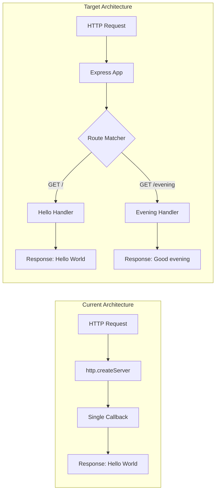

# Technical Specification

# 0. Agent Action Plan

## 0.1 Intent Clarification

### 0.1.1 Core Feature Objective

Based on the prompt, the Blitzy platform understands that the new feature requirement is to:

- **Add Express.js Framework**: Integrate the Express.js web framework into the existing Node.js project that currently uses only the built-in `http` module
- **Create New Endpoint**: Add a second HTTP endpoint that returns the response "Good evening"
- **Preserve Existing Functionality**: Maintain the existing "Hello World" endpoint functionality while adding the new feature

**Implicit Requirements Detected:**
- Migrate from raw `http` module to Express.js routing system
- Refactor the existing "Hello, World!" endpoint to use Express.js patterns
- Maintain the same port (3000) and hostname configuration
- Follow Express.js best practices for route handling
- Update project dependencies via npm

**Feature Dependencies and Prerequisites:**
- Node.js runtime environment (v18+ required for Express.js 5.x compatibility)
- npm package manager for Express.js installation
- Understanding of Express.js routing fundamentals

### 0.1.2 Special Instructions and Constraints

**Critical Directives:**
- Integrate Express.js to replace the built-in `http` module implementation
- Maintain backward compatibility with existing server behavior
- Both endpoints must be accessible at the same port (3000)

**Architectural Requirements:**
- Use Express.js routing conventions for defining endpoints
- Follow the repository's existing coding style (ES5/CommonJS modules with `require()`)
- Keep the server implementation in the existing `server.js` file

**User Example (preserved exactly):**
> "this is a tutorial of node js server hosting one endpoint that returns the response "Hello world". Could you add expressjs into the project and add another endpoint that return the response of "Good evening"?"

**Web Search Requirements Identified:**
- Latest stable Express.js version and compatibility requirements (COMPLETED - Express.js v5.2.1)
- Express.js basic routing patterns (standard documentation)

### 0.1.3 Technical Interpretation

These feature requirements translate to the following technical implementation strategy:

- **To add Express.js to the project**, we will install Express.js as an npm dependency and modify `package.json` to include it
- **To implement the "Hello World" endpoint**, we will refactor `server.js` to use `app.get('/', ...)` Express routing instead of the raw `http.createServer()` callback
- **To add the "Good evening" endpoint**, we will create a new Express route handler using `app.get('/evening', ...)` or a similar path pattern
- **To preserve server behavior**, we will maintain the same host (127.0.0.1) and port (3000) configuration using `app.listen()`

| Requirement | Technical Action | Target Component |
|-------------|------------------|------------------|
| Add Express.js | Install via npm, update package.json | package.json, package-lock.json |
| Migrate HTTP server | Replace `http.createServer()` with Express app | server.js |
| Hello World endpoint | Create Express route handler at root path | server.js |
| Good Evening endpoint | Create new Express route handler | server.js |
| Update main entry | Correct package.json main field | package.json |

## 0.2 Repository Scope Discovery

### 0.2.1 Comprehensive File Analysis

**Repository Structure Overview:**

```
/
├── server.js              # Main HTTP server implementation (MODIFY)
├── package.json           # Node.js manifest (MODIFY)
├── package-lock.json      # Dependency lockfile (AUTO-UPDATE)
├── README.md              # Project documentation (MODIFY)
├── LoginTest.java         # Unrelated Java file (OUT OF SCOPE)
├── industry.csv           # Lookup data file (OUT OF SCOPE)
├── test.py.txt            # Empty placeholder (OUT OF SCOPE)
└── test.txt.txt           # Empty placeholder (OUT OF SCOPE)
```

**Existing Files Requiring Modification:**

| File | Current Purpose | Required Changes |
|------|-----------------|------------------|
| `server.js` | HTTP server using built-in `http` module serving "Hello, World!" at root | Replace `http` module with Express.js; add new "/evening" route |
| `package.json` | npm manifest with no dependencies, main pointing to non-existent `index.js` | Add Express.js dependency; update main to `server.js`; add start script |
| `package-lock.json` | Empty lockfile with no resolved packages | Auto-generated when installing Express.js |
| `README.md` | Basic project description with "Do not touch!" directive | Update to document Express.js integration and available endpoints |

**Current `server.js` Implementation (Lines 1-14):**
```javascript
const http = require('http');
const server = http.createServer((req, res) => {
  res.statusCode = 200;
  res.setHeader('Content-Type', 'text/plain');
  res.end('Hello, World!\n');
});
```

**Current `package.json` Configuration:**
```json
{
  "name": "hello_world",
  "version": "1.0.0",
  "main": "index.js",
  "dependencies": {}
}
```

### 0.2.2 Integration Point Discovery

**API Endpoints Affected:**

| Endpoint | Current State | Target State |
|----------|---------------|--------------|
| `GET /` | Returns "Hello, World!" via raw http | Returns "Hello, World!" via Express |
| `GET /evening` | Does not exist | NEW: Returns "Good evening" |

**Server Configuration Touchpoints:**
- Host binding: `127.0.0.1` (to be preserved)
- Port: `3000` (to be preserved)
- Console output: Server startup message (to be preserved or enhanced)

**Middleware/Handler Impact:**
- Raw `http.createServer()` callback → Express route handlers
- Manual `res.statusCode`, `res.setHeader()`, `res.end()` → Express `res.send()` convenience method

### 0.2.3 Web Search Research Conducted

| Topic | Finding | Source |
|-------|---------|--------|
| Express.js Latest Version | v5.2.1 (published ~2 months ago) | npm registry |
| Express.js 5 Node.js Requirement | Requires Node.js v18 or higher | Express.js releases |
| Express.js 5 Status | Now the default on npm (v5.1.0+ as latest) | expressjs.com |

### 0.2.4 New File Requirements

**No new source files are required for this feature.** The implementation will modify existing files only:

- `server.js` - Core implementation changes
- `package.json` - Dependency and configuration updates
- `package-lock.json` - Auto-generated
- `README.md` - Documentation updates

**Optional New Files (Recommended but not strictly required):**

| File | Purpose | Priority |
|------|---------|----------|
| `tests/server.test.js` | Unit tests for endpoint verification | Optional |
| `.nvmrc` | Node.js version specification | Optional |

## 0.3 Dependency Inventory

### 0.3.1 Private and Public Packages

**New Dependencies Required:**

| Registry | Package Name | Version | Purpose |
|----------|--------------|---------|---------|
| npm (public) | express | ^5.2.1 | Express.js web framework for HTTP routing and request handling |

**Transitive Dependencies (Auto-Installed with Express.js 5.x):**
- `body-parser` - Request body parsing middleware
- `path-to-regexp` - Route path pattern matching
- `debug` - Debug logging utility
- Additional internal dependencies managed by npm

**Current Project Dependencies:**

| Type | Count | Details |
|------|-------|---------|
| Production | 0 | No dependencies currently defined |
| Development | 0 | No dev dependencies defined |
| Peer | 0 | None |

### 0.3.2 Dependency Updates Required

**Package.json Modifications:**

Before:
```json
{
  "name": "hello_world",
  "version": "1.0.0",
  "description": "Hello world in Node.js",
  "main": "index.js",
  "scripts": {
    "test": "echo \"Error: no test specified\" && exit 1"
  },
  "author": "hxu",
  "license": "MIT"
}
```

After:
```json
{
  "name": "hello_world",
  "version": "1.1.0",
  "description": "Hello world in Node.js with Express",
  "main": "server.js",
  "scripts": {
    "start": "node server.js",
    "test": "echo \"Error: no test specified\" && exit 1"
  },
  "dependencies": {
    "express": "^5.2.1"
  },
  "author": "hxu",
  "license": "MIT"
}
```

### 0.3.3 Import Updates

**Files Requiring Import Changes:**

| File Pattern | Current Imports | Updated Imports |
|--------------|-----------------|-----------------|
| `server.js` | `const http = require('http');` | `const express = require('express');` |

**Import Transformation Rules:**

- **Old**: `const http = require('http');`
- **New**: `const express = require('express');`
- **Apply to**: `server.js`

The `http` module import will be completely replaced, not augmented, as Express.js handles all HTTP server functionality internally.

### 0.3.4 External Reference Updates

**Configuration Files to Update:**

| File | Change Required |
|------|-----------------|
| `package.json` | Add express dependency, update main entry, add start script |
| `package-lock.json` | Auto-regenerated by npm install |

**Documentation Files to Update:**

| File | Change Required |
|------|-----------------|
| `README.md` | Document Express.js usage, available endpoints, installation steps |

**No CI/CD files exist in the repository** - no workflow updates required.

## 0.4 Integration Analysis

### 0.4.1 Existing Code Touchpoints

**Direct Modifications Required:**

| File | Location | Modification Description |
|------|----------|-------------------------|
| `server.js` | Lines 1-14 (entire file) | Complete refactor from `http` module to Express.js |
| `package.json` | `main` field | Change from `index.js` to `server.js` |
| `package.json` | `dependencies` object | Add Express.js dependency |
| `package.json` | `scripts` object | Add `start` script for `node server.js` |
| `package.json` | `version` field | Bump from `1.0.0` to `1.1.0` (feature addition) |

**Detailed server.js Transformation:**

| Current Code Segment | Line(s) | Transformation Required |
|----------------------|---------|------------------------|
| `const http = require('http');` | 1 | Replace with `const express = require('express');` |
| `const hostname = '127.0.0.1';` | 3 | Retain (configuration) |
| `const port = 3000;` | 4 | Retain (configuration) |
| `http.createServer((req, res) => {...})` | 6-10 | Replace with Express app and route handlers |
| `server.listen(port, hostname, ...)` | 12-14 | Replace with `app.listen(port, ...)` |

### 0.4.2 Dependency Injections

**No dependency injection framework exists in this project.** The implementation follows a simple module pattern.

**Module-Level Changes:**
- The `http` module dependency will be removed (no longer imported)
- Express.js becomes the sole HTTP handling dependency
- Express application instance (`app`) becomes the central routing object

### 0.4.3 Database/Schema Updates

**No database or schema changes required.** This project does not use any database - it is a stateless HTTP server returning static text responses.

### 0.4.4 Routing Architecture Change

**Before (raw http module):**
```
Request → http.createServer callback → Single response handler → Response
```

**After (Express.js):**
```
Request → Express.js Router → Route Matcher → Route Handler → Response
```



### 0.4.5 Response Behavior Comparison

| Aspect | Current (http module) | Target (Express.js) |
|--------|----------------------|---------------------|
| Response method | `res.end('Hello, World!\n')` | `res.send('Hello, World!')` |
| Status code | `res.statusCode = 200` | Implicit 200 (Express default) |
| Content-Type | `res.setHeader('Content-Type', 'text/plain')` | Auto-detected by Express |
| Root path (/) | Returns Hello World | Returns Hello World |
| /evening path | Returns Hello World (no routing) | Returns "Good evening" |
| Unknown paths | Returns Hello World (no routing) | Returns 404 (Express default) |

## 0.5 Technical Implementation

### 0.5.1 File-by-File Execution Plan

**CRITICAL: Every file listed here MUST be created or modified.**

**Group 1 - Core Feature Files:**

| Action | File | Implementation Details |
|--------|------|----------------------|
| MODIFY | `server.js` | Refactor to Express.js with two route handlers |
| MODIFY | `package.json` | Add express dependency, update metadata |
| AUTO | `package-lock.json` | Regenerated by npm install |

**Group 2 - Documentation:**

| Action | File | Implementation Details |
|--------|------|----------------------|
| MODIFY | `README.md` | Document endpoints and Express.js usage |

### 0.5.2 Implementation Approach per File

**server.js - Complete Refactoring:**

The server.js file requires complete replacement of the HTTP handling logic:

```javascript
const express = require('express');
const app = express();
const port = 3000;

app.get('/', (req, res) => {
  res.send('Hello, World!\n');
});

app.get('/evening', (req, res) => {
  res.send('Good evening');
});

app.listen(port, () => {
  console.log(`Server running at http://127.0.0.1:${port}/`);
});
```

**Key Implementation Decisions:**
- Use `res.send()` instead of `res.end()` for Express.js idiomatic response handling
- Express.js auto-sets Content-Type based on response content
- Maintain trailing newline on "Hello, World!\n" for backward compatibility
- Use path `/evening` for the new endpoint (semantic and clear)

**package.json - Dependency and Metadata Updates:**

```json
{
  "name": "hello_world",
  "version": "1.1.0",
  "description": "Hello world in Node.js with Express",
  "main": "server.js",
  "scripts": {
    "start": "node server.js",
    "test": "echo \"Error: no test specified\" && exit 1"
  },
  "dependencies": {
    "express": "^5.2.1"
  },
  "author": "hxu",
  "license": "MIT"
}
```

**README.md - Documentation Updates:**

Add sections for:
- Express.js framework mention
- Installation instructions (`npm install`)
- Available endpoints table
- Running instructions (`npm start` or `node server.js`)

### 0.5.3 Step-by-Step Implementation Sequence

| Step | Action | Command/Change | Verification |
|------|--------|----------------|--------------|
| 1 | Install Express.js | `npm install express@^5.2.1` | Check package.json |
| 2 | Update package.json main | Change `index.js` to `server.js` | Verify JSON |
| 3 | Add start script | Add `"start": "node server.js"` | Verify JSON |
| 4 | Refactor server.js | Replace http with Express | Syntax check |
| 5 | Add root route | `app.get('/', ...)` | Test endpoint |
| 6 | Add evening route | `app.get('/evening', ...)` | Test endpoint |
| 7 | Update README.md | Document changes | Review |
| 8 | Test all endpoints | `curl http://127.0.0.1:3000/` | Verify responses |

### 0.5.4 Endpoint Specification

**Endpoint 1: Hello World (Root)**

| Attribute | Value |
|-----------|-------|
| Method | GET |
| Path | `/` |
| Response Body | `Hello, World!\n` |
| Content-Type | text/html (Express default for strings) |
| Status Code | 200 |

**Endpoint 2: Good Evening**

| Attribute | Value |
|-----------|-------|
| Method | GET |
| Path | `/evening` |
| Response Body | `Good evening` |
| Content-Type | text/html (Express default for strings) |
| Status Code | 200 |

### 0.5.5 User Interface Design

**Not Applicable** - This feature involves API endpoints only, no user interface components. No Figma URLs were provided.

## 0.6 Scope Boundaries

### 0.6.1 Exhaustively In Scope

**Source Files:**

| Pattern | Files Matched | Purpose |
|---------|---------------|---------|
| `server.js` | `server.js` | Main server implementation refactoring |

**Configuration Files:**

| Pattern | Files Matched | Purpose |
|---------|---------------|---------|
| `package.json` | `package.json` | Dependency and metadata updates |
| `package-lock.json` | `package-lock.json` | Auto-generated lockfile |

**Documentation Files:**

| Pattern | Files Matched | Purpose |
|---------|---------------|---------|
| `README.md` | `README.md` | Project documentation updates |

**Complete In-Scope File List:**

```
server.js                 # MODIFY - Express.js integration and new endpoint
package.json              # MODIFY - Add dependency, update main, add scripts
package-lock.json         # AUTO   - Regenerated by npm install
README.md                 # MODIFY - Document Express.js and endpoints
```

**In-Scope Changes Summary:**

| Change Type | Count | Files |
|-------------|-------|-------|
| Framework Integration | 1 | server.js |
| Dependency Addition | 2 | package.json, package-lock.json |
| Documentation | 1 | README.md |
| **Total** | **4** | |

### 0.6.2 Explicitly Out of Scope

**Files NOT to be Modified:**

| File | Reason |
|------|--------|
| `LoginTest.java` | Unrelated Java test file, not part of Node.js server |
| `industry.csv` | Static lookup data, no relation to HTTP endpoints |
| `test.py.txt` | Empty placeholder file, no content |
| `test.txt.txt` | Empty placeholder file, no content |
| `100Pages.pdf` | Binary document, not source code |
| `demo.jpg` | Binary image, not source code |
| `sample.doc` | Binary document, not source code |

**Explicitly Out of Scope Activities:**

| Activity | Rationale |
|----------|-----------|
| Database integration | No database mentioned in requirements |
| Authentication/Authorization | Not requested |
| Additional endpoints beyond /evening | Only one new endpoint requested |
| Test file creation | Not explicitly requested (optional) |
| CI/CD pipeline setup | No CI/CD infrastructure exists or requested |
| TypeScript migration | JavaScript is sufficient per current codebase |
| Containerization (Docker) | Not requested |
| Performance optimizations | Simple tutorial project, not required |
| Error handling middleware | Basic implementation sufficient |
| Logging middleware | Not requested |
| Environment configuration (.env) | Hardcoded values sufficient per requirements |

### 0.6.3 Scope Validation Criteria

| Criterion | Required State | Validation Method |
|-----------|----------------|-------------------|
| Express.js installed | Listed in package.json dependencies | `npm ls express` |
| Root endpoint works | Returns "Hello, World!\n" | `curl http://127.0.0.1:3000/` |
| Evening endpoint works | Returns "Good evening" | `curl http://127.0.0.1:3000/evening` |
| Server starts successfully | Console shows startup message | `node server.js` |
| No breaking changes | Existing root path behavior preserved | Compare responses |

## 0.7 Rules for Feature Addition

### 0.7.1 Feature-Specific Rules

**Coding Conventions:**
- Maintain existing code style using CommonJS (`require()`) module syntax
- Use single quotes for strings to match existing codebase
- Preserve existing variable naming patterns
- Keep server configuration at file-level scope

**Express.js Specific Requirements:**
- Use Express.js 5.x (latest stable version ^5.2.1)
- Define routes using `app.get()` method
- Use `res.send()` for response handling
- Maintain port 3000 for backward compatibility

**Response Format Requirements:**
- "Hello, World!" endpoint MUST include trailing newline (`\n`) for backward compatibility
- "Good evening" endpoint matches user's exact wording from requirements
- Use plain text responses (no JSON wrapper needed)

### 0.7.2 Integration Requirements

| Requirement | Implementation Approach |
|-------------|------------------------|
| Backward compatibility | Preserve exact "Hello, World!\n" response at root path |
| Server binding | Maintain 127.0.0.1:3000 configuration |
| Startup message | Keep informative console log on server start |
| Module system | Continue using CommonJS (require/module.exports) |

### 0.7.3 Performance Considerations

**Not Critical for This Feature:**
- This is a tutorial/demo project with minimal performance requirements
- Express.js adds negligible overhead for this simple use case
- No caching, rate limiting, or optimization patterns required

### 0.7.4 Security Requirements

**Basic Security (Inherent to Express.js 5.x):**
- Express 5.x includes improved ReDoS (Regular Expression Denial of Service) protection
- No user input processing beyond URL path matching
- No sensitive data handling
- No authentication required for either endpoint

**Not Required:**
- HTTPS configuration (development server)
- CORS middleware (single-origin tutorial)
- Helmet.js or security headers (not requested)
- Input validation (no user input beyond path)

### 0.7.5 User-Specified Constraints

The user explicitly stated:
> "this is a tutorial of node js server"

This indicates:
- Educational/learning context
- Simplicity is preferred over complexity
- Standard patterns are sufficient
- No production-grade requirements

## 0.8 References

### 0.8.1 Repository Files Searched

**Files Retrieved and Analyzed:**

| File Path | Analysis Purpose | Key Findings |
|-----------|------------------|--------------|
| `server.js` | Understand current HTTP implementation | Uses `http` module, serves "Hello, World!" at port 3000 |
| `package.json` | Review project configuration and dependencies | No dependencies, main points to non-existent index.js |
| `package-lock.json` | Check existing dependency tree | Empty lockfile, no resolved packages |
| `README.md` | Review project documentation | Contains "hao-backprop-test" identifier and "Do not touch!" directive |

**Folder Structure Analyzed:**

| Path | Contents | Relevance |
|------|----------|-----------|
| `/` (root) | 8 files including server.js, package.json, README.md, plus binary/unrelated files | Primary scope for modifications |

### 0.8.2 External Research Conducted

**Web Searches Performed:**

| Query | Purpose | Key Findings |
|-------|---------|--------------|
| "Express.js latest stable version 2025" | Determine current Express.js version | Express.js v5.2.1 is latest; v5.x requires Node.js 18+ |

**External Sources Referenced:**

| Source | Information Retrieved |
|--------|----------------------|
| npm registry (npmjs.com) | Express.js v5.2.1 is latest version |
| Express.js GitHub releases | Express v5 officially released, focuses on security and modernization |
| expressjs.com | Express 5.1.0 is now default on npm with LTS support |

### 0.8.3 User-Provided Attachments

**No attachments were provided for this project.**

The `/tmp/environments_files` directory was checked and found empty.

### 0.8.4 Figma URLs

**No Figma URLs were provided.** This feature involves API endpoints only with no user interface components.

### 0.8.5 Environment Variables

**Environment Variables Provided by User:**

| Variable | Usage Status |
|----------|--------------|
| `DB_HOST1` | Not used - this project has no database |
| `adsfasdfasfasdfhalsjdfkoqwejfalskdjfals;fjdl;asjdfopwf;ladjksfopasjdfl;adksflo;adhjsfoahjsdfljkhaeiowhjaklhsdfioauswhdfkljasdadfhjslkadjlsdfhjals;djfhaiklsdfhaksjlddfhaioslkdfhjlkawfhioasdjhfklashdfioasdfklajshfhjasdflhasifhsakfhjasdifjhaksjddfhjkaldsfiuaa` | Not used - appears to be test/placeholder data |

### 0.8.6 Technical Specification Sections Referenced

| Section | Purpose |
|---------|---------|
| 1.1 Executive Summary | Background context on original project |
| 3.1 Technology Stack Overview | Understanding existing tech stack documentation |

### 0.8.7 Version Information Summary

| Component | Version | Source |
|-----------|---------|--------|
| Node.js (environment) | v20.20.0 | Runtime check |
| npm (environment) | v11.1.0 | Runtime check |
| Express.js (to install) | ^5.2.1 | npm registry research |
| Project version (current) | 1.0.0 | package.json |
| Project version (target) | 1.1.0 | Feature version bump |

