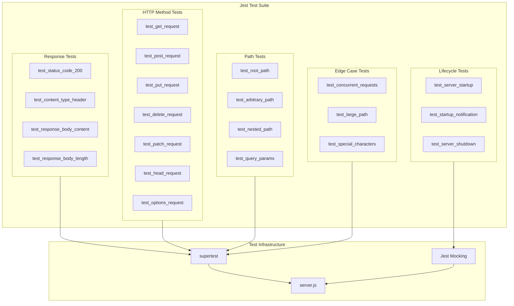

# Technical Specification

# 0. Agent Action Plan

## 0.1 Intent Clarification

### 0.1.1 Core Testing Objective

Based on the provided requirements, the Blitzy platform understands that the testing objective is to **create comprehensive unit tests for the Node.js HTTP server** (`server.js`) that thoroughly validate all aspects of server functionality including HTTP response handling, status codes, headers, server lifecycle management, error handling, and edge case coverage.

**Request Category:** Add new tests (no existing tests found)

| Requirement | Enhanced Interpretation |
|-------------|------------------------|
| Test HTTP responses | Validate response body content (`"Hello, World!\n"`) matches exactly, including trailing newline character |
| Test status codes | Verify HTTP 200 OK status is returned for all requests regardless of path or method |
| Test headers | Confirm `Content-Type: text/plain` header is properly set on all responses |
| Test server startup/shutdown | Validate server binds to `127.0.0.1:3000`, emits startup notification, and shuts down gracefully |
| Test error handling | Cover scenarios where the server encounters unexpected conditions, malformed requests, or connection issues |
| Test edge cases | Handle boundary conditions including empty paths, deep nested routes, special characters in URLs, various HTTP methods |

**Implicit Testing Needs Surfaced:**
- Response body byte-length validation (14 bytes expected)
- Trailing newline character presence verification (`\n` = 0x0A)
- Server binding address verification (localhost only)
- Port availability and conflict handling
- Multiple concurrent request handling
- Connection timeout behavior
- Request with various HTTP methods (GET, POST, PUT, DELETE, PATCH, HEAD, OPTIONS)
- Arbitrary URL path handling (`/`, `/test`, `/deep/nested/path`)

### 0.1.2 Special Instructions and Constraints

**Testing Framework Selection:** The user has specified Jest or Mocha as acceptable testing frameworks. Based on repository analysis and modern best practices, **Jest** is recommended due to:
- Zero-configuration setup for Node.js projects
- Built-in mocking, assertion, and coverage capabilities
- Better async/await support out of the box
- Active maintenance and widespread adoption

**Constraints Identified:**
- No existing test infrastructure exists in the repository
- Package.json currently has a placeholder test script: `"echo \"Error: no test specified\" && exit 1"`
- No devDependencies are declared
- Server uses top-level execution (side effects when requiring module)

**Web Search Requirements:**
- ✅ Jest version compatibility with Node.js 20 - Confirmed Jest 30.x supports Node 18+
- ✅ Supertest HTTP testing library - Latest version 7.1.4 available
- ✅ Best practices for testing Node.js HTTP servers

### 0.1.3 Technical Interpretation

These testing requirements translate to the following technical test implementation strategy:

| Requirement | Technical Implementation |
|-------------|-------------------------|
| To test HTTP responses | Create tests using supertest to make requests and assert response body equals `"Hello, World!\n"` |
| To test status codes | Use supertest's `.expect(200)` to validate all requests return HTTP 200 OK |
| To test headers | Assert `Content-Type` header equals `text/plain` using supertest expectations |
| To test server startup | Refactor server.js to export server instance, capture console.log output, verify binding |
| To test server shutdown | Implement graceful shutdown testing using server.close() with callback verification |
| To test error handling | Mock error scenarios using Jest spies on http module methods |
| To test edge cases | Parameterize tests with various paths, methods, and request configurations |

### 0.1.4 Coverage Requirements Interpretation

**Explicit Coverage Targets:** Not specified by user - will apply industry best practices

**Implicit Coverage Expectations Based on Analysis:**
- Industry standard for Node.js applications: 80%+ line coverage
- Given minimal 14-line implementation: 100% coverage achievable and expected
- Critical path analysis indicates all code paths must be tested

**To achieve comprehensive testing, coverage should include:**
- 100% line coverage for server.js
- 100% branch coverage (conditional paths)
- 100% function coverage
- All HTTP methods exercised
- Multiple URL paths tested
- Server lifecycle (startup/shutdown) fully covered


## 0.2 Test Discovery and Analysis

## 0.2 Test Discovery and Analysis

### 0.2.1 Existing Test Infrastructure Assessment

**Repository Analysis Conducted:**

A comprehensive search of the repository revealed **no existing test infrastructure**:

| Search Pattern | Files Found | Status |
|---------------|-------------|--------|
| `*test*`, `*spec*` | `test.py.txt`, `test.txt.txt` | Empty placeholder files (0 bytes) |
| `test_*`, `spec_*` | None | No matching files |
| `*_test.*`, `*_spec.*` | None | No matching files |
| `jest.config.*` | None | No Jest configuration |
| `.mocharc.*`, `mocha.*` | None | No Mocha configuration |
| `pytest.ini` | None | No pytest configuration |
| `__tests__/` | None | No test directory |

**Package.json Analysis:**

```json
{
  "name": "hello_world",
  "version": "1.0.0",
  "scripts": {
    "test": "echo \"Error: no test specified\" && exit 1"
  }
}
```

- No devDependencies declared
- No testing framework installed
- Placeholder test script that exits with error

**Repository analysis reveals:** No existing testing setup. The project requires complete test infrastructure creation from scratch using Jest as the primary testing framework with supertest for HTTP assertions.

### 0.2.2 Current Testing Framework Status

| Component | Current State | Required State |
|-----------|--------------|----------------|
| Testing framework | Not installed | Jest 30.x |
| Test runner configuration | None | jest.config.js |
| Coverage tools | None | Built-in Jest coverage |
| Mock/stub libraries | None | Jest built-in mocking |
| HTTP testing library | None | supertest 7.x |
| Test data fixtures | None | To be created |

### 0.2.3 Source Code Analysis for Testability

**server.js Analysis:**

```javascript
// 14 lines of code - Current structure
const http = require('http');
const hostname = '127.0.0.1';
const port = 3000;
const server = http.createServer((req, res) => {
  res.statusCode = 200;
  res.setHeader('Content-Type', 'text/plain');
  res.end('Hello, World!\n');
});
server.listen(port, hostname, () => {
  console.log(`Server running at http://${hostname}:${port}/`);
});
```

**Testability Challenges Identified:**
- Top-level side effects: Server starts immediately when module is required
- No export of server instance for testing
- Console output in callback requires capture
- No graceful shutdown handler implemented

**Required Modifications for Testability:**
- Extract server creation into exportable function
- Conditionally start server based on module execution context
- Export server instance and configuration for test access

### 0.2.4 Web Search Research Conducted

| Research Topic | Findings | Application |
|---------------|----------|-------------|
| Jest Node.js 20 compatibility | Jest 30.x supports Node 18+ (minimum), Node 20 fully supported | Use Jest 30.2.0 |
| Supertest HTTP testing | Version 7.1.4 latest, works with any test framework | Use for HTTP assertions |
| Node.js HTTP server testing patterns | Supertest can accept http.Server directly | Pass server to supertest |
| Server lifecycle testing | Use server.close() with done callback | Implement shutdown tests |
| Console output capture | Jest provides spy capabilities for console | Mock console.log |

### 0.2.5 Testing Stack Recommendation

Based on research and repository analysis, the recommended testing stack is:

| Tool | Version | Purpose | Rationale |
|------|---------|---------|-----------|
| jest | 30.2.0 | Test framework | Zero-config, built-in mocking, Node 20 compatible |
| supertest | 7.1.4 | HTTP assertions | Fluent API for HTTP testing, no server startup needed |

**Configuration Files Required:**
- `jest.config.js` - Jest configuration
- `package.json` updates - devDependencies and test script


## 0.3 Testing Scope Analysis

## 0.3 Testing Scope Analysis

### 0.3.1 Test Target Identification

**Primary Code to be Tested:**

| Module/File | Path | Test Categories Required |
|------------|------|-------------------------|
| HTTP Server | `server.js` | Unit tests, Integration tests, Lifecycle tests, Edge case tests |

**Functions and Components Requiring Tests:**

| Component | Location | Test Categories |
|-----------|----------|-----------------|
| HTTP Server Creation | `http.createServer()` callback | Response tests, Header tests |
| Request Handler | Anonymous function in createServer | Method handling, Path handling |
| Response Generation | `res.statusCode`, `res.setHeader`, `res.end` | Status code, Headers, Body |
| Server Binding | `server.listen()` | Startup tests, Port binding |
| Startup Notification | `console.log()` in listen callback | Console output verification |

**Existing Test File Mapping:**

| Source File | Existing Test File | Test Categories Present |
|-------------|-------------------|------------------------|
| `server.js` | None (to be created) | None |

### 0.3.2 Dependencies Requiring Mocking

| Dependency Type | Component | Mocking Strategy |
|-----------------|-----------|------------------|
| Built-in module | `http` | Jest spy on createServer for error scenarios |
| Console output | `console.log` | Jest spy to capture startup notification |
| Network binding | Port 3000 | Use supertest (ephemeral ports) |
| File system | None | N/A |
| Database | None | N/A |
| External services | None | N/A |

### 0.3.3 Version Compatibility Research

**Environment Analysis:**
- Node.js version: 20.19.6 (LTS)
- npm version: 11.1.0

**Recommended Testing Stack with Compatibility:**

| Tool | Recommended Version | Compatibility Notes |
|------|--------------------|--------------------|
| jest | 30.2.0 | Supports Node 18+ (Node 20 fully compatible) |
| supertest | 7.1.4 | Works with http.Server, no framework dependency |

**Version Conflict Analysis:**
- No conflicts identified
- Jest 30.x dropped Node 16 support but fully supports Node 20
- Supertest 7.x is compatible with all current Node LTS versions

### 0.3.4 Test Categories Breakdown

**Unit Tests:**
- Response body content validation
- Response status code verification
- Response header verification
- Request handler function behavior

**Integration Tests:**
- Complete HTTP request/response cycle
- Server binding and listening
- Multiple concurrent requests

**Lifecycle Tests:**
- Server startup notification
- Server shutdown (graceful close)
- Port binding verification

**Edge Case Tests:**
- Various HTTP methods (GET, POST, PUT, DELETE, PATCH, HEAD, OPTIONS)
- Arbitrary URL paths (`/`, `/test`, `/deep/nested/path`, `/with/special?chars=true`)
- Empty path handling
- Large path handling

**Error Handling Tests:**
- Server error scenarios (via mocking)
- Connection handling
- Request abort scenarios


## 0.4 Test Implementation Design

## 0.4 Test Implementation Design

### 0.4.1 Test Strategy Selection

**Test Types to Implement:**

| Test Type | Focus Areas | Priority |
|-----------|-------------|----------|
| Unit tests | Isolated response generation, header setting, status codes | Critical |
| Integration tests | Full HTTP request/response cycle via supertest | Critical |
| Lifecycle tests | Server startup, shutdown, console output | Required |
| Edge case tests | Various HTTP methods, URL paths, boundary conditions | Required |
| Error handling tests | Server error scenarios via mocking | Required |

### 0.4.2 Test Case Blueprint

**Component: HTTP Response Generation**

```
Component: Response Generation (server.js request handler)
Test Categories:
- Happy path:
  - GET request returns "Hello, World!\n"
  - Response status code is 200
  - Content-Type header is text/plain
  - Response body is exactly 14 bytes
- Edge cases:
  - POST request returns same response
  - PUT request returns same response
  - DELETE request returns same response
  - HEAD request returns headers only
  - OPTIONS request returns same response
  - Deep nested path returns same response
  - Path with query parameters returns same response
- Error cases:
  - Server handles malformed requests gracefully
  - Connection abort handling
```

**Component: Server Lifecycle**

```
Component: Server Startup/Shutdown (server.listen, server.close)
Test Categories:
- Happy path:
  - Server starts successfully
  - Startup notification logged to console
  - Server binds to 127.0.0.1:3000
- Edge cases:
  - Server can be started and stopped multiple times
  - Multiple servers on different ports (if applicable)
- Error cases:
  - Port already in use handling
  - Graceful shutdown completes all pending requests
```

### 0.4.3 Existing Test Extension Strategy

Since no existing tests exist, this section documents the creation strategy:

| Action | Description |
|--------|-------------|
| Create test directory | `__tests__/` directory for Jest test files |
| Create main test file | `__tests__/server.test.js` - comprehensive server tests |
| Create Jest config | `jest.config.js` - test configuration |
| Update package.json | Add devDependencies and test scripts |

### 0.4.4 Test Data and Fixtures Design

**Required Test Data Structures:**

| Data | Value | Purpose |
|------|-------|---------|
| Expected response body | `"Hello, World!\n"` | Response content validation |
| Expected status code | `200` | Status verification |
| Expected content-type | `"text/plain"` | Header verification |
| Expected body length | `14` | Byte-length validation |
| Server hostname | `"127.0.0.1"` | Binding verification |
| Server port | `3000` | Port verification |

**Test Paths (Parameterized):**
- `/`
- `/test`
- `/any/path`
- `/deeply/nested/path/here`
- `/path?query=param`
- `/path#fragment`
- `/special%20chars`

**Test HTTP Methods (Parameterized):**
- `GET`
- `POST`
- `PUT`
- `DELETE`
- `PATCH`
- `HEAD`
- `OPTIONS`

### 0.4.5 Test Architecture Diagram



### 0.4.6 Mock Object Specifications

| Mock Target | Jest Method | Purpose |
|-------------|-------------|---------|
| `console.log` | `jest.spyOn(console, 'log')` | Capture startup notification |
| `console.error` | `jest.spyOn(console, 'error')` | Capture error output |
| `http.createServer` | `jest.mock('http')` | Error scenario testing |

### 0.4.7 Test Isolation Strategy

| Strategy | Implementation |
|----------|----------------|
| Server per test | Use supertest with fresh server instance per test |
| Mock cleanup | Use `jest.restoreAllMocks()` in afterEach |
| Port isolation | Supertest uses ephemeral ports automatically |
| State reset | Server is stateless, no state cleanup needed |


## 0.5 Test File Transformation Mapping

## 0.5 Test File Transformation Mapping

### 0.5.1 File-by-File Test Plan

**Test Transformation Modes:**
- **CREATE** - Create a new test file
- **UPDATE** - Update an existing test file
- **DELETE** - Remove an obsolete test file
- **REFERENCE** - Use as an example for test patterns and styles

| Target Test File | Transformation | Source File/Reference | Purpose/Changes |
|-----------------|----------------|----------------------|-----------------|
| `__tests__/server.test.js` | CREATE | `server.js` | Main test suite covering HTTP responses, status codes, headers, all HTTP methods, URL paths, and server lifecycle |
| `__tests__/server.response.test.js` | CREATE | `server.js` | Focused tests for response body, content-type, and status code validation |
| `__tests__/server.lifecycle.test.js` | CREATE | `server.js` | Server startup notification, shutdown, and binding verification tests |
| `__tests__/server.edge-cases.test.js` | CREATE | `server.js` | Edge case tests for special paths, concurrent requests, and boundary conditions |
| `jest.config.js` | CREATE | N/A | Jest configuration with coverage settings |
| `package.json` | UPDATE | `package.json` | Add devDependencies (jest, supertest) and update test script |
| `server.js` | UPDATE | `server.js` | Minor refactor to export server instance for testing (conditional startup) |
| `test.py.txt` | DELETE | N/A | Remove empty placeholder file (not needed) |
| `test.txt.txt` | DELETE | N/A | Remove empty placeholder file (not needed) |

### 0.5.2 New Test Files Detail

**`__tests__/server.test.js`** - Main comprehensive test suite

```
Test Categories:
- Happy path tests (response validation)
- HTTP method tests (GET, POST, PUT, DELETE, PATCH, HEAD, OPTIONS)
- URL path tests (root, arbitrary, nested, query params)
- Header validation tests
- Response body tests

Mock Dependencies:
- None (uses supertest for HTTP testing)

Assertions Focus:
- Response status code === 200
- Content-Type header === 'text/plain'
- Response body === 'Hello, World!\n'
- Response body length === 14 bytes
```

**`__tests__/server.response.test.js`** - Focused response validation

```
Test Categories:
- Status code verification (200 OK)
- Header verification (Content-Type: text/plain)
- Body content verification (exact string match)
- Body length verification (14 bytes)
- Trailing newline verification

Mock Dependencies:
- None

Assertions Focus:
- Byte-level body comparison
- Header case-insensitivity
- Character encoding validation
```

**`__tests__/server.lifecycle.test.js`** - Server lifecycle tests

```
Test Categories:
- Server startup successful
- Startup notification logged
- Server binds to correct host/port
- Server shutdown graceful
- Console output capture

Mock Dependencies:
- console.log (Jest spy)

Assertions Focus:
- Server.listening === true after start
- Console output matches expected format
- server.close() callback invoked
```

**`__tests__/server.edge-cases.test.js`** - Edge case coverage

```
Test Categories:
- Special characters in URL path
- Very long URL paths
- Empty path segments
- Query parameters
- URL fragments
- Concurrent requests
- Rapid sequential requests

Mock Dependencies:
- None

Assertions Focus:
- All edge cases return 200 OK
- Response body always identical
- No server errors or crashes
```

### 0.5.3 Test Configuration Updates

**`jest.config.js`** - Create with settings:

```
Configuration includes:
- Test environment: node
- Test match pattern: **/__tests__/**/*.test.js
- Coverage collection: enabled
- Coverage threshold: 100% lines, branches, functions
- Coverage reporters: text, lcov
- Verbose output: enabled
```

**`package.json`** - Update to include:

```
Updates:
- devDependencies:
  - jest: ^30.2.0
  - supertest: ^7.1.4
- scripts:
  - "test": "jest"
  - "test:watch": "jest --watch"
  - "test:coverage": "jest --coverage"
```

### 0.5.4 Source File Modifications

**`server.js`** - Minor refactor for testability:

```
Changes required:
- Wrap server creation in exportable function
- Add conditional startup (check if module is main)
- Export server instance for testing
- Export configuration constants (hostname, port)

Pattern:
- if (require.main === module) { server.listen(...) }
- module.exports = { server, hostname, port, createServer }
```

### 0.5.5 Cross-File Test Dependencies

| Dependency Type | Location | Usage |
|----------------|----------|-------|
| Server instance | `server.js` (exported) | All test files import server |
| Test utilities | Jest built-in | describe, test, expect, beforeEach, afterEach |
| HTTP assertions | supertest | request(server).get('/').expect(200) |
| Spy utilities | Jest built-in | jest.spyOn(console, 'log') |

### 0.5.6 Complete Test File Inventory

| File Path | Type | Status |
|-----------|------|--------|
| `__tests__/server.test.js` | Test file | CREATE |
| `__tests__/server.response.test.js` | Test file | CREATE |
| `__tests__/server.lifecycle.test.js` | Test file | CREATE |
| `__tests__/server.edge-cases.test.js` | Test file | CREATE |
| `jest.config.js` | Configuration | CREATE |
| `package.json` | Package manifest | UPDATE |
| `server.js` | Source file | UPDATE (minor refactor) |
| `test.py.txt` | Placeholder | DELETE |
| `test.txt.txt` | Placeholder | DELETE |

**Total: 4 test files to CREATE, 2 config/source files to UPDATE, 2 placeholder files to DELETE**


## 0.6 Dependency Inventory

## 0.6 Dependency Inventory

### 0.6.1 Testing Dependencies

All testing packages required for this testing exercise:

| Registry | Package Name | Version | Purpose |
|----------|--------------|---------|---------|
| npm | jest | 30.2.0 | Primary testing framework - zero-config, built-in mocking, coverage |
| npm | supertest | 7.1.4 | HTTP assertions library - fluent API for testing HTTP servers |

### 0.6.2 Version Verification

**Jest 30.2.0:**
- Verified via npm registry: `npm view jest version` → 30.2.0
- Node.js compatibility: Requires Node 18+ (Node 20.19.6 ✓ compatible)
- Released: Approximately 2 months ago
- Features: ESM wrappers, Node 20.11+ support for import.meta

**Supertest 7.1.4:**
- Verified via npm registry: `npm view supertest version` → 7.1.4
- Compatibility: Works with any http.Server instance
- No peer dependencies required
- Works with Jest, Mocha, or standalone

### 0.6.3 Dependency Installation Command

```bash
npm install --save-dev jest@30.2.0 supertest@7.1.4
```

### 0.6.4 Package.json Updates

**Current package.json:**
```json
{
  "name": "hello_world",
  "version": "1.0.0",
  "description": "Hello world in Node.js",
  "main": "index.js",
  "scripts": {
    "test": "echo \"Error: no test specified\" && exit 1"
  },
  "author": "hxu",
  "license": "MIT"
}
```

**Updated package.json (after changes):**
```json
{
  "name": "hello_world",
  "version": "1.0.0",
  "description": "Hello world in Node.js",
  "main": "server.js",
  "scripts": {
    "test": "jest",
    "test:watch": "jest --watch",
    "test:coverage": "jest --coverage",
    "start": "node server.js"
  },
  "author": "hxu",
  "license": "MIT",
  "devDependencies": {
    "jest": "30.2.0",
    "supertest": "7.1.4"
  }
}
```

### 0.6.5 Import Updates

**Test files will require these imports:**

| Test File | Imports Required |
|-----------|-----------------|
| `__tests__/server.test.js` | `const request = require('supertest');`<br>`const { server, createServer } = require('../server');` |
| `__tests__/server.response.test.js` | `const request = require('supertest');`<br>`const { server } = require('../server');` |
| `__tests__/server.lifecycle.test.js` | `const { server, createServer, hostname, port } = require('../server');` |
| `__tests__/server.edge-cases.test.js` | `const request = require('supertest');`<br>`const { server } = require('../server');` |

### 0.6.6 Source File Export Requirements

**server.js - Required exports:**

```javascript
module.exports = {
  server,      // http.Server instance
  createServer, // Factory function (if implemented)
  hostname,    // '127.0.0.1'
  port         // 3000
};
```

### 0.6.7 No Additional Dependencies Required

The following are NOT required due to Jest's built-in capabilities:

| Package | Reason Not Needed |
|---------|------------------|
| chai | Jest includes expect() assertions |
| sinon | Jest includes jest.spyOn() and jest.mock() |
| nyc/istanbul | Jest includes --coverage flag |
| mocha | Jest is the chosen framework |
| nock | No external HTTP calls to mock |


## 0.7 Coverage and Quality Targets

## 0.7 Coverage and Quality Targets

### 0.7.1 Coverage Metrics

**Current Coverage:** 0% (no tests exist)

**Target Coverage:** 100% based on:
- Minimal codebase (14 lines)
- Industry best practices for critical server components
- Achievability given straightforward code structure

**Coverage Gaps to Address:**

| Component | Current | Target | Focus Areas |
|-----------|---------|--------|-------------|
| server.js | 0% | 100% | All lines must be exercised |
| Request handler | 0% | 100% | Response generation code |
| Server lifecycle | 0% | 100% | Listen callback, shutdown |

**Coverage Breakdown by Test Category:**

| Test Category | Lines Covered | Percentage |
|--------------|---------------|------------|
| Response tests | Lines 6-9 (handler) | ~30% |
| Method/Path tests | Lines 6-9 (handler) | ~30% |
| Lifecycle tests | Lines 12-14 (listen) | ~20% |
| Module loading | Lines 1-5 (setup) | ~20% |

### 0.7.2 Per-File Coverage Targets

| File | Line Coverage | Branch Coverage | Function Coverage |
|------|--------------|-----------------|-------------------|
| server.js | 100% | 100% | 100% |

### 0.7.3 Test Quality Criteria

**Assertion Density Expectations:**
- Minimum 2-3 assertions per test case
- Each test validates a specific behavior
- No test should assert unrelated behaviors

**Test Isolation Requirements:**
- Each test runs independently
- Tests can execute in any order
- No shared state between tests
- Server instance reset between tests using supertest

**Performance Constraints:**
- Full test suite execution: < 10 seconds
- Individual test timeout: 5 seconds (Jest default)
- No long-running or slow tests

**Maintainability Standards:**
- Descriptive test names following pattern: `test_<feature>_<scenario>_<expected>`
- Group related tests using describe blocks
- Use parameterized tests for repetitive scenarios
- Clear arrange-act-assert structure

### 0.7.4 Repository Test Pattern Conventions

Since no existing test patterns exist in the repository, the following conventions will be established:

| Convention | Standard |
|------------|----------|
| Test file location | `__tests__/` directory |
| Test file naming | `*.test.js` |
| Test function naming | `it('should <expected behavior>', ...)` |
| Describe block naming | Feature or component name |
| Setup/Teardown | beforeEach/afterEach for server cleanup |

### 0.7.5 Quality Gates

| Gate | Criteria | Enforcement |
|------|----------|-------------|
| Pre-commit | All tests pass | Manual (optional pre-commit hook) |
| CI/CD | 100% test pass, 100% coverage | Jest --coverage --coverageThreshold |
| Pull Request | All quality gates pass | Required for merge |

### 0.7.6 Jest Coverage Configuration

```javascript
// jest.config.js coverage settings
module.exports = {
  coverageThreshold: {
    global: {
      branches: 100,
      functions: 100,
      lines: 100,
      statements: 100
    }
  },
  collectCoverageFrom: [
    'server.js'
  ],
  coverageReporters: ['text', 'lcov', 'html']
};
```

### 0.7.7 Test Success Metrics

| Metric | Target | Notes |
|--------|--------|-------|
| Test pass rate | 100% | All tests must pass |
| Flaky test rate | 0% | No intermittent failures |
| Test execution time | < 10s | Full suite under 10 seconds |
| Coverage | 100% | All lines, branches, functions |

### 0.7.8 Quality Validation Checklist

- [ ] All HTTP methods return 200 OK
- [ ] All paths return identical response
- [ ] Response body exactly matches expected
- [ ] Content-Type header correctly set
- [ ] Server startup notification logged
- [ ] Server can be started and stopped
- [ ] Edge cases handled gracefully
- [ ] No memory leaks in test execution
- [ ] Tests run in isolation
- [ ] Coverage threshold met


## 0.8 Scope Boundaries

## 0.8 Scope Boundaries

### 0.8.1 Exhaustively In Scope

**New Test Files:**

| Pattern | Description |
|---------|-------------|
| `__tests__/**/*.test.js` | All Jest test files in test directory |
| `__tests__/server.test.js` | Main comprehensive server test suite |
| `__tests__/server.response.test.js` | Response validation tests |
| `__tests__/server.lifecycle.test.js` | Lifecycle management tests |
| `__tests__/server.edge-cases.test.js` | Edge case and boundary tests |

**Test Configuration:**

| File | Purpose |
|------|---------|
| `jest.config.js` | Jest test framework configuration |
| `package.json` | devDependencies and test scripts |

**Test Utilities and Helpers:**

| File | Purpose |
|------|---------|
| `__tests__/helpers/*.js` | Optional test helper utilities |
| `__tests__/fixtures/*.js` | Optional test data fixtures |

**Source File Updates (minimal for testability):**

| File | Changes |
|------|---------|
| `server.js` | Add exports for testing (server instance, config) |
| `server.js` | Conditional startup check (require.main === module) |

**Files to Delete:**

| File | Reason |
|------|--------|
| `test.py.txt` | Empty placeholder, not needed |
| `test.txt.txt` | Empty placeholder, not needed |

### 0.8.2 Explicitly Out of Scope

**Source Code Modifications (beyond testability):**

| Item | Reason |
|------|--------|
| Adding new features to server.js | Testing scope only |
| Changing server behavior | Tests validate existing behavior |
| Adding error handling to server | Feature addition, not testing |
| Performance optimizations | Not part of testing task |
| Refactoring request handler | Beyond minimal testability changes |

**Unrelated Files:**

| Item | Reason |
|------|--------|
| `LoginTest.java` | Java file, unrelated to Node.js testing |
| `industry.csv` | Data file, not subject to testing |
| `README.md` | Documentation, not modified for tests |
| `100Pages.pdf` | Binary file, not relevant |
| `demo.jpg` | Image file, not relevant |
| `sample.doc` | Document file, not relevant |

**Other Testing Types Not Included:**

| Item | Reason |
|------|--------|
| End-to-end browser tests | Server returns plain text, no UI |
| Performance/load testing | Not specified in requirements |
| Security penetration testing | Not specified in requirements |
| Python tests | Node.js server uses Jest |
| Mocha tests | Jest selected as framework |

### 0.8.3 Scope Clarification Matrix

| Category | In Scope | Out of Scope |
|----------|----------|--------------|
| Test framework | Jest, supertest | Mocha, Chai, Jasmine |
| Test types | Unit, Integration, Lifecycle | E2E, Performance, Security |
| Source changes | Exports for testing | Feature additions |
| Configuration | Jest config, package.json | CI/CD pipeline setup |
| Documentation | Test file comments | README updates |
| Files tested | server.js | All other files |

### 0.8.4 Boundary Conditions

**What triggers IN SCOPE:**
- Any change to `server.js` test coverage
- Jest or supertest configuration
- Test file creation or modification
- Package.json test-related updates

**What triggers OUT OF SCOPE:**
- Changes to non-test functionality
- Addition of new server features
- Database or external service testing
- CI/CD pipeline configuration
- Documentation updates beyond code comments


## 0.9 Execution Parameters

## 0.9 Execution Parameters

### 0.9.1 Test Execution Commands

| Command | Purpose | Usage |
|---------|---------|-------|
| `npm test` | Run all tests | Primary test execution |
| `npm run test:watch` | Watch mode for development | Continuous testing during development |
| `npm run test:coverage` | Run tests with coverage report | Coverage verification |
| `npx jest` | Direct Jest execution | Alternative to npm script |
| `npx jest --verbose` | Verbose output | Detailed test results |
| `npx jest --watchAll` | Watch all files | Development mode |

### 0.9.2 Coverage Measurement Commands

| Command | Purpose |
|---------|---------|
| `npm run test:coverage` | Generate coverage report |
| `npx jest --coverage` | Alternative coverage command |
| `npx jest --coverage --coverageReporters="text"` | Text-only coverage |
| `npx jest --coverage --coverageReporters="html"` | HTML report in coverage/ |

### 0.9.3 Single Test Execution Patterns

| Pattern | Command |
|---------|---------|
| Run specific test file | `npx jest __tests__/server.test.js` |
| Run tests matching name | `npx jest -t "status code"` |
| Run tests in watch mode | `npx jest --watch` |
| Run only changed tests | `npx jest -o` |

### 0.9.4 Debug Mode Execution

| Command | Purpose |
|---------|---------|
| `node --inspect-brk node_modules/.bin/jest --runInBand` | Debug with Chrome DevTools |
| `npx jest --runInBand` | Sequential execution for debugging |
| `DEBUG=* npx jest` | Enable debug logging |

### 0.9.5 Environment Setup Requirements

**Prerequisites:**
- Node.js 20.x installed (verified: 20.19.6)
- npm 11.x installed (verified: 11.1.0)
- Dependencies installed via `npm install`

**Environment Variables:**
- `NODE_ENV=test` - Jest sets automatically
- `CI=true` - For CI/CD environments (disables watch mode)

**Setup Commands:**
```bash
# Install dependencies
npm install

#### Verify Jest installation
npx jest --version

#### Run tests
npm test
```

### 0.9.6 CI/CD Execution Command

For continuous integration environments:

```bash
CI=true npm test -- --coverage --coverageReporters="text" --coverageReporters="lcov"
```

### 0.9.7 Test Patterns to Follow

**Jest Test Pattern:**
```javascript
describe('Server', () => {
  describe('HTTP Responses', () => {
    it('should return 200 status code', async () => {
      // Arrange, Act, Assert pattern
    });
  });
});
```

**Supertest Request Pattern:**
```javascript
const response = await request(server)
  .get('/')
  .expect(200)
  .expect('Content-Type', /text\/plain/);
```

### 0.9.8 Excluded Test Categories

| Category | Reason |
|----------|--------|
| Performance tests | Not specified in requirements |
| Load tests | Not specified in requirements |
| Security tests | Not specified in requirements |
| Browser tests | No UI to test |

### 0.9.9 Test Timeout Configuration

| Setting | Value | Rationale |
|---------|-------|-----------|
| Default timeout | 5000ms | Jest default, sufficient for unit tests |
| Async timeout | 5000ms | HTTP requests complete quickly |
| Test suite timeout | None | Let Jest manage |

```javascript
// jest.config.js
module.exports = {
  testTimeout: 5000
};
```


## 0.10 Special Instructions for Testing

## 0.10 Special Instructions for Testing

### 0.10.1 Testing-Specific Requirements

The following directives apply to this testing implementation:

| Directive | Description |
|-----------|-------------|
| **Minimal source changes** | Modify `server.js` ONLY to add exports for testability - do not change server behavior |
| **Preserve existing behavior** | Tests validate current behavior; do not add error handling or new features |
| **Framework choice** | Use Jest as the testing framework (user specified Jest or Mocha) |
| **HTTP testing library** | Use supertest for HTTP request/response testing |
| **Test isolation** | Each test must run independently without shared state |
| **Complete coverage** | Achieve 100% line coverage on server.js |

### 0.10.2 Source Code Modification Guidelines

**PERMITTED Changes to server.js:**

| Change | Purpose |
|--------|---------|
| Add `module.exports` | Export server instance for testing |
| Add conditional startup | `if (require.main === module)` check |
| Export configuration | Export hostname and port constants |

**PROHIBITED Changes to server.js:**

| Change | Reason |
|--------|--------|
| Adding error handling | Feature addition, not testability |
| Changing response content | Alters existing behavior |
| Changing port/hostname | Alters existing configuration |
| Adding new routes | Feature addition |
| Adding middleware | Feature addition |

### 0.10.3 Test Pattern Requirements

**Follow existing conventions:**
- Since no existing test patterns exist, establish new conventions
- Use Jest's describe/it syntax
- Group tests by feature (Response, Lifecycle, Methods, Paths)

**Test isolation requirements:**
- Use supertest with fresh server reference per test
- Clean up server connections in afterEach hooks
- No global state modifications

**Mocking guidelines:**
- Use Jest's built-in mocking for console.log capture
- Avoid mocking http module unless testing error scenarios
- Prefer integration testing over unit testing for HTTP handling

### 0.10.4 Test Execution Principles

| Principle | Implementation |
|-----------|----------------|
| Tests run independently | Each test creates its own supertest instance |
| Tests run in parallel | Jest parallelizes by default |
| No external dependencies | Tests don't require network access |
| Deterministic results | Same result every execution |
| Fast execution | Full suite under 10 seconds |

### 0.10.5 Backward Compatibility

| Aspect | Requirement |
|--------|-------------|
| Server behavior | Tests must not break existing server functionality |
| Package.json | Preserve existing scripts, add new test scripts |
| Module exports | Make exports non-breaking (server still works standalone) |

### 0.10.6 Code Style Requirements

**Match existing repository style:**
- CommonJS modules (`require`/`module.exports`)
- No TypeScript (repository uses JavaScript)
- Single quotes for strings
- Semicolons optional (match server.js style)
- 2-space indentation

### 0.10.7 Documentation Requirements

**Each test file should include:**
- JSDoc comments describing test purpose
- Clear test descriptions using Jest's describe/it
- Comments for non-obvious assertions

### 0.10.8 Server Refactoring Pattern

**Required pattern for server.js testability:**

```javascript
// server.js - Refactored for testability
const http = require('http');

const hostname = '127.0.0.1';
const port = 3000;

const server = http.createServer((req, res) => {
  res.statusCode = 200;
  res.setHeader('Content-Type', 'text/plain');
  res.end('Hello, World!\n');
});

// Only start server if run directly
if (require.main === module) {
  server.listen(port, hostname, () => {
    console.log(`Server running at http://${hostname}:${port}/`);
  });
}

// Export for testing
module.exports = { server, hostname, port };
```

### 0.10.9 Critical Success Factors

| Factor | Measure |
|--------|---------|
| All tests pass | 100% pass rate |
| Coverage threshold met | 100% line coverage |
| No flaky tests | Consistent results across runs |
| Tests are maintainable | Clear, readable test code |
| Server still works | `node server.js` starts server normally |
| No breaking changes | Existing functionality preserved |

### 0.10.10 Summary of Constraints

- ✅ Use Jest 30.2.0 as testing framework
- ✅ Use supertest 7.1.4 for HTTP testing
- ✅ Create tests in `__tests__/` directory
- ✅ Achieve 100% coverage on server.js
- ✅ Test all HTTP methods (GET, POST, PUT, DELETE, etc.)
- ✅ Test various URL paths
- ✅ Test response body, headers, and status codes
- ✅ Test server startup notification
- ✅ Minimal changes to server.js for testability
- ❌ Do not add new features
- ❌ Do not change server behavior
- ❌ Do not add error handling beyond testing


